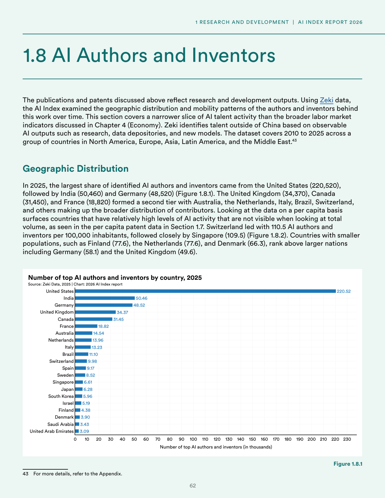
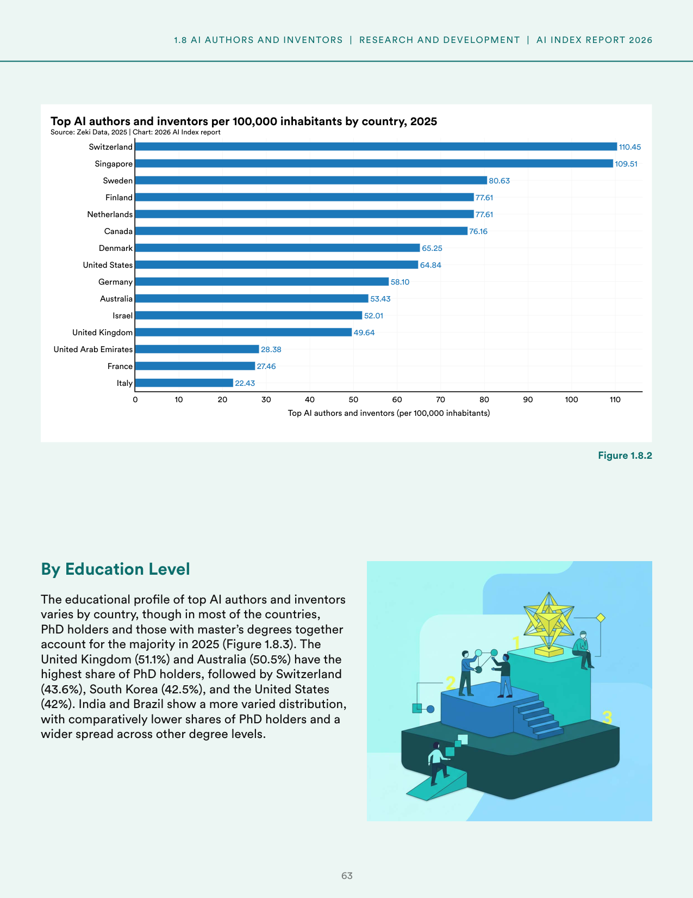
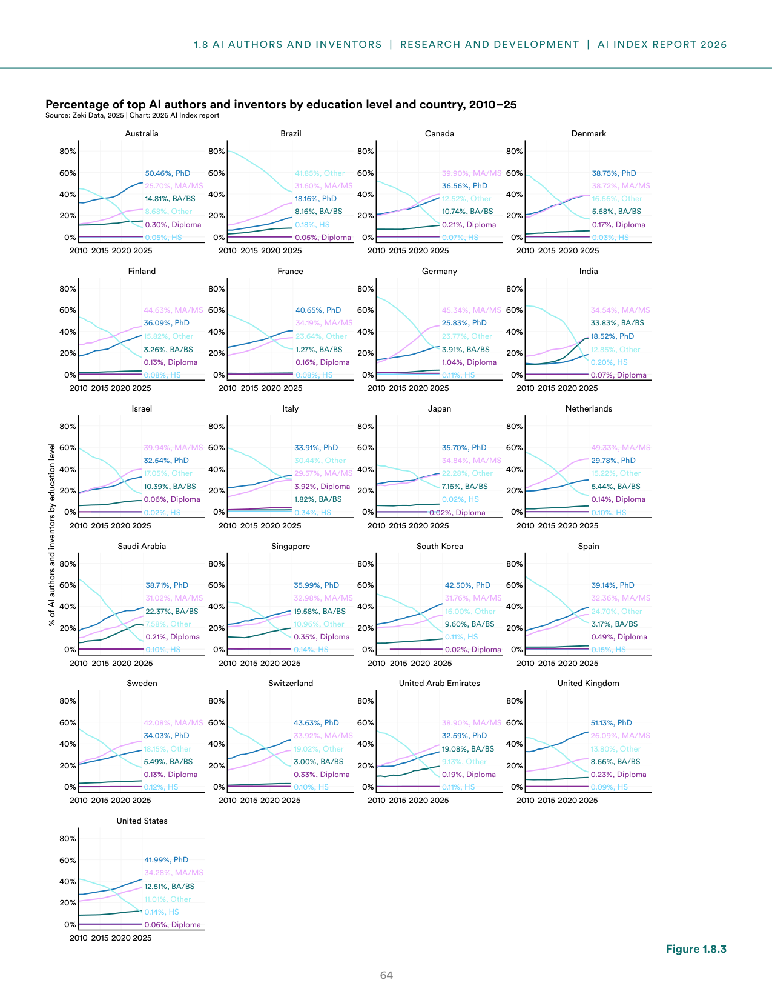
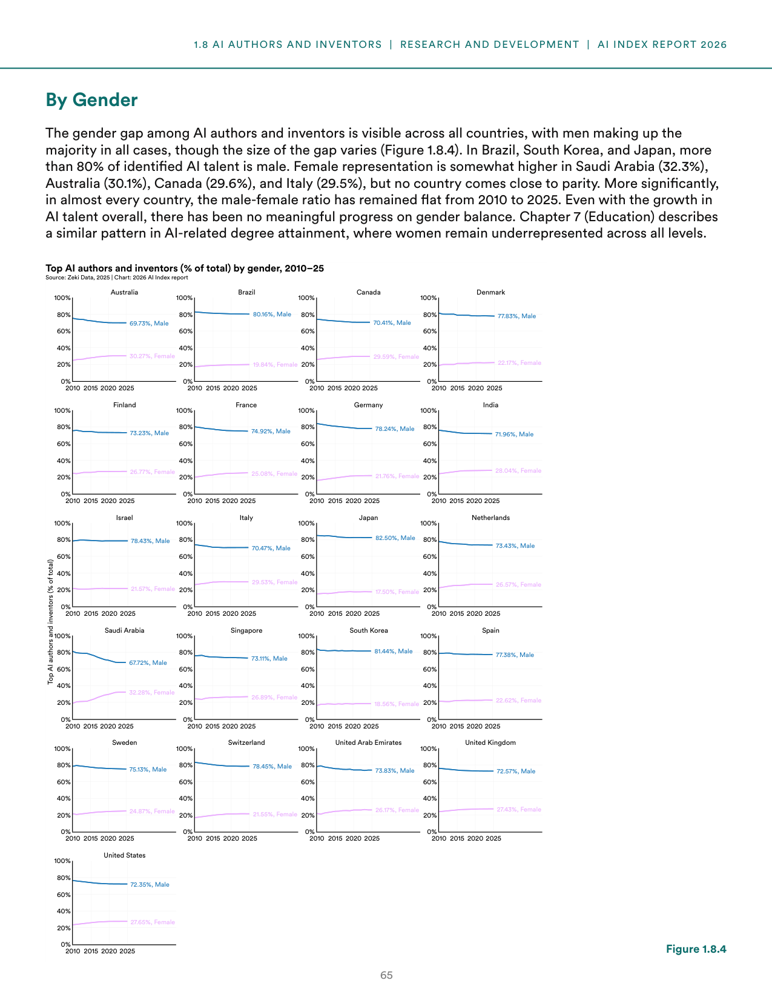
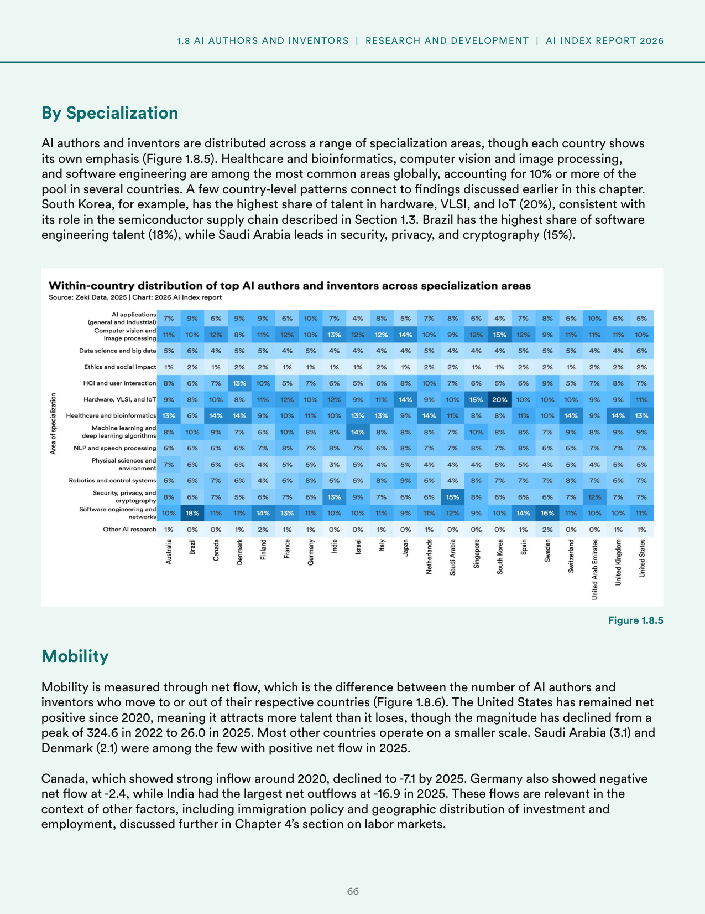
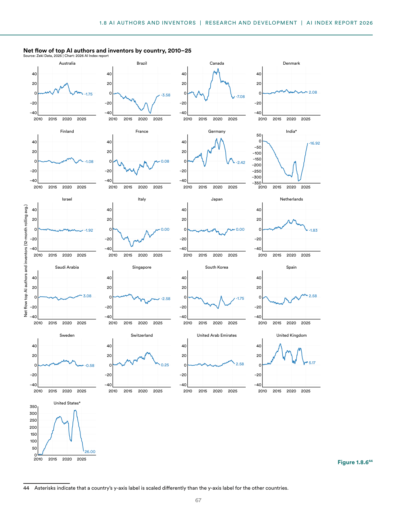

# ai-authors-inventors-talent-distribution

**Parent:** [[content/L1/ai-talent-technical-performance-2026|ai-talent-technical-performance-2026]] — The 2026 AI Index Report details a world where the US leads in total AI talent (220,520 individuals) but Switzerland leads per capita (110.45), while frontier models have converged in performance, with the top four providers (Anthropic, xAI, Google, OpenAI) separated by fewer than 25 Elo points.

The 2026 Artificial Intelligence Index Report examines the geographic distribution and mobility patterns of top AI authors and inventors from 2010 to 2025 using Zeki data. This analysis focuses on a narrower slice of AI talent activity—specifically those identified via observable AI outputs such as research, data depositories, and new models—rather than the broader labor market indicators discussed in the report's section on the economy. The dataset includes countries across North America, Europe, Asia, Latin America, and the Middle East.

### Geographic Distribution of AI Talent

In 2025, the United States had the largest share of identified AI authors and inventors with 220,520 individuals, followed by India (50,460) and Germany (48,520). A second tier of contributors included the United Kingdom (34,370), Canada (31,450), and France (18,820), with a broader distribution including Australia, the Netherlands, Italy, Brazil, and Switzerland.

**Figure 1.8.1: Number of top AI authors and inventors by country, 2025**
- X-axis: Number of top AI authors and inventors (in thousands), from 0 to 230
- Y-axis: Country
- Data values:
    - United States: 220.52
    - India: 50.46
    - Germany: 48.52
    - United Kingdom: 34.37
    - Canada: 31.45
    - France: 18.82
    - Australia: 14.54
    - Netherlands: 13.96
    - Italy: 13.23
    - Brazil: 11.10
    - Switzerland: 9.98
    - Spain: 9.17
    - Sweden: 8.52
    - Singapore: 6.61
    - Japan: 6.28
    - South Korea: 5.96
    - Israel: 5.19
    - Finland: 4.38
    - Denmark: 3.90
    - Saudi Arabia: 3.43
    - United Arab Emirates: 3.09

When analyzed on a per capita basis (per 100,000 inhabitants), Switzerland led in 2025 with 110.5 AI authors and inventors, followed by Singapore at 109.5. Smaller populations often ranked higher than larger nations; for example, Finland (77.6), the Netherlands (77.6), and Denmark (66.3) ranked above Germany (58.1) and the United Kingdom (49.6).

**Figure 1.8.2: Top AI authors and inventors per 100,000 inhabitants by country, 2025**
- X-axis: Top AI authors and inventors (per 100,000 inhabitants), from 0 to 110
- Y-axis: Country
- Data values:
    - Switzerland: 110.45
    - Singapore: 109.51
    - Sweden: 80.63
    - Finland: 77.61
    - Netherlands: 77.61
    - Canada: 76.16
    - Denmark: 65.25
    - United States: 64.84
    - Germany: 58.10
    - Australia: 53.43
    - Israel: 52.01
    - United Kingdom: 49.64
    - United Arab Emirates: 28.38
    - France: 27.46
    - Italy: 22.43

### Educational Profile

In 2025, PhD holders and those with master's degrees accounted for the majority of top AI talent in most countries. The United Kingdom (51.1%) and Australia (50.5%) had the highest shares of PhD holders, followed by Switzerland (43.6%), South Korea (42.5%), and the United States (42%). Conversely, India and Brazil showed more varied distributions with lower shares of PhD holders.

**Figure 1.8.3: Percentage of top AI authors and inventors by education level and country, 2010–25**
- X-axis: Year (2010 to 2025)
- Y-axis: Percentage of AI authors and inventors by education level (0% to 80%+)
- 2025 data by country:
    - Australia: PhD (50.46%), MA/MS (25.70%), BA/BS (14.81%), Other (8.68%), Diploma (0.30%), HS (0.05%)
    - Brazil: Other (41.85%), MA/MS (31.60%), PhD (18.16%), BA/BS (8.16%), HS (0.18%), Diploma (0.05%)
    - Canada: MA/MS (39.90%), PhD (36.56%), Other (12.52%), BA/BS (10.74%), Diploma (0.21%), HS (0.07%)
    - Denmark: PhD (38.75%), MA/MS (38.72%), Other (16.66%), BA/BS (5.68%), Diploma (0.17%), HS (0.03%)
    - Finland: MA/MS (44.63%), PhD (36.09%), Other (15.82%), BA/BS (3.26%), Diploma (0.13%), HS (0.08%)
    - France: PhD (40.65%), MA/MS (34.19%), Other (23.64%), BA/BS (1.27%), Diploma (0.16%), HS (0.08%)
    - Germany: MA/MS (45.34%), PhD (25.83%), Other (23.77%), BA/BS (3.91%), Diploma (1.04%), HS (0.11%)
    - India: MA/MS (34.54%), BA/BS (33.83%), PhD (18.52%), Other (12.85%), Diploma (0.07%), HS (0.20%)
    - Israel: MA/MS (39.94%), PhD (32.54%), Other (17.05%), BA/BS (10.39%), Diploma (0.06%), HS (0.02%)
    - Italy: PhD (33.91%), Other (30.44%), MA/MS (29.57%), Diploma (3.92%), BA/BS (1.82%), HS (0.34%)
    - Japan: PhD (35.70%), MA/MS (34.84%), Other (22.28%), BA/BS (7.16%), Diploma (0.02%), HS (0.02%)
    - Netherlands: MA/MS (49.33%), PhD (29.78%), Other (15.22%), BA/BS (5.44%), Diploma (0.14%), HS (0.10%)
    - Saudi Arabia: PhD (38.71%), MA/MS (31.02%), BA/BS (22.37%), Other (7.58%), Diploma (0.21%), HS (0.10%)
    - Singapore: PhD (35.99%), MA/MS (32.98%), BA/BS (19.58%), Other (10.96%), Diploma (0.35%), HS (0.14%)
    - South Korea: PhD (42.50%), MA/MS (31.76%), Other (16.00%), BA/BS (9.60%), Diploma (0.02%), HS (0.11%)
    - Spain: PhD (39.14%), MA/MS (32.36%), Other (24.70%), BA/BS (3.17%), Diploma (0.49%), HS (0.15%)
    - Sweden: MA/MS (42.08%), PhD (34.03%), Other (18.15%), BA/BS (5.49%), Diploma (0.13%), HS (0.12%)
    - Switzerland: PhD (43.63%), MA/MS (33.92%), Other (19.02%), BA/BS (3.00%), Diploma (0.33%), HS (0.10%)
    - United Arab Emirates: MA/MS (38.90%), PhD (32.59%), BA/BS (19.08%), Other (9.13%), Diploma (0.19%), HS (0.11%)
    - United Kingdom: PhD (51.13%), MA/MS (26.09%), Other (13.80%), BA/BS (8.66%), Diploma (0.23%), HS (0.09%)
    - United States: PhD (41.99%), MA/MS (34.28%), BA/BS (12.51%), Other (11.01%), Diploma (0.06%), HS (0.14%)

### Gender Representation

Gender gaps persist across all analyzed countries, with men comprising the majority of AI authors and inventors. In Brazil, South Korea, and Japan, over 80% of identified AI talent is male. Female representation was highest in Saudi Arabia (32.3%), Australia (30.1%), Canada (29.6%), and Italy (29.5%), though no country reached parity. Notably, the male-female ratio remained flat from 2010 to 2025 in almost every country, showing no meaningful progress in gender balance despite the overall growth of AI talent.

**Figure 1.8.4: Top AI authors and inventors (% of total) by gender, 2010–25**
- X-axis: Year (2010 to 2025)
- Y-axis: Percentage of total (0% to 100%)
- 2025 values:
    - Australia: 69.73% Male / 30.27% Female
    - Brazil: 80.16% Male / 19.84% Female
    - Canada: 70.41% Male / 29.59% Female
    - Denmark: 77.83% Male / 22.17% Female
    - Finland: 73.23% Male / 26.77% Female
    - France: 74.92% Male / 25.08% Female
    - Germany: 78.24% Male / 21.76% Female
    - India: 71.96% Male / 28.04% Female
    - Israel: 78.43% Male / 21.57% Female
    - Italy: 70.47% Male / 29.53% Female
    - Japan: 82.50% Male / 17.50% Female
    - Netherlands: 73.43% Male / 26.57% Female
    - Saudi Arabia: 67.72% Male / 32.28% Female
    - Singapore: 73.11% Male / 26.89% Female
    - South Korea: 81.44% Male / 18.56% Female
    - Spain: 77.38% Male / 22.62% Female
    - Sweden: 75.13% Male / 24.87% Female
    - Switzerland: 78.45% Male / 21.55% Female
    - United Arab Emirates: 73.83% Male / 26.17% Female
    - United Kingdom: 72.57% Male / 27.43% Female
    - United States: 72.35% Male / 27.65% Female

### Specialization and Talent Mobility

AI authors and inventors specialize in various areas, with healthcare and bioinformatics, computer vision and image processing, and software engineering being globally common. Specific national emphases exist: South Korea has the highest share of talent in hardware, VLSI, and IoT (20%), Brazil leads in software engineering (18%), and Saudi Arabia leads in security, privacy, and cryptography (15%).

**Figure 1.8.5: Within-country distribution of top AI authors and inventors across specialization areas**
- Table showing the share of talent by area and country. (Data transcription from image):

| Specialization Area | Australia | Brazil | Canada | Denmark | Finland | France | Germany | India | Israel | Italy | Japan | Netherlands | Saudi Arabia | Singapore | South Korea | Spain | Sweden | Switzerland | United Arab Emirates | United Kingdom | United States |
| :--- | :--- | :--- | :--- | :--- | :--- | :--- | :--- | :--- | :--- | :--- | :--- | :--- | :--- | :--- | :--- | :--- | :--- | :--- | :--- | :--- | :--- |
| AI applications (general and specific) | 9% | 7% | 9% | 6% | 9% | 10% | 7% | 4% | 8% | 8% | 5% | 7% | 8% | 6% | 4% | 7% | 8% | 6% | 10% | 6% | 5% |
| Computer vision and image processing | 41% | 10% | 12% | 8% | 11% | 12% | 13% | 12% | 14% | 12% | 14% | 9% | 12% | 15% | 14% | 11% | 11% | 11% | 11% | 11% | 10% |
| Data science and analytics | 6% | 5% | 6% | 4% | 5% | 5% | 4% | 4% | 4% | 4% | 4% | 5% | 5% | 4% | 4% | 5% | 5% | 4% | 4% | 5% | 5% |
| Ethics and social impact | 1% | 2% | 1% | 1% | 2% | 1% | 1% | 1% | 2% | 1% | 1% | 2% | 1% | 2% | 1% | 2% | 1% | 2% | 1% | 2% | 2% |
| HCI and user experience | 9% | 6% | 7% | 13% | 10% | 6% | 5% | 9% | 6% | 5% | 9% | 6% | 5% | 9% | 5% | 6% | 5% | 9% | 5% | 6% | 5% |
| Hardware, VLSI, and IoT | 0% | 2% | 0% | 0% | 0% | 0% | 3% | 0% | 0% | 0% | 2% | 0% | 10% | 10% | 20% | 0% | 0% | 0% | 0% | 0% | 0% |
| Healthcare and bioinformatics | 13% | 14% | 14% | 9% | 13% | 11% | 10% | 13% | 9% | 11% | 13% | 14% | 9% | 11% | 10% | 14% | 13% | 11% | 11% | 14% | 13% |
| Machine learning and deep learning algorithms | 20% | 12% | 12% | 12% | 12% | 8% | 10% | 12% | 15% | 10% | 14% | 8% | 12% | 8% | 7% | 12% | 8% | 12% | 10% | 8% | 10% |
| NLP and language models | 6% | 6% | 6% | 5% | 7% | 5% | 5% | 5% | 5% | 4% | 5% | 5% | 5% | 5% | 5% | 5% | 5% | 5% | 5% | 7% | 7% |
| Physical sciences and environment | 4% | 4% | 5% | 4% | 5% | 3% | 5% | 4% | 4% | 5% | 4% | 5% | 4% | 4% | 5% | 4% | 4% | 5% | 4% | 5% | 5% |
| Robotics and computer vision | 6% | 6% | 7% | 6% | 6% | 8% | 6% | 6% | 8% | 6% | 8% | 6% | 8% | 6% | 6% | 8% | 7% | 8% | 7% | 8% | 7% |
| Security, privacy, and cryptography | 8% | 6% | 7% | 6% | 7% | 6% | 7% | 6% | 6% | 7% | 6% | 8% | 15% | 7% | 6% | 6% | 8% | 6% | 7% | 8% | 7% |
| Software engineering | 18% | 18% | 14% | 13% | 14% | 13% | 11% | 10% | 10% | 11% | 10% | 10% | 10% | 11% | 10% | 14% | 14% | 13% | 10% | 10% | 11% |
| Other AI research | 1% | 0% | 0% | 1% | 0% | 2% | 1% | 0% | 1% | 0% | 1% | 0% | 1% | 0% | 1% | 0% | 1% | 0% | 1% | 0% | 1% |

### Talent Mobility

Mobility is tracked via net flow—the difference between the number of AI authors and inventors moving into or out of a country. Between 2020 and 2025, the United States remained net positive, attracting more talent than it lost, although its net flow decreased from a peak of 324.6 in 2022 to 26.0 in 2025. In 2025, Saudi Arabia (3.1) and Denmark (2.1) were among the few other countries with a positive net flow. 

Conversely, Canada's inflow peaked around 2020 and declined to -7.1 by 2025. Germany recorded a net flow of -2.4 in 2025, and India experienced the largest net outflows at -16.9 in 2025.

**Figure 1.8.6: Net flow of top AI authors and inventors by country, 2010–25**
- X-axis: Year (2010 to 2025)
- Y-axis: Net flow top AI authors and inventors (12-month rolling average)
- 2025 values:
    - United States: 26.00
    - United Kingdom: 5.17
    - United Arab Emirates: 2.58
    - Saudi Arabia: 3.08
    - Spain: 2.58
    - Switzerland: 0.25
    - Denmark: 2.08
    - Italy: 0.00
    - Japan: 0.00
    - France: 0.08
    - Canada: -7.08
    - Germany: -2.42
    - India: -16.92
    - Finland: -1.08
    - Israel: -1.92
    - Australia: -1.75
    - Brazil: -3.58
    - Singapore: -2.58
    - South Korea: -1.75
    - Sweden: -0.58

Note: The United States and India are scaled differently on their Y-axes in Figure 1.8.6 to accommodate their larger magnitudes of flow.

## Source pages

