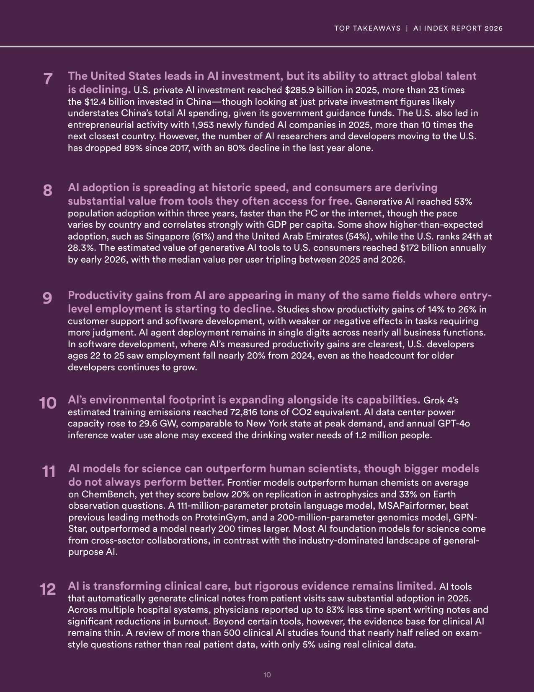
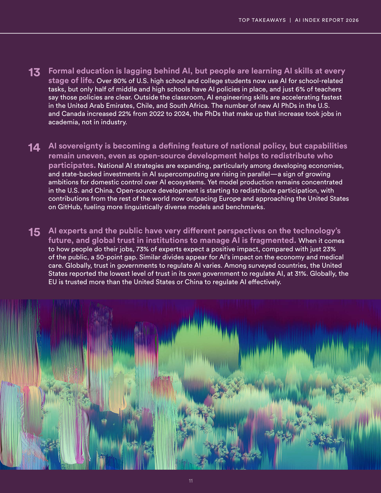

# ai-index-2026-top-takeaways

**Parent:** [[content/L1/ai-index-report-2026-synthesis|ai-index-report-2026-synthesis]] — The 2026 AI Index Report reveals that industry now produces 91.18% of notable AI models, with the U.S. leading in private investment ($285.9B in 2025) and model count (59), while China leads in research publications and patents.

According to the 2026 Artificial Intelligence Index Report, the United States leads in AI investment, but its ability to attract global talent is declining. U.S. private AI investment reached $285.9 billion in 2025, which is more than 23 times the $12.4 billion invested in China—though the report notes that private investment figures likely understate China’s total AI spending due to government guidance funds. The U.S. also led in entrepreneurial activity in 2025 with 1,953 newly funded AI companies, which is more than 10 times the number of companies in the next closest country. However, the number of AI researchers and developers moving to the U.S. has dropped 89% since 2017, with an 80% decline in the last year alone.

AI adoption is spreading at historic speed, and consumers are deriving substantial value from tools they often access for free. Generative AI reached 53% population adoption within three years, which is faster than the adoption rate of the PC or the internet. While the pace of adoption varies by country and correlates strongly with GDP per capita, some countries show higher-than-expected adoption, such as Singapore (61%) and the United Arab Emirates (54%), while the U.S. ranks 24th at 28.3%. The estimated annual value of generative AI tools to U.S. consumers reached $172 billion by early 2026, with the median value per user tripling between 2025 and 2026.

Productivity gains from AI are appearing in many of the same fields where entry-level employment is starting to decline. Studies show productivity gains of 14% to 26% in customer support and software development, but effects are weaker or negative in tasks requiring more judgment. AI agent deployment remains in single digits across nearly all business functions. In software development, where productivity gains are most clear, U.S. developers aged 22 to 25 saw employment fall nearly 20% from 2024, even as the headcount for older developers continues to grow.

AI’s environmental footprint is expanding alongside its capabilities. Grok 4’s estimated training emissions reached 72,816 tons of CO2 equivalent. AI data center power capacity rose to 29.6 GW, a level comparable to New York state at peak demand, and annual GPT-4o inference water use alone may exceed the drinking water needs of 1.2 million people.

AI models for science can outperform human scientists, though bigger models do not always perform better. Frontier models outperform human chemists on average on ChemBench, yet these models score below 20% on replication in astrophysics and 33% on Earth observation questions. A 111-million-parameter protein language model, MSAPairformer, beat previous leading methods on ProteinGym, and a 200-million-parameter genomics model, GPN-Star, outperformed a model nearly 200 times larger. Most AI foundation models for science come from cross-sector collaborations, whereas general-purpose AI is dominated by industry.

AI is transforming clinical care, but rigorous evidence remains limited. AI tools that automatically generate clinical notes from patient visits saw substantial adoption in 2025. Across multiple hospital systems, physicians reported up to 83% less time spent writing notes and significant reductions in burnout. However, the evidence base for clinical AI beyond certain tools remains thin. A review of more than 500 clinical AI studies found that nearly half relied on exam-style questions rather than real patient data, with only 5% using real clinical data.

Formal education is lagging behind AI, but people are learning AI skills at every stage of life. Over 80% of U.S. high school and college students now use AI for school-related tasks, but only half of middle and high schools have AI policies in place, and just 6% of teachers say those policies are clear. Outside the classroom, AI engineering skills are accelerating fastest in the United Arab Emirates, Chile, and South Africa. The number of new AI PhDs in the U.S. and Canada increased 22% from 2022 to 2024, but the PhDs contributing to that increase took jobs in academia rather than in industry.

AI sovereignty is becoming a defining feature of national policy, and national AI strategies are expanding, particularly among developing economies. State-backed investments in AI supercomputing are rising in parallel as a sign of growing ambitions for domestic control over AI ecosystems. However, capabilities remain uneven, and model production remains concentrated in the U.S. and China. Open-source development is helping to redistribute participation, with contributions from the rest of the world now outpacing Europe and approaching the United States on GitHub, fueling more linguistically diverse models and benchmarks.

AI experts and the public have very different perspectives on the technology’s future, and global trust in institutions to manage AI is fragmented. Regarding how people do their jobs, 73% of experts expect a positive impact, compared with just 23% of the public, a 50-point gap. Similar divides exist for AI’s impact on the economy and medical care. Globally, trust in governments to regulate AI varies. Among surveyed countries, the United States reported the lowest level of trust in its own government to regulate AI, at 31%. Globally, the EU is trusted more than the United States or China to regulate AI effectively.

## Source pages

