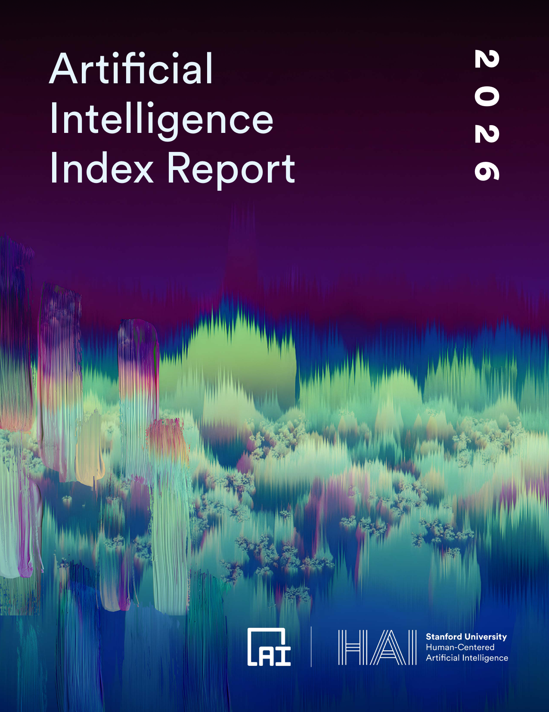
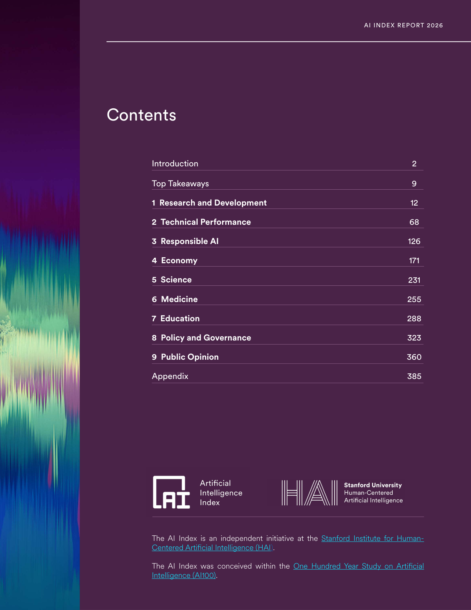
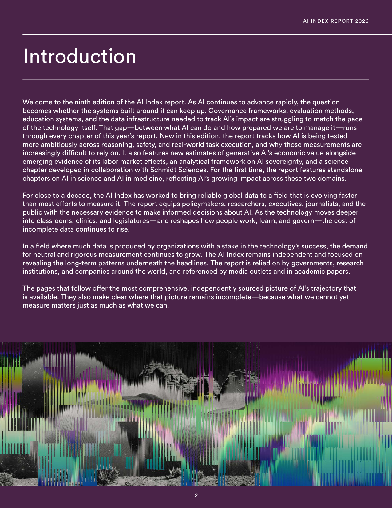
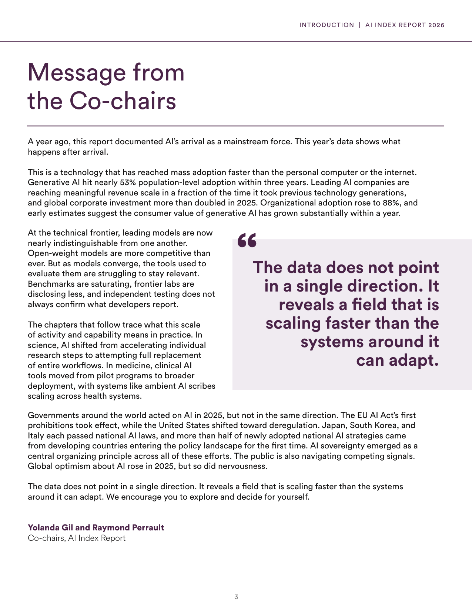
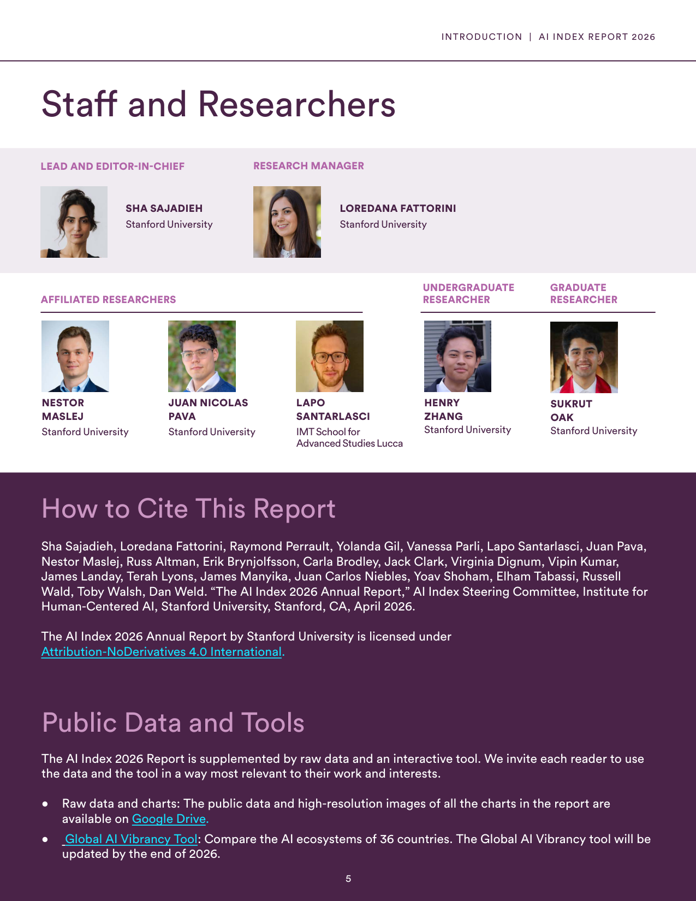
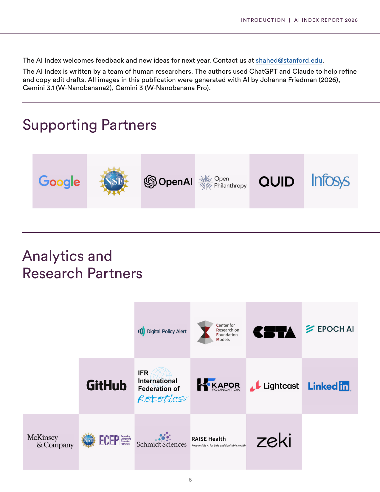
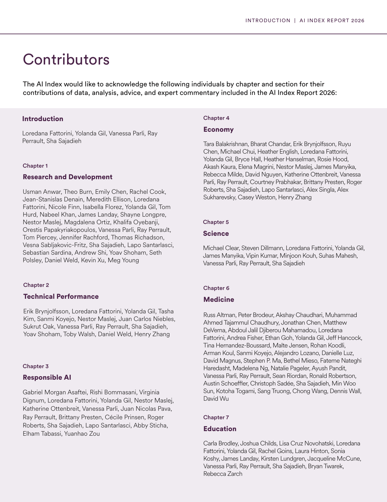
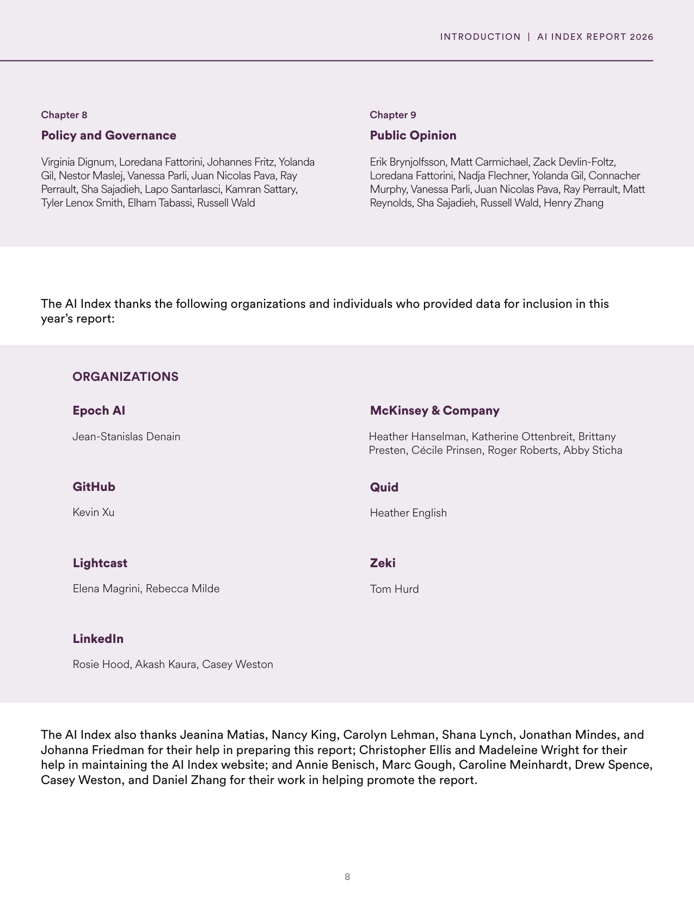
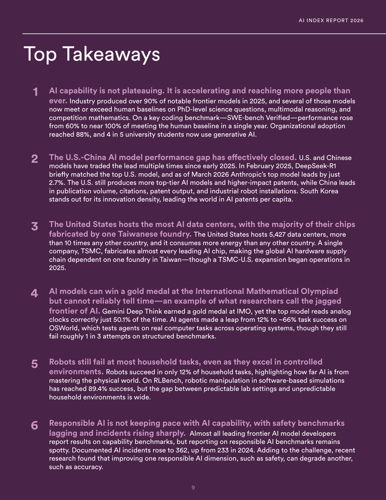

# ai-index-report-2026-top-takeaways

**Parent:** [[content/L1/ai-index-report-2026-synthesis|ai-index-report-2026-synthesis]] — The 2026 AI Index Report reveals that industry now produces 91.18% of notable AI models, with the U.S. leading in private investment ($285.9B in 2025) and model count (59), while China leads in research publications and patents.

The 2026 Artificial Intelligence Index Report, published in April 2026 by the AI Index Steering Committee of the Stanford Institute for Human-Centered Artificial Intelligence (HAI) at Stanford University, is the ninth edition of the report. The AI Index is an independent initiative conceived within the One Hundred Year Study on Artificial Intelligence (AI100). 

According to the report, AI capability is accelerating and reaching a broader population. In 2025, industry produced over 90% of notable frontier models, and several of these models now meet or exceed human baselines on PhD-level science questions, multimodal reasoning, and competition mathematics. In a single year, performance on the SWE-bench Verified coding benchmark rose from 60% to nearly 100% of the human baseline. Organizational adoption of AI reached 88%, and 80% (4 in 5) of university students now use generative AI.

Regarding international competition, the performance gap between U.S. and Chinese AI models has effectively closed, with the two countries trading the lead multiple times since early 2025. In February 2025, DeepSeek-R1 briefly matched the top U.S. model, and as of March 2026, Anthropic’s top model leads by only 2.7%. While the United States produces more top-tier AI models and higher-impact patents, China leads in publication volume, citations, patent output, and industrial robot installations. South Korea leads the world in AI patents per capita.

Infrastructure and hardware supply chains remain centralized. The United States hosts 5,427 AI data centers—more than 10 times the amount hosted by any other country—and consumes more energy for AI than any other nation. However, the global AI hardware supply chain is heavily dependent on the Taiwanese company TSMC, which fabricates almost every leading AI chip, although a TSMC-U.S. expansion began operations in 2025.

Researchers describe the current state of AI as a "jagged frontier," where models can achieve high-level specialized tasks but fail at simple ones. For example, Gemini Deep Think won a gold medal at the International Mathematical Olympiad (IMO), yet the top AI model correctly reads analog clocks only 50.1% of the time. While AI agents improved their task success on OSWorld (which tests real computer tasks across operating systems) from 12% to approximately 66%, they still fail roughly one in three attempts on structured benchmarks.

In robotics, a wide gap exists between controlled and unpredictable environments. Robots succeed in only 12% of household tasks, whereas robotic manipulation in software-based simulations on RLBench has reached 89.4% success.

Finally, the report notes that Responsible AI is not keeping pace with technical capabilities. While almost all frontier model developers report capability benchmarks, reporting on responsible AI benchmarks is inconsistent. Documented AI incidents increased to 362, up from 233 in 2024. Additionally, recent research indicates that improving one responsible AI dimension, such as safety, may degrade another, such as accuracy.

## Source pages

