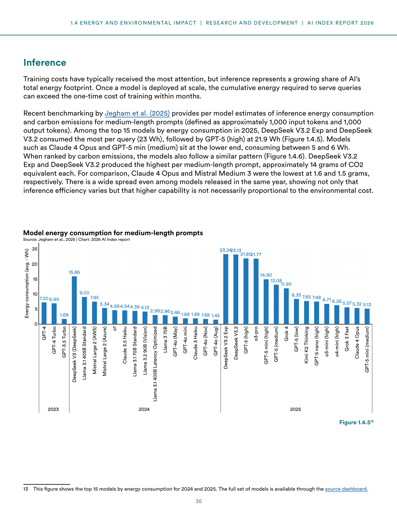
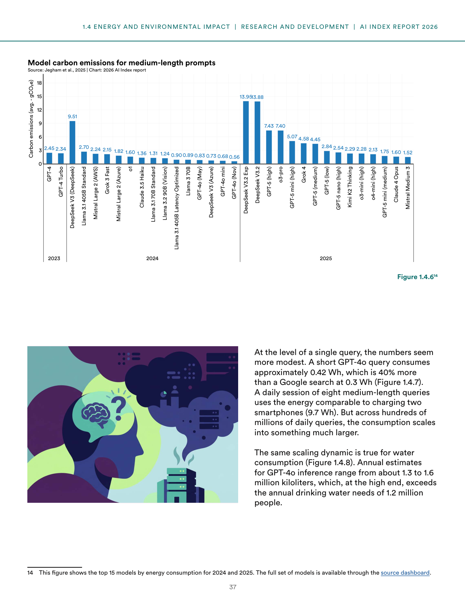
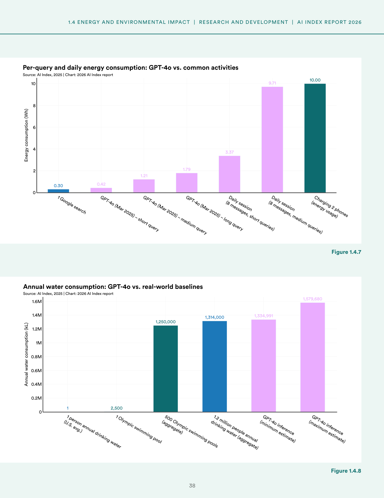
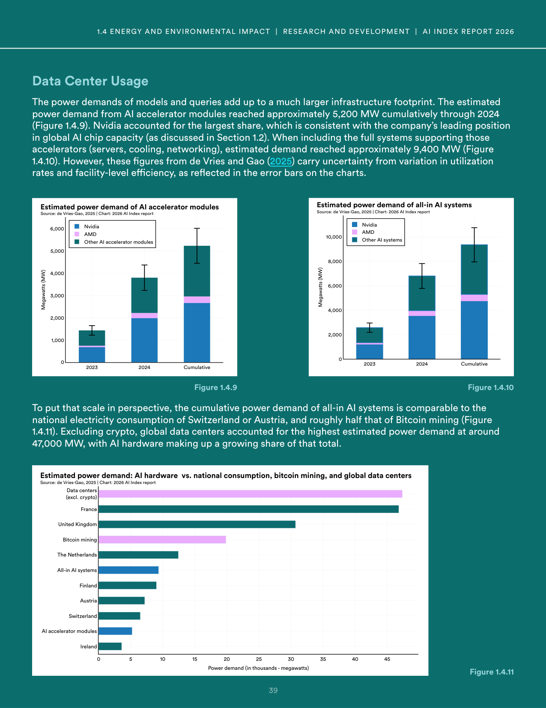
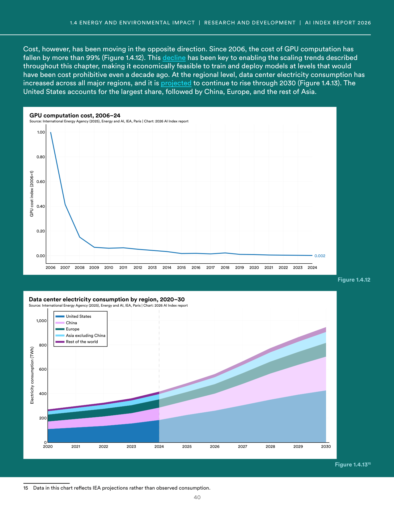
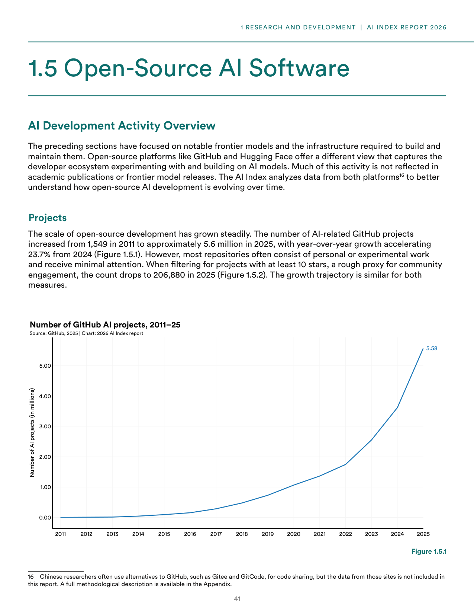
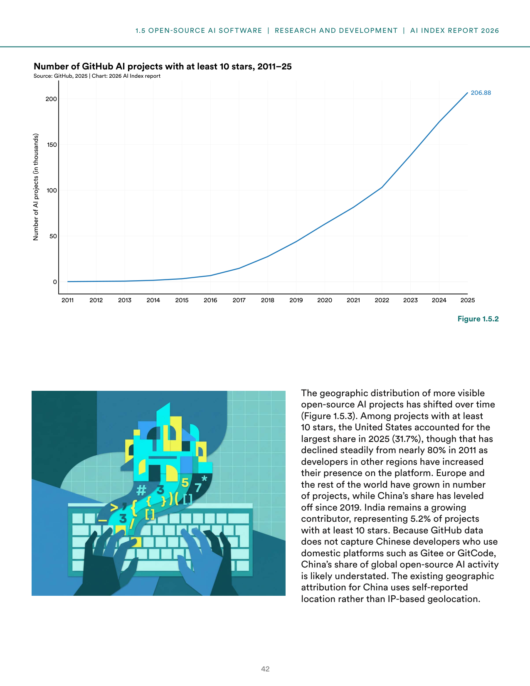
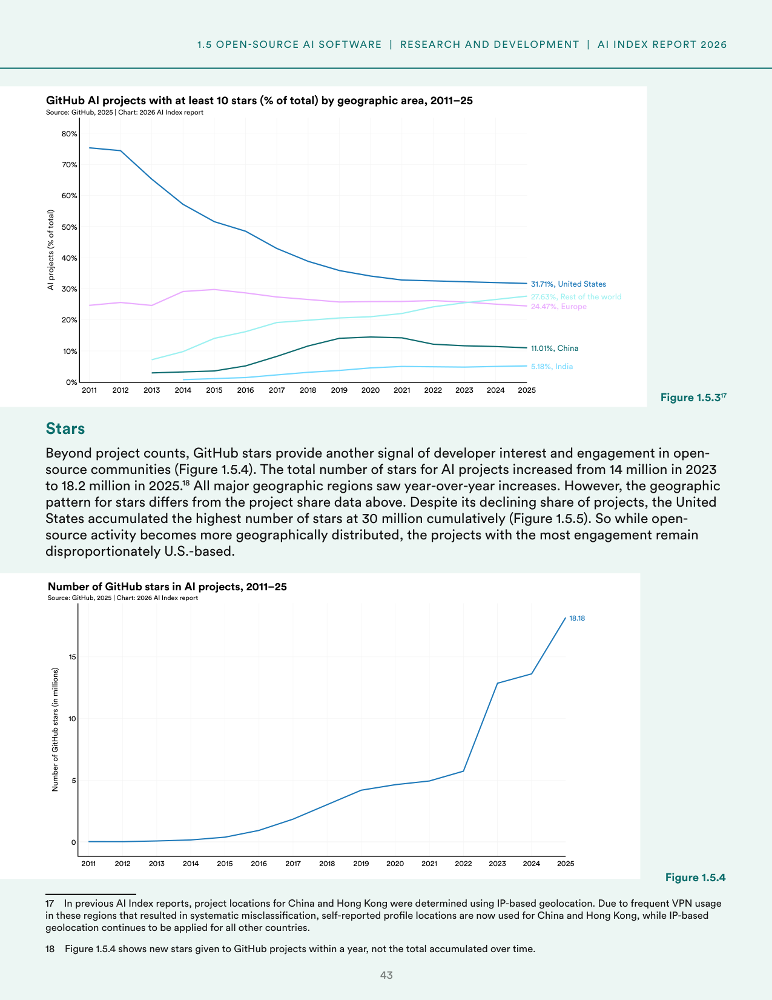

# ai-inference-environmental-impact-open-source

**Parent:** [[content/L1/ai-models-infrastructure-environmental-impact|ai-models-infrastructure-environmental-impact]] — The 2026 AI Index Report highlights that while global AI compute capacity grew to 17.1 million H100-equivalents by 2025, training emissions for models like Grok 4 reached 72,816 tons of CO2e, and the US dominates data center counts with 5,427 facilities.

The 2026 Artificial Intelligence Index Report details the environmental and infrastructural impacts of AI, specifically focusing on the energy and water consumption of inference, the power demand of data centers, and the growth of open-source AI software development on platforms like GitHub.

### Inference Energy and Carbon Footprint

While training costs typically receive the most attention, inference represents a growing share of AI's total energy footprint. Once a model is deployed at scale, the cumulative energy required to serve queries can exceed the training cost within months.

According to benchmarking by Jegham et al. (2025), the energy consumption and carbon emissions for medium-length prompts (defined as approximately 1,000 input and 1,000 output tokens) vary significantly between models. Among the top 15 models by energy consumption in 2025, DeepSeek V3.2 Exp and DeepSeek V3.2 consumed the most energy per query at 23 Wh each, followed by GPT-5 (high) at 21.9 Wh. In contrast, models like Claude 4 Opus and GPT-5 mini (medium) consumed between 5 and 6 Wh per query.

**Figure 1.4.5: Model energy consumption for medium-length prompts (avg. Wh)**
- X-axis: Model names grouped by release year (2023, 2024, 2025)
- Y-axis: Energy consumption (avg. - Wh), from 0 to 25
- 2023 data: GPT-4 (7.20), GPT-4 Turbo (6.90), GPT-3.5 Turbo (1.69)
- 2024 data: DeepSeek V3 (15.86), Llama 3.1 405B Standard (9.00), Mistral Large 2 (AWS) (7.45), Mistral Large 2 (Azure) (5.34), o1 (4.59), Claude 3.5 Haiku (4.54), Llama 3.1 70B Standard (4.36), Llama 3.2 90B (Vision) (4.13), Llama 3.1 405B Latency Optimized (2.99), Llama 3 70B (2.96), GPT-4o (May) (2.46), GPT-4o mini (1.88), Claude 3 Haiku (1.88), GPT-4o (Nov) (1.68), GPT-4o (Aug) (1.45)
- 2025 data: DeepSeek V3.2 Exp (23.24), DeepSeek V3.2 (23.13), GPT-5 (high) (21.85), o3-pro (21.77), GPT-5 mini (high) (14.90), GPT-5 (medium) (13.08), Grok 4 (11.90), GPT-5 (low) (8.35), Kimi K2 Thinking (7.65), GPT-5 nano (high) (7.48), o3-mini (high) (6.71), o4-mini (high) (6.26), Grok 3 Fast (5.57), Claude 4 Opus (5.32), GPT-5 mini (medium) (5.13)

Carbon emissions follow a similar pattern to energy consumption. DeepSeek V3.2 Exp and DeepSeek V3.2 produced the highest carbon emissions per medium-length prompt at approximately 14 grams of CO2 equivalent (gCO2e) each. The lowest emissions were produced by Claude 4 Opus (1.6 gCO2e) and Mistral Medium 3 (1.5 gCO2e).

**Figure 1.4.6: Model carbon emissions for medium-length prompts (avg. gCO2e)**
- X-axis: Model names grouped by release year (2023, 2024, 2025)
- Y-axis: Carbon emissions (avg. - gCO2e), from 0 to 18
- 2023 data: GPT-4 (2.45), GPT-4 Turbo (2.34)
- 2024 data: DeepSeek V3 (9.51), Llama 3.1 405B Standard (2.70), Mistral Large 2 (AWS) (2.24), Grok 3 Fast (2.15), Mistral Large 2 (Azure) (1.82), o1 (1.60), Claude 3.5 Haiku (1.36), Llama 3.1 70B Standard (1.31), Llama 3.2 90B (Vision) (1.24), Llama 3.1 405B Latency Optimized (0.90), Llama 3 70B (0.89), GPT-4o (May) (0.83), DeepSeek V3 (Azure) (0.73), GPT-4o mini (0.68), GPT-4o (Nov) (0.56)
- 2025 data: DeepSeek V3.2 Exp (13.95), DeepSeek V3.2 (13.88), GPT-5 (high) (7.43), o3-pro (7.40), GPT-5 mini (high) (5.07), Grok 4 (4.58), GPT-5 (medium) (4.45), GPT-5 (low) (2.84), GPT-5 nano (high) (2.54), Kimi K2 Thinking (2.29), o3-mini (high) (2.28), o4-mini (high) (2.13), GPT-5 mini (medium) (1.75), Claude 4 Opus (1.60), Mistral Medium 3 (1.52)

### Per-Query and Daily Resource Consumption

At the level of a single query, energy consumption is more modest. A short GPT-4o query consumes approximately 0.42 Wh, which is 40% more than a Google search at 0.3 Wh. A daily session of eight medium-length queries uses energy comparable to charging two smartphones, totaling 9.7 Wh.

**Figure 1.4.7: Per-query and daily energy consumption: GPT-4o vs. common activities (Wh)**
- 1 Google search: 0.30
- GPT-4o (Mar 2025) – short query: 0.42
- GPT-4o (Mar 2025) – medium query: 1.21
- GPT-4o (Mar 2025) – long query: 1.79
- Daily session (8 messages, short queries): 3.37
- Daily session (8 messages, medium queries): 9.71
- Charging 2 phones: 10.00

Water consumption for GPT-4o inference is also significant. Annual estimates range from 1.3 to 1.6 million kiloliters, with the high end exceeding the annual drinking water needs of 1.2 million people.

**Figure 1.4.8: Annual water consumption: GPT-4o vs. real-world baselines (kL)**
- 1 person annual drinking water (U.S. avg.): 1
- 1 Olympic swimming pool: 2,500
- 500 Olympic swimming pools (aggregate): 1,250,000
- 1.2 million people annual drinking water (aggregate): 1,314,000
- GPT-4o inference (minimum estimate): 1,334,991
- GPT-4o inference (maximum estimate): 1,579,680

### Data Center Infrastructure and Power

The power demands of AI models and queries create a substantial infrastructure footprint. The estimated cumulative power demand from AI accelerator modules through 2024 reached approximately 5,200 MW. Nvidia held the largest share of this demand, consistent with its leading position in global AI chip capacity. When including full support systems such as servers, cooling, and networking, the estimated total demand reached approximately 9,400 MW.

**Figure 1.4.9: Estimated power demand of AI accelerator modules (MW)**
- X-axis: 2023, 2024, Cumulative
- Series: Nvidia, AMD, Other AI accelerator modules
- Y-axis: Power demand (MW) from 0 to 6,000

**Figure 1.4.10: Estimated power demand of all-in AI systems (MW)**
- X-axis: 2023, 2024, Cumulative
- Series: Nvidia, AMD, Other AI systems
- Y-axis: Power demand (MW) from 0 to 10,000

To put this in perspective, the cumulative power demand of all-in AI systems is comparable to the national electricity consumption of Switzerland or Austria, and roughly half that of Bitcoin mining. Excluding cryptocurrency, global data centers had the highest estimated power demand at around 47,000 MW, with AI hardware representing a growing share of this total.

**Figure 1.4.11: Estimated power demand: AI hardware vs. national consumption, bitcoin mining, and global data centers (thousands of MW)**
- Ireland: 5
- AI accelerator modules: 10
- Switzerland: 15
- Austria: 15
- All-in AI systems: 20
- The Netherlands: 20
- Bitcoin mining: 25
- United Kingdom: 30
- France: 35
- Data centers (excl. crypto): 47

### Computing Costs and Regional Electricity Usage

Since 2006, the cost of GPU computation has fallen by more than 99%, which has enabled the scaling of models that would otherwise be cost-prohibitive.

**Figure 1.4.12: GPU computation cost, 2006–24**
- X-axis: Year (2006 to 2024)
- Y-axis: GPU cost index (2006=1), from 0.00 to 1.00
- Final value (2024): 0.002

Regional data center electricity consumption has increased across all major regions and is projected to rise through 2030. The United States accounts for the largest share, followed by China, Europe, and the rest of Asia.

**Figure 1.4.13: Data center electricity consumption by region, 2020–30 (TWh)**
- X-axis: Year (2020 to 2030)
- Y-axis: Electricity consumption (TWh) from 0 to 1,000
- Regional shares: United States, China, Europe, Asia excluding China, Rest of the world

### Open-Source AI Software Development

Open-source platforms like GitHub and Hugging Face provide a view of the developer ecosystem that is not fully reflected in academic publications. AI-related GitHub projects increased from 1,549 in 2011 to approximately 5.6 million in 2025, with year-over-year growth accelerating by 23.7% from 2024.

**Figure 1.5.1: Number of GitHub AI projects, 2011–25 (millions)**
- X-axis: Year (2011 to 2025)
- Y-axis: Number of AI projects (in millions), from 0.00 to 5.00+
- 2025 value: 5.58 million

However, most repositories are experimental and receive minimal attention. When filtering for projects with at least 10 stars, the count drops to 206,880 in 2025.

**Figure 1.5.2: Number of GitHub AI projects with at least 10 stars, 2011–25 (thousands)**
- X-axis: Year (2011 to 2025)
- Y-axis: Number of AI projects (in thousands), from 0 to 200
- 2025 value: 206.88 thousand

The geographic distribution of these visible projects has shifted. Among projects with at least 10 stars, the United States' share declined from nearly 80% in 2011 to 31.7% in 2025, as developers in other regions increased their presence. Europe and the rest of the world have grown, while China's share leveled off since 2019. India represents 5.2% of projects with at least 10 stars. Because GitHub data does not capture Chinese developers using domestic platforms like Gitee or GitCode, China's share is likely understated.

**Figure 1.5.3: GitHub AI projects with at least 10 stars (% of total) by geographic area, 2011–25**
- 2025 values: United States (31.71%), Rest of the world (27.63%), Europe (24.47%), China (11.01%), India (5.18%)

Developer interest and engagement are measured by GitHub stars. The total number of stars for AI projects increased from 14 million in 2023 to 18.2 million in 2025. While the geographic distribution of projects is more balanced, the most engaged projects remain disproportionately U.S.-based, with the United States accumulating 30 million stars cumulatively.

**Figure 1.5.4: Number of GitHub stars in AI projects, 2011–25 (millions)**
- X-axis: Year (2011 to 2025)
 unfinished

## Source pages

