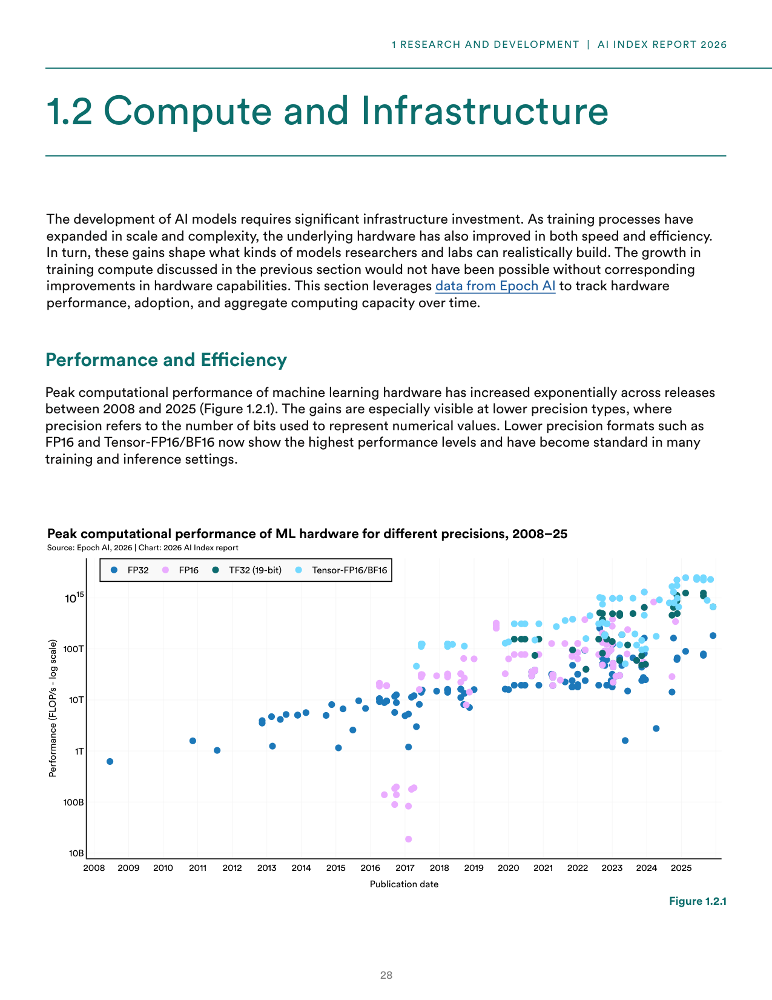
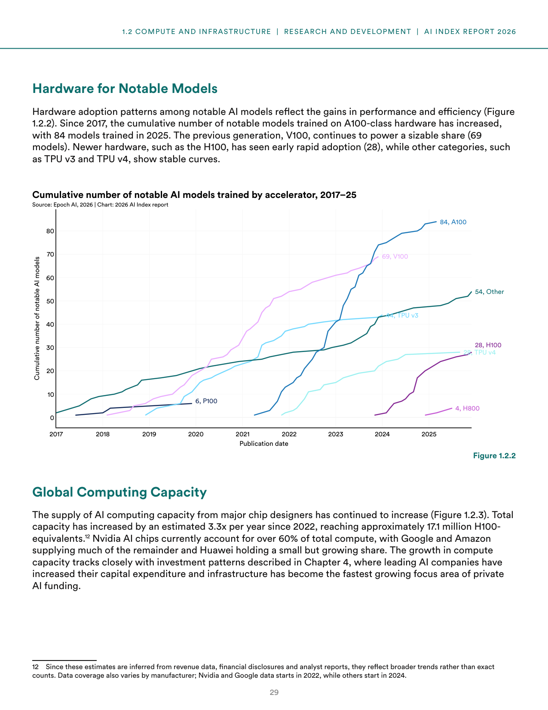
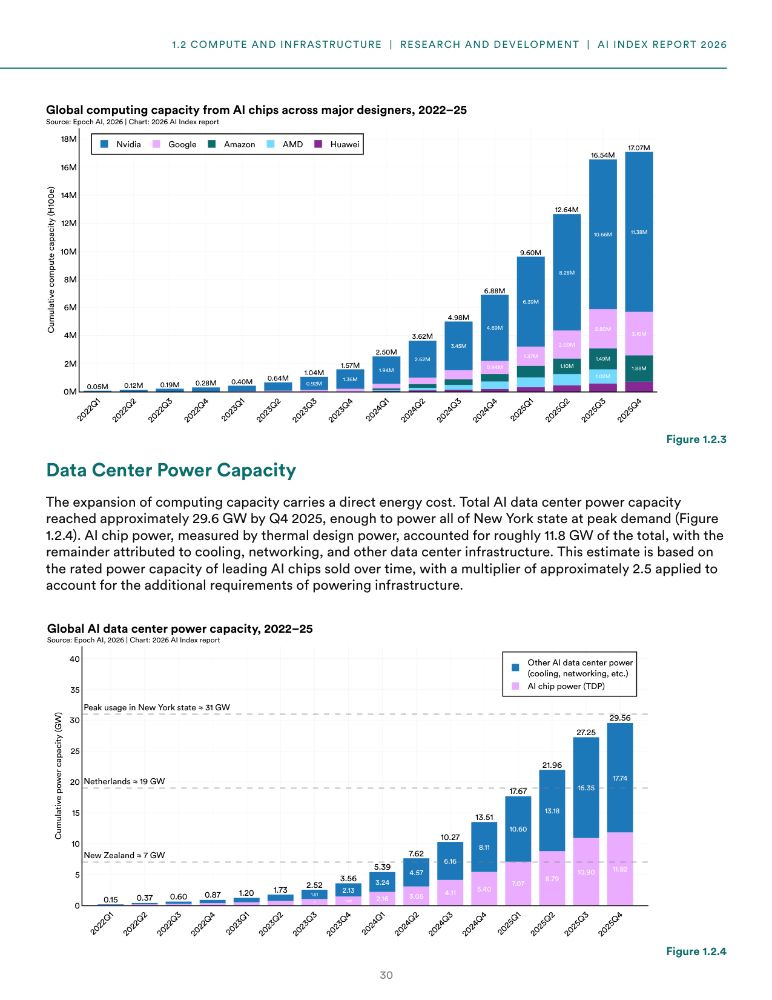
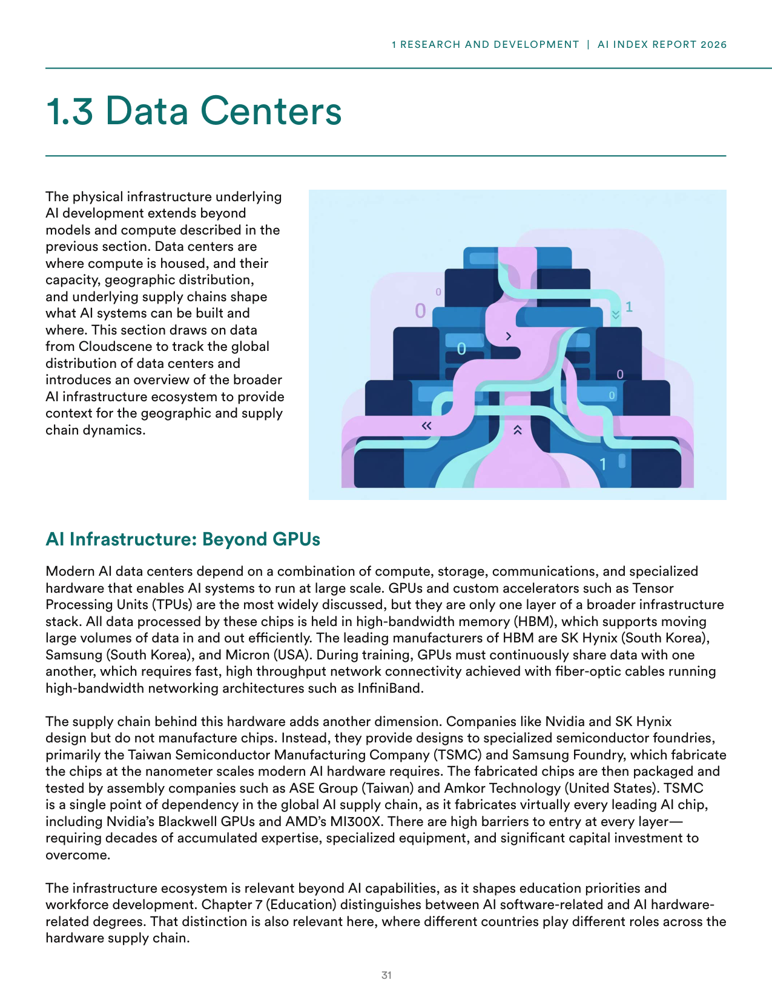
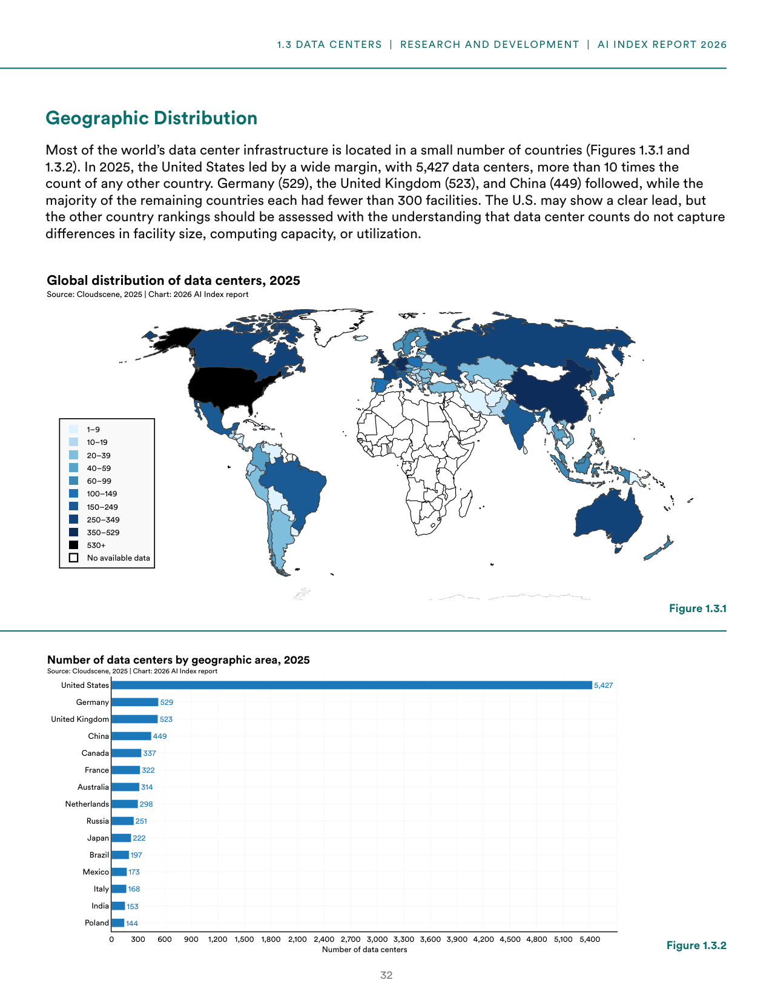
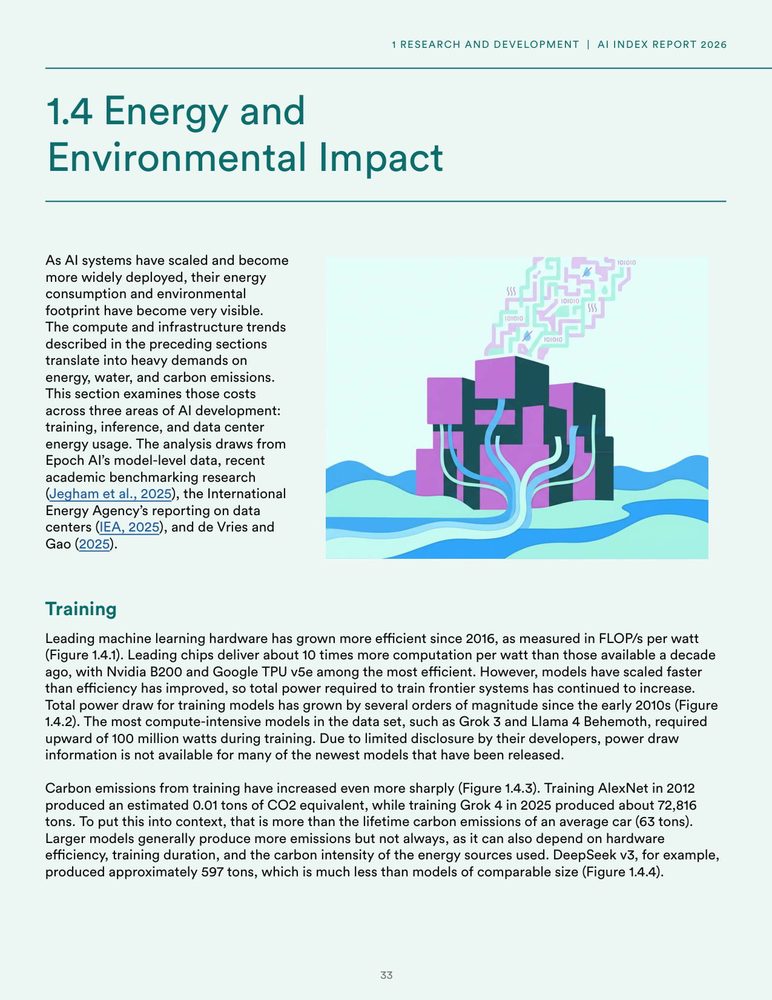
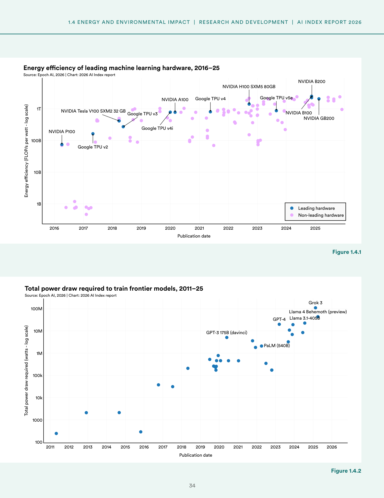
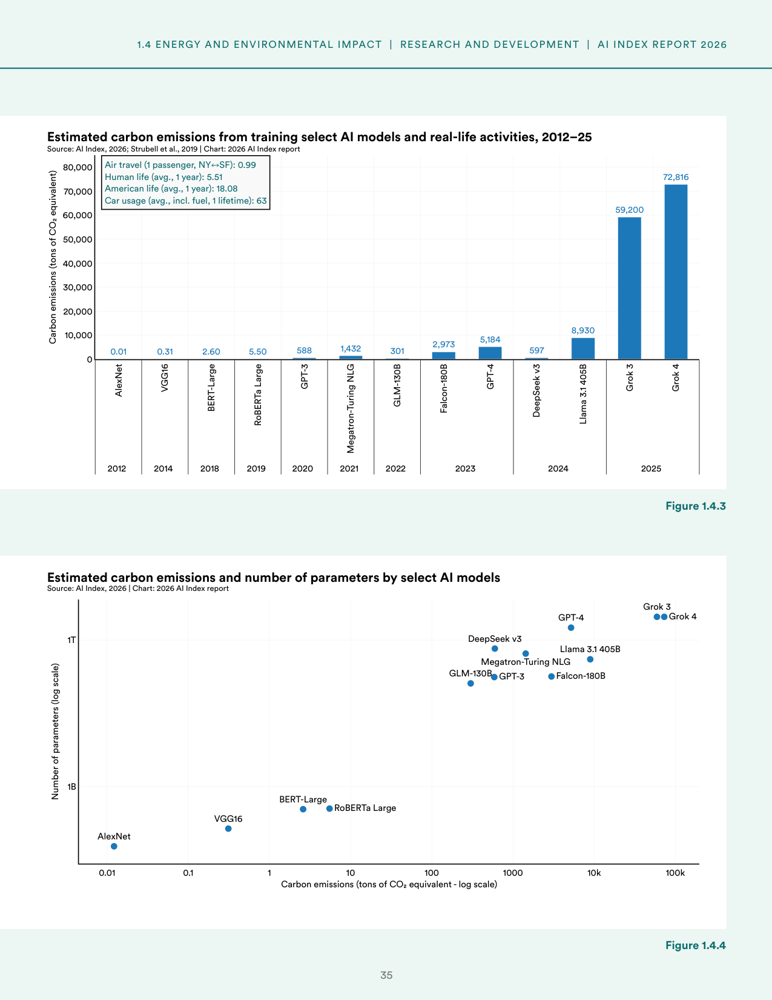

# ai-infrastructure-compute-energy-environmental-impact

**Parent:** [[content/L1/ai-models-infrastructure-environmental-impact|ai-models-infrastructure-environmental-impact]] — The 2026 AI Index Report highlights that while global AI compute capacity grew to 17.1 million H100-equivalents by 2025, training emissions for models like Grok 4 reached 72,816 tons of CO2e, and the US dominates data center counts with 5,427 facilities.

The 2026 Artificial Intelligence Index Report details the infrastructure requirements for AI development, focusing on hardware performance, global computing capacity, data center distribution, and environmental impact. 

### Compute and Infrastructure

Development of AI models requires significant infrastructure investment. Hardware improvements in speed and efficiency have directly influenced the types of models that researchers and labs can realistically build. 

#### Performance and Efficiency

Between 2008 and 2025, the peak computational performance of machine learning hardware increased exponentially (Figure 1.2.1). These gains are most prominent in lower precision formats—where precision is the number of bits used for numerical representation—such as FP16 and Tensor-FP16/BF16, which have become standard for training and inference.

**Figure 1.2.1: Peak computational performance of ML hardware for different precisions, 2008–25**
- X-axis: Publication date (2008 to 2025)
- Y-axis: Performance (FLOP/s - log scale), ranging from 10B to 10^15
- Data series: FP32, FP16, TF32 (19-bit), Tensor-FP16/BF16

#### Hardware for Notable Models

Hardware adoption for notable AI models follows performance and efficiency gains (Figure 1.2.2). Since 2017, the cumulative number of notable models trained on A100-class hardware has grown to 84 models by 2025. The V100 generation continues to power 69 models. Early rapid adoption is seen in H100 (28 models), while TPU v3 (44 models) and TPU v4 (28 models) show stable growth curves. Other accelerators account for 54 models.

**Figure 1.2.2: Cumulative number of notable AI models trained by accelerator, 2017–25**
- X-axis: Publication date (2017 to 2025)
- Y-axis: Cumulative number of notable AI models (0 to 80+)
- Data series/Points: A100 (84), V100 (69), TPU v3 (44), TPU v4 (28), H100 (28), H800 (4), P100 (6), and "Other" (54).

#### Global Computing Capacity

Global AI computing capacity from major chip designers has increased by an estimated 3.3x per year since 2022, reaching approximately 17.1 million H100-equivalents by 2025 (Figure 1.2.3). Nvidia AI chips account for over 60% of total compute, with Google and Amazon providing much of the remainder and Huawei maintaining a small but growing share. This growth tracks with increased capital expenditure by leading AI companies.

**Figure 1.2.3: Global computing capacity from AI chips across major designers, 2022–25**
- X-axis: Time (2022Q1 to 2025Q4)
- Y-axis: Cumulative compute capacity (H100e) from 0M to 18M
- Data per designer (Q4 2025): 
    - Nvidia: 17.07M
    - Google: 1.88M
    - Amazon: 1.88M
    - AMD: 1.88M
    - Huawei: 1.88M (Note: Based on the visual representation, these figures are estimated from the bar chart heights for the final quarter)

**Table 1: Global computing capacity by designer (estimated from Figure 1.2.3)**

| Designer | Capacity (H100e) in 2025Q4 |
| :--- | :--- |
| Nvidia | 17.07M |
| Google | 1.88M |
| Amazon | 1.88M |
| AMD | 1.88M |
| Huawei | 1.88M |

#### Data Center Power Capacity

By Q4 2025, total AI data center power capacity reached approximately 29.6 GW, equivalent to the peak demand of New York state (approximately 31 GW). AI chip power, measured by thermal design power (TDP), accounts for roughly 11.8 GW of this total. The remainder is attributed to cooling, networking, and other infrastructure. This estimate uses a multiplier of approximately 2.5 to account for supporting infrastructure costs.

**Figure 1.2.4: Global AI data center power capacity, 2022–25**
- X-axis: Time (2022Q1 to 2025Q4)
- Y-axis: Cumulative power capacity (GW) from 0 to 40
- Data: Total capacity rose from 0.15 GW in 2022Q1 to 29.56 GW in 2025Q4. AI chip power (TDP) rose from 1.01 GW in 2022Q1 to 11.82 GW in 2025Q4. Other infrastructure power rose from 0.15 GW in 2022Q1 to 17.74 GW in 2025Q4.
- Annotations: New York state peak usage ≈ 31 GW; Netherlands ≈ 19 GW; New Zealand ≈ 7 GW.

### Data Centers

#### AI Infrastructure: Beyond GPUs

AI data centers rely on a stack of compute, storage, communications, and specialized hardware. Beyond GPUs and TPUs, this includes high-bandwidth memory (HBM) for efficient data movement, manufactured primarily by SK Hynix, Samsung, and Micron. Network connectivity is provided by fiber-optic cables running high-bandwidth architectures like InfiniBand.

 The supply chain is highly centralized. Designers like Nvidia and SK Hynix provide blueprints to semiconductor foundries—primarily the Taiwan Semiconductor Manufacturing Company (TSMC) and Samsung Foundry—for fabrication at nanometer scales. Chips are then packaged and tested by assembly companies like ASE Group (Taiwan) and Amkor Technology (USA). TSMC is a critical single point of dependency, fabricating virtually every leading AI chip, including AMD’s MI300X and Nvidia’s Blackwell GPUs.

#### Geographic Distribution

In 2025, the United States led in data center count with 5,427 facilities, more than 10 times the count of any other country. Following the U.S., the highest counts were Germany (529), the United Kingdom (523), and China (449). 

**Figure 1.3.1: Global distribution of data centers, 2025**
- Map displaying data center density by country using a scale of 1–9 to 530+.

**Figure 1.3.2: Number of data centers by geographic area, 2025**
- X-axis: Number of data centers (0 to 5,400+)
- Data: United States (5,427), Germany (529), United Kingdom (523), China (449), Canada (337), France (322), Australia (314), Netherlands (298), Russia (251), Japan (222), Brazil (197), Mexico (173), Italy (168), India (153), Poland (144).

### Energy and Environmental Impact

#### Training

Since 2016, leading machine learning hardware has become more efficient, with Nvidia B200 and Google TPU v5e among the most efficient. Hardware delivers approximately 10 times more computation per watt than it did a decade ago. However, because models have scaled faster than hardware efficiency has improved, total power draw for frontier systems has increased by several orders of magnitude since the early 2010s (Figure 1.4.1 and 1.4.2).

**Figure 1.4.1: Energy efficiency of leading machine learning hardware, 2016–25**
- X-axis: Publication date (2016 to 2025)
- Y-axis: Energy efficiency (FLOP/s per watt - log scale) from 1B to 1T
- Leading hardware points include: NVIDIA P100, Google TPU v2, Google TPU v3, Google TPU v4, NVIDIA Tesla V100 SXM2 32 GB, Google TPU v4i, NVIDIA A100, Google TPU v5e, NVIDIA H100 SXM5 80GB, NVIDIA B100, NVIDIA B200, and NVIDIA GB200.

**Figure 1.4.2: Total power draw required to train frontier models, 2011–25**
- X-axis: Publication date (2011 to 2026)
- Y-axis: Total power draw required (watts - log scale) from 100 to 100M
- Points indicate that Grok 3 and Llama 4 Behemoth (preview) require upward of 100 million watts.

#### Carbon Emissions

Carbon emissions from training have increased sharply. Training AlexNet in 2012 produced an estimated 0.01 tons of CO2 equivalent, whereas training Grok 4 in 2025 produced approximately 72,816 tons. This is more than the lifetime carbon emissions of an average car (63 tons).

**Figure 1.4.3: Estimated carbon emissions from training select AI models and real-life activities, 2012–25**
- X-axis: Publication date (2012 to 2025)
- Y-axis: Carbon emissions (tons of CO2 equivalent) from 0 to 80,000
- Model emissions: AlexNet (0.01), VGG16 (0.31), BERT-Large (2.60), RoBERTa Large (5.50), GPT-3 (588), Megatron-Turing NLG (1,432), GLM-130B (301), Falcon-180B (2,973), GPT-4 (5,184), DeepSeek v3 (597), Llama 3.1 405B (8,930), Grok 3 (59,200), Grok 4 (72,816).
- Comparative activities: Air travel (1 passenger, NY↔SF): 0.99 tons; Human life (avg., 1 year): 5.51 tons; American life (avg., 1 year): 18.08 tons; Car usage (avg., lifetime): 63 tons.

**Figure 1.4.4: Estimated carbon emissions and number of parameters by select AI models**
- X-axis: Carbon emissions (tons of CO2 equivalent - log scale) from 0.01 to 100k
- Y-axis: Number of parameters (log scale) from 1B to 1T+
- Data points plotted for AlexNet, VGG16, BERT-Lage, RoBERTa Large, GPT-3, Megatron-Turing NLG, GLM-130B, GPT-3, Falcon-180B, DeepSeek v3, Llama 3.1 405B, GPT-4, Grok 3, and Grok 4.

## Source pages

