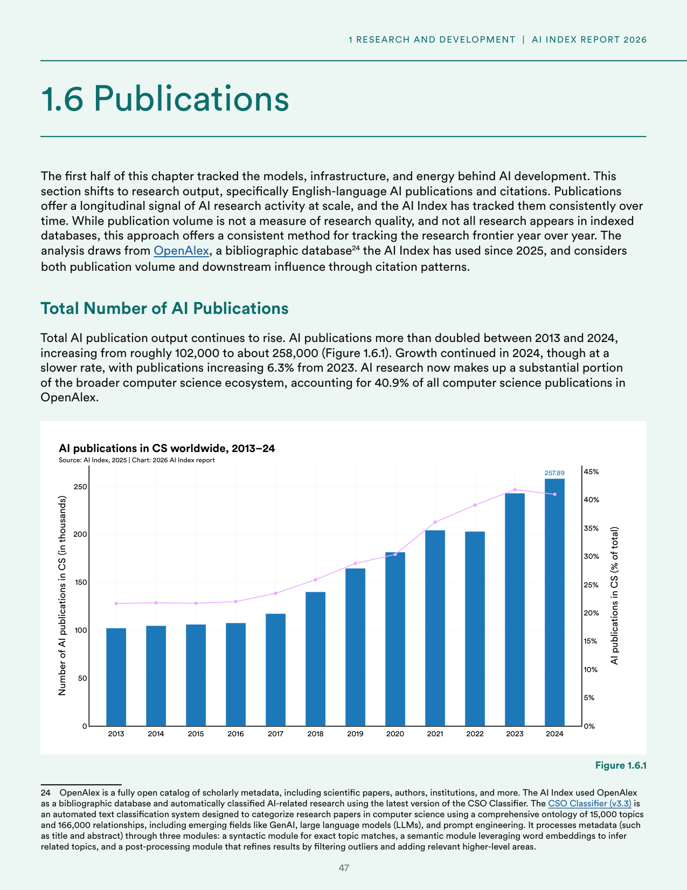
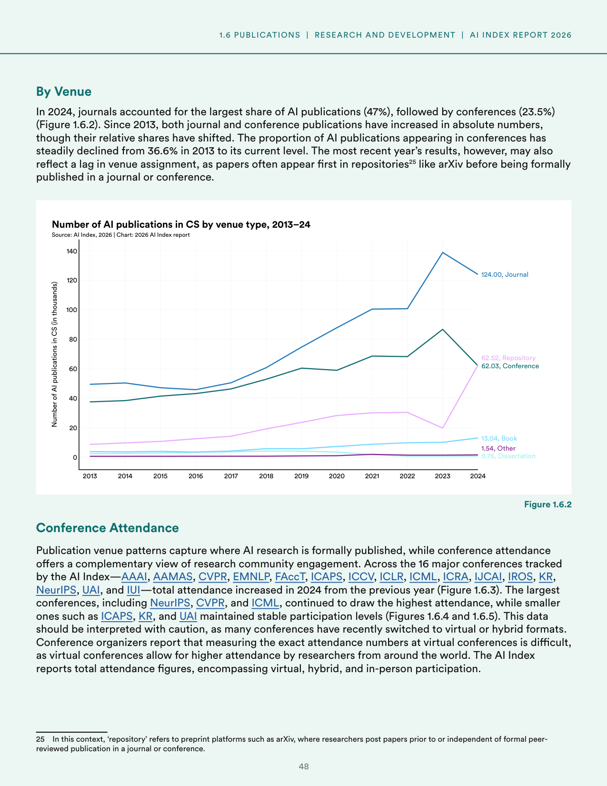
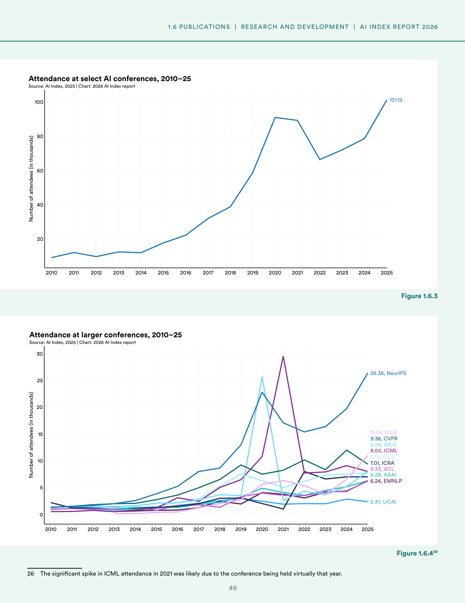
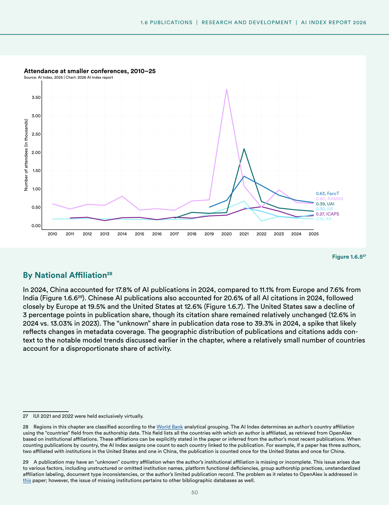
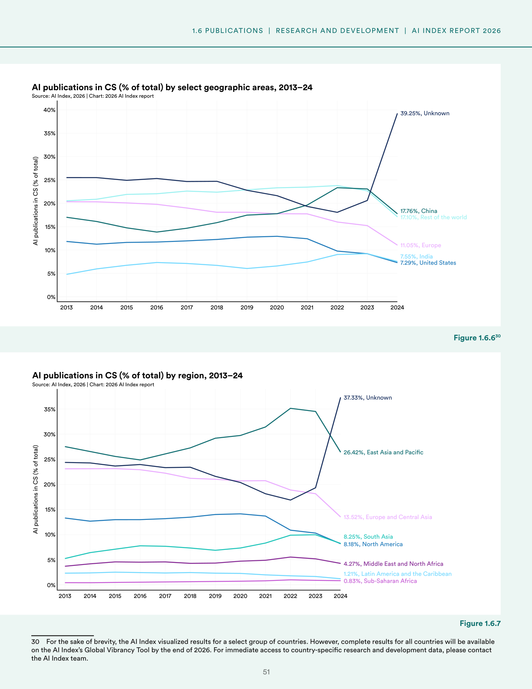
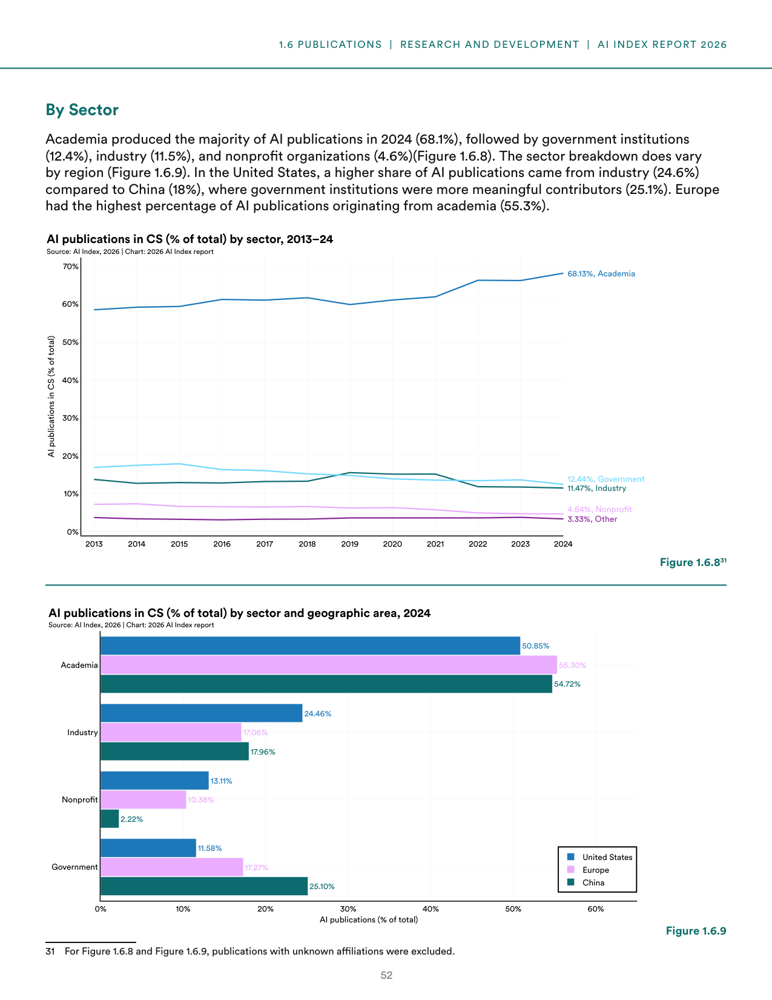
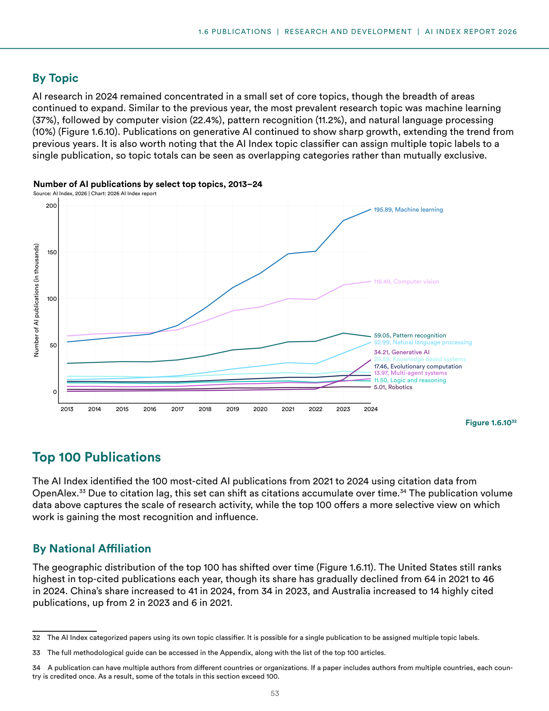
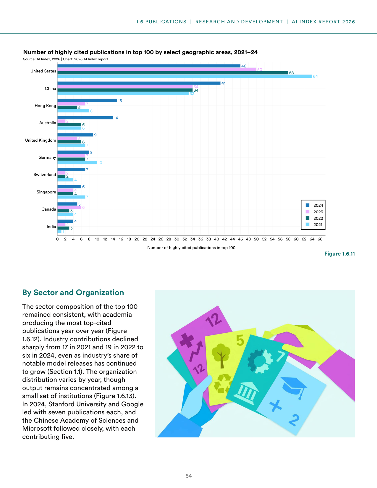

# ai-publications-and-citations-analysis

**Parent:** [[content/L1/ai-environmental-research-patents-2026|ai-environmental-research-patents-2026]] — The 2026 AI Index Report shows a shift toward China's dominance in patent volume (74.24%) and publication counts, while the U.S. maintains leadership in high-influence patents (51.91% forward citations) and cumulative GitHub stars (30.02 million).

The 2026 Artificial Intelligence Index Report provides an analysis of research output, focusing on English-language AI publications and citations. The analysis utilizes the OpenAlex bibliographic database, which the AI Index has used since 2025. To categorize research, the AI Index uses the CSO Classifier (v3.3), an automated text classification system that uses a comprehensive ontology of 15,000 topics and 166,000 relationships—including fields such as Generative AI (GenAI), large language models (LLMs), and prompt engineering—to analyze metadata like titles and abstracts through syntactic, semantic, and post-processing modules.

### Total Number of AI Publications

Total AI publication output has continued to rise, more than doubling between 2013 and 2024 from roughly 102,000 to approximately 258,000 publications. Growth continued in 2024, although at a slower rate of 6.3% compared to 2023. As of 2024, AI research accounts for 40.9% of all computer science publications in the OpenAlex database.

**Figure 1.6.1: AI publications in CS worldwide, 2013–24**
- X-axis: Year (2013 to 2024)
- Y-axis (Left): Number of AI publications in CS (in thousands), from 0 to 250
- Y-axis (Right): AI publications in CS (% of total), from 0% to 45%
- Final value (2024): 257.89 thousand publications

### Publication Venue and Conference Attendance

In 2024, journals were the most common publication venue, accounting for 47% of AI publications, followed by conferences at 23.5%. Since 2013, while absolute numbers for both have increased, the share of AI publications in conferences has steadily declined from 36.6% in 2013 to its current level. The report notes that papers often appear first in preprint repositories, such as arXiv, before formal publication.

**Figure 1.6.2: Number of AI publications in CS by venue type, 2013–24**
- X-axis: Year (2013 to 2024)
- Y-axis: Number of AI publications in CS (in thousands), from 0 to 140
- 2024 values: Journal (124.00), Repository (62.52), Conference (62.03), Book (13.04), Other (1.54), Dissertation (0.76)

Complementing publication data, the AI Index tracks attendance at 16 major AI conferences: AAAI, AAMAS, CVPR, EMNLP, FAccT, ICAPS, ICCV, ICLR, ICML, ICRA, IJCAI, IROS, KR, NeurIPS, UAI, and IUI. Total attendance increased in 2024 compared to 2023, though figures include virtual, hybrid, and in-person participation. 

**Figure 1.6.3: Attendance at select AI conferences, 2010–25**
- X-axis: Year (2010 to 2025)
- Y-axis: Number of attendees (in thousands), from 0 to 100
- 2025 value: 101.12 thousand

**Figure 1.6.4: Attendance at larger conferences, 2010–25**
- X-axis: Year (2010 to 2025)
- Y-axis: Number of attendees (in thousands), from 0 to 30
- 2025 values: NeurIPS (26.38), ICLR (11.04), CVPR (9.38), ICML (8.00), IROS (8.00), ICCV (7.73), ICRA (7.01), ACL (6.33), AAAI (6.29), EMNLP (6.24), IJCAI (2.37)
- Note: A significant spike in ICML attendance occurred in 2021, likely due to the conference being held virtually.

**Figure 1.6.5: Attendance at smaller conferences, 2010–25**
- X-axis: Year (2010 to 2025)
- Y-axis: Number of attendees (in thousands), from 0.00 to 3.50
- 2025 values: FaccT (0.63), AAMAS (0.60), UAI (0.39), IUI (0.30), ICAPS (0.27), KR (0.18)
- Note: IUI 2021 and 2022 were held exclusively virtually.

### Geographic Distribution of Publications and Citations

In 2024, China accounted for 17.8% of AI publications, followed by Europe (11.1%) and India (7.6%). In terms of citations, Chinese AI publications accounted for 20.6% of all AI citations in 2024, followed by Europe (19.5%) and the United States (12.6%). The United States saw its publication share decline by 3 percentage points, while its citation share remained relatively stable (12.6% in 2024 compared to 13.03% in 2023). The share of publications with "unknown" country affiliation rose to 39.3% in 2024.

**Figure 1.6.6: AI publications in CS (% of total) by select geographic areas, 2013–24**
- X-axis: Year (2013 to 2024)
- Y-axis: AI publications in CS (% of total), from 0% to 40%
- 2024 values: Unknown (39.25%), China (17.76%), Rest of the world (17.10%), Europe (11.05%), India (7.55%), United States (7.29%)

**Figure 1.6.7: AI publications in CS (% of total) by region, 2013–24**
- X-axis: Year (2013 to 2024)
- Y-axis: AI publications in CS (% of total), from 0% to 35%
- 2024 values: Unknown (37.33%), East Asia and Pacific (26.42%), Europe and Central Asia (13.52%), South Asia (8.25%), North America (8.18%), Middle East and North Africa (4.27%), Latin America and the Caribbean (1.21%), Sub-Saharan Africa (0.83%)

### Sectoral Distribution of AI Publications

In 2024, academia produced the majority of AI publications at 68.1%, followed by government institutions (12.4%), industry (11.5%), and nonprofits (4.6%). This distribution varies by region: in the United States, industry's share was higher (24.6%) compared to China (18%), while in China, government institutions were more significant contributors (25.1%). Europe had the highest academic share of AI publications at 55.3%.

**Figure 1.6.8: AI publications in CS (% of total) by sector, 2013–24**
- X-axis: Year (2013 to 2024)
- Y-axis: AI publications in CS (% of total), from 0% to 70%
- 2024 values: Academia (68.13%), Government (12.44%), Industry (11.47%), Nonprofit (4.64%), Other (3.33%)

**Figure 1.6.9: AI publications in CS (% of total) by sector and geographic area, 2024**
- Sector breakdown for 2024:
    - United States: Academia (50.85%), Industry (24.46%), Government (11.58%), Nonprofit (13.11%)
    - Europe: Academia (55.30%), Industry (17.06%), Government (17.27%), Nonprofit (10.38%)
    - China: Academia (54.72%), Industry (17.96%), Government (25.10%), Nonprofit (2.22%)

### AI Publications by Topic

AI research in 2024 remained concentrated in core topics, with machine learning being the most prevalent (37%), followed by computer vision (22.4%), pattern recognition (11.2%), and natural language processing (10%).

**Figure 1.6.10: Number of AI publications by select top topics, 2013–24**
- X-axis: Year (2013 to 2024)
- Y-axis: Number of AI publications (in thousands), from 0 to 200
- 2024 values: Machine learning (195.89), Computer vision (118.49), Pattern recognition (59.05), Natural language processing (52.99), Generative AI (34.21), Knowledge based systems (20.59), Evolutionary computation (17.46), Multi-agent systems (13.97), Logic and reasoning (11.50), Robotics (5.01)

### The Top 100 Most-Cited AI Publications

Using citation data from OpenAlex, the AI Index identified the 100 most-cited AI publications from 2021 to 2024. The geographic distribution has shifted; while the United States remains the highest in top-cited publications, its share declined from 64 in 2021 to 46 in 2024. China's share increased from 34 in 2023 to 41 in 2024, and Australia's count rose from 2 in 2021 and 6 in 2023 to 14 in 2024.

**Figure 1.6.11: Number of highly cited publications in top 100 by select geographic areas, 2021–24**
- X-axis: Year (2021 to 2024)
- Y-axis: Number of highly cited publications in top 100, from 0 to 66
- 2024 values: United States (46), China (41), Australia (14), Hong Kong (9), United Kingdom (8), Germany (7), Switzerland (7), Singapore (6), Canada (5), India (4), India (3 - though chart shows 4 for India, 2024 data point is 4)
- 2023 values: United States (58), China (34), Hong Kong (7), Australia (6), United Kingdom (6), Germany (5), Switzerland (4), Singapore (4), Canada (2), India (2)
- 2021 values: United States (64), China (33), Hong Kong (10), Australia (2), United Kingdom (7), Germany (6),지난 2021년 2024년 사이의 가장 많이 인용된 상위 100개 AI 논문 중 미국은 2021년 64개에서 2024년 46개로 그 비중이 감소했으나, 중국은 2023년 34개에서 2024년 41개로 증가했습니다.

Regarding sector and organization, academia consistently produced the most top-cited publications. However, industry's contribution to the top 100 declined sharply from 17 in 2021 and 19 in 2022 to six in 2024. In 2024, Stanford University and Google led the most-cited institutions, each with seven publications, followed by the Chinese Academy of Sciences and Microsoft, each contributing five.

## Source pages

