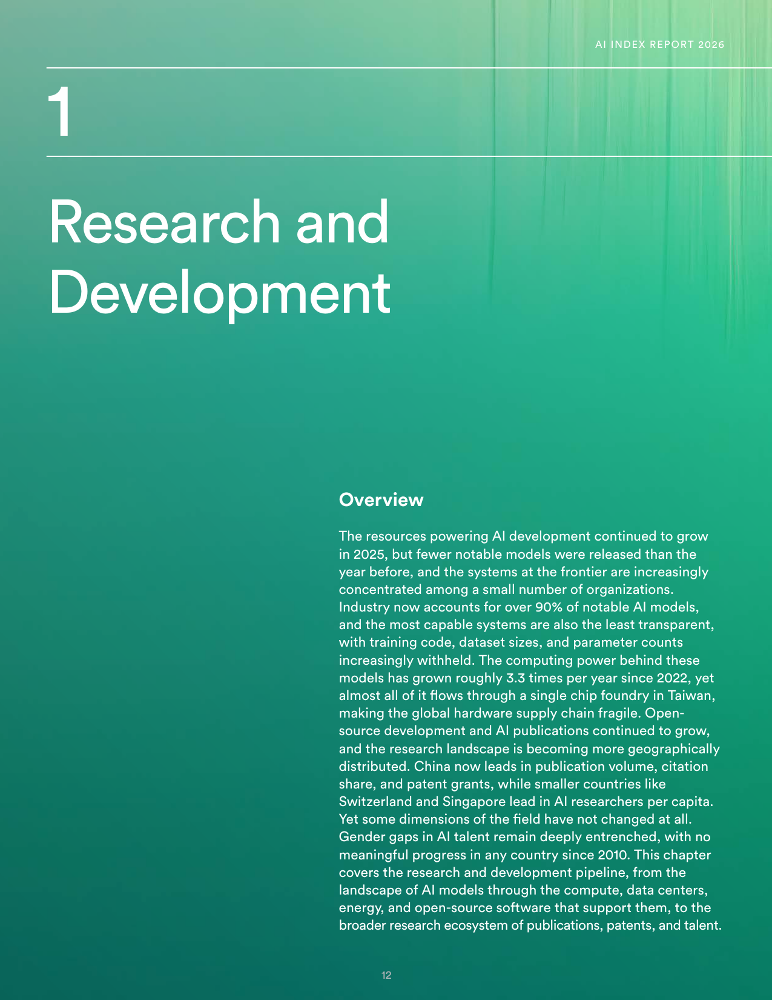
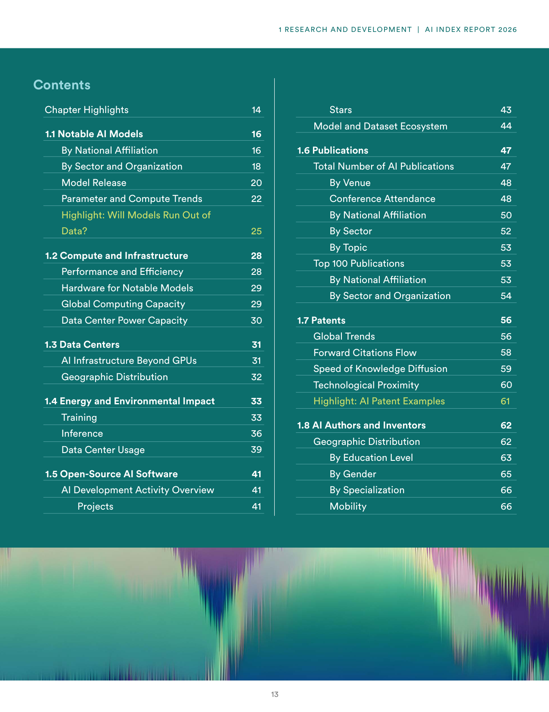
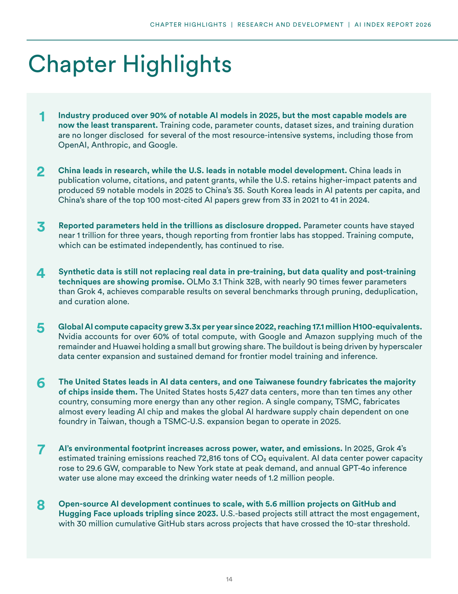
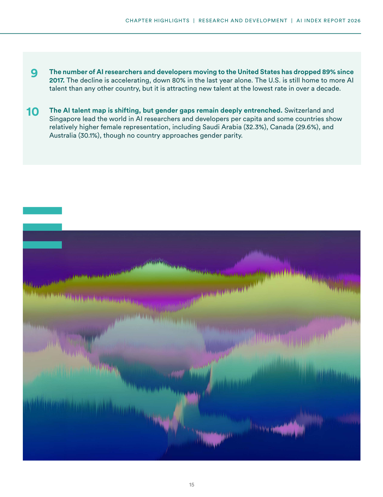
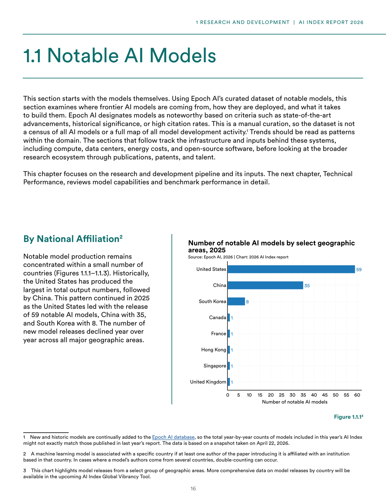
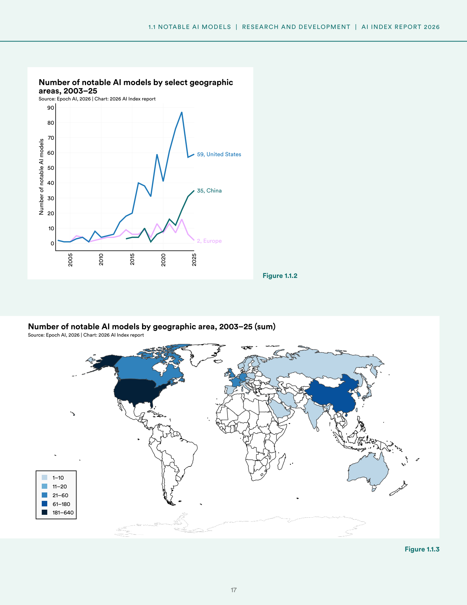
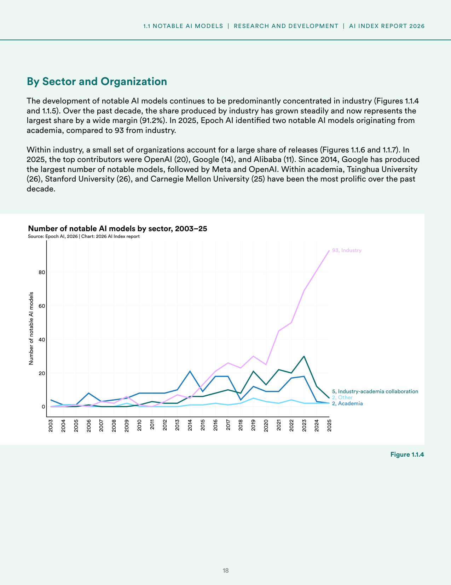
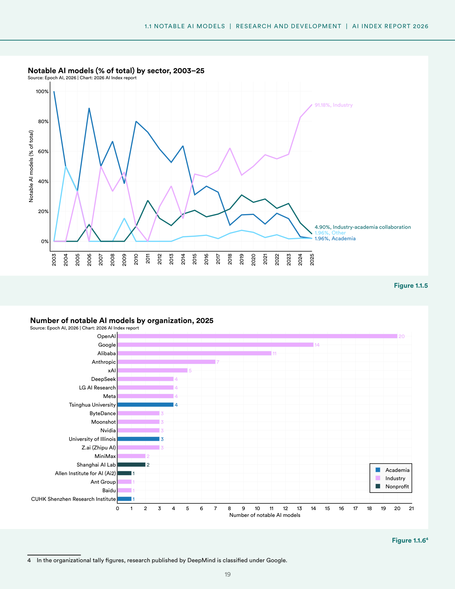
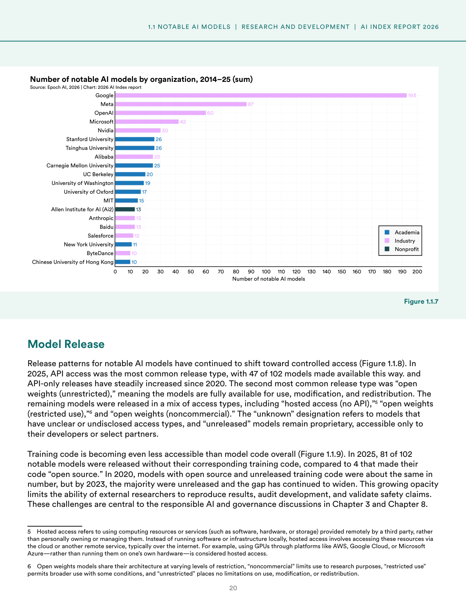

# ai-research-development-overview

**Parent:** [[content/L1/ai-index-report-2026-synthesis|ai-index-report-2026-synthesis]] — The 2026 AI Index Report reveals that industry now produces 91.18% of notable AI models, with the U.S. leading in private investment ($285.9B in 2025) and model count (59), while China leads in research publications and patents.

The 2026 Artificial Intelligence Index Report indicates that while resources powering AI development continued to grow in 2025, the number of notable AI models released was lower than in the previous year. Frontier AI systems are increasingly concentrated within a small number of organizations, with industry now accounting for over 90% of notable AI models. The most capable systems are also the least transparent, as training code, dataset sizes, and parameter counts are increasingly withheld. Since 2022, the computing power behind these models has grown roughly 3.3 times per year, but the global hardware supply chain remains fragile because almost all of it flows through a single chip foundry in Taiwan (TSMC). 

Open-source development and AI publications have continued to grow, and the research landscape is becoming more geographically distributed. China currently leads in publication volume, citation share, and patent grants. In contrast, smaller countries such as Switzerland and Singapore lead in AI researchers per capita. However, gender gaps in AI talent remain deeply entrenched, with no meaningful progress in any country since 2010.

### Notable AI Models

Using a curated dataset from Epoch AI (based on a snapshot taken on April 22, 2026), the report examines the origin and deployment of frontier AI models. Epoch AI designates models as 'noteworthy' based on state-of-the-art advancements, historical significance, or high citation rates. 

#### Model Production by National Affiliation

Notable model production is concentrated in a few countries. In 2025, the United States led with 59 notable AI models, followed by China with 35 and South Korea with 8. Other countries, including Canada, France, Hong Kong, Singapore, and the United Kingdom, each produced one notable model in 2025 (Figure 1.1.1).

Historically, the United States has produced the most notable models, with Figure 1.1.2 showing the trend from 2003–2025, ending with 59 for the U.S., 35 for China, and 2 for Europe. Figure 1.1.3 depicts the total sum of notable AI models by geographic area from 2003–2025, categorized by the following volume ranges: 1–10, 11–20, 21–60, 61–180, and 181–640.

#### Model Production by Sector and Organization

Industry dominates the development of notable AI models. In 2025, Epoch AI identified 93 notable models from industry, compared to only two from academia. This represents a wide margin, with industry's share of the total being 91.18% (Figure 1.1.4 and 1.1.5).

Within industry, a small number of organizations are the primary contributors. In 2025, the top contributors were OpenAI (20), Google (14), and Alibaba (11). Since 2014, Google has produced the largest number of notable models (193), followed by Meta (87), OpenAI (60), Nvidia (42), and Alibaba (30) (Figure 1.1.7). Within academia, Tsinghua University (26), Stanford University (26), and Carnegie Mellon University (25) have been the most prolific over the past decade (Figure 1.1.7).

In 2025, the breakdown of notable models by organization is as follows (Figure 1.1.6):

| Organization | Number of Notable Models | Sector |
| :--- | :--- | :--- |
| OpenAI | 20 | Industry |
| Google | 14 | Industry |
| Alibaba | 11 | Industry |
| Anthropic | 7 | Industry |
| DeepSeek | 5 | Industry |
| xAI | 4 | Industry |
| LG AI Research | 4 | Industry |
| Meta | 4 | Industry |
| Tsinghua University | 4 | Academia |
| ByteDance | 3 | Industry |
| Moonshot | 3 | Industry |
| Nvidia | 3 | Industry |
| University of Illinois | 3 | Industry |
| Z.ai (Zhipu AI) | 1 | Industry |
| MiniMax | 1 | Industry |
| Shanghai AI Lab | 2 | Academia |
| Allen Institute for AI (Ai2) | 1 | Academia |
| Ant Group | 1 | Industry |
| Baidu | 1 | Industry |
| CUHK Shenzhen Research Institute | 1 | Academia |

#### Model Release and Transparency

Release patterns for notable AI models are shifting toward controlled access. In 2025, out of 102 models, 47 were released via API access, which has been the most common release type since 2020. The second most common type is "open weights (unrestricted)," where models are fully available for use, modification, and redistribution. Other access types include "hosted access (no API)"—defined as using third-party cloud resources like AWS or Azure rather than local hardware—"open weights (restricted use)" (permitting broader use with conditions), and "open weights (noncommercial)" (limited to research purposes).

Transparency regarding training is declining. In 2025, 81 of 102 notable models were released without their corresponding training code, while only four models were released with "open source" training code. Since 2020, when open source and unreleased training code were approximately equal in number, the gap has widened, with the majority of models now having unreleased training code.

### Chapter Highlights Summary

- **Transparency:** Industry produced over 90% of notable AI models in 2025, but the most capable models are now the least transparent. Training code, parameter counts, dataset sizes, and training duration are often withheld by organizations like OpenAI, Anthropic, and Google.
- **Geographic Distribution:** China leads in research (publication volume, citations, and patent grants), while the U.S. leads in notable model development (59 models in 2025 vs. 35 for China). South Korea leads in AI patents per capita.
- **Scaling and Compute:** Global AI compute capacity grew 3.3x per year since 2022, reaching 17.1 million H100-equivalents. Nvidia accounts for over 60% of total compute, with Google, Amazon, and Huawei also contributing.
- **Curation and Data:** Synthetic data is not replacing real data in pre-training, but post-training techniques show promise. For example, OLMo 3.1 Think 32B achieved comparable results to Grok 4 on several benchmarks using pruning, deduplication, and curation, despite having nearly 90 times fewer parameters.
- **Infrastructure:** The United States hosts 5,427 AI data centers, more than ten times any other country, and consumes the most energy. The global supply chain is dependent on TSMC in Taiwan for the majority of AI chips.
- **Environmental Impact:** In 2025, Grok 4's estimated training emissions were 72,816 tons of CO2 equivalent. AI data center power capacity rose to 29.6 GW, and annual GPT-4o inference water use may exceed the drinking water needs of 1.2 million people.
- **Open Source:** Open-source AI development continues to scale with 5.6 million projects on GitHub and Hugging Face uploads tripling since 2023. U.S.-based projects attract the most engagement, with 30 million cumulative GitHub stars for projects crossing the 10-star threshold.
- **Talent:** The number of AI researchers and developers moving to the U.S. has dropped 89% since 2017, with an 80% decline in the last year alone. Switzerland and Singapore lead the world in AI researchers per capita, while countries like Saudi Arabia (32.3%), Canada (29.6%), and Australia (30.1%) show relatively higher female representation, though gender parity is not approached.

### Research and Development Pipeline Overview

This chapter of the AI Index Report 2026 covers the research and development pipeline, including the landscape of AI models, compute, data centers, energy, and open-source software, as well as the broader research ecosystem of publications, patents, and talent.

## Source pages

