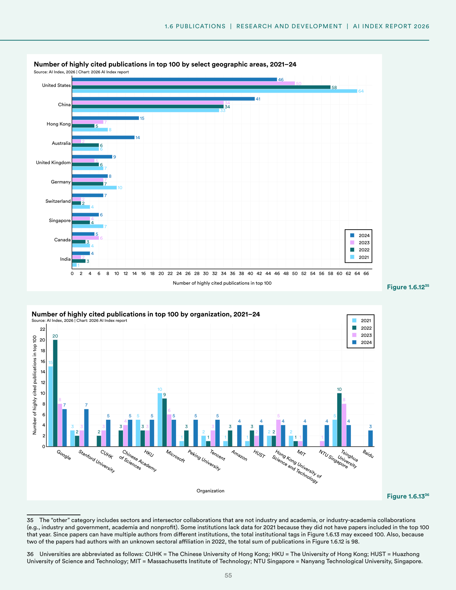
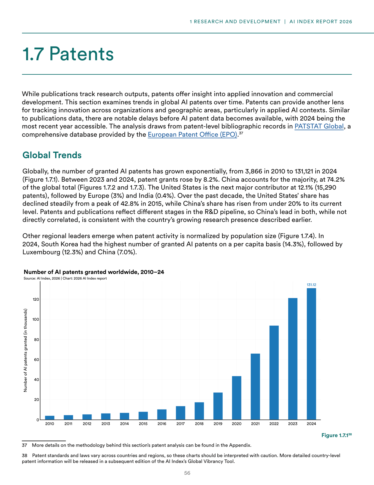
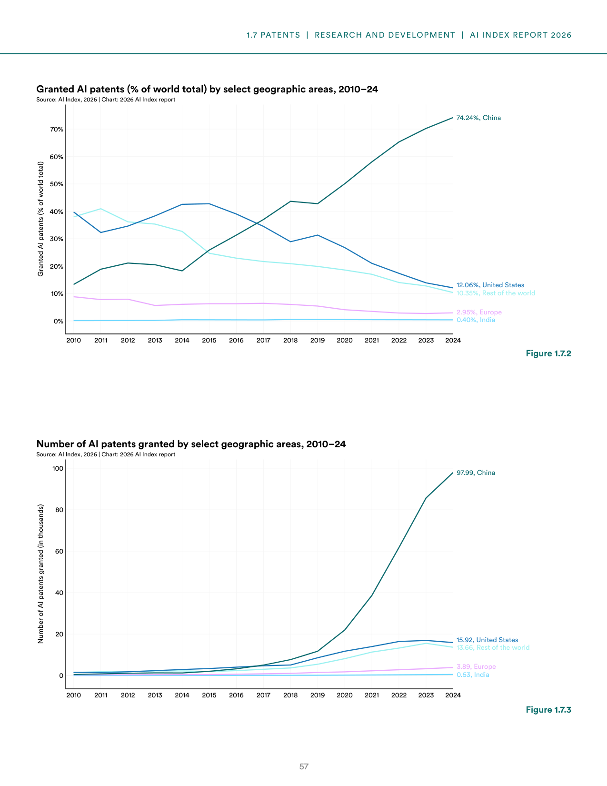
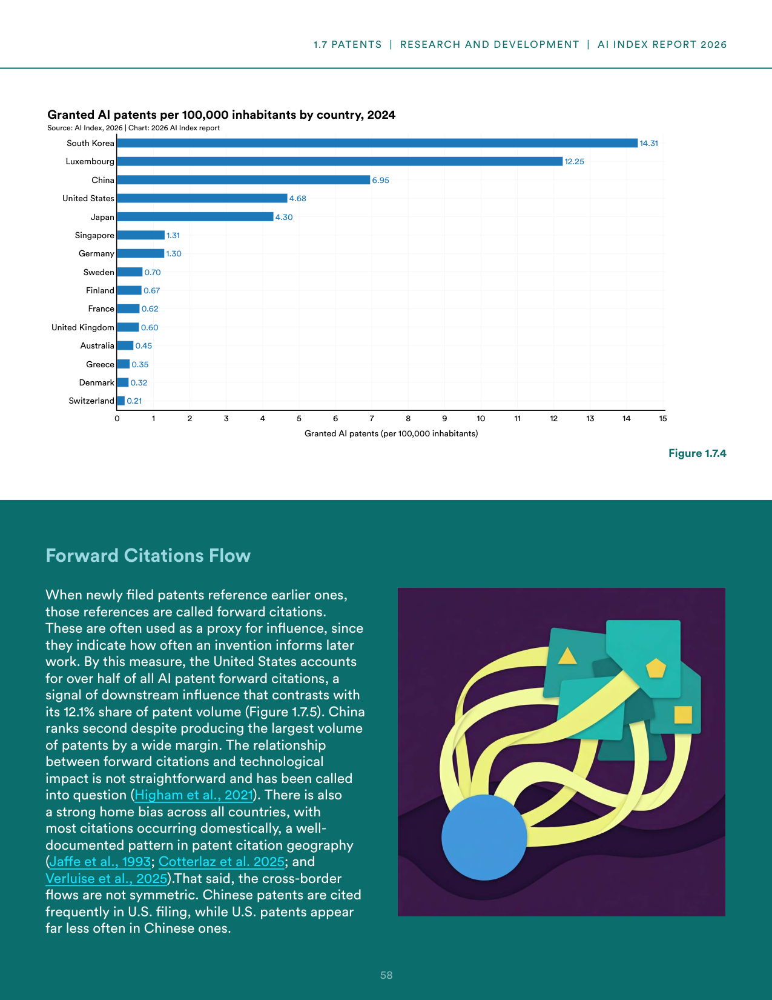
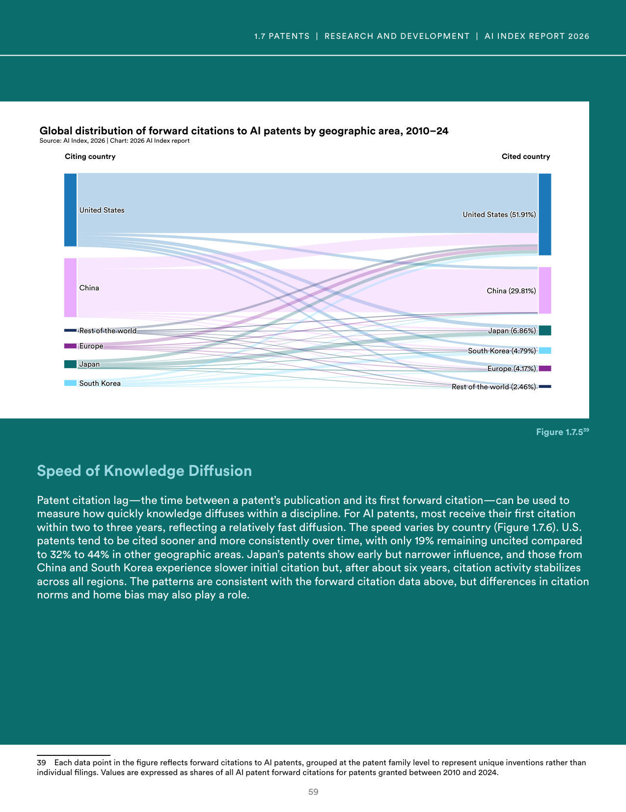
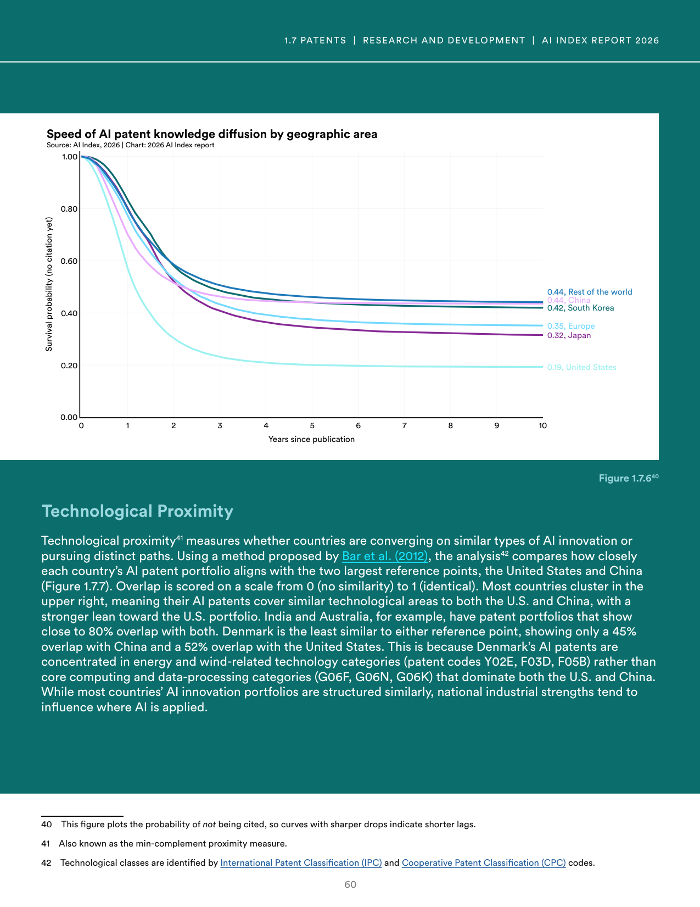
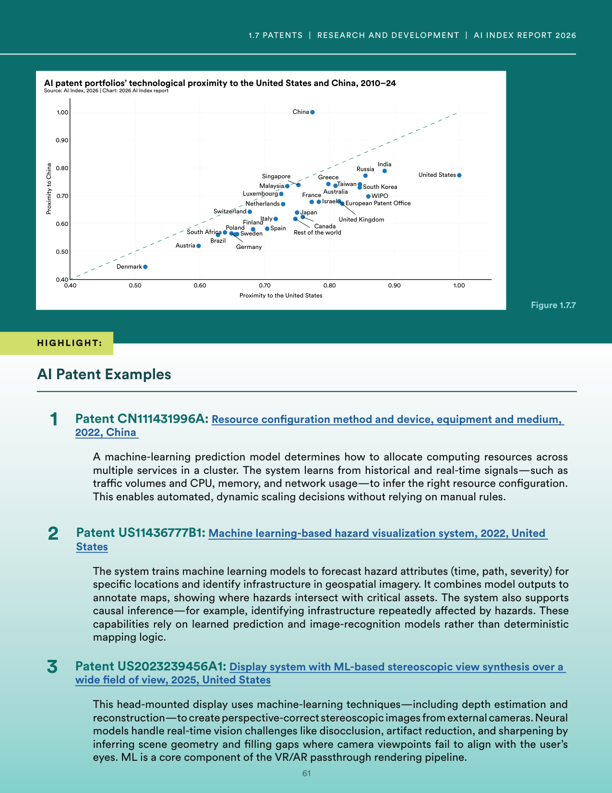

# ai-research-patents-impact-analysis

**Parent:** [[content/L1/ai-environmental-research-patents-2026|ai-environmental-research-patents-2026]] — The 2026 AI Index Report shows a shift toward China's dominance in patent volume (74.24%) and publication counts, while the U.S. maintains leadership in high-influence patents (51.91% forward citations) and cumulative GitHub stars (30.02 million).

The 2026 Artificial Intelligence Index Report provides an analysis of high-impact AI research and the global landscape of AI patents from 2010 to 2026. 

### Highly Cited AI Publications

Using citation data from OpenAlex, the AI Index identified the 100 most-cited AI publications from 2021 to 2024. 

**Figure 1.6.12: Number of highly cited publications in top 100 by select geographic areas, 2021–24**
- X-axis: Year (2021 to 2024)
- Y-axis: Number of highly cited publications in top 100 (0 to 66)
- United States: 64 (2021) $\rightarrow$ 58 (2023) $\rightarrow$ 46 (2024)
- China: 33 (2021) $\rightarrow$ 34 (2023) $\rightarrow$ 41 (2024)
- Hong Kong: 10 (2021) $\rightarrow$ 7 (2023) $\rightarrow$ 9 (2024)
- Australia: 2 (2021) $\rightarrow$ 6 (2023) $\rightarrow$ 14 (2024)
- United Kingdom: 7 (2021) $\rightarrow$ 6 (2023) $\rightarrow$ 8 (2024)
- Germany: 6 (2021) $\rightarrow$ 5 (2023) $\rightarrow$ 7 (2024)
- Switzerland: 4 (2021) $\rightarrow$ 4 (2023) $\rightarrow$ 7 (2024)
- Singapore: 4 (2021) $\rightarrow$ 4 (2023) $\rightarrow$ 6 (2024)
- Canada: 1 (2021) $\rightarrow$ 2 (2023) $\rightarrow$ 5 (2024)
- India: 2 (2021) $\rightarrow$ 2 (2023) $\rightarrow$ 4 (2024)
- Note: In 2022, the total sum of publications is 98 because two papers had authors with an unknown sectoral affiliation.

**Figure 1.6.13: Number of highly cited publications in top 100 by organization, 2021–24**
- X-axis: Organization
- Y-axis: Number of highly cited publications in top 100 (0 to 22)
- 2024 Top Contributors:
    - Google: 7
    - Stanford University: 7
    - Chinese Academy of Sciences: 5
    - Microsoft: 5
    - HKU (The University of Hong Kong): 5
    - Peking University: 4
    - Tencent: 4
    - Amazon: 4
    - HUST (Huazhong University of Science and Technology): 4
    - Hong Kong University of Science and Technology: 4
    - MIT (Massachusetts Institute of Technology): 3
    - NTU Singapore (Nanyang Technological University, Singapore): 3
    - Tsinghua University: 3
    - Baidu: 3
- Note: Total institutional tags may exceed 100 because papers can have multiple authors from different institutions.

### Global AI Patent Trends (2010–2024)

While publications track research outputs, patents provide insight into applied innovation and commercial development. The following analysis draws from the PATSTAT Global database provided by the European Patent Office (EPO).

#### Volume and Growth
Globally, the number of granted AI patents grew exponentially from 3,866 in 2010 to 131,121 in 2024. Between 2023 and 2024, patent grants increased by 8.2%.

**Figure 1.7.1: Number of AI patents granted worldwide, 2010–24**
- X-axis: Year (2010 to 2024)
- Y-axis: Number of AI patents granted (in thousands), from 0 to 120+
- Final value (2024): 131.12 thousand

#### Geographic Distribution
China accounts for the majority of global AI patents at 74.24%. The United States is the second-largest contributor with 12.06% (15,920 patents), followed by the Rest of the World (10.35%), Europe (2.95%), and India (0.40%). Over the last decade, the U.S. share has declined from a peak of 42.8% in 2015, while China's share has risen from under 20%.

**Figure 1.7.2: Granted AI patents (% of world total) by select geographic areas, 2010–24**
- X-axis: Year (2010 to 2024)
- Y-axis: Granted AI patents (% of world total), from 0% to 70%+
- 2024 values: China (74.24%), United States (12.06%), Rest of the world (10.35%), Europe (2.95%), India (0.40%)

**Figure 1.7.3: Number of AI patents granted by select geographic areas, 2010–24**
- X-axis: Year (2010 to 2024)
- Y-axis: Number of AI patents granted (in thousands), from 0 to 100+
- 2024 values: China (97.99 thousand), United States (15.92 thousand), Rest of the world (13.66 thousand), Europe (3.89 thousand), India (0.53 thousand)

#### Per Capita Patenting
When normalized by population size, South Korea had the highest number of granted AI patents per 100,000 inhabitants in 2024, followed by Luxembourg and China.

**Figure 1.7.4: Granted AI patents per 100,000 inhabitants by country, 2024**
- X-axis: Granted AI patents (per 100,000 inhabitants)
- Y-axis: Country
- Values: South Korea (14.31), Luxembourg (12.25), China (6.95), United States (4.68), Japan (4.30), Singapore (1.30), Germany (1.31), Sweden (0.70), Finland (0.67), France (0.62), United Kingdom (0.60), Australia (0.45), Greece (0.35), Denmark (0.32), Switzerland (0.21)

#### Forward Citations and Influence
Forward citations—where new patents reference earlier ones—serve as a proxy for influence. The United States accounts for over 51.91% of all AI patent forward citations, signaling high downstream influence despite its lower volume share (12.1%). China ranks second (29.81%) despite producing the most patents.

**Figure 1.7.5: Global distribution of forward citations to AI patents by geographic area, 2010–24**
- This figure is a Sankey-style flow chart showing citations from citing countries to cited countries.
- Distribution of cited countries (2010-2024): United States (51.91%), China (29.81%), Japan (6.86%), South Korea (4.79%), Europe (4.17%), Rest of the world (2.46%)

#### Speed of Knowledge Diffusion
Patent citation lag—the time between publication and the first forward citation—measures the speed of knowledge diffusion. Most AI patents are cited within two to three years. U.S. patents are cited more quickly and consistently, with only 19% remaining uncited. In contrast, 32% to 44% of patents in other regions remain uncited.

**Figure 1.7.6: Speed of AI patent knowledge diffusion by geographic area**
- X-axis: Years since publication (0 to 10)
- Y-axis: Survival probability (probability of not being cited yet), from 0.00 to 1.00
- 10-year survival probability (uncited rate): United States (0.19), Japan (0.32), Europe (0.35), South Korea (0.42), China (0.44), Rest of the world (0.44)

#### Technological Proximity
Technological proximity (the min-complement proximity measure) evaluates if countries are pursuing similar innovation paths by comparing portfolios to the U.S. and China. Proximity is scored from 0 (no similarity) to 1 (identical).

**Figure 1.7.7: AI patent portfolios’ technological proximity to the United States and China, 2010–24**
- X-axis: Proximity to the United States (0.40 to 1.00)
- Y-axis: Proximity to China (0.40 to 1.00)
- Key observations: Most countries cluster in the upper right (high similarity to both), with a stronger lean toward the U.S. India and Australia show close to 80% overlap with both. Denmark is the least similar to either, with only 45% overlap with China and 52% overlap with the United States, as its patents are concentrated in energy and wind-related technology (codes Y02E, F03D, F05B) rather than core computing (G06F, G06N, G06K).

### AI Patent Examples

1. **Patent CN111431996A (2022, China):** A resource configuration method and device that uses a machine-learning prediction model to automatically allocate computing resources in a cluster based on historical and real-time signals (e.g., traffic, CPU, memory, network usage).
2. **Patent US11436777B1 (2022, United States):** A machine learning-based hazard visualization system that forecasts hazard attributes (time, path, severity) using geospatial imagery and identifies where hazards intersect with critical infrastructure through learned prediction and image-recognition models.
3. **Patent US202323945 la (2025, United States):** A display system with ML-based stereoscopic view synthesis for VR/AR passthrough rendering, using neural models for depth estimation and reconstruction to create perspective-correct images from external cameras, handling challenges like disocclusion and artifact reduction.

## Source pages

