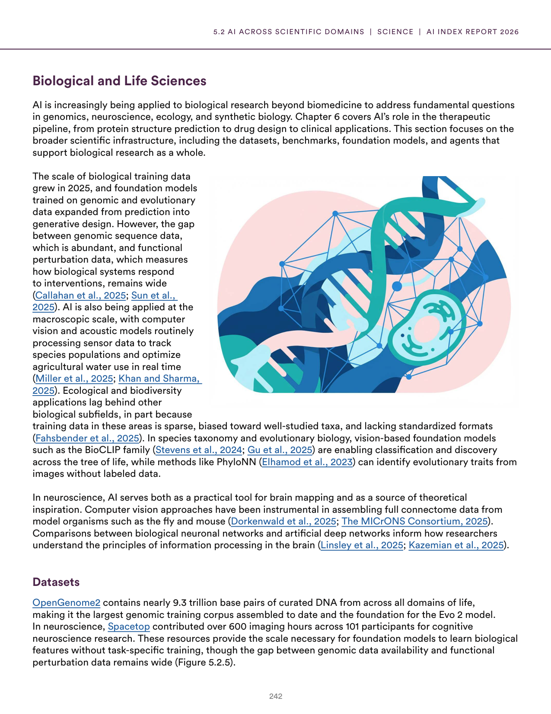
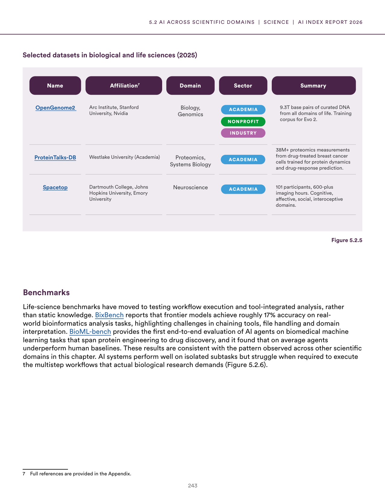
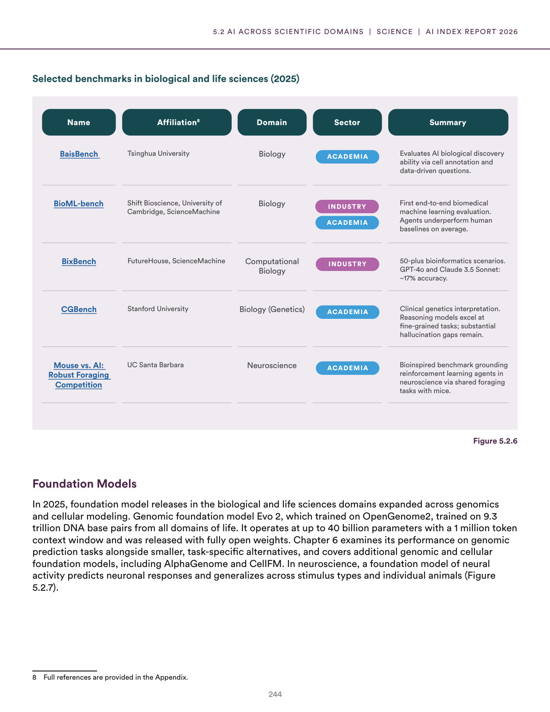
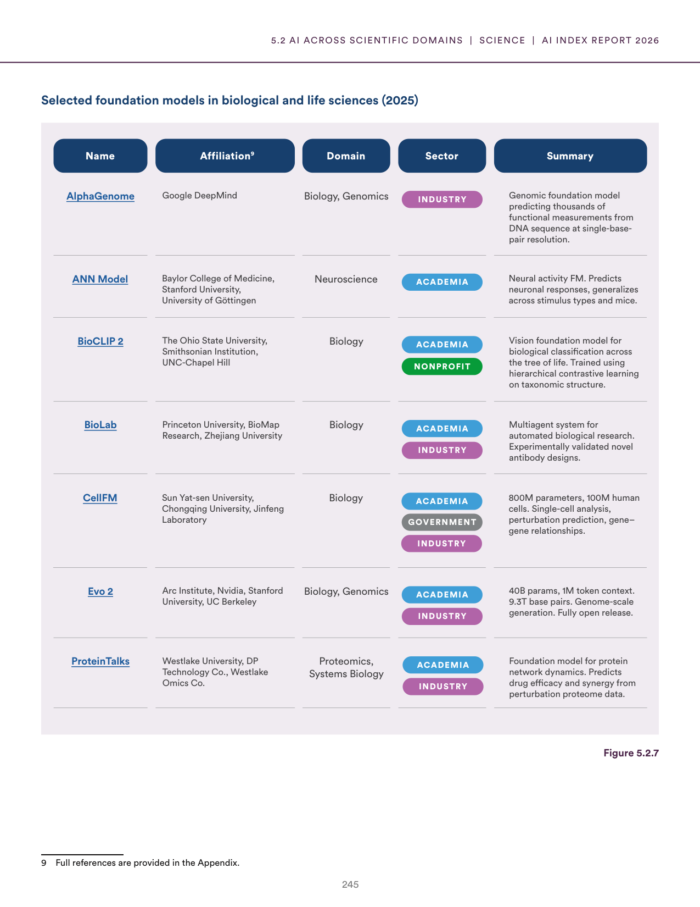
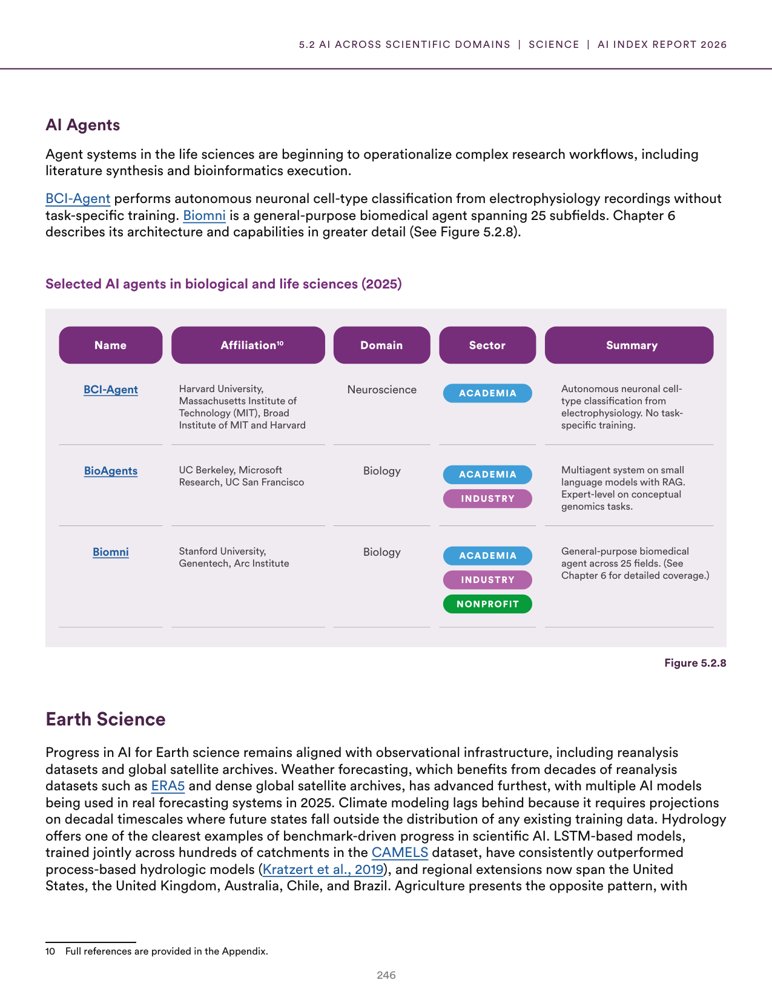
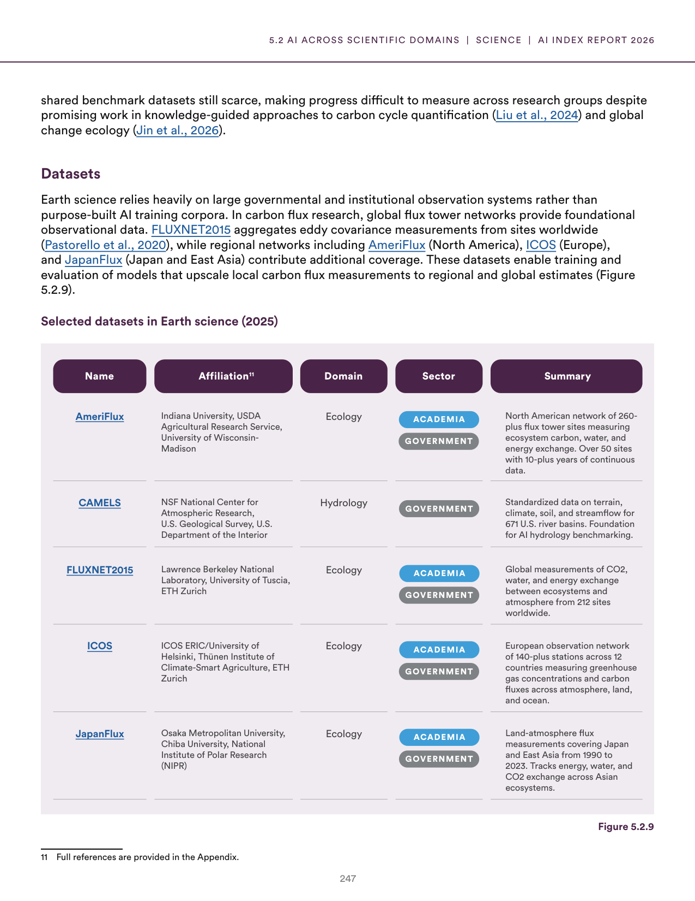
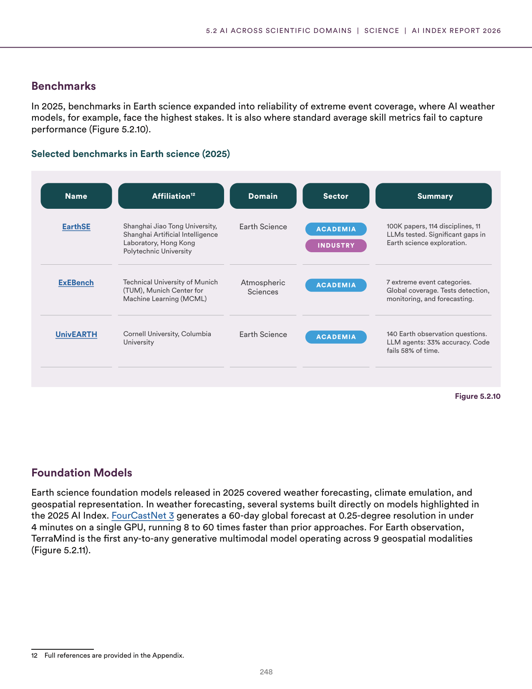
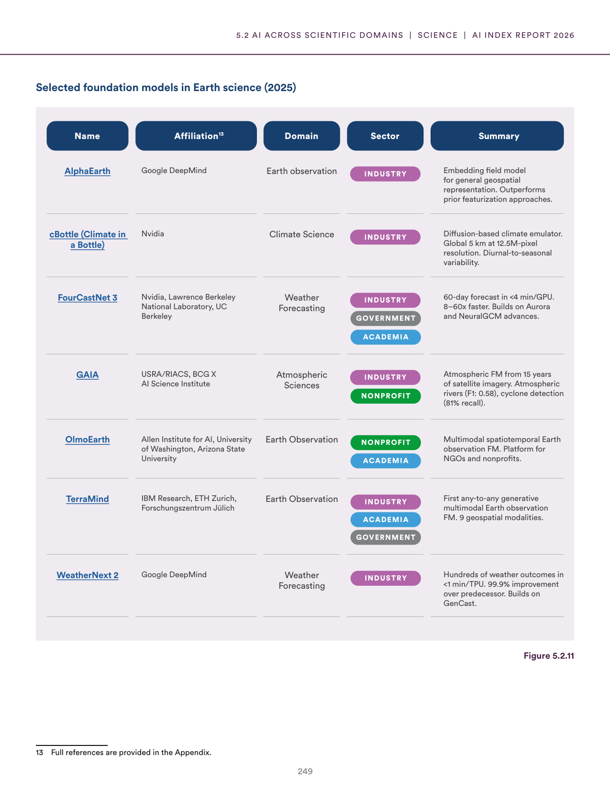

# ai_biological_earth_sciences.json

**Parent:** [[content/L1/ai-for-science-applications-2025|ai-for-science-applications-2025]] — AI in 2025 is shifting toward 'AI4Science,' utilizing closed-loop 'predict-synthesize-test-analyze' systems with lab-on-a-chip robotics to accelerate drug discovery, while applying geometric deep learning for 3D molecular modeling and machine learning emulators for high-resolution climate projections.

The 2025 report on AI applications in science highlights the role of AI in biological and earth sciences. In biological research, AI is used to model complex systems; for instance, the 'Open-set' approach helps in analyzing cellular behavior. In earth sciences, AI assists in monitoring environment and climate. 

Regarding biological and health sciences, a significant focus is on the intersection of AI and genomics. AI models are being used to predict protein folding and genomic sequences, which accelerates drug discovery. Specifically, the use of Large Language Models (LLMs) has been extended to 'protein languages,' where the AI treats amino acid sequences as tokens to predict functional sites and mutations. 

In earth sciences, AI is integrated into climate modeling to bridge the gap between coarse-grained global climate models and high-resolution local weather patterns. Machine learning 'emulators' are used to replace computationally expensive physics-based simulations, allowing for faster and more frequent climate projections. Additionally, AI is used in satellite imagery analysis to track deforestation and urban sprawl in real-time.

Crucially, the report emphasizes the 'AI-for-Science' paradigm, where AI is not just a tool for data analysis but is integrated into the scientific method through closed-loop systems: AI proposes a hypothesis, robots conduct the experiment, and the results are fed back into the AI to refine the model.

## Source pages

