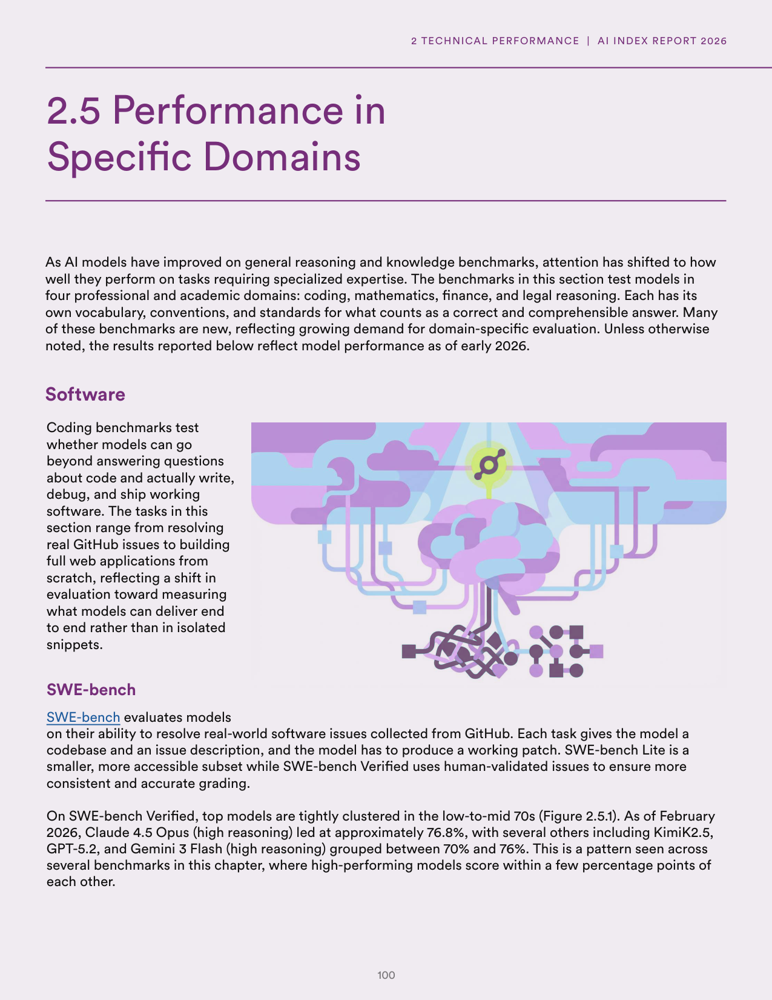
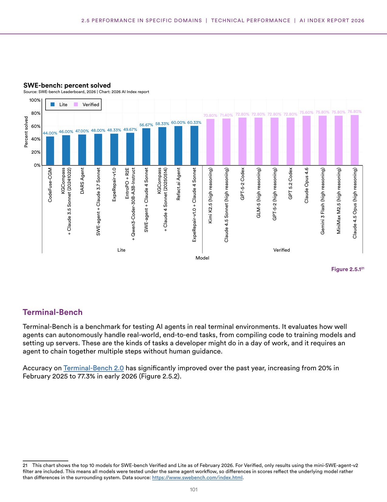
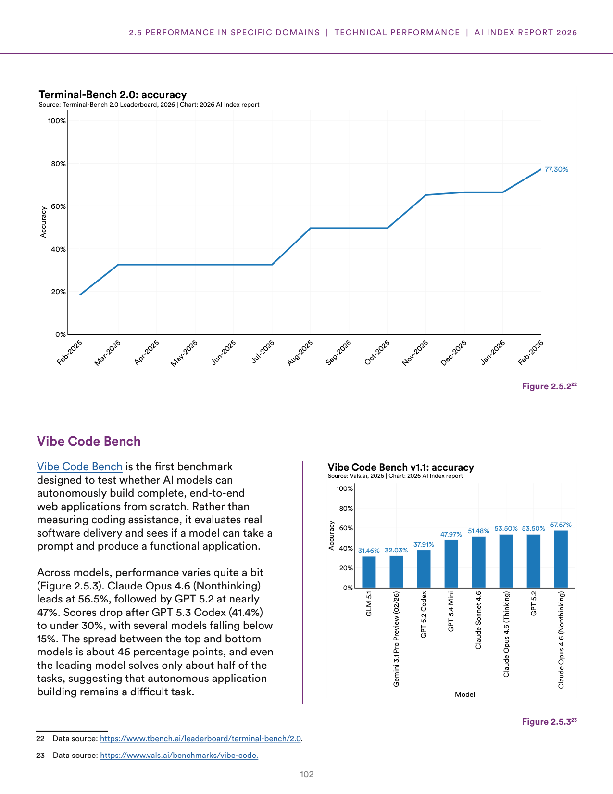
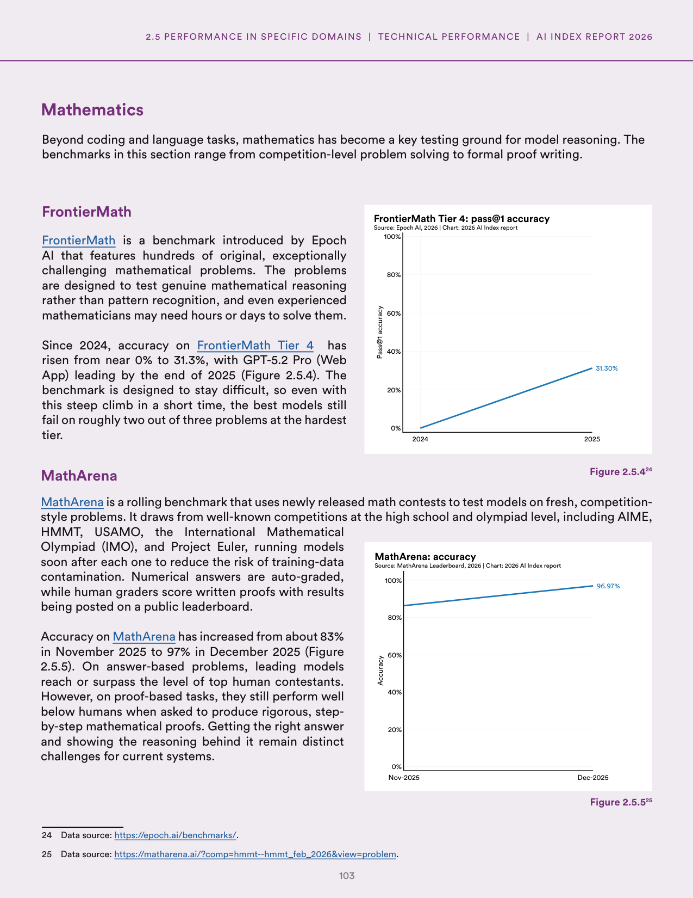
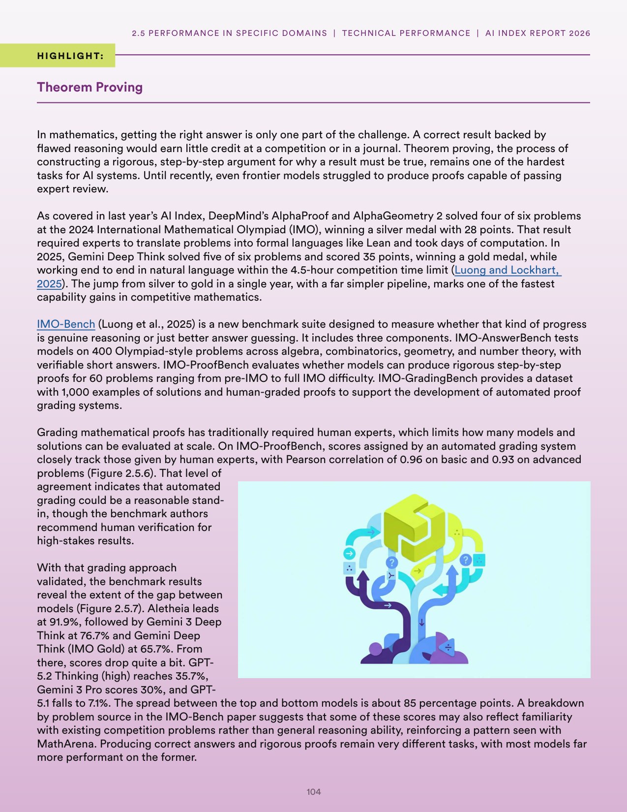
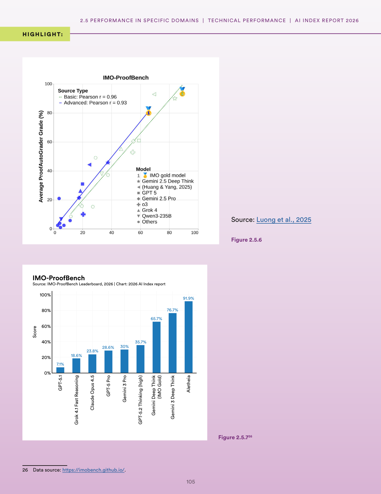
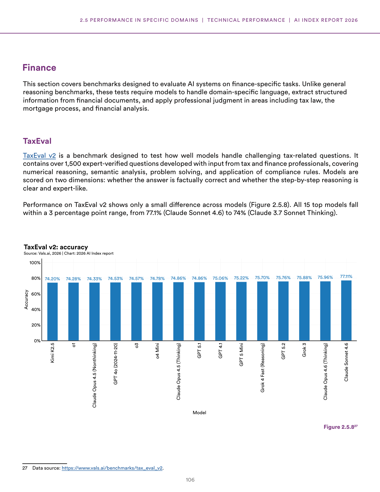
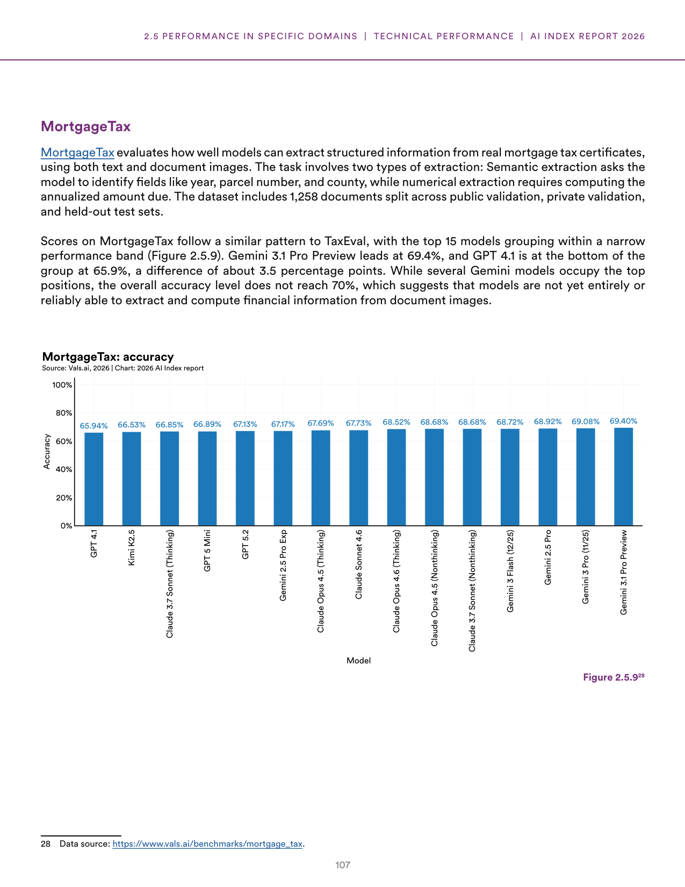

# ai_domain_benchmarks_analysis

**Parent:** [[content/L1/ai-specialized-benchmarks-and-robotics|ai-specialized-benchmarks-and-robotics]] — AI models show improvements in benchmarks like GSM8K, HumanEval, and RLBench, but struggle with complex multi-step reasoning and the 'sim-to-real' gap in robotics, while professional exam success in law and medicine does not equate to real-world practice.

The provided text details the performance and benchmarks of AI models across specialized domains, specifically in coding, mathematics, and professional fields. In the realm of coding, the report highlights the use of the 'CodeContests' benchmark, noting that while models are improving, they still struggle with complex, multi-step reasoning. In mathematics, it discusses the shift toward more rigorous benchmarks like MATH and GSM8K, emphasizing the gap between simple arithmetic and complex problem-solving. In professional domains, the text examines the use of benchmarks for law and medicine, noting that while models can pass professional exams, they often lack the nuanced reasoning required for real-world practice. Furthermore, it mentions the 'CodeContests' benchmark's focus on the ability to generate code that is not only syntactically correct but also efficient and correct against hidden test cases.

## Source pages

