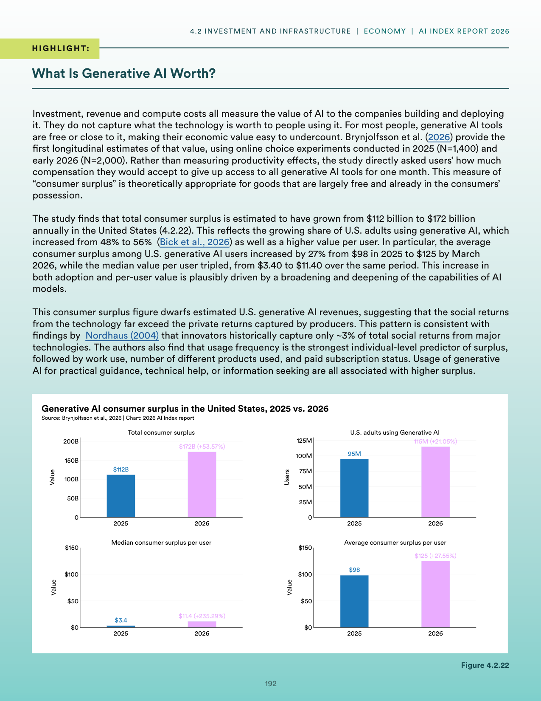
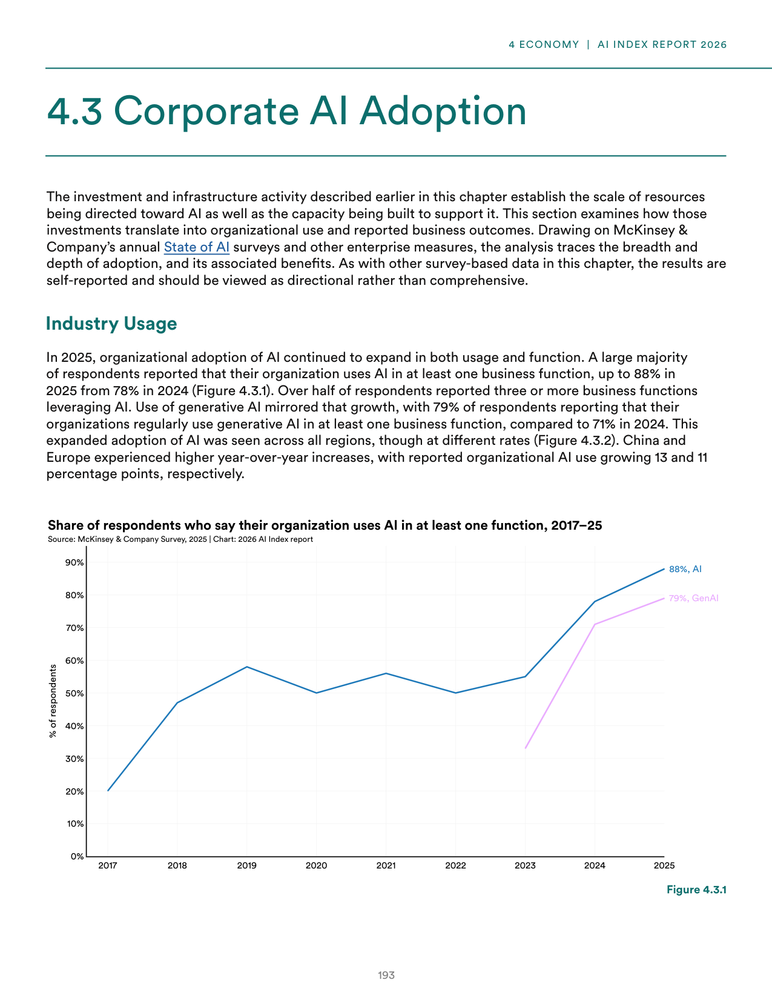
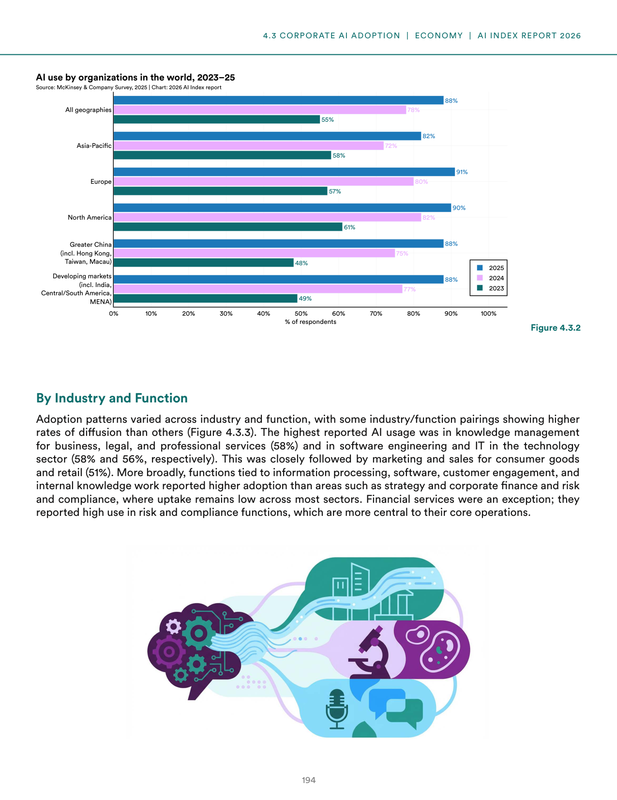
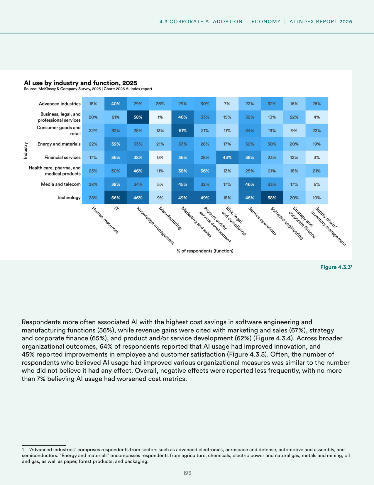
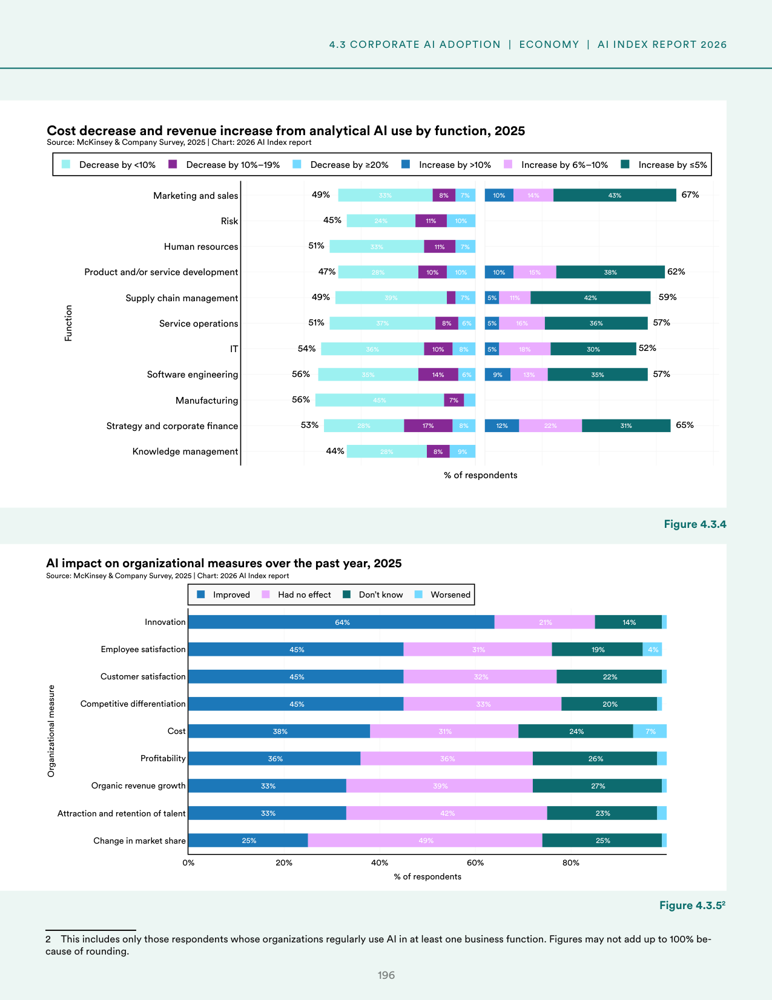
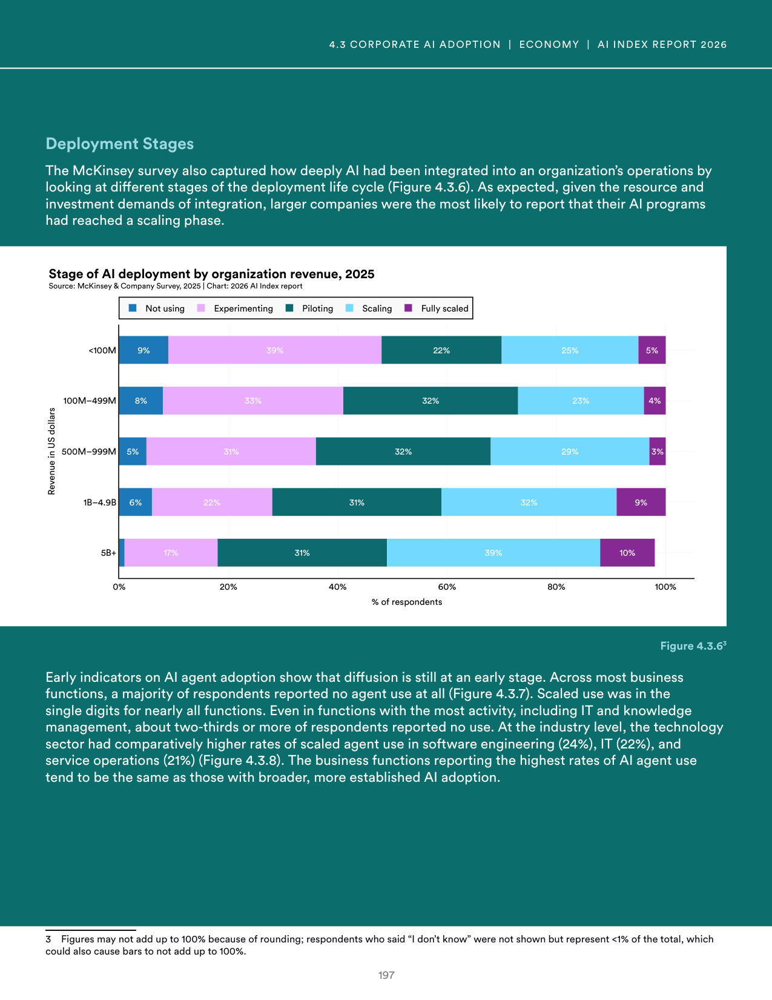
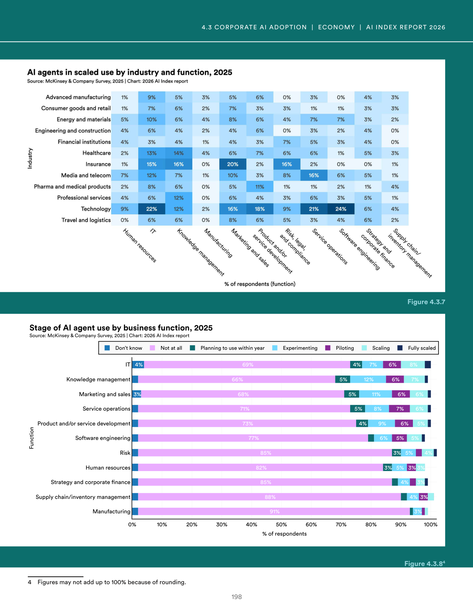
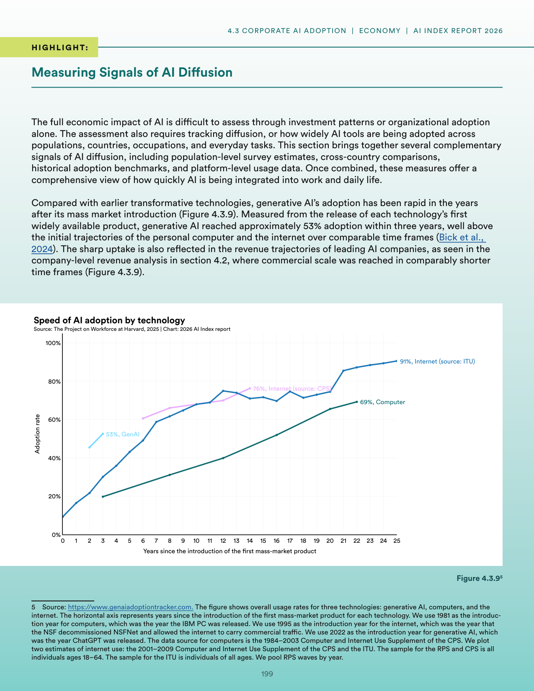

# ai_economics_productivity_paradox

**Parent:** [[content/L1/ai-ecosystem-2025-economics-safety-labor|ai-ecosystem-2025-economics-safety-labor]] — The 2025 AI landscape is characterized by technical tensions between capability and safety, a US-led concentration of capital in vertical AI, and a 'productivity paradox' where corporate AI investment has not yet yielded macroeconomic productivity gains, while the US labor market sees a sharp rise in demand for specialized AI/ML production skills over general data analysis.

In the 2025 reports on AI economics and adoption, the impact of generative AI is analyzed through both consumer and corporate lenses. For individual users, the economic value is measured by the 'consumer surplus' (the difference between what users are willing to pay and the actual price), though the report notes that this value varies significantly by use case. At the corporate level, adoption is tracked via investment and deployment. While many companies have integrated AI into their workflows, a 'productivity paradox' is observed where significant investment in AI has not yet translated into a measurable increase in overall macroeconomic productivity. The report highlights terms like 'AI-ready' organizations—those that have updated their data infrastructure and employee skills to actually leverage these tools. Furthermore, the data indicates a divide between 'leaders' (companies seeing tangible ROI) and 'laggards' (those using AI for superficial tasks), suggesting that the bottleneck for AI value is often organizational culture and data quality rather than the technology itself.

## Source pages

