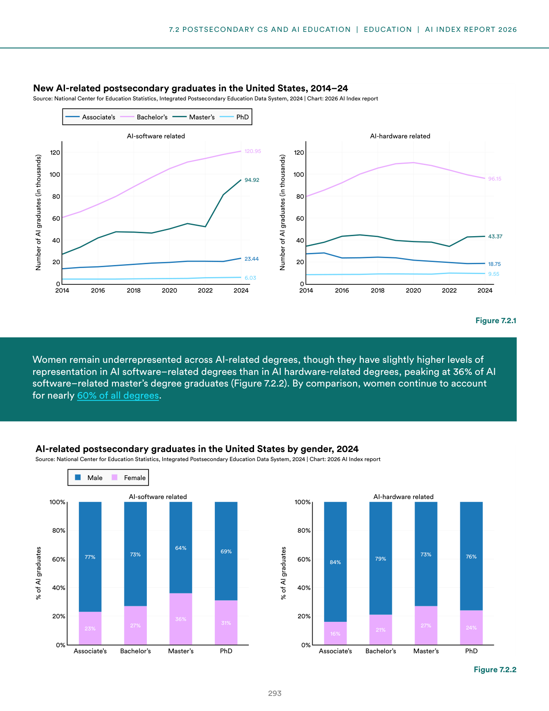
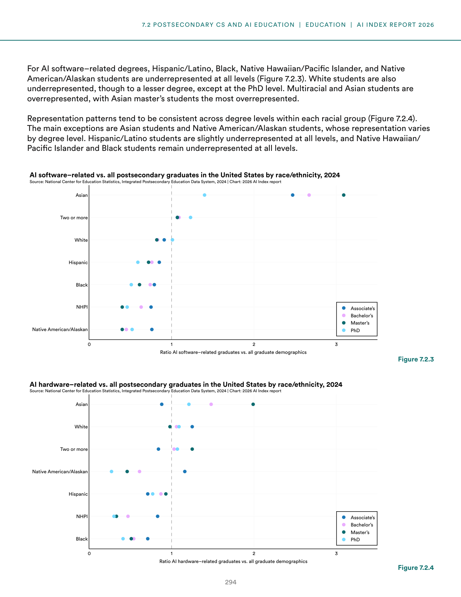
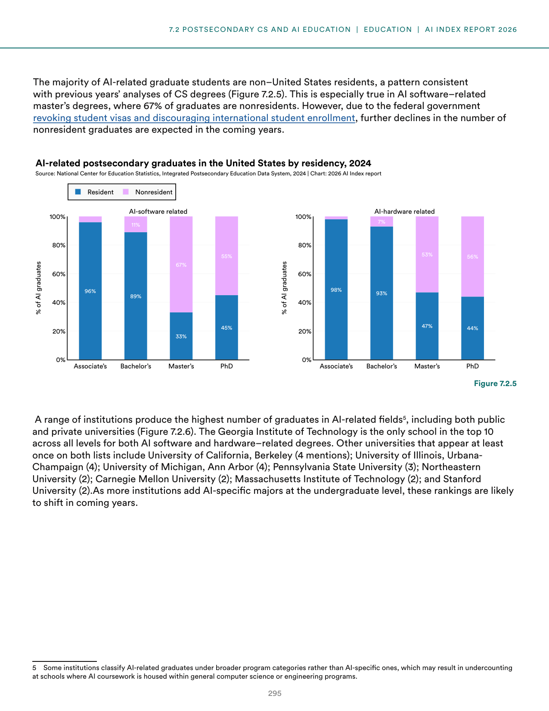
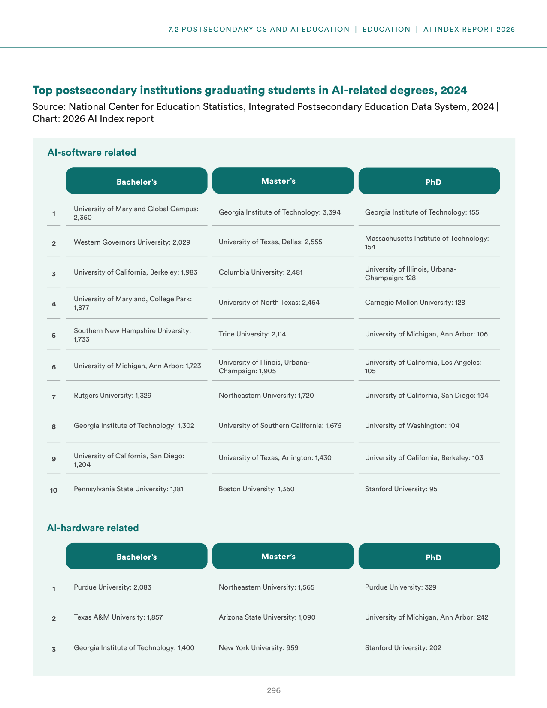
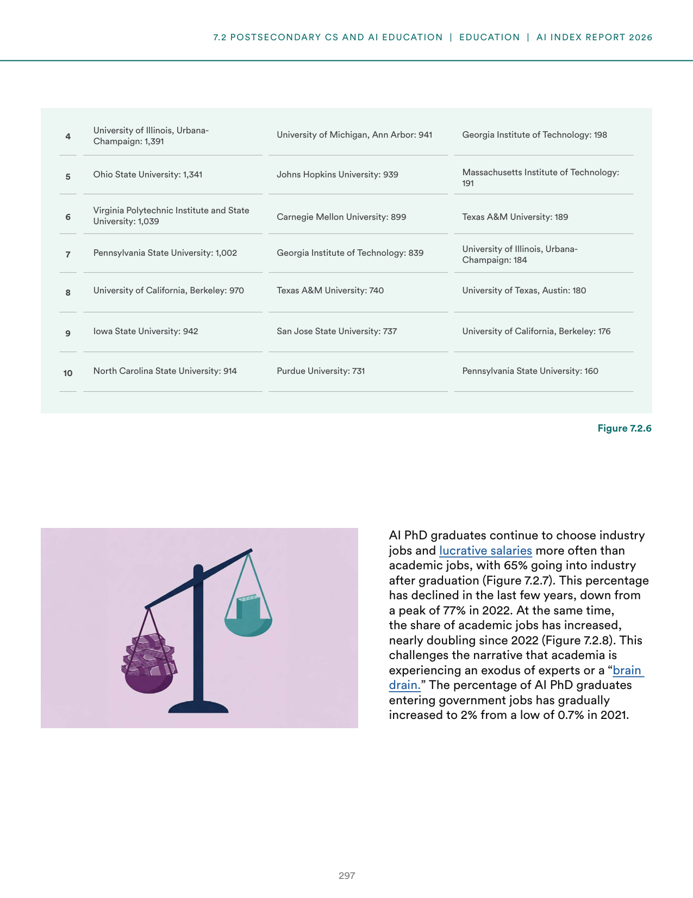
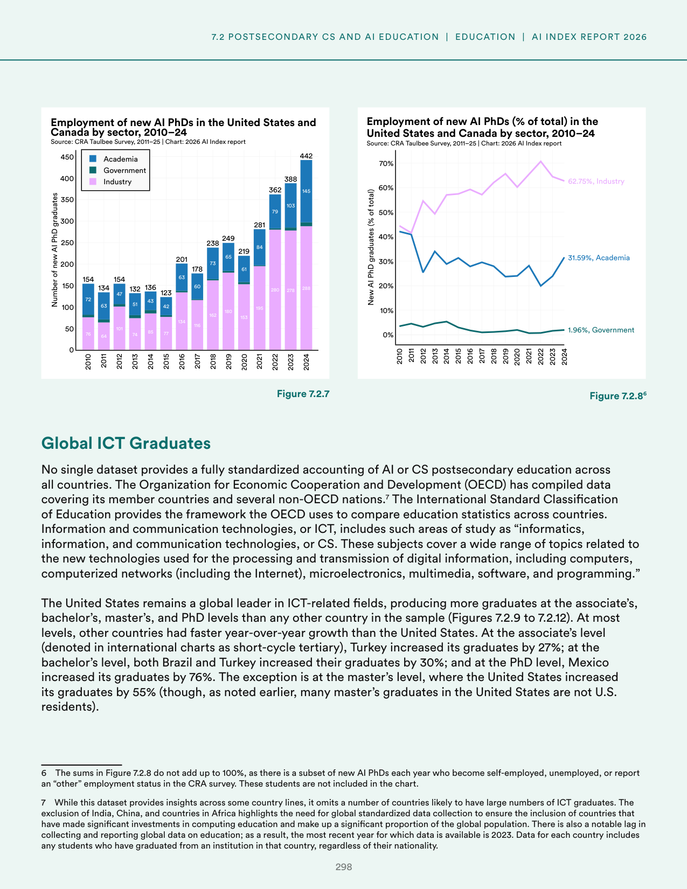
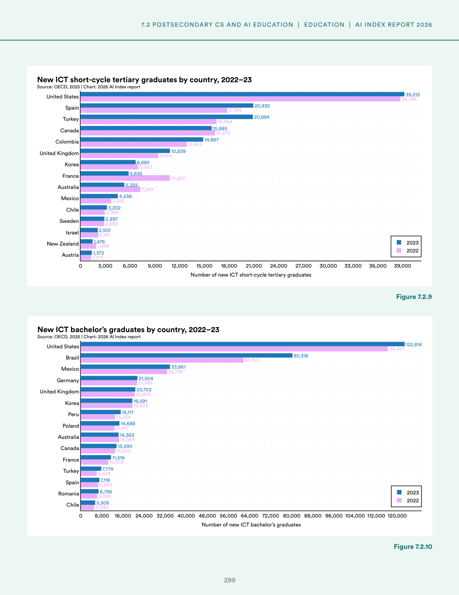
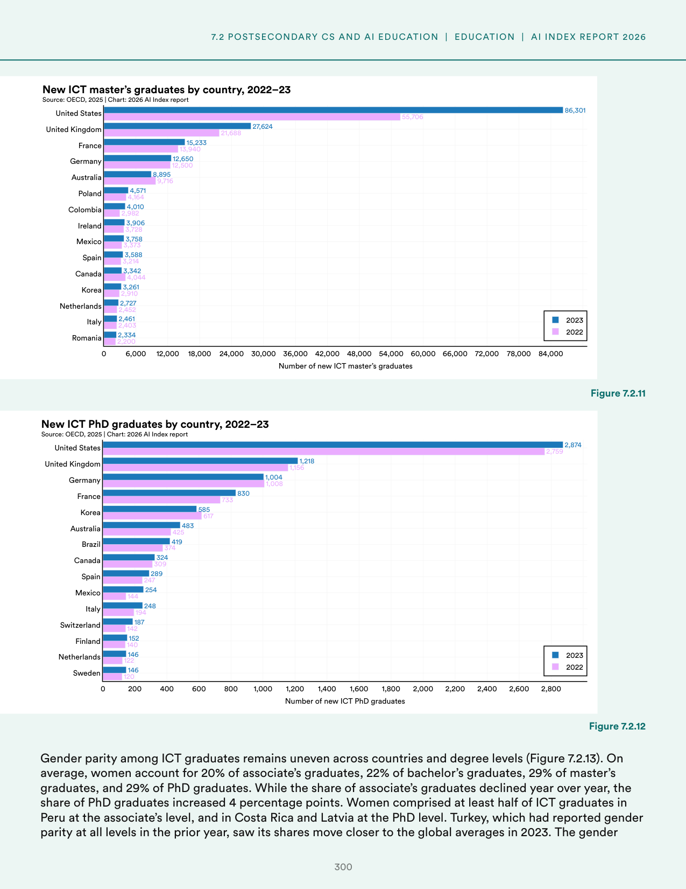

# ai_education_demographics_trends

**Parent:** [[content/L1/ai-education-ethics-sovereignty-trends|ai-education-ethics-sovereignty-trends]] — The 2025 AI Index reports a global skills gap and a lack of standardized AI curricula, with France, UAE, and China investing billions in 'AI Sovereignty' to reduce NVIDIA and US-provider dependency. In the US, K-12 CS enrollment gaps persist in the U20 population due to teacher shortages, while universities shift from AI bans to guided integration.

The provided text analyzes trends and statistics regarding AI and computer science education, specifically focusing on AI-related degrees and certifications. It details the demographics and outcomes of these programs, including a breakdown of graduates by gender and the various types of credentials obtained (e.g., Bachelor's, Master's, and professional certifications). The data highlights the growing demand for AI skills and the disparities in representation within the field, while also noting the shift toward shorter, specialized certification programs alongside traditional academic degrees.

## Source pages

