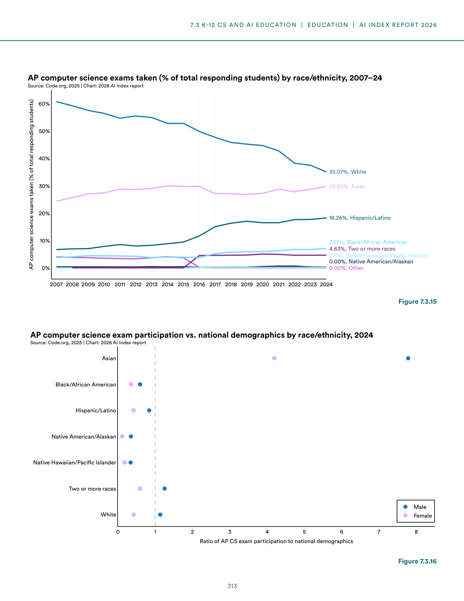
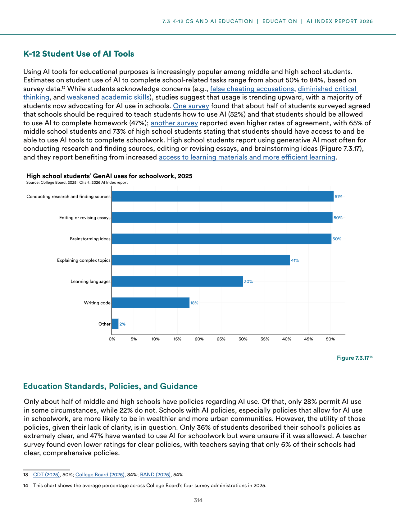
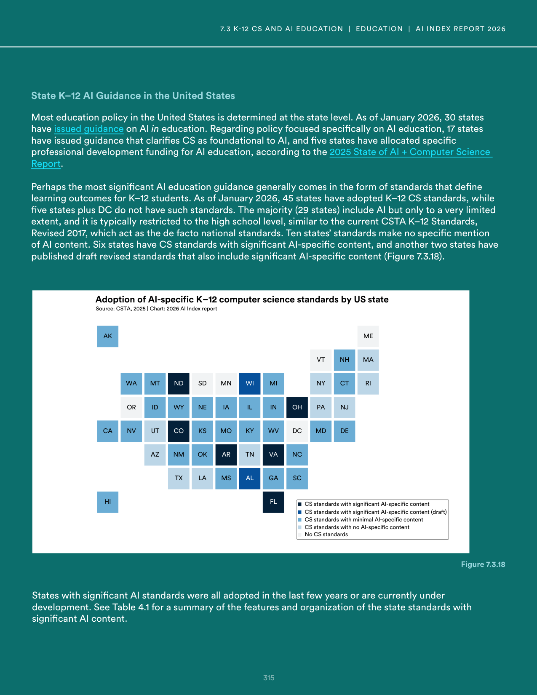
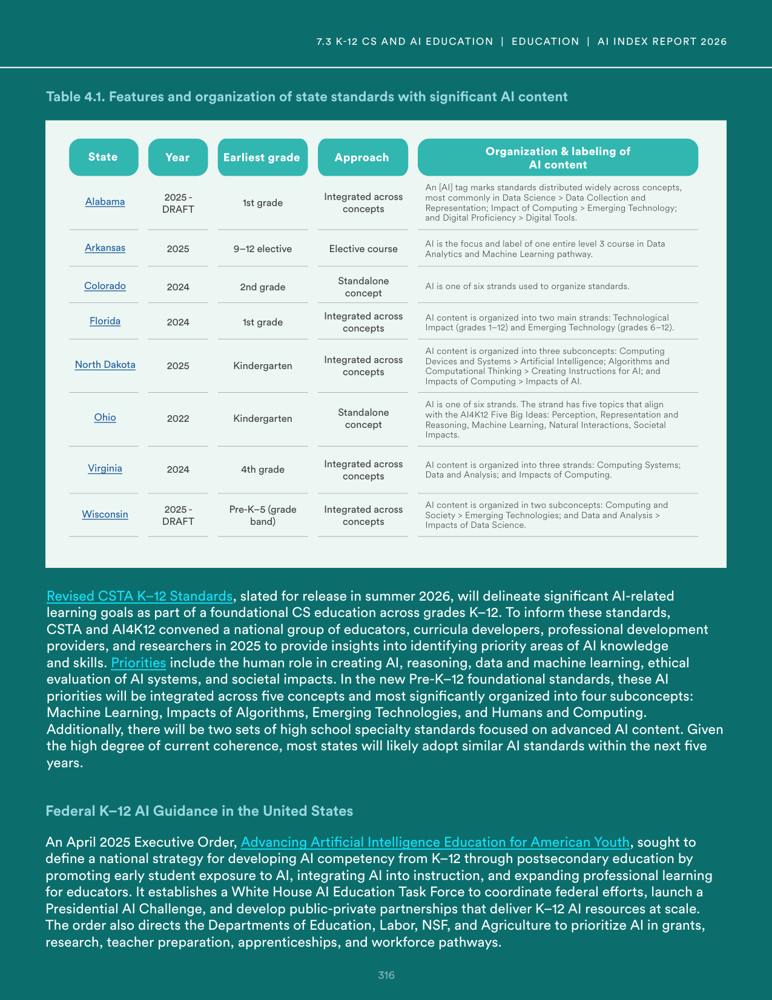
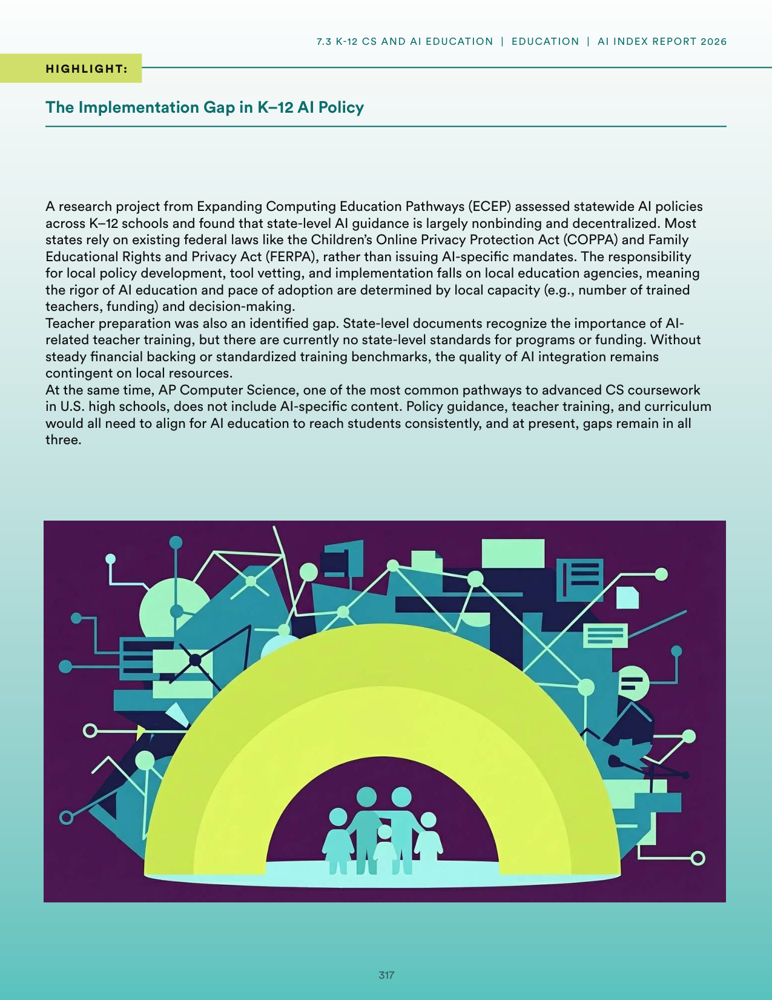
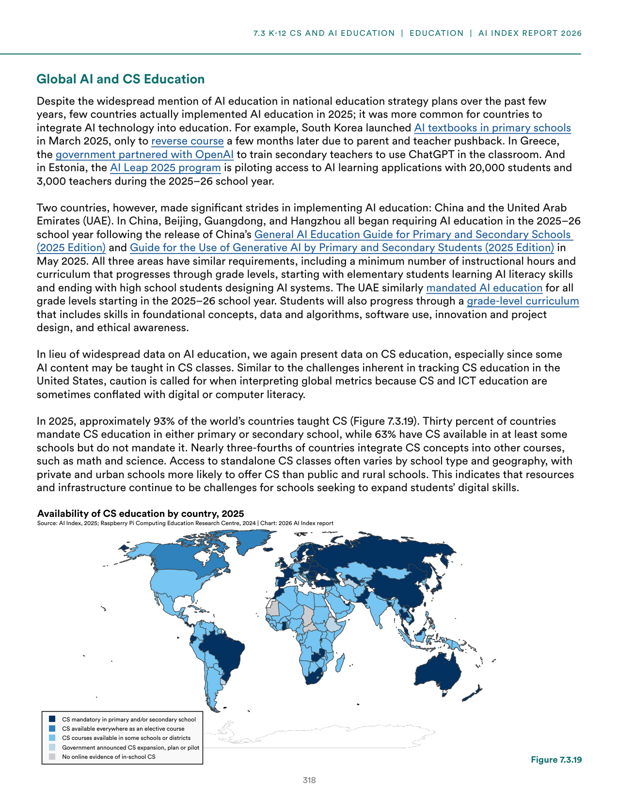

# ai_education_global_comparison

**Parent:** [[content/L1/ai-education-ethics-sovereignty-trends|ai-education-ethics-sovereignty-trends]] — The 2025 AI Index reports a global skills gap and a lack of standardized AI curricula, with France, UAE, and China investing billions in 'AI Sovereignty' to reduce NVIDIA and US-provider dependency. In the US, K-12 CS enrollment gaps persist in the U20 population due to teacher shortages, while universities shift from AI bans to guided integration.

The provided text details the state of AI and computer science education, focusing on the United States and global trends. In the U.S., there is a significant gap in AI education; while some progress is noted, the report highlights a lack of standardized AI curricula in schools. At the policy level, the U.S. government has begun emphasizing AI literacy, but implementation varies. Globally, some countries are integrating AI into national curricula more aggressively than the U.S. For example, China and several European nations have introduced AI modules at terms of primary and secondary education. The document emphasizes that while technical tools are available, the pedagogical framework for teaching AI—balancing theory, ethics, and practice—remains underdeveloped. It also notes that industry-led initiatives often fill the gap where public education falls short, though this can lead to an uneven distribution of AI skills across different socioeconomic groups.

## Source pages

