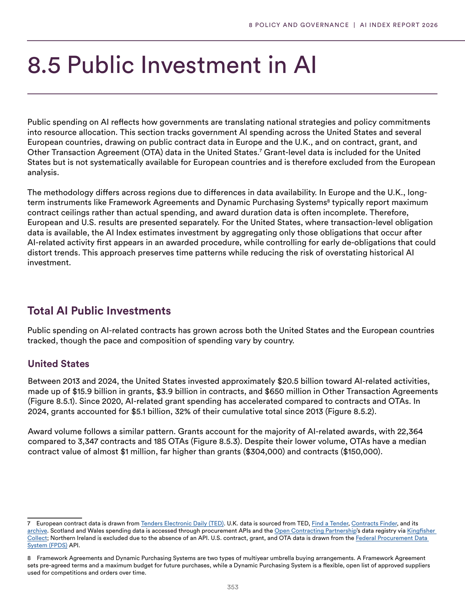
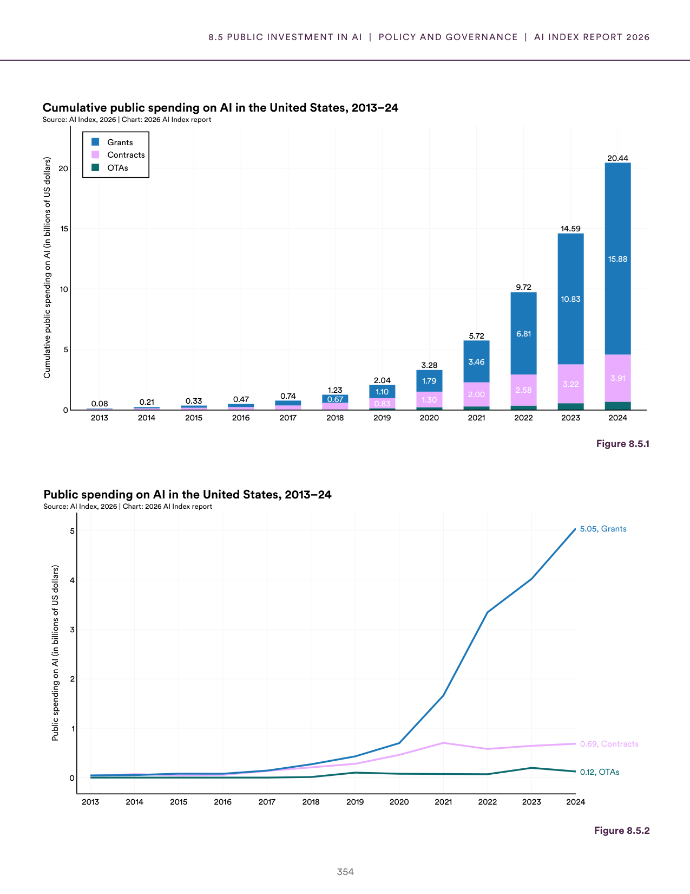
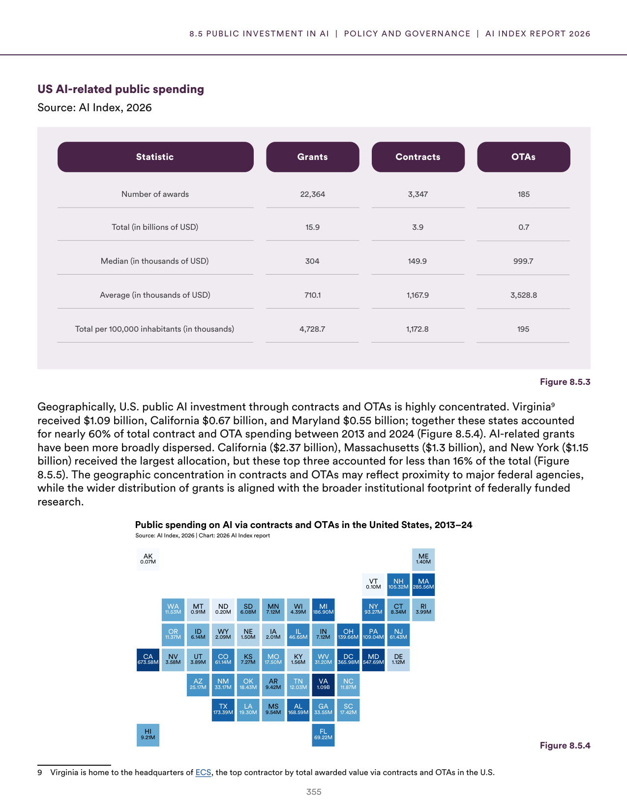
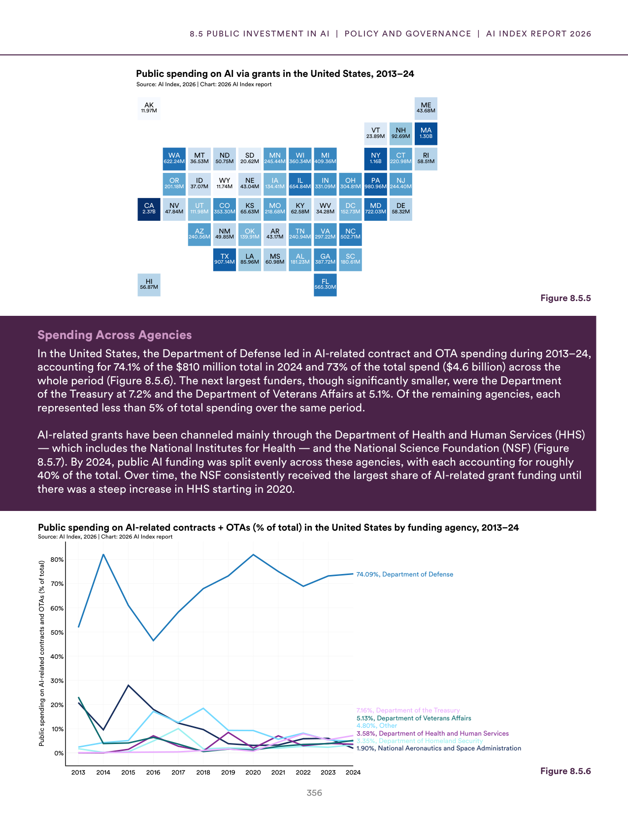
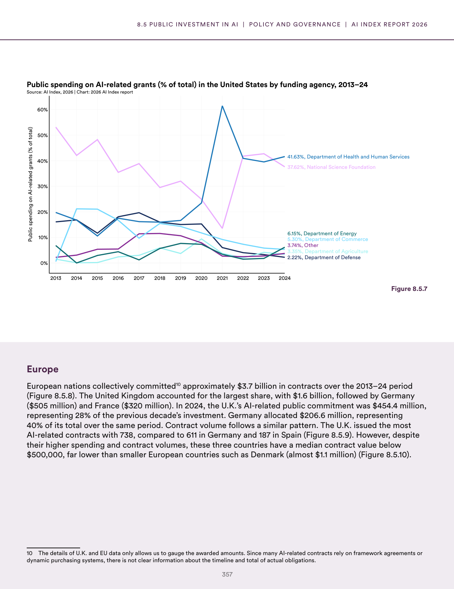
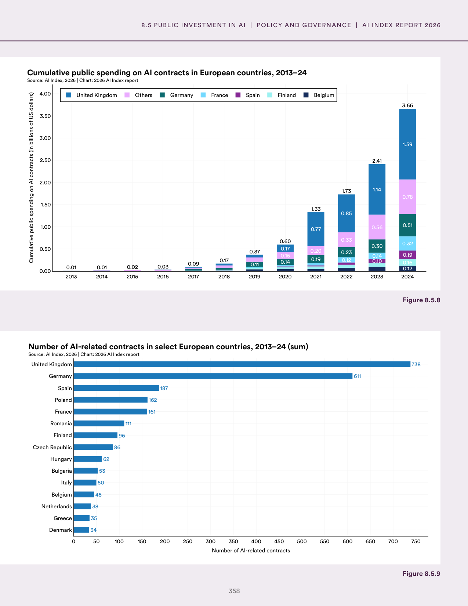
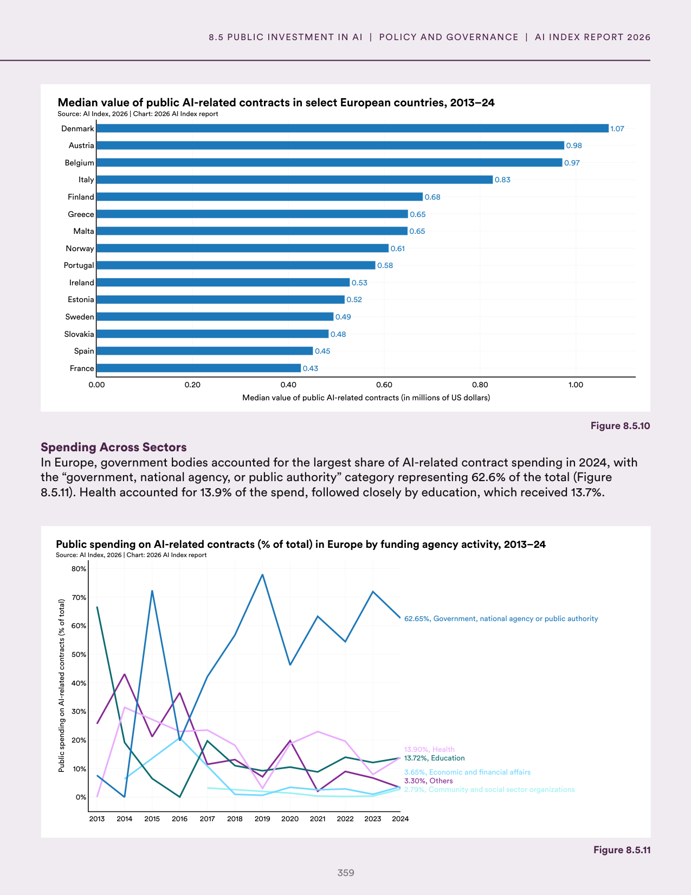
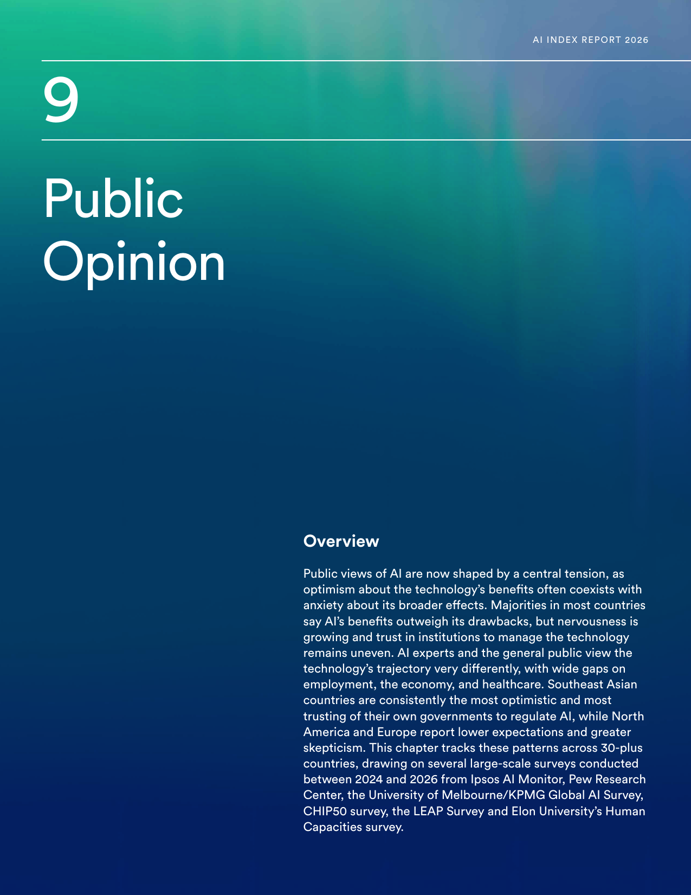

# ai_funding_us_europe.json

**Parent:** [[content/L1/ai-landscape-governance-and-funding|ai-landscape-governance-and-funding]] — This comprehensive context synthesizes the AI landscape in 2025, detailing the balance between capabilities and safety, the U.S. dominance in private and public sector funding (using grants, contracts, and loans between 2014-2024), and the regional differences in public sentiment and RAI framework maturity scores (rising from 2.5 to 2.8).

The provided text outlines public sector investment and funding patterns for AI, focusing on the United States and Europe between 2014 and 2024. In the United States, funding is categorized by the type of spending instrument: grants, contracts, and loans. Grant funding has historically been the primary mechanism for AI research, though contract funding for specific deliverables has grown. Loans are a less common but existing instrument for AI-related initiatives. In Europe, AI funding is heavily influenced by the 'AI Act' and various Horizon Europe programs, emphasizing 'trustworthy AI' and public-interest applications. The data highlights a trend toward increasing the scale of investments in AI infrastructure (compute and data) and a shift toward public-private partnerships to accelerate deployment.

## Source pages

