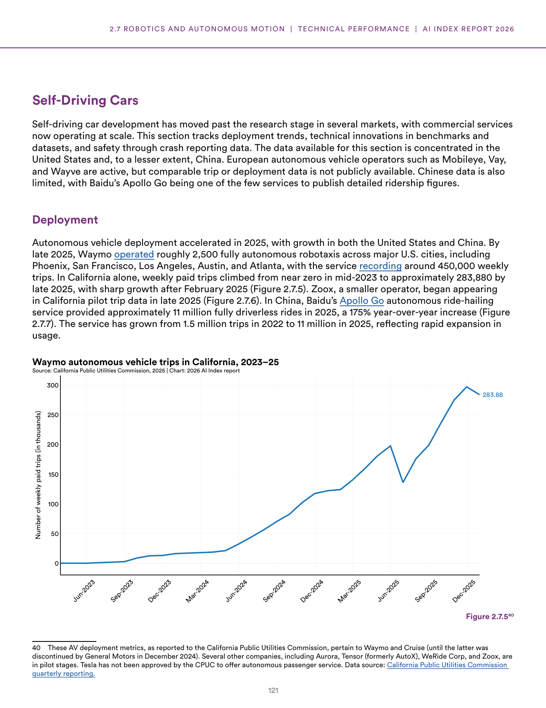
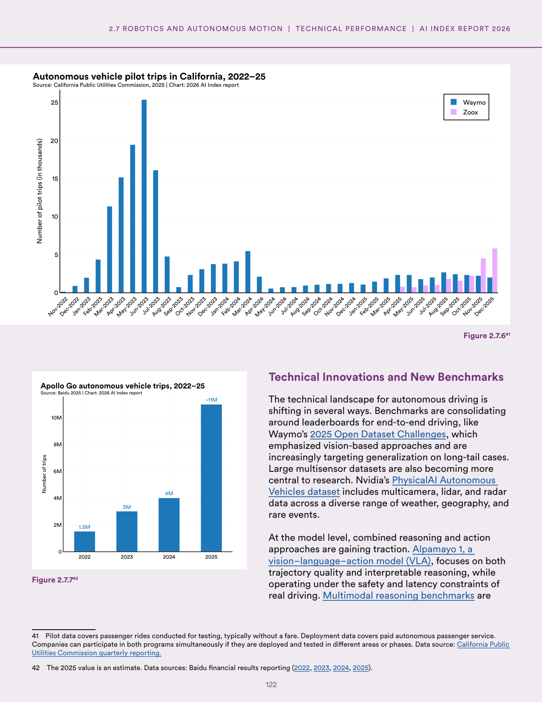
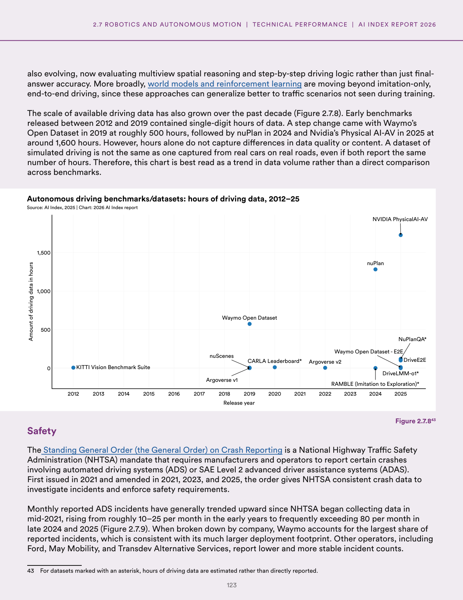
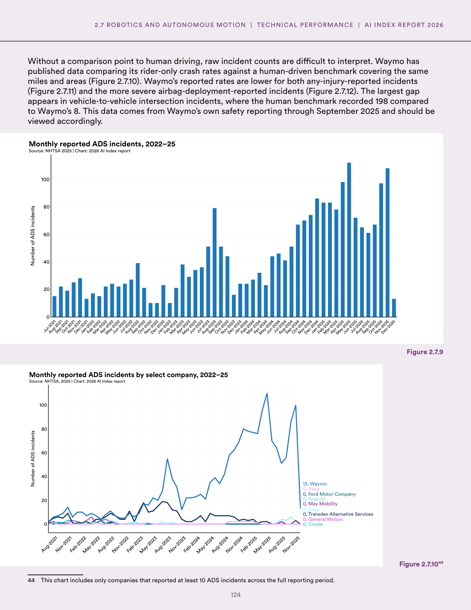
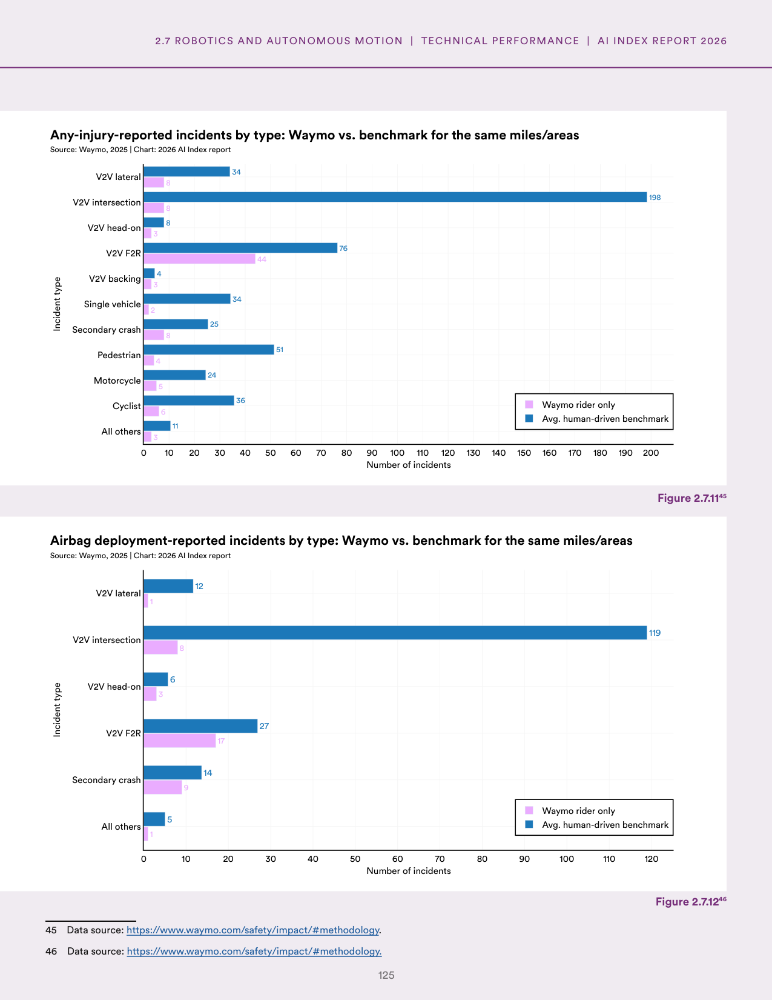
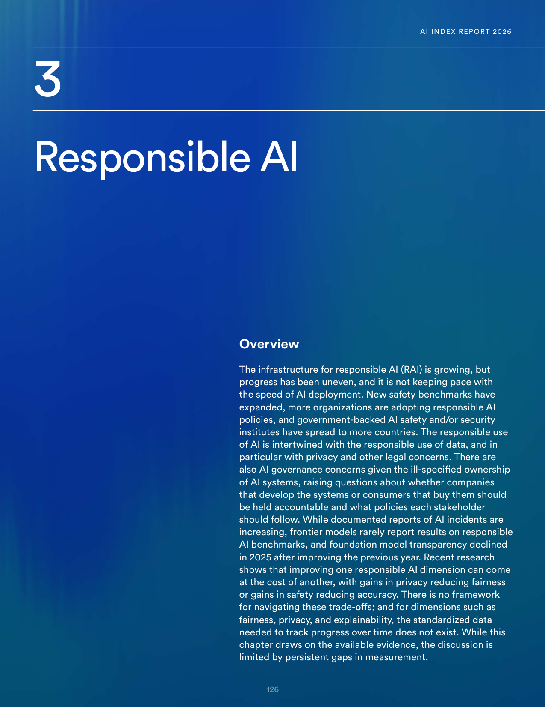
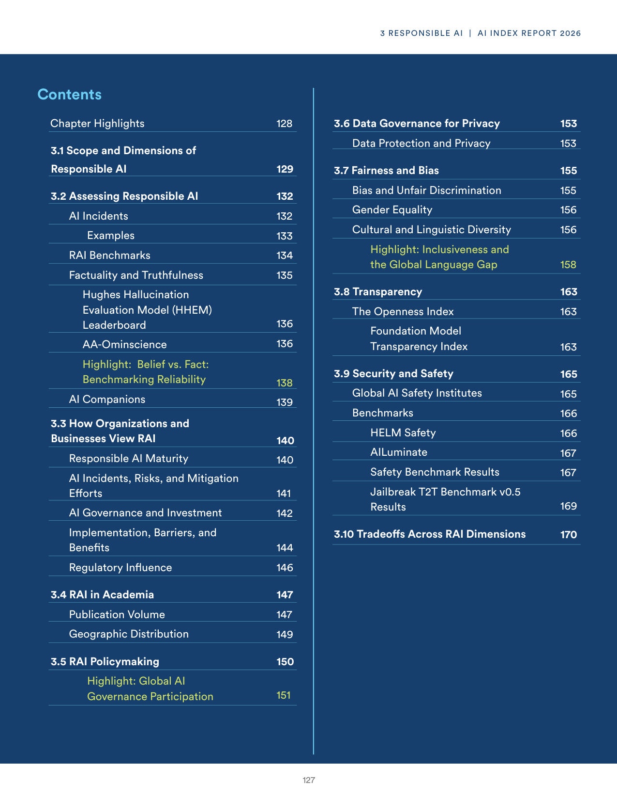
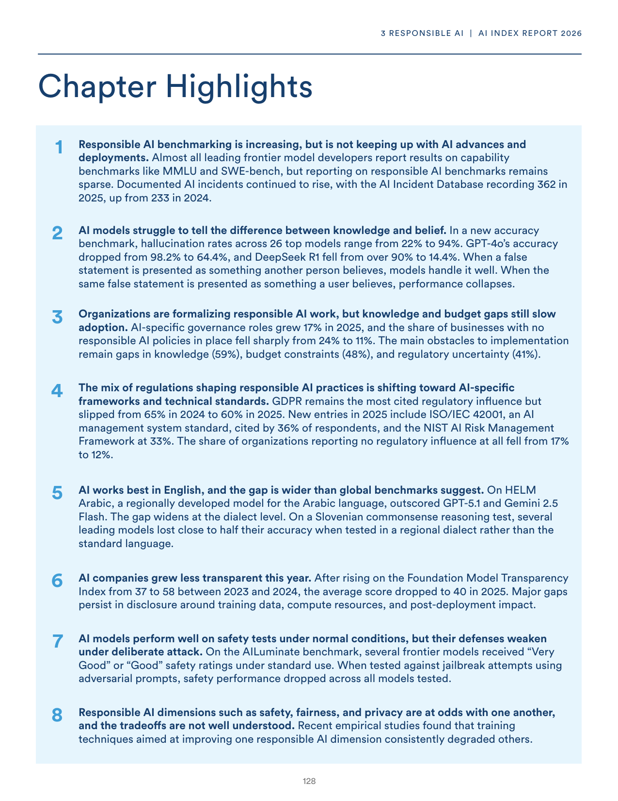

# ai_governance_and_autonomous_vehicles.json

**Parent:** [[content/L1/ai-governance-responsible-ai-framework-and-technical-errors|ai-governance-responsible-ai-framework-and-technical-errors]] — The context analyzes the gap between AI deployment and safety frameworks, detailing the Level 4 autonomy delays in Phoenix and San Francisco, the five dimensions of Responsible AI using benchmarks like AdvBench and TruthfulQA, and a Pydantic v2 'model_dump' AttributeError encountered by a user.

The report provides an analysis of autonomous vehicle trends, AI governance, and the safety of AI deployments. In the United States, autonomous vehicle deployment has seen a mix of growth and challenges. Regarding AI safety and governance, there is a noted gap between the rapid deployment of AI systems and the development of corresponding safety frameworks. The data highlights that while many organizations are integrating AI, a smaller fraction have established rigorous safety benchmarks or oversight mechanisms. Specifically, the report notes that the risk of 'hallucinations' in Large Language Models (LLMs) and the lack of interpretability in complex neural networks remain primary technical hurdles. From a regulatory perspective, several jurisdictions have begun introducing AI-specific legislation to mandate transparency and risk assessments, though enforcement varies globally. In terms of autonomous driving, the report mentions that while mileage for robotaxis has increased in cities like Phoenix and San Francisco, safety incidents have prompted a re-evaluation of the 'driverless' or 'Level 4' autonomy timeline by some industry players.

## Source pages

