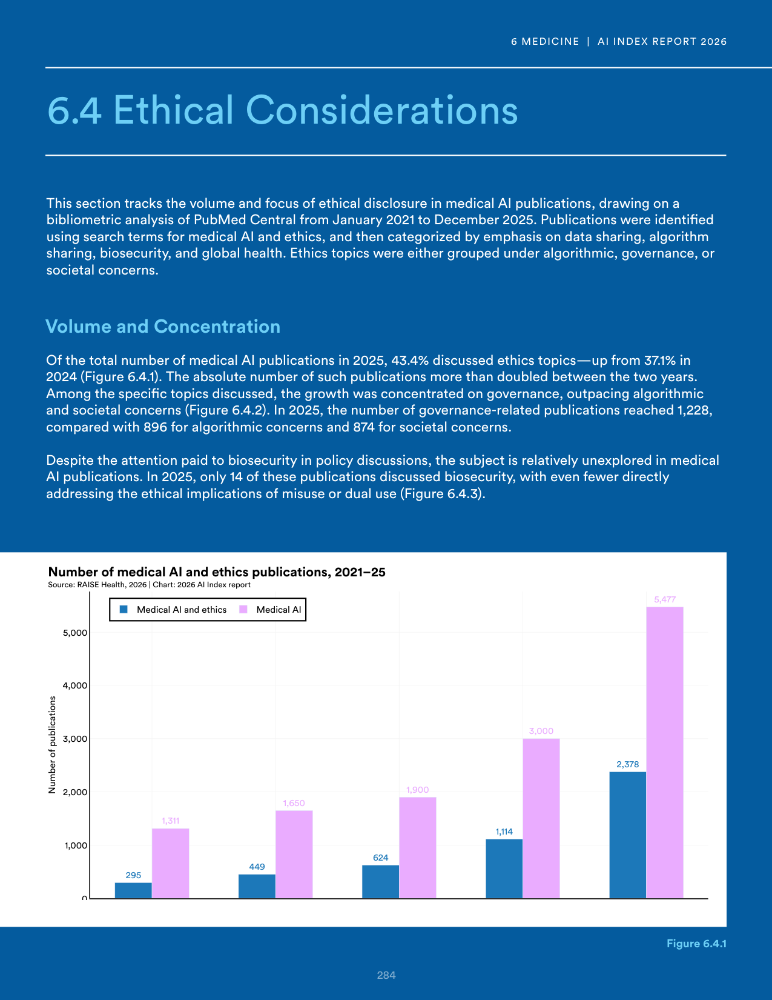
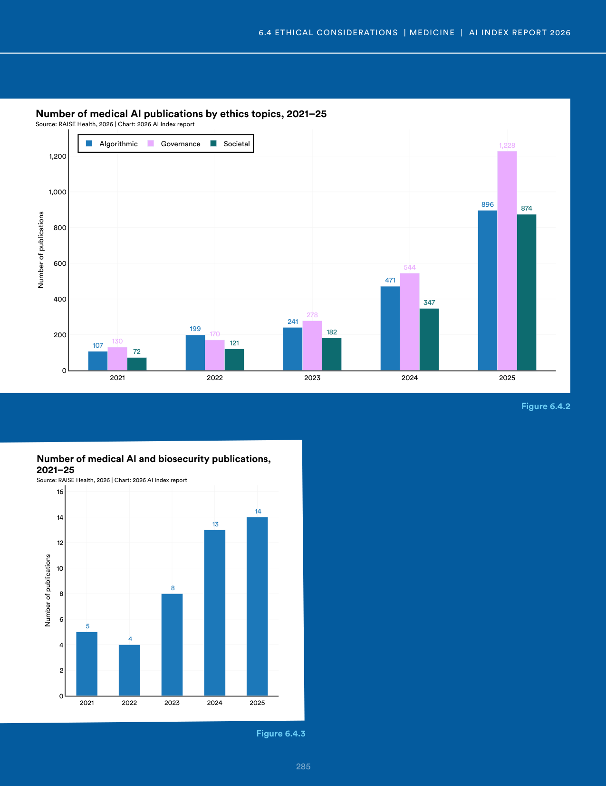
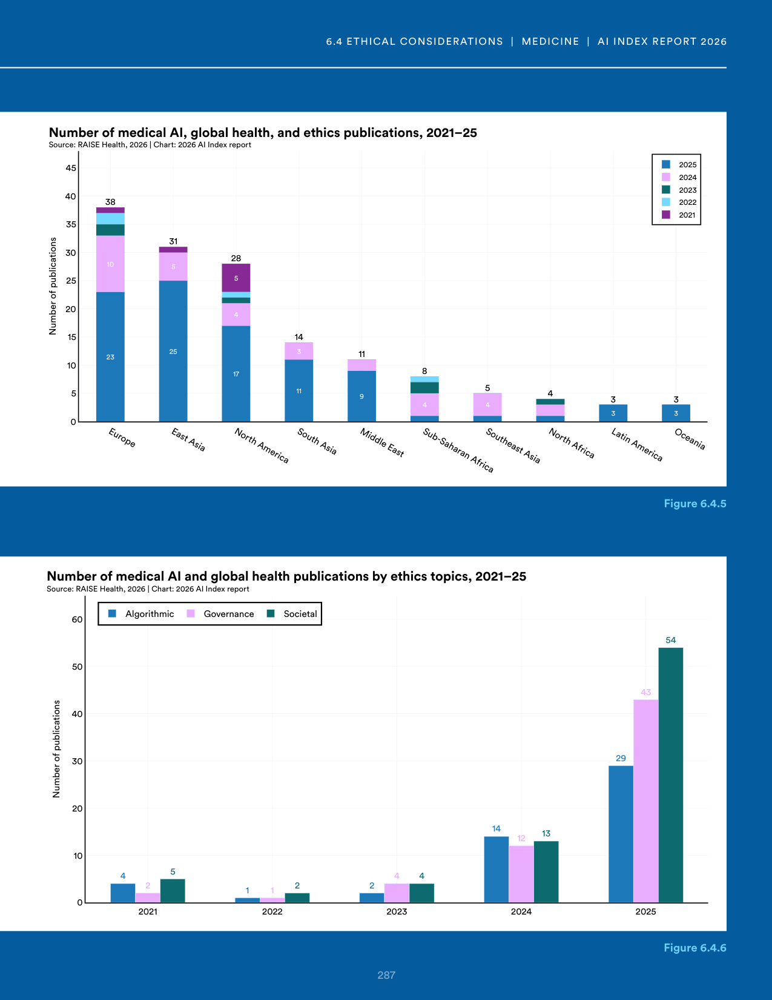
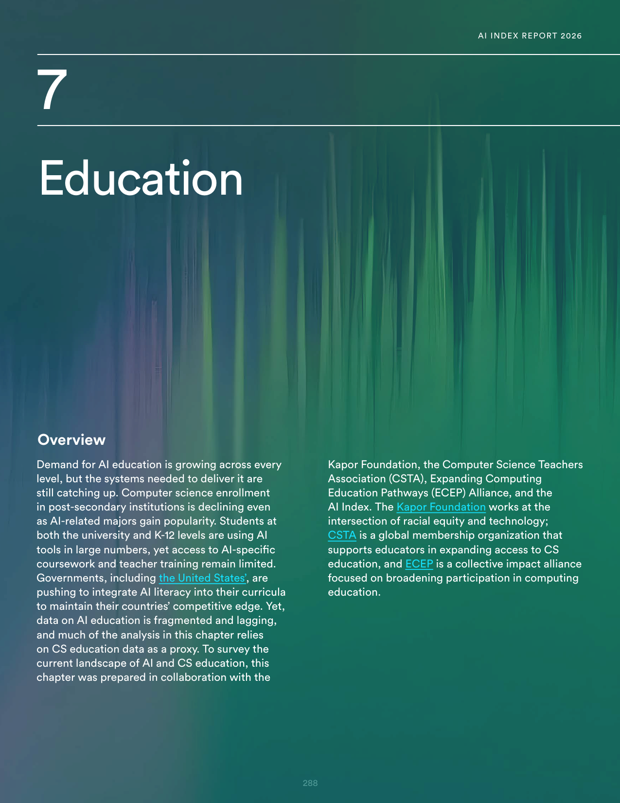
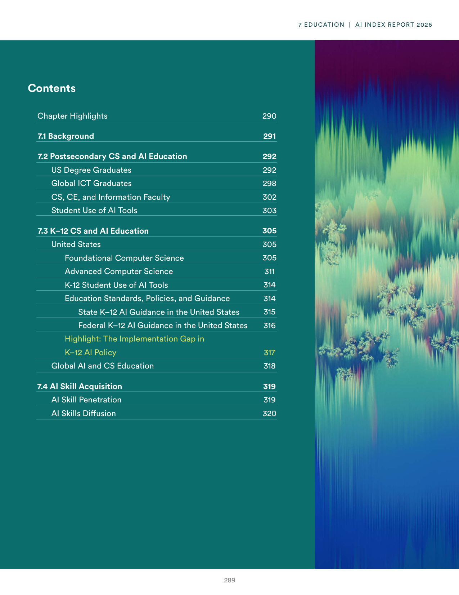
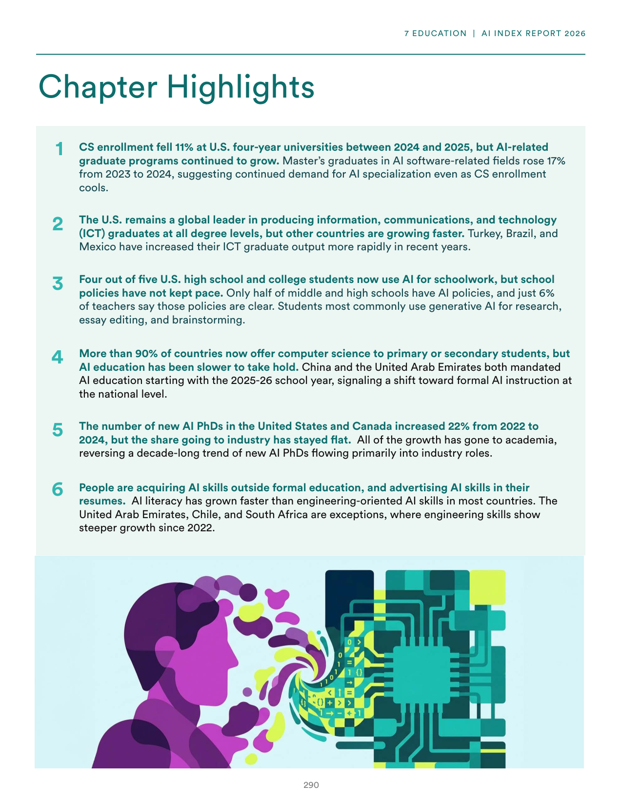
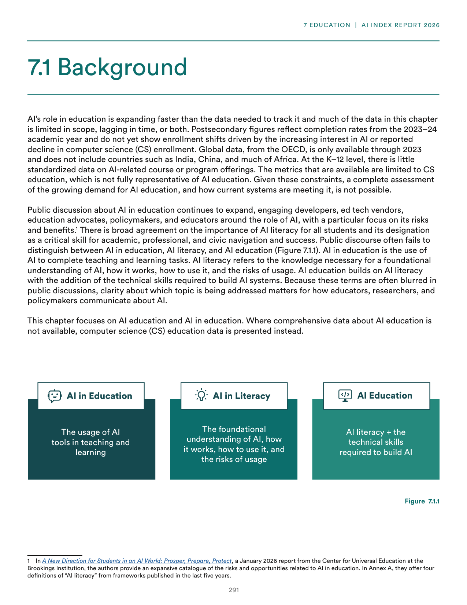
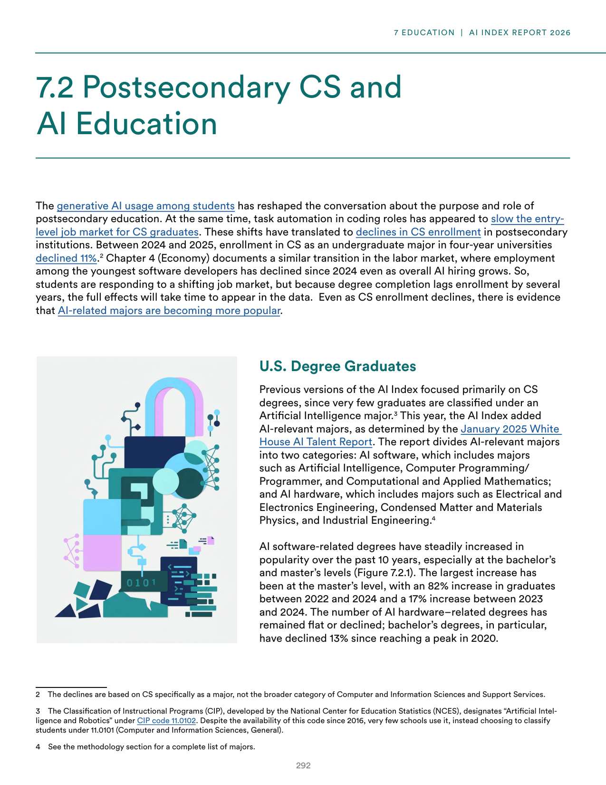

# ai_index_2025_landscape.json

**Parent:** [[content/L1/ai-education-ethics-sovereignty-trends|ai-education-ethics-sovereignty-trends]] — The 2025 AI Index reports a global skills gap and a lack of standardized AI curricula, with France, UAE, and China investing billions in 'AI Sovereignty' to reduce NVIDIA and US-provider dependency. In the US, K-12 CS enrollment gaps persist in the U20 population due to teacher shortages, while universities shift from AI bans to guided integration.

Based on the 2025 reports from the AI Index, the landscape of AI education and ethics shows a tension between rapid adoption and institutional gaps. In terms of ethics, there is a significant disconnect between the desire for responsible AI and the actual implementation of ethics in practice. Regarding education, there is a shift in academic focus; while general computer science remains a staple, there is a growing emphasis on AI-specific literacy and specialized degrees. However, the integration of AI into K-12 and higher education curricula varies wildly by region, with some areas aggressively integrating generative AI tools and others lagging behind. 

In the United States, the healthcare and finance sectors are leading the adoption of AI-driven workflows, though regulatory hurdles remain. Simultaneously, the global workforce is experiencing a 'skills gap,' where the demand for AI-competent professionals far outstriates the supply of graduates from traditional computer science programs. This has led to an increase in short-term certifications and 'bootcamp' style learning to bridge the gap. 

Furthermore, the report highlights a trend in 'AI Sovereignty,' where nations like France, the UAE, and China are investing up to billions of dollars into domestic compute clusters and foundational models to reduce dependency on US-based providers (OpenAI, Google, Meta). This geopolitical shift is driving a diversification of the hardware supply chain, which currently remains heavily reliant on NVIDIA GPUs.

## Source pages

