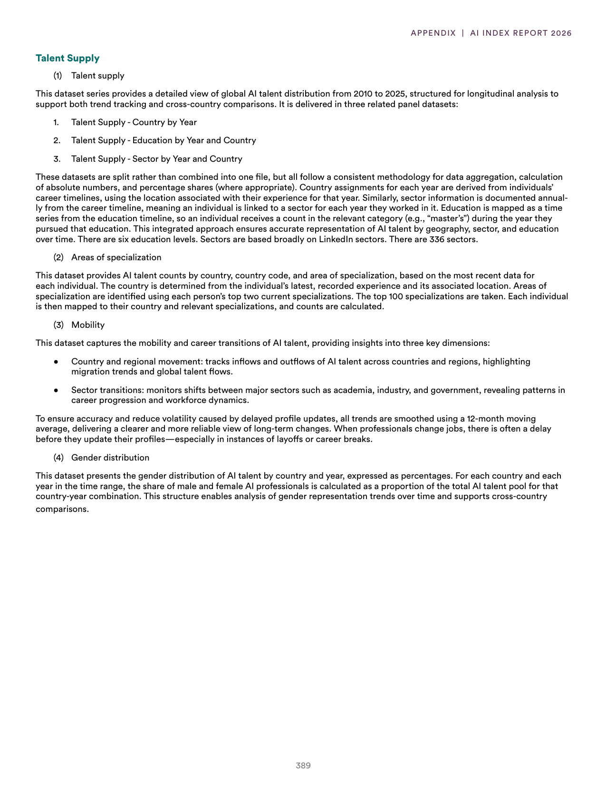
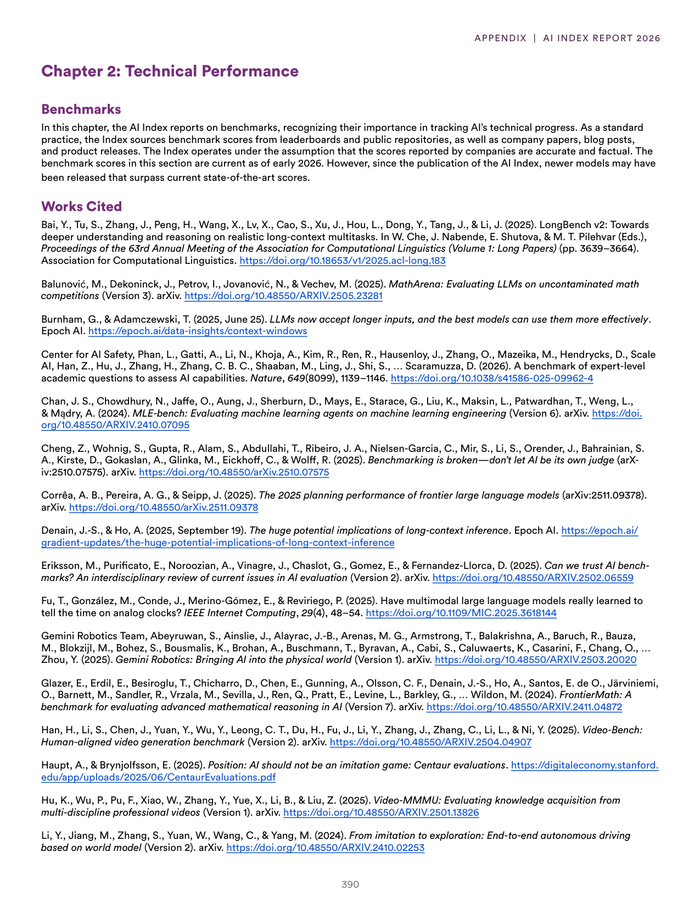
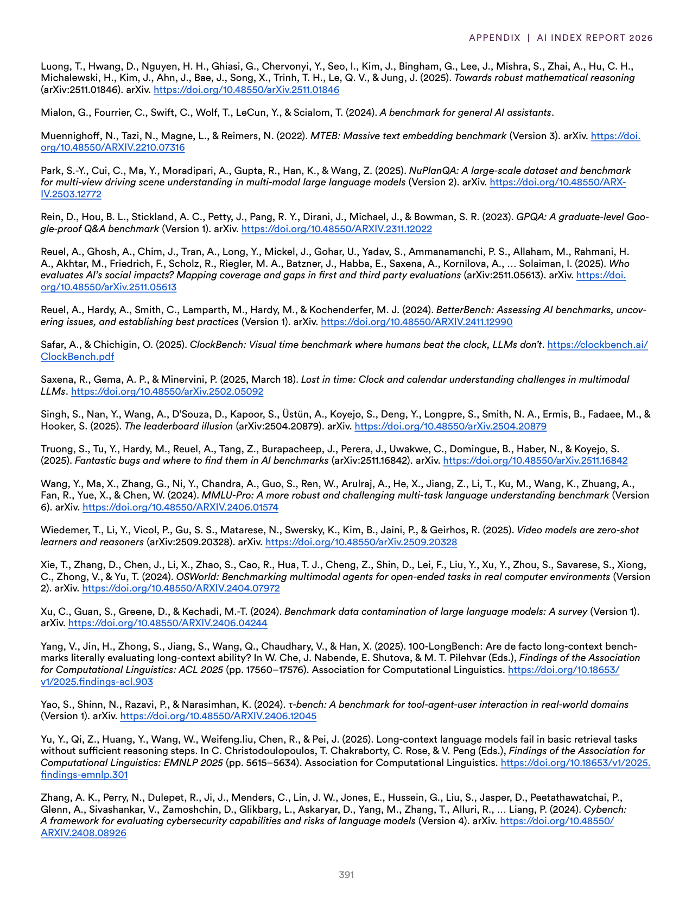

# ai_index_bibliography_and_index

**Parent:** [[index]]

The provided text consists of a bibliography and an index for the 2024/2025 AI Index Report. It lists various scholarly works and data sources used to analyze AI developments, specifically focusing on benchmarks for model performance, the impact of LLMs, and the technicalities of AI training. The index highlights key areas of focus including 'synthesis of benchmarks,' 'model evaluation,' and 'computational resources.' The citations include researchers and institutions that contribute to the understanding of AI's scaling laws and the socio-economic impacts of deploying large-scale AI systems.

## Source pages

