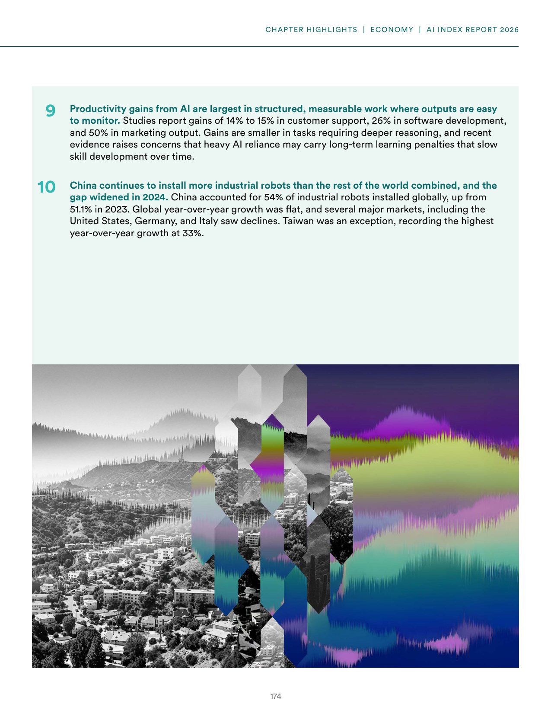
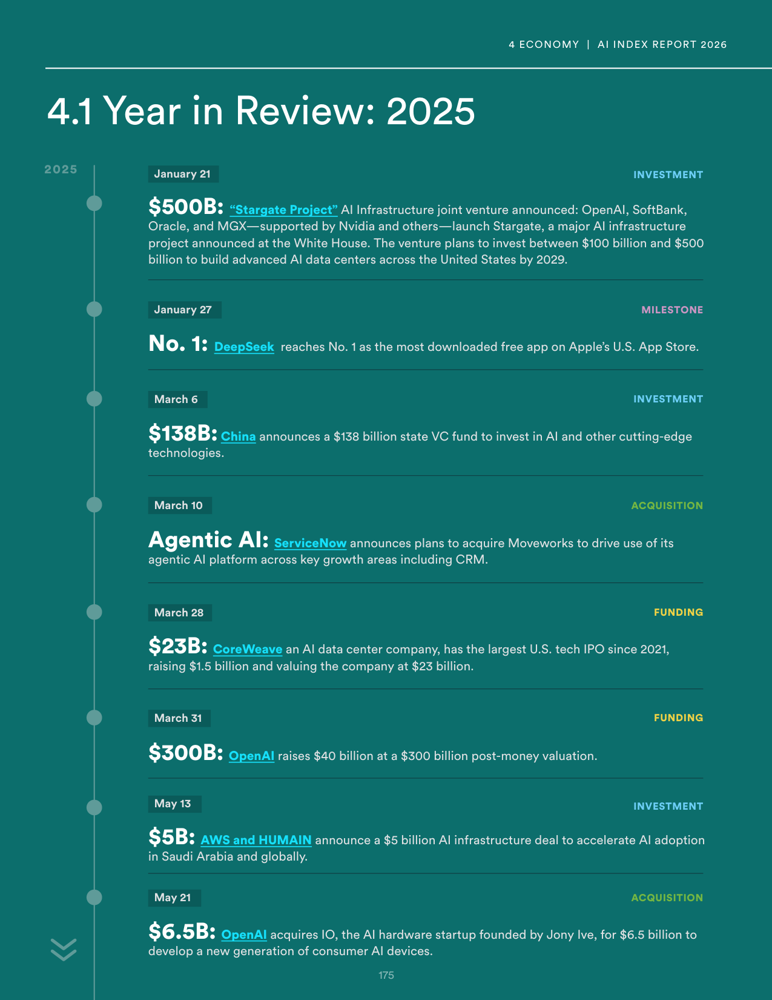
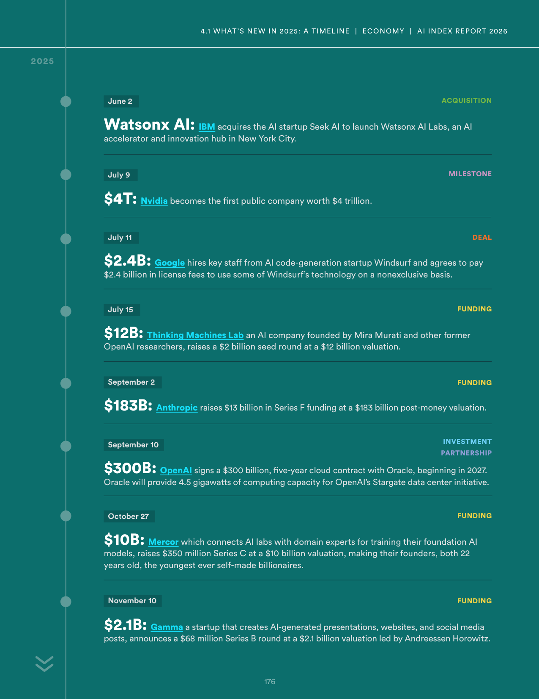
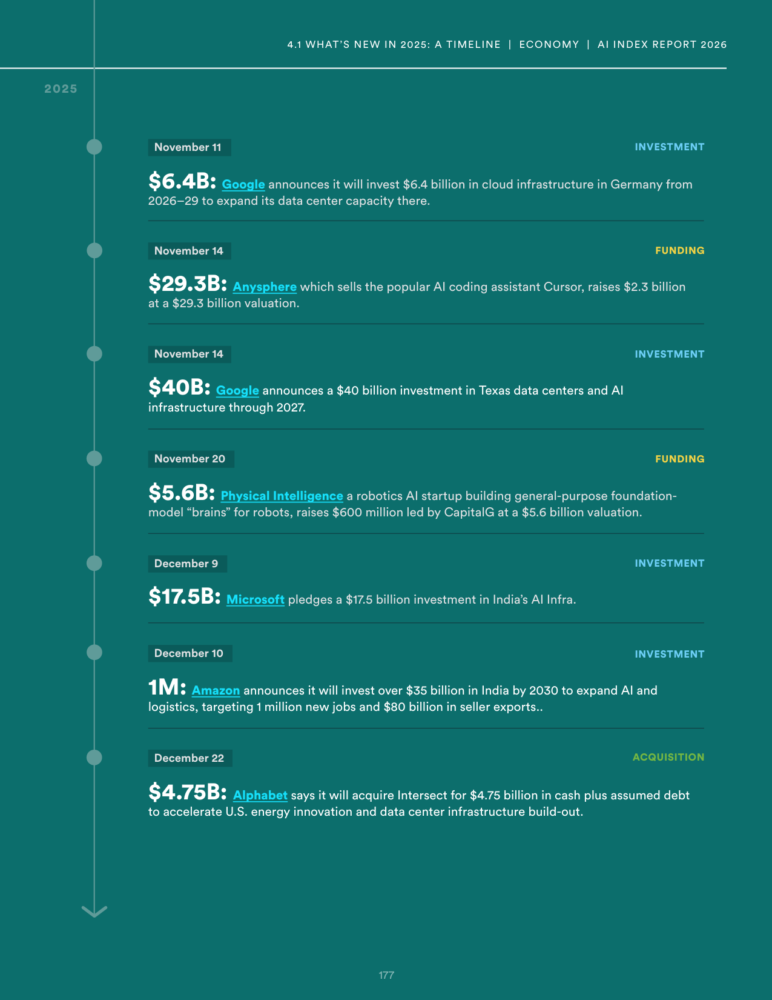
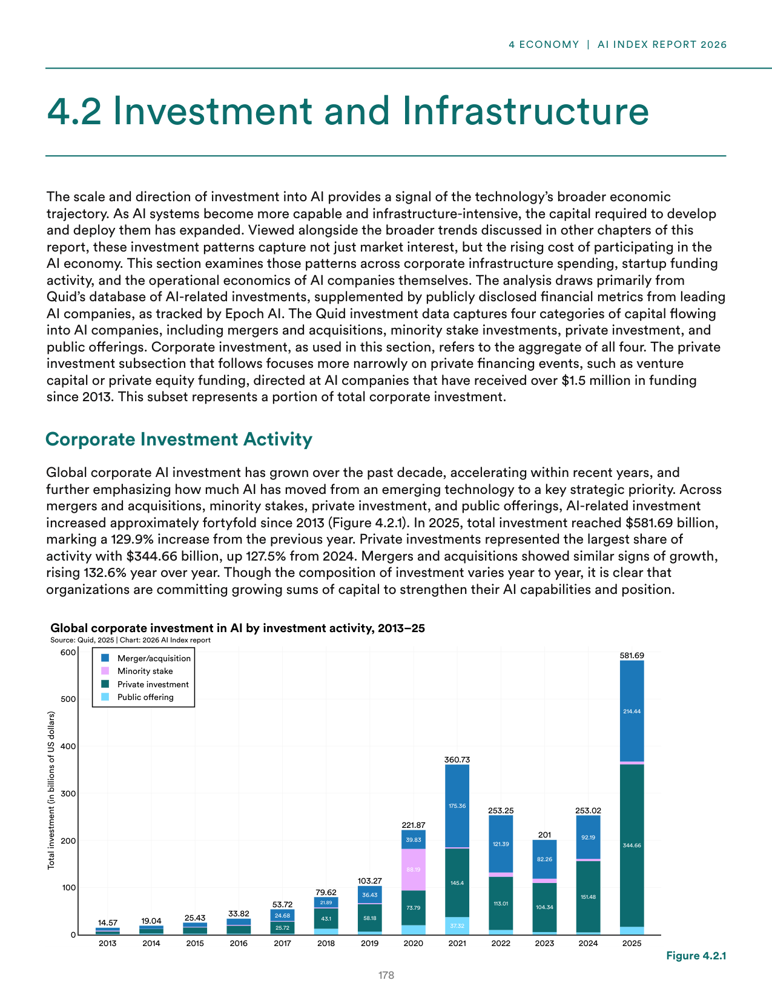
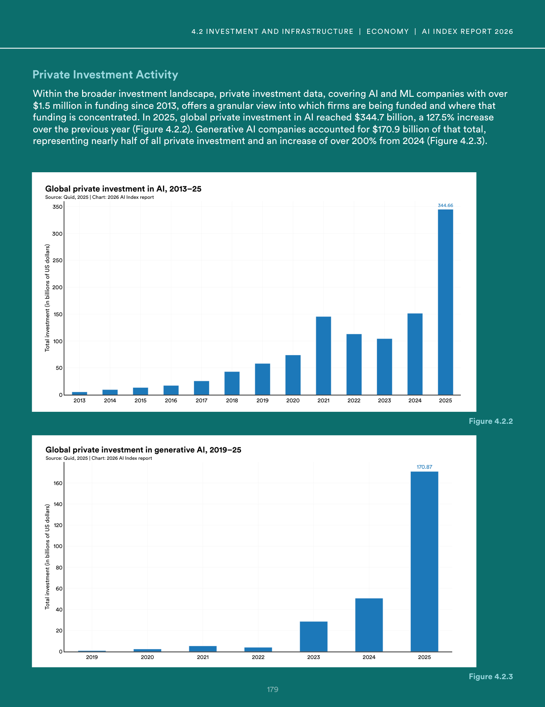
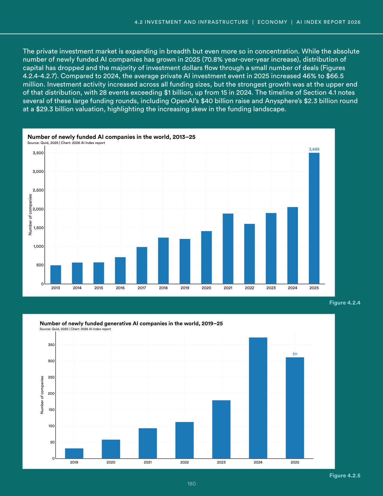
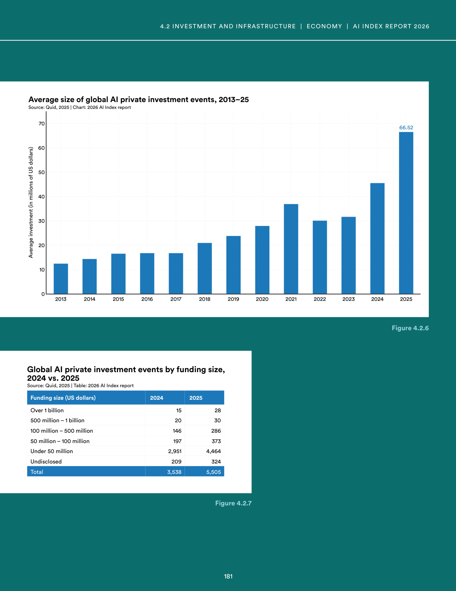
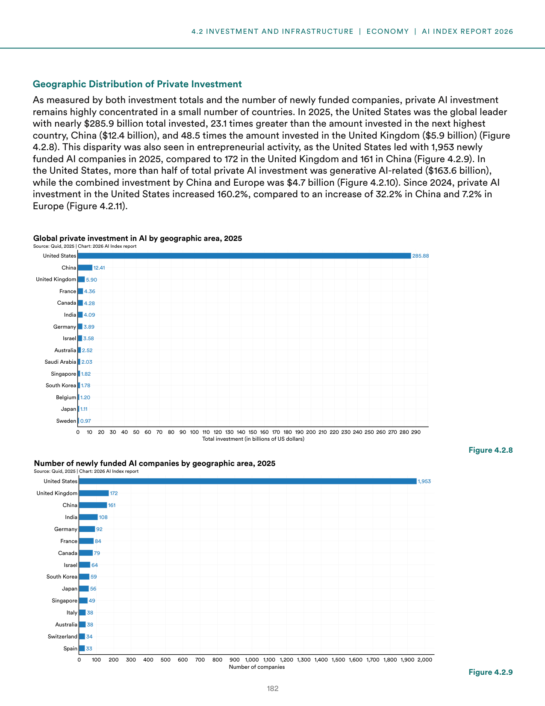

# ai_investment_trends_2025

**Parent:** [[content/L1/ai-safety-economics-and-system-errors|ai-safety-economics-and-system-errors]] — The AI landscape in 2025 is defined by technical challenges like sycophancy and the trade-off between safety and capabilities, US-led dominance in AI unicorns and funding for vertical AI in healthcare, law, and finance, and a system error ('NoneType' object has no attribute 'model_dump') occurring in Pydantic-based JSON validation.

The provided text details the economic landscape and investment trends surrounding AI in 2025. Global investment in AI is characterized by terms of high concentration, with the United States leading in both the scale and volume of funding. In 2025, the U.S. dominated AI funding, outstripping other nations; for instance, in a comparison of private investment, the U.S. significantly exceeded the totals of other leading countries. 

Investment is also reflected in the growth of AI-focused companies. The data shows a trend where a small number of high-valuation firms drive the majority of the sector's growth. Specifically, the report highlights that the U.S. has a dominant lead in the number of AI 'unicorns' (startups valued over $1 billion), which serves as a proxy for the intensity of private capital flowing into the field. 

Furthermore, the documents note a shift in the nature of investment, moving from general-purpose AI research toward applied AI. There is an increasing focus on 'vertical AI'—solutions tailored for specific industries such as healthcare, law, and finance. This transition is evidenced by the rise in funding for startups that integrate LLMs into specialized professional workflows. Despite the overall growth, the text mentions that investors are becoming more discerning, demanding clearer paths to profitability and revenue generation rather than funding based on technical novelty alone.

## Source pages

