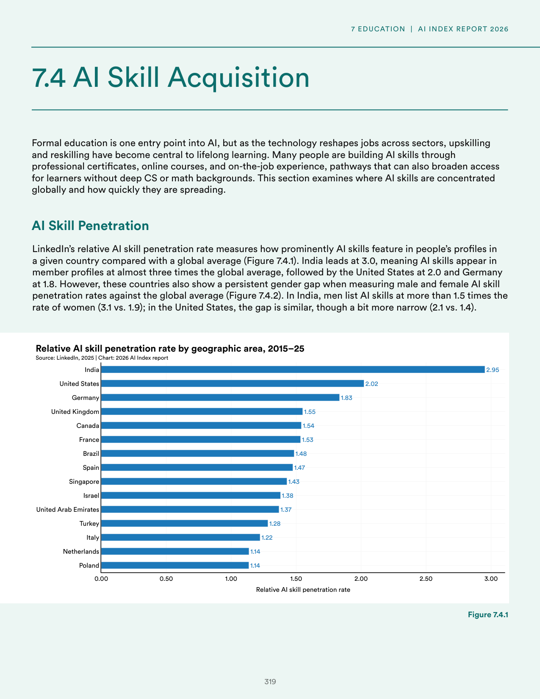
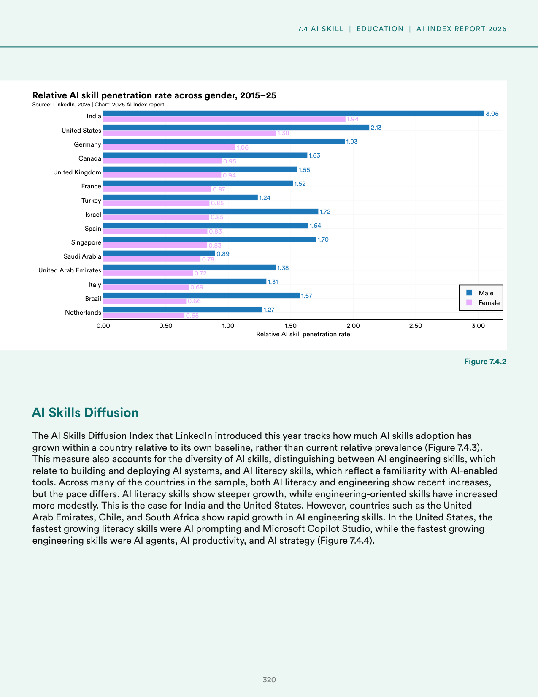
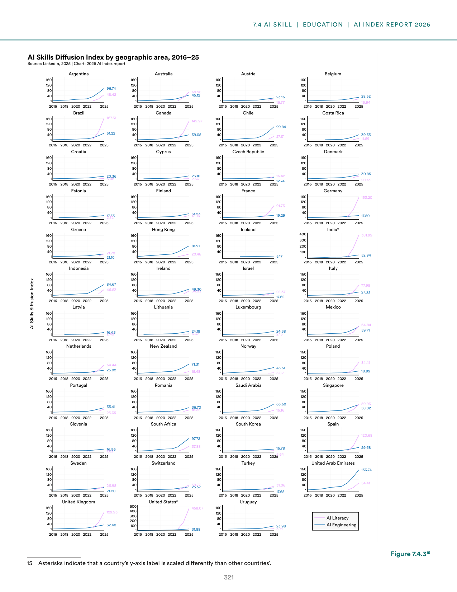
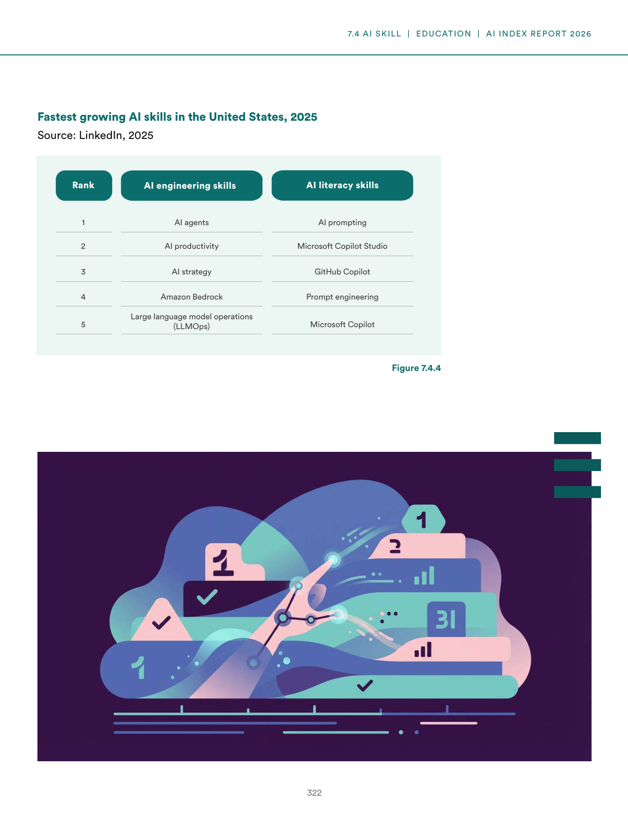
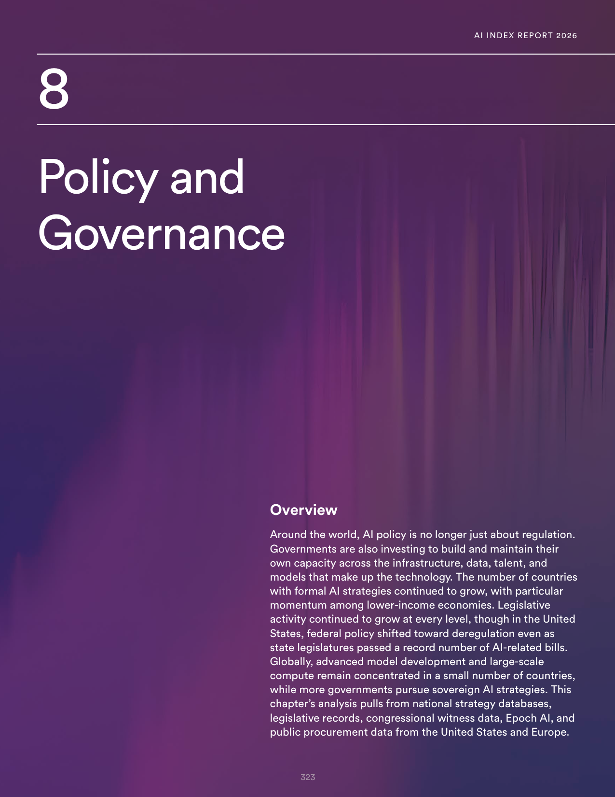
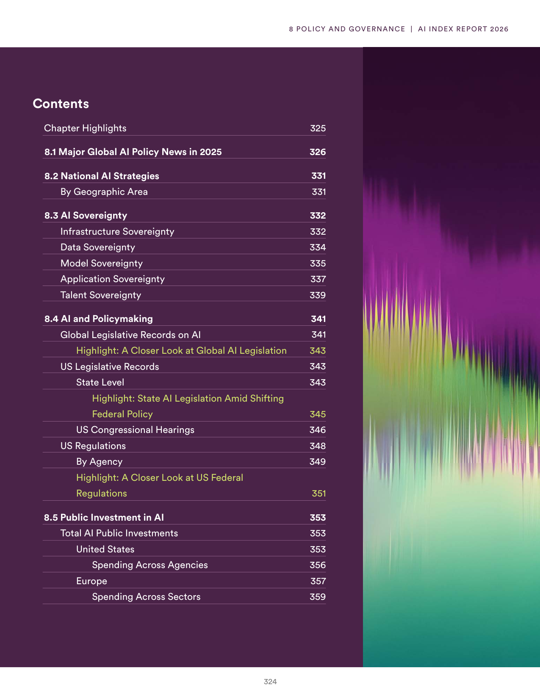
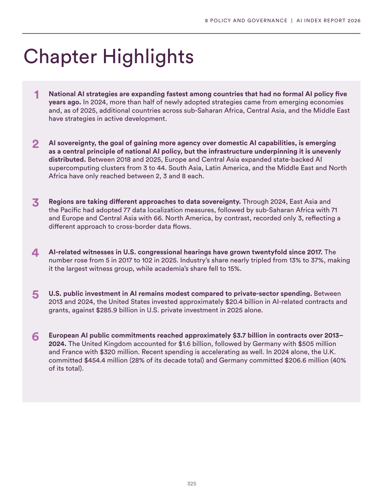
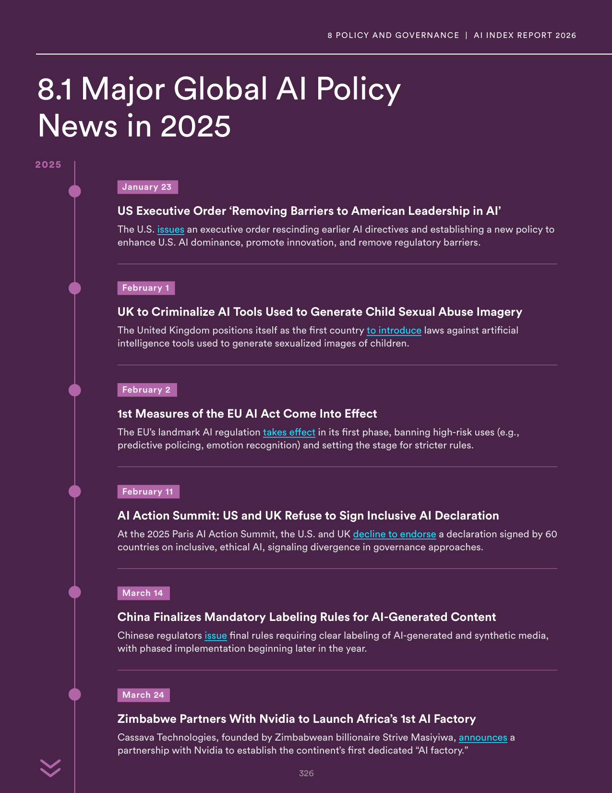

# ai_labor_compute_and_governance.json

**Parent:** [[content/L1/ai-governance-and-technical-safety-2025|ai-governance-and-technical-safety-2025]] — The AI landscape in 2025 is characterized by a tension between capabilities and safety, with U.S. dominance in investment and 'vertical AI', alongside a global shift toward risk-based regulation like the EU AI Act and state-level laws in Utah and California.

The provided text details global trends, policies, and trends in AI across various dimensions. In terms of workforce and skills, AI skill acquisition is tracked via the prevalence of AI-related skills in LinkedIn profiles, showing a surge in demand and adoption. Regarding policy, the United States and other nations are balancing innovation with safety; for example, the US has seen a shift toward deregulation to maintain a competitive edge. The report also highlights a 'compute divide,' where a few large companies control the vast majority of high-end GPUs, limiting the ability of smaller entities to train frontier models. In terms of governance, the EU's AI Act represents a significant regulatory effort to categorize AI risks and mandate transparency. Finally, the data emphasizes that while generative AI has boosted productivity in coding and writing, its impact on broader economic output is still being measured, with a notable gap between corporate optimism and actual implementation.

## Source pages

