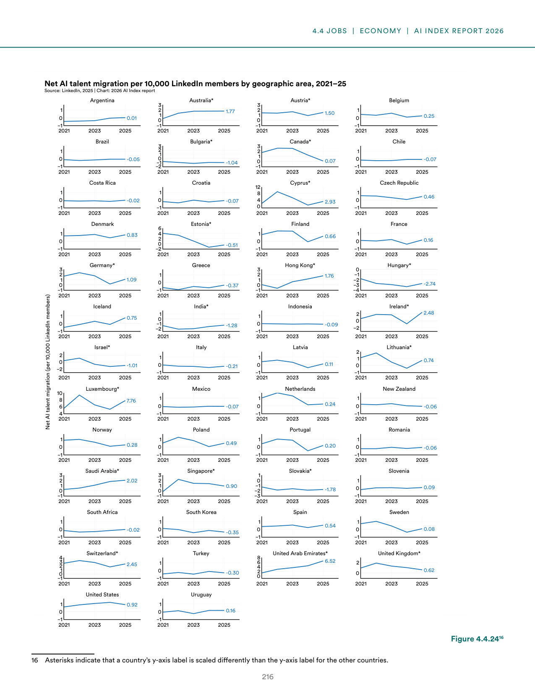
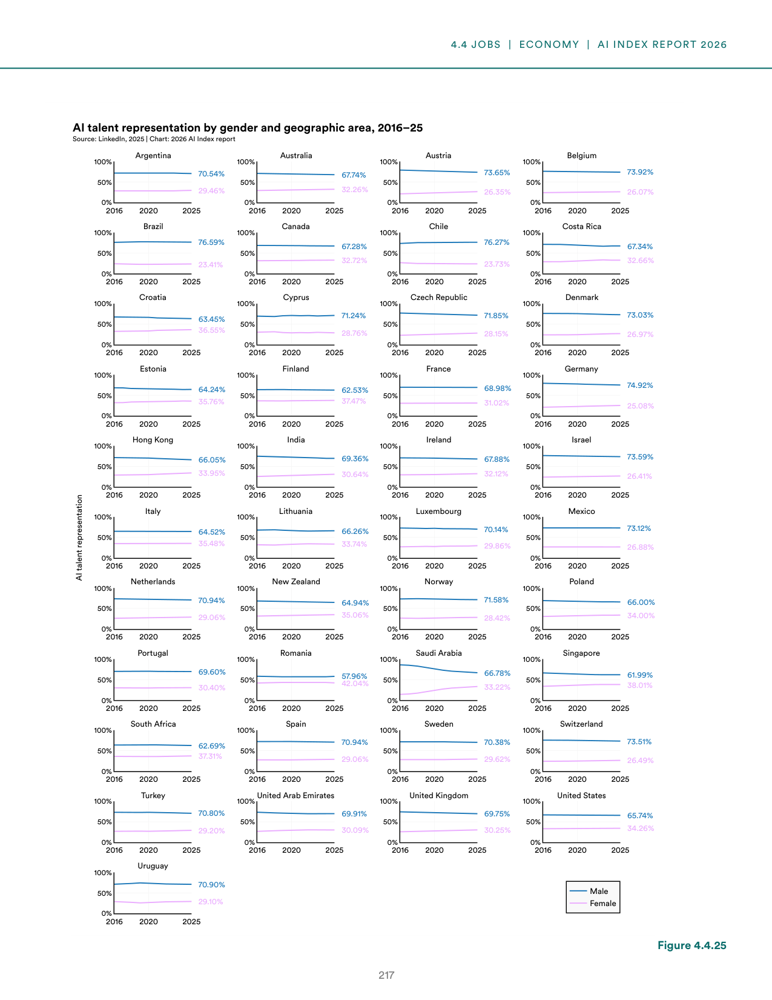
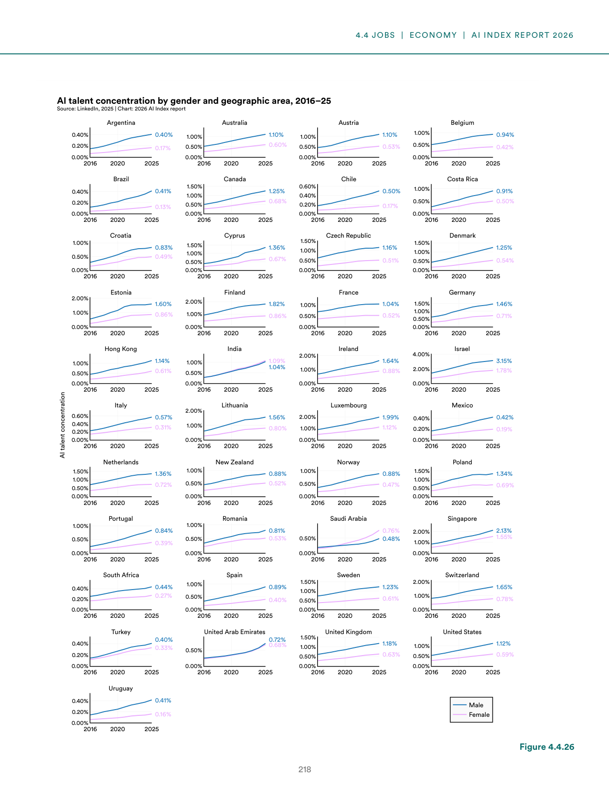
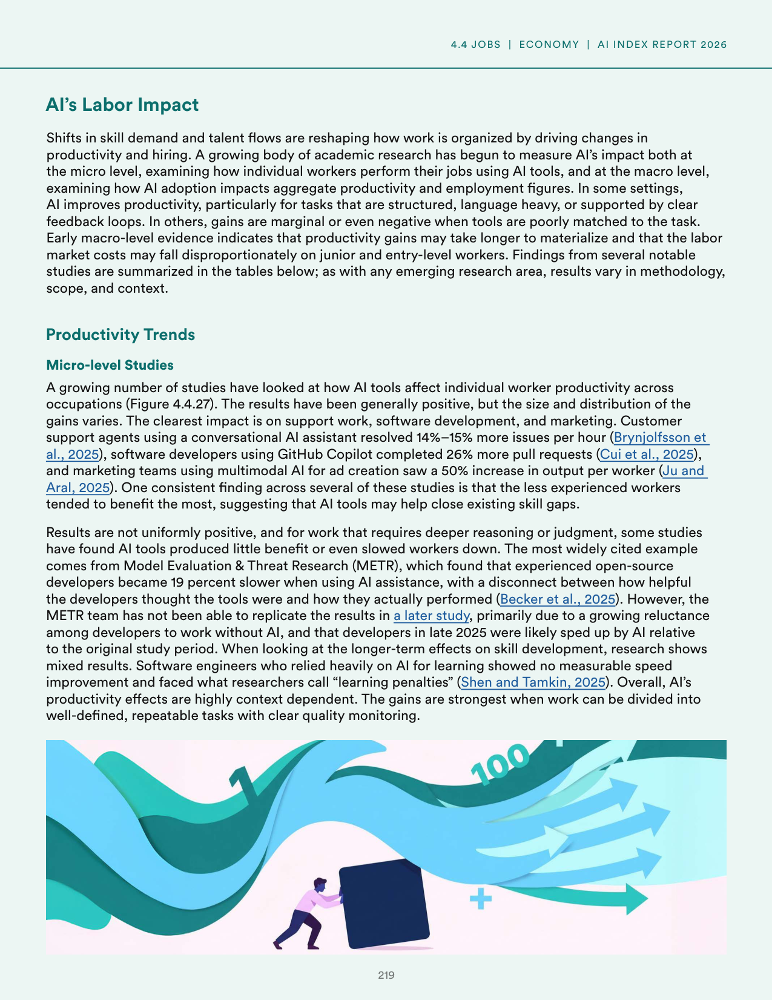
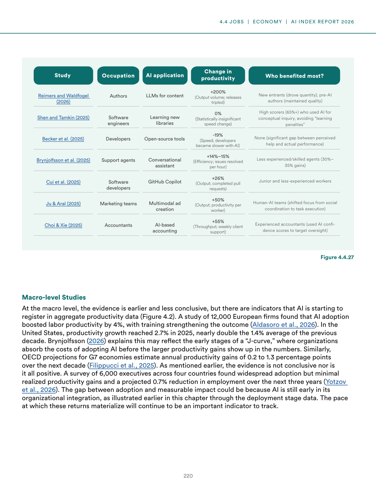
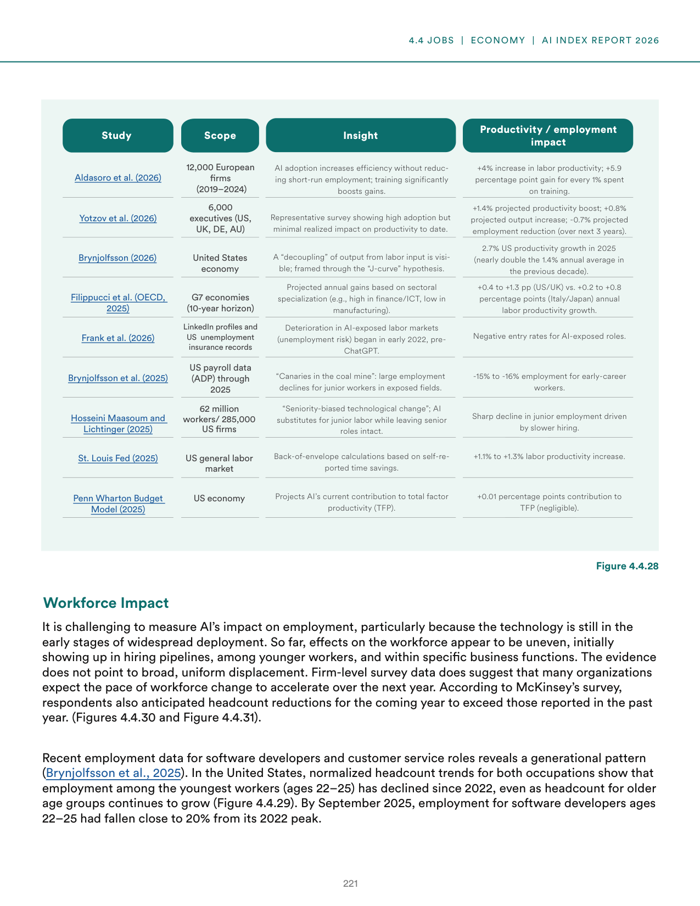
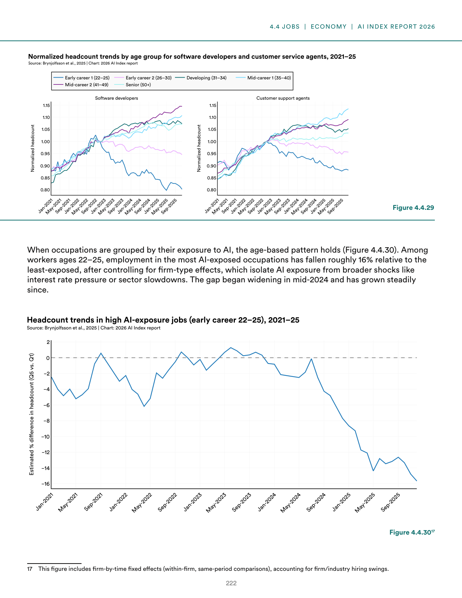
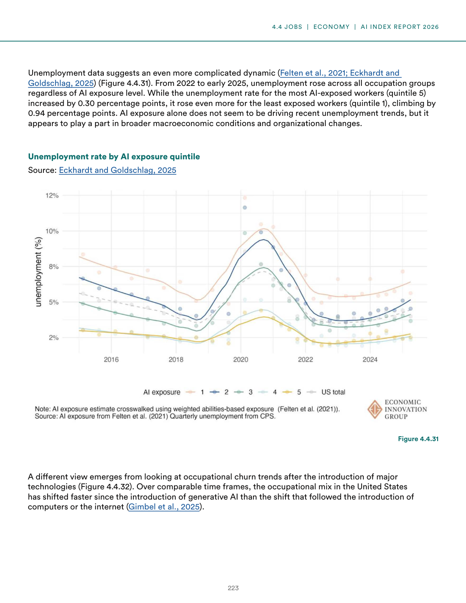

# ai_labor_market_impacts

**Parent:** [[content/L1/ai-2025-state-technical-economic-governance|ai-2025-state-technical-economic-governance]] — In 2025, AI is characterized by a tension between capability and safety, with the US dominating private investment and the rise of 'AI4Science' for scientific discovery. Meanwhile, RAI framework maturity scores rose from 2.5 to 2.8, but only 15% of organizations are 'high maturity' (score 4+), and a specific Pydantic 'AttributeError: NoneType object has no attribute model_dump' persists in API structured outputs.

The provided text details the impact of AI on the labor market, specifically focusing on productivity, employment, and the distribution of these effects across different demographic and professional groups. According to data and analysis in the report, AI has a significant influence on productivity, though the benefits are not distributed evenly. 

Key findings regarding employment and productivity include:
- **Productivity Gains:** AI is which increases productivity, but these gains are often concentrated. 
- **Employment Trends:** There is a notable divergence in how AI affects different roles. While some high-skill positions see productivity boosts, others face displacement or a shift in required tasks. 
- **Demographic/Professionals Differences:** The impact varies by professional background and seniority. For instance, junior-level workers in certain technical fields may face more displacement as AI automates entry-level tasks, whereas senior-level professionals leverage AI to augment their expertise.
- **Industry Variance:** The degree of AI integration and its subsequent effect on the workforce varies across sectors, with technical and administrative sectors showing higher rates of adoption and corresponding shifts in labor demand.

Essentially, the documents highlight that while AI creates opportunities for efficiency and output, it also necessitates a transition in the workforce, particularly for those in roles most susceptible to automation.

## Source pages

