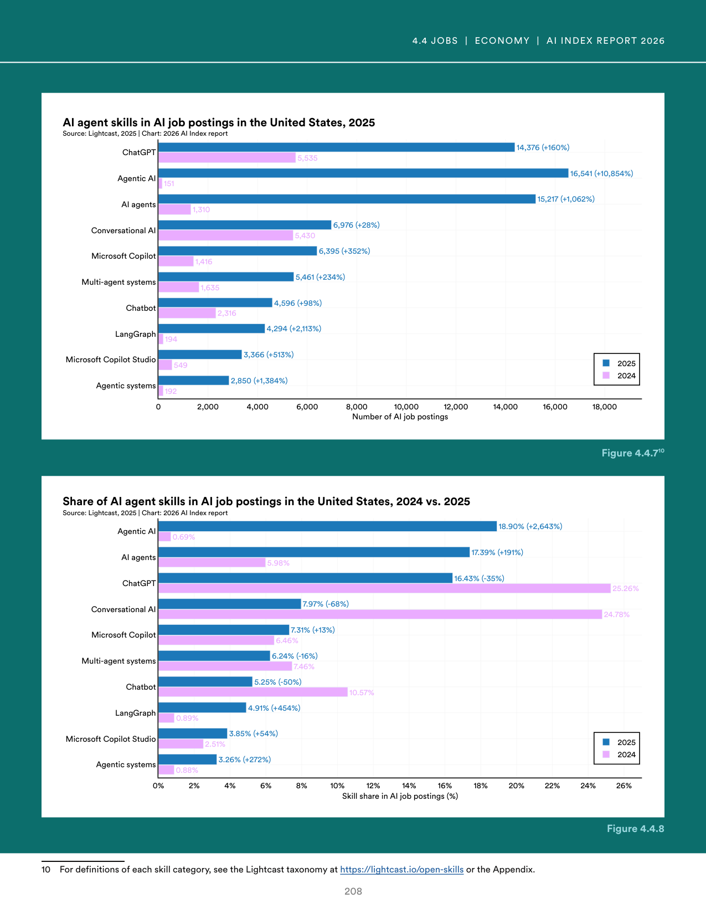
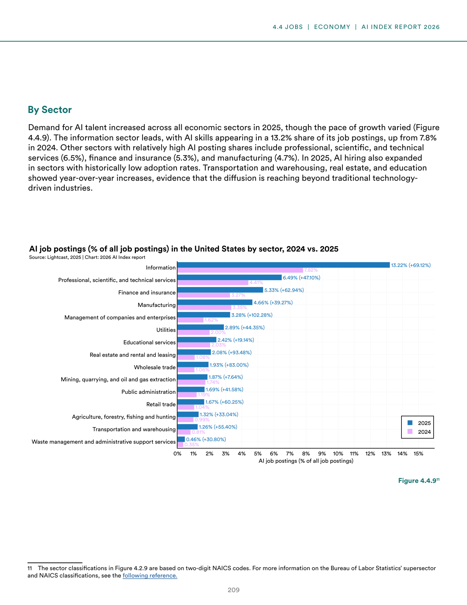
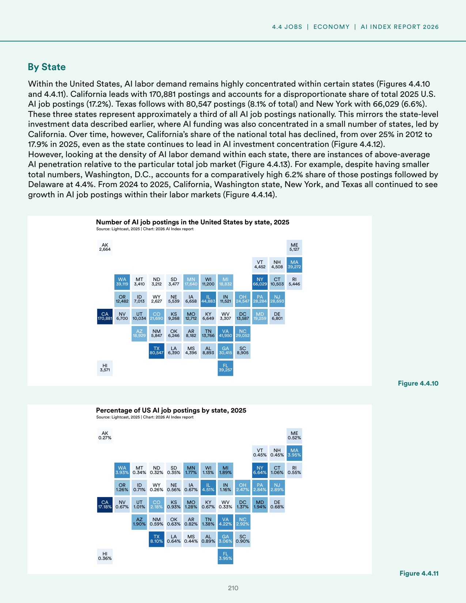
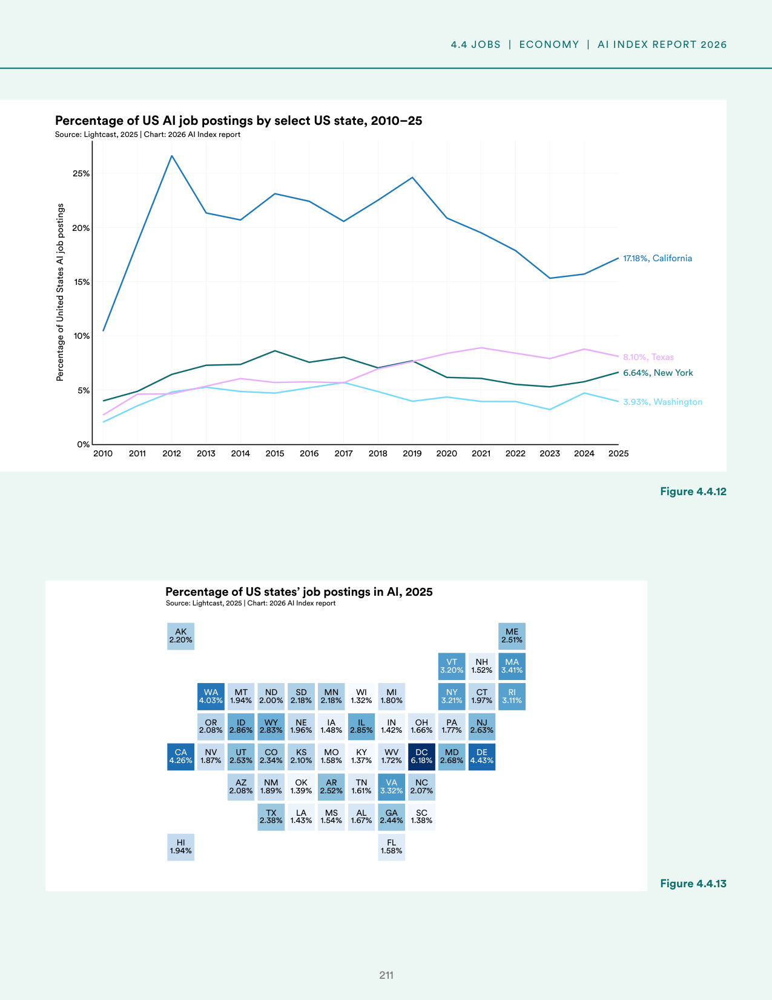
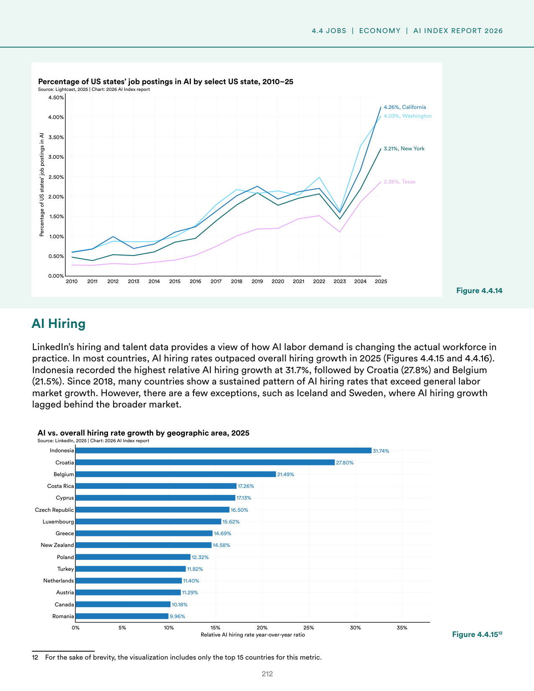
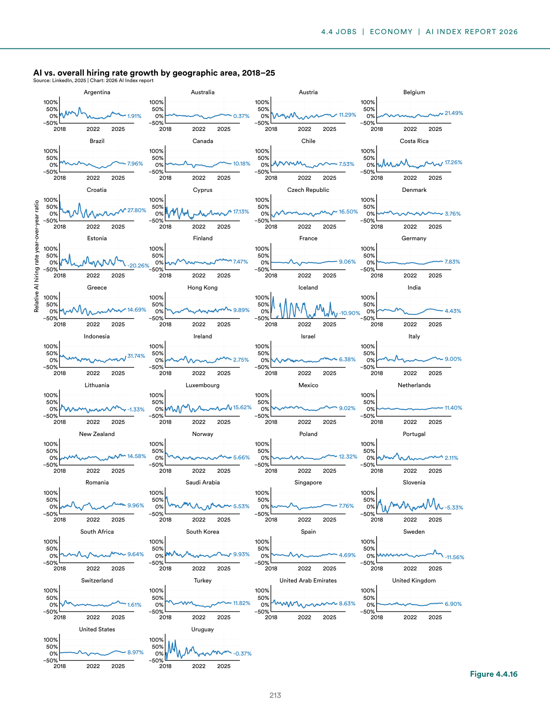
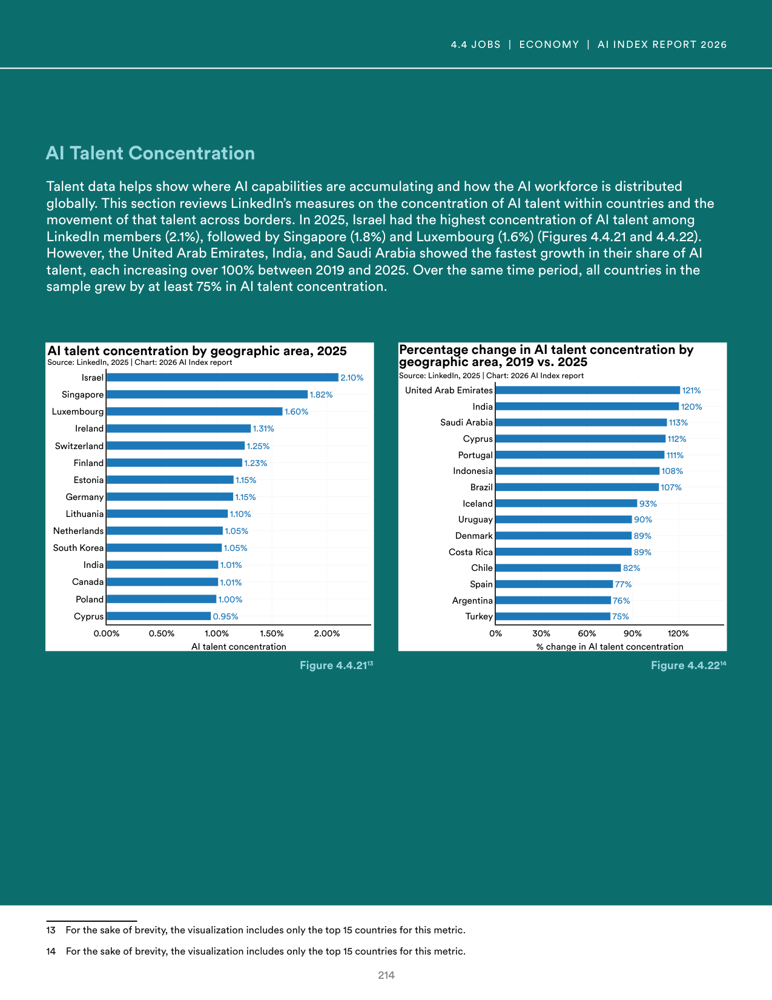
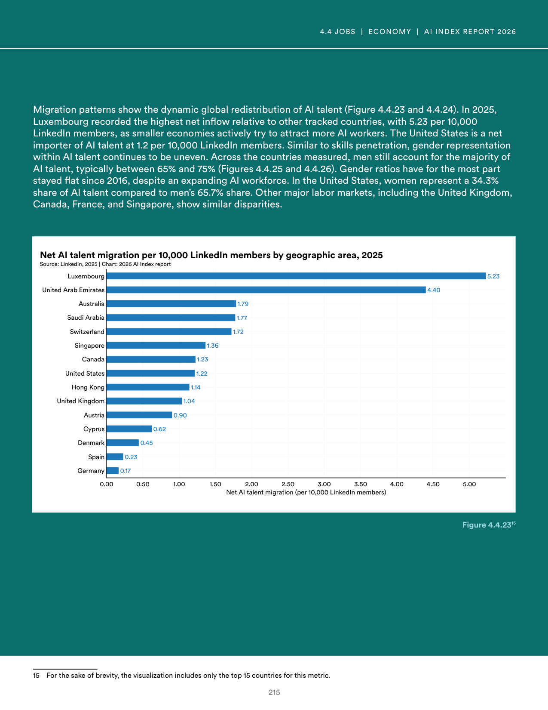

# ai_labor_market_trends

**Parent:** [[content/L1/ai-ecosystem-2025-economics-safety-labor|ai-ecosystem-2025-economics-safety-labor]] — The 2025 AI landscape is characterized by technical tensions between capability and safety, a US-led concentration of capital in vertical AI, and a 'productivity paradox' where corporate AI investment has not yet yielded macroeconomic productivity gains, while the US labor market sees a sharp rise in demand for specialized AI/ML production skills over general data analysis.

The analysis of AI labor market trends reveals a significant increase in both the demand and the specific nature of AI-related skills. In the United States, the demand for AI skills in job postings has risen sharply, with a notable shift toward the need for specialized technical capabilities. For example, the demand for 'AI' and 'Machine Learning' skills has outpaced more general data analysis roles. 

Regarding the distribution of these skills, the data indicates that while the US leads in the absolute number of AI-skilled professionals, other regions are catching up in terms of relative growth. Specifically, the shift in job requirements suggests a transition from basic literacy to a need for the ability to implement and deploy AI models in production environments.

In terms of the labor market's composition, the 'AI skill gap' remains a challenge, as the growth in job postings for AI-competent workers continues to exceed the growth of the available talent pool. This has led to increased investment in upskilling and corporate training programs to bridge the divide.

## Source pages

