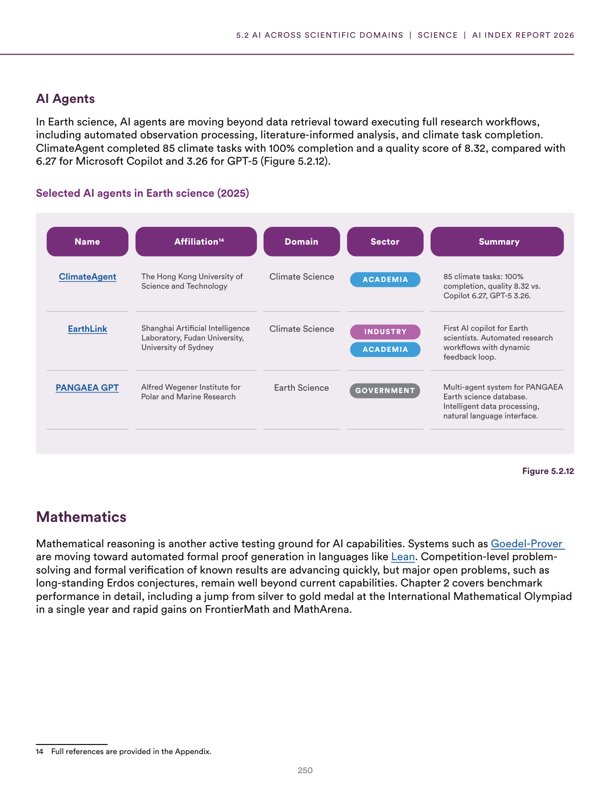
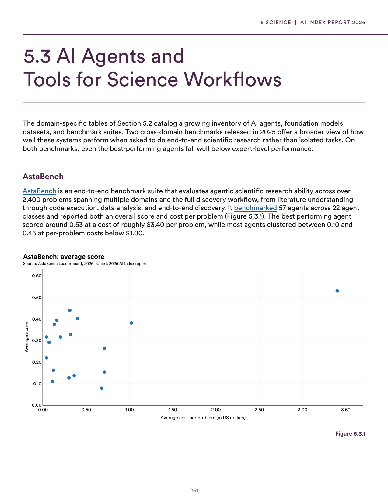
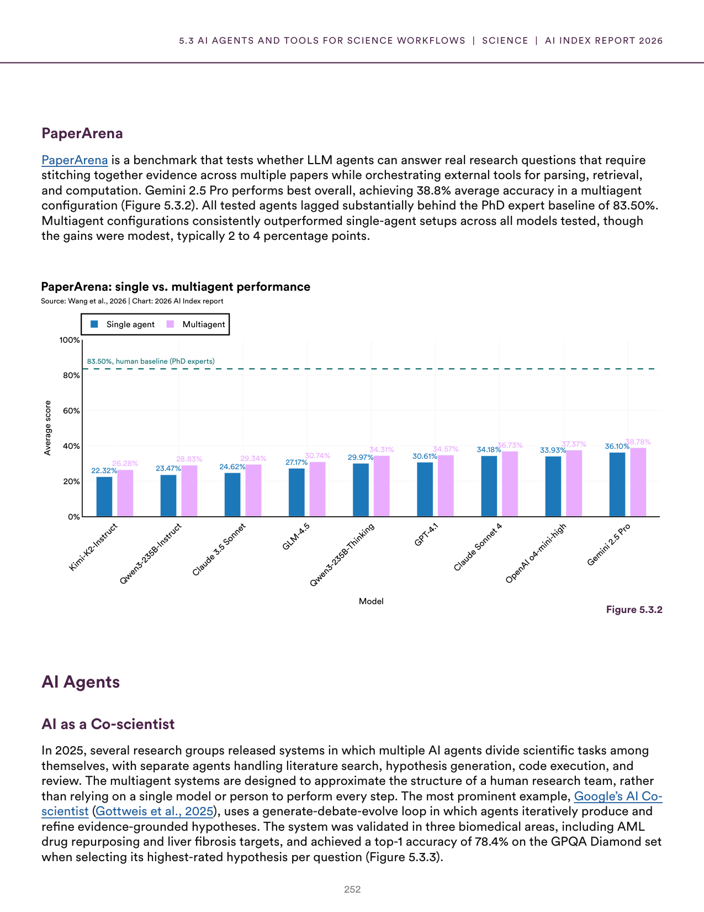
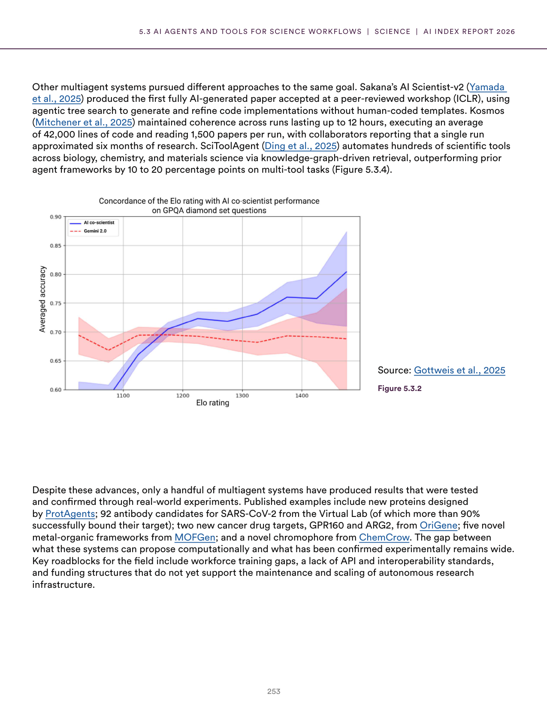
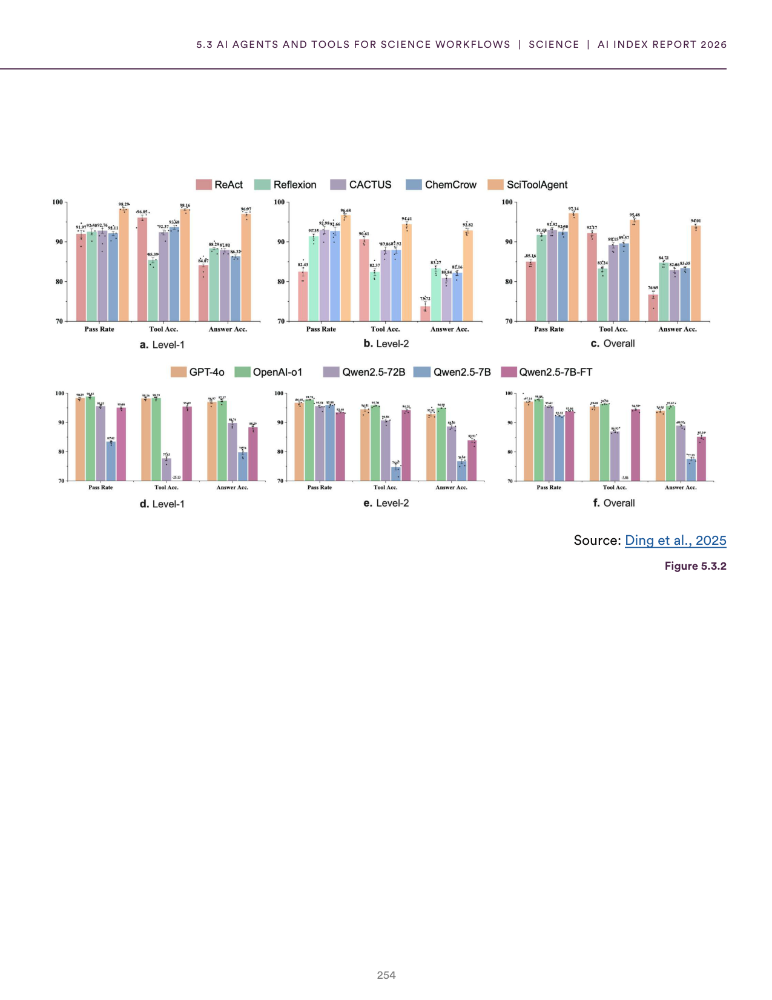
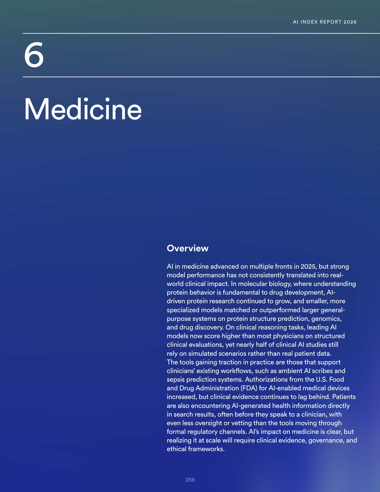
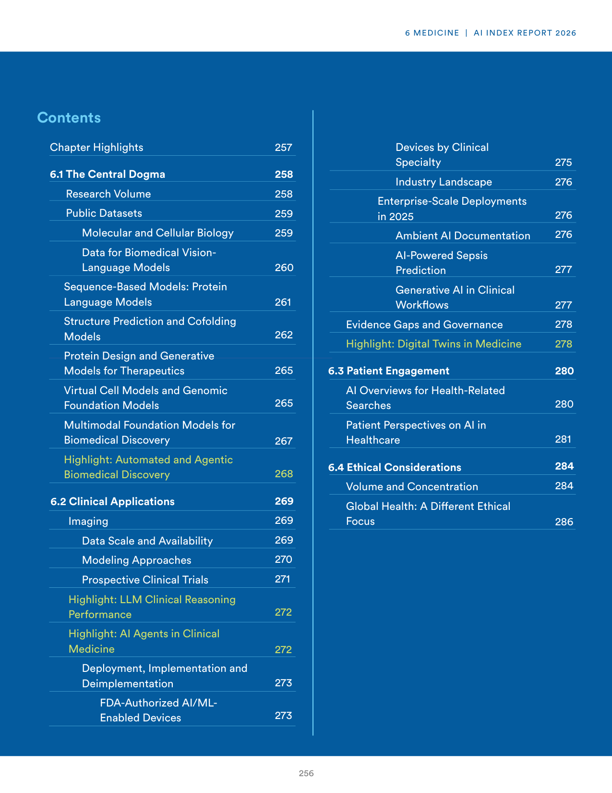
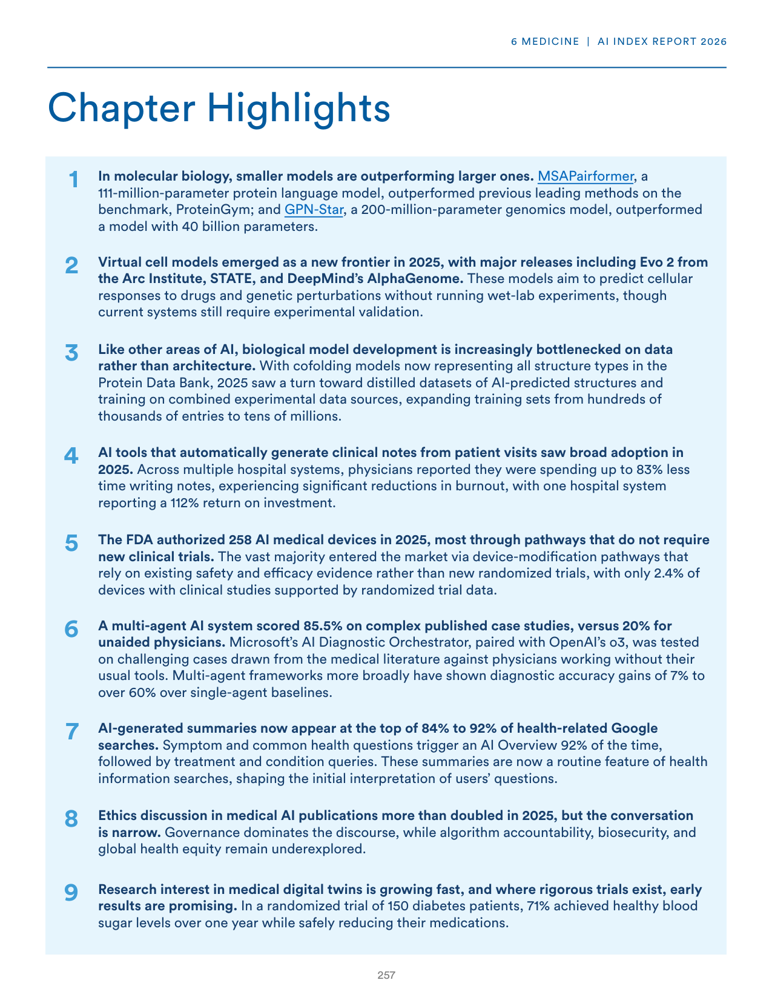
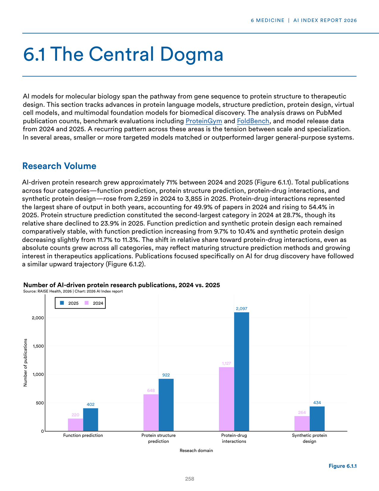

# ai_molecular_medicine_discovery.json

**Parent:** [[content/L1/ai-for-science-applications-2025|ai-for-science-applications-2025]] — AI in 2025 is shifting toward 'AI4Science,' utilizing closed-loop 'predict-synthesize-test-analyze' systems with lab-on-a-chip robotics to accelerate drug discovery, while applying geometric deep learning for 3D molecular modeling and machine learning emulators for high-resolution climate projections.

The provided text documents the state of AI in specialized scientific and medical domains, specifically focusing on the application of AI to biological, medical, and health-related research. In the field of biological and molecular science, AI is being used for molecular and biological discovery, with a notable trend toward smaller, specialized models outperforming larger ones. In medicine, AI application is characterized by a tension between the promise of the technology and the reality of its implementation. While AI is being applied to clinical tasks, there is a significant gap in the deployment of these tools in real-world medical settings. 

Regarding specific applications, the text highlights the use of AI in molecular discovery and the development of biological models. In the medical sector, the focus is on clinical decision support and the automation of diagnostic tasks, although the actual integration into healthcare workflows remains limited. The documents also emphasize the importance of evaluating these models for safety, reliability, and clinical efficacy before widespread adoption.

## Source pages

