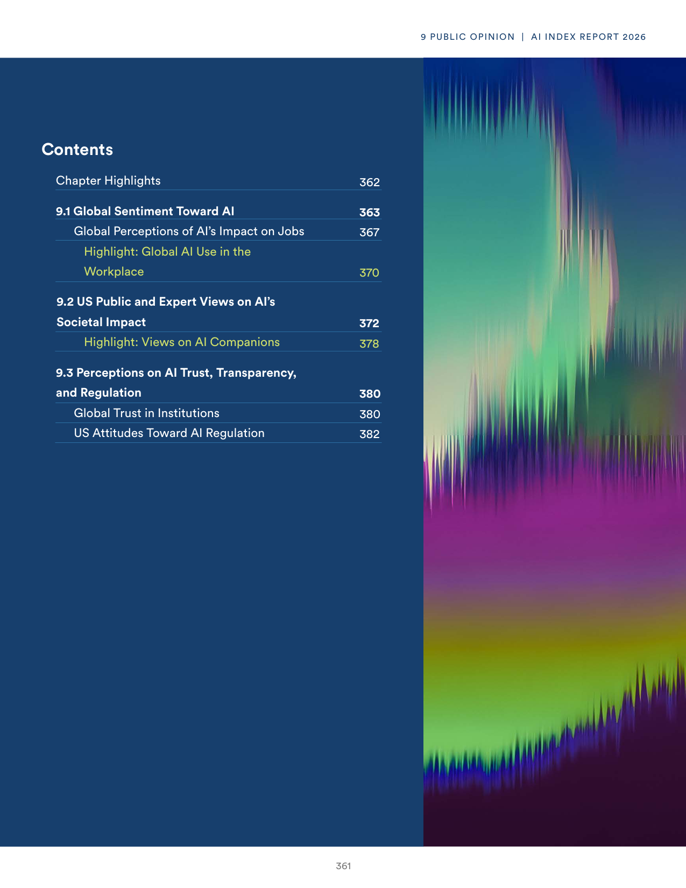
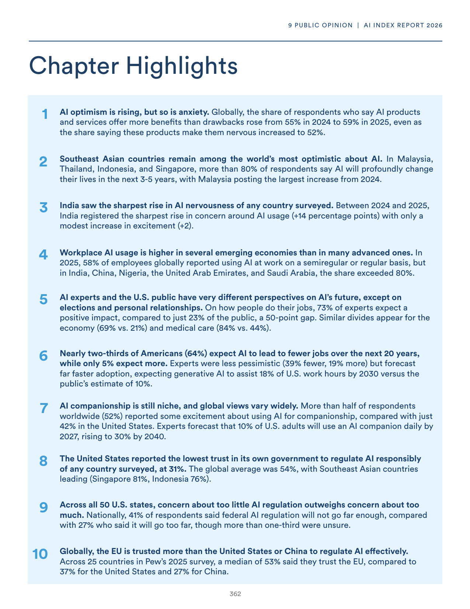
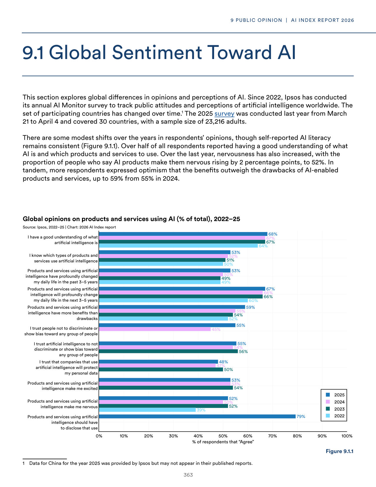
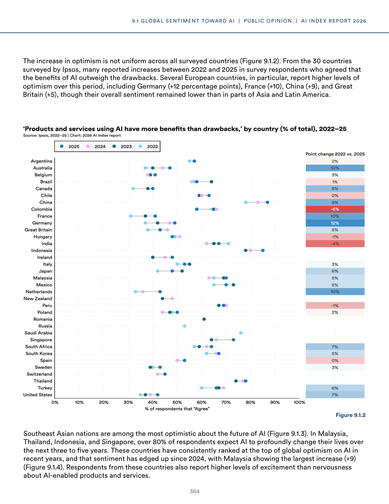
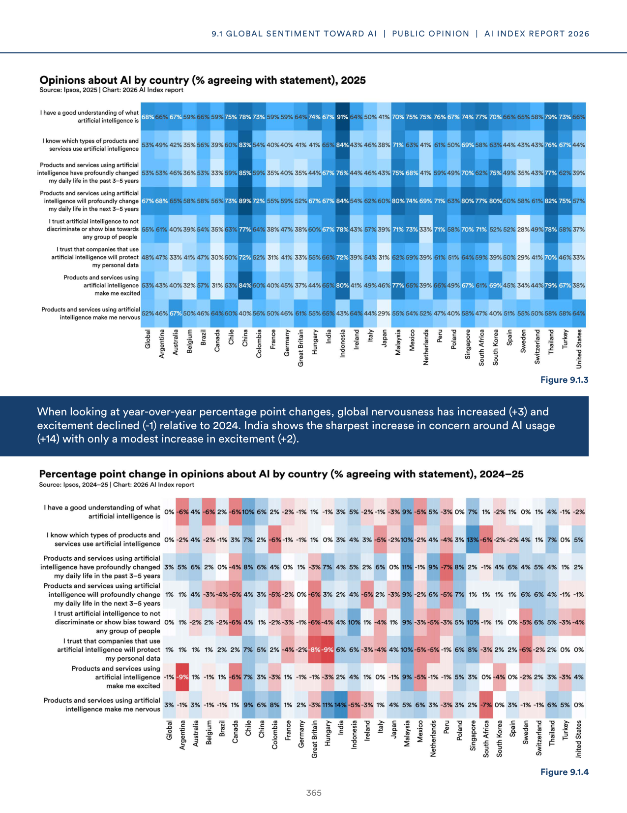
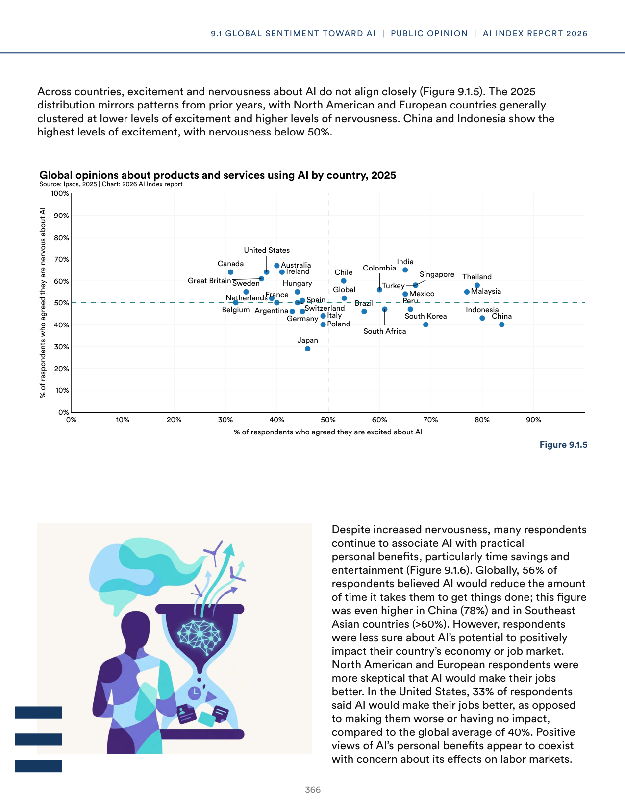
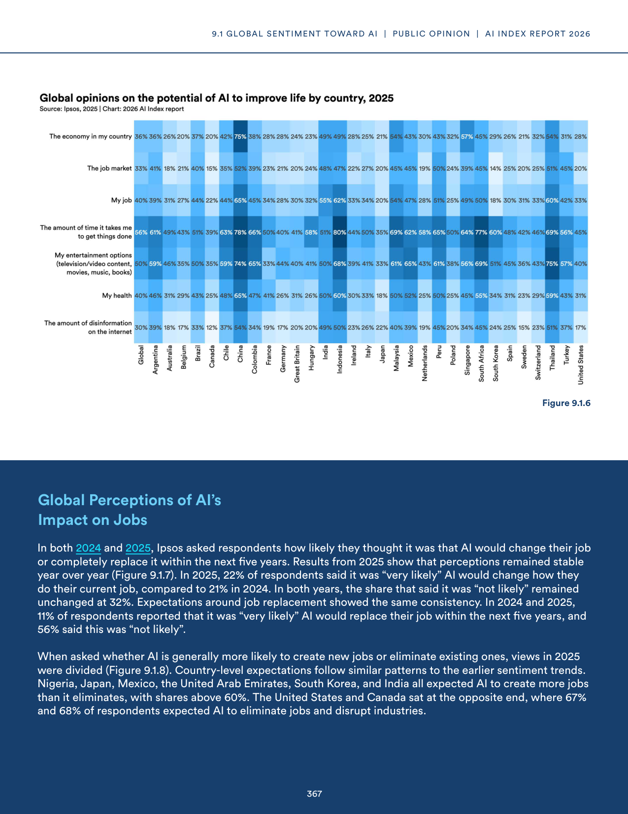
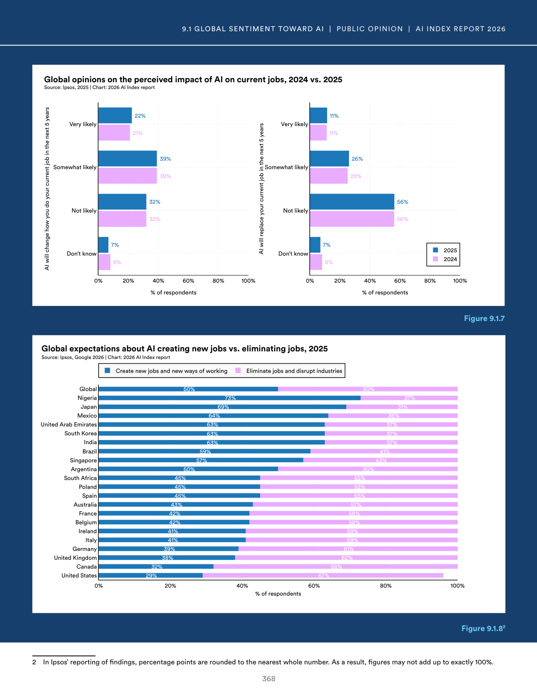

# ai_public_perception_global.txt

**Parent:** [[content/L1/ai-landscape-governance-and-funding|ai-landscape-governance-and-funding]] — This comprehensive context synthesizes the AI landscape in 2025, detailing the balance between capabilities and safety, the U.S. dominance in private and public sector funding (using grants, contracts, and loans between 2014-2024), and the regional differences in public sentiment and RAI framework maturity scores (rising from 2.5 to 2.8).

Based on global surveys, public sentiment toward AI varies significantly by region and demographic. In the United States, there is a notable gap between the views of experts and the general public; for instance, while experts may be more optimistic about AI's capabilities, a significant portion of the general population expresses concern over job displacement and ethics. In contrast, regions like Asia often show higher levels of optimism regarding AI's role in economic growth and productivity. Specifically, in the US, a significant portion of the general population views AI as a risk to employment, whereas in other markets, the focus is more on the augmentation of human labor. Data suggests that while global awareness of AI is high, the level of trust in AI systems remains low, particularly in developed economies where privacy and algorithmic bias are primary concerns.

## Source pages

