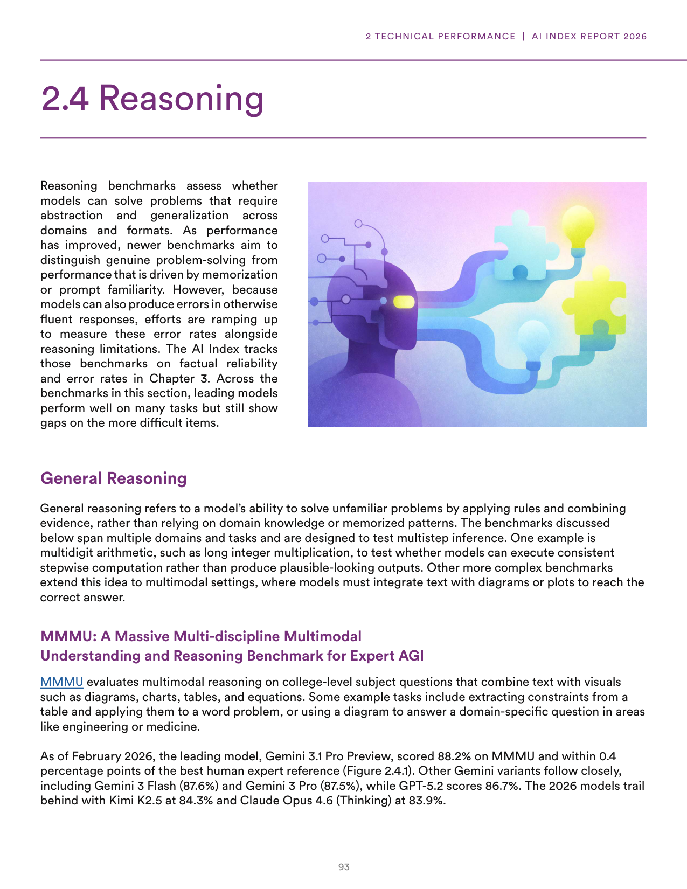
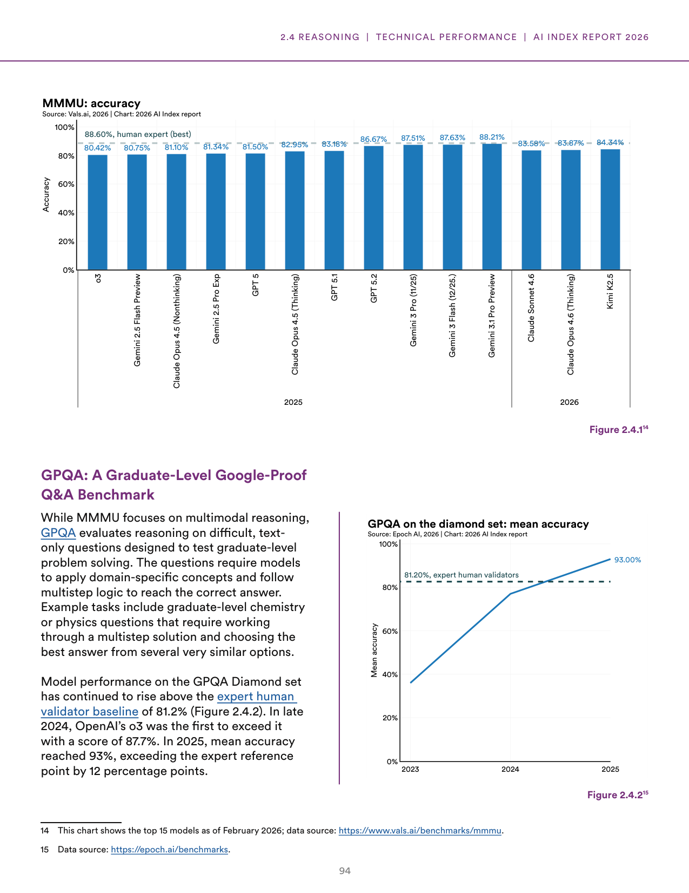
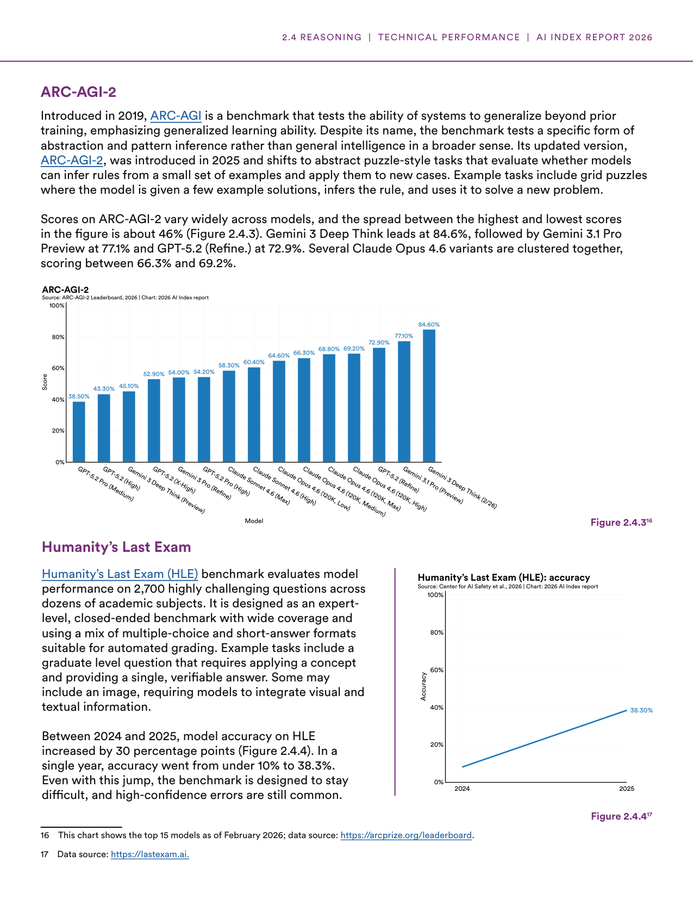
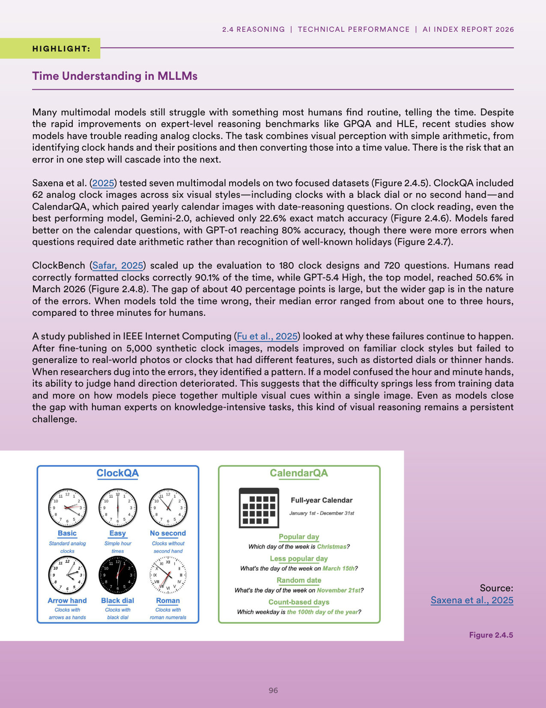
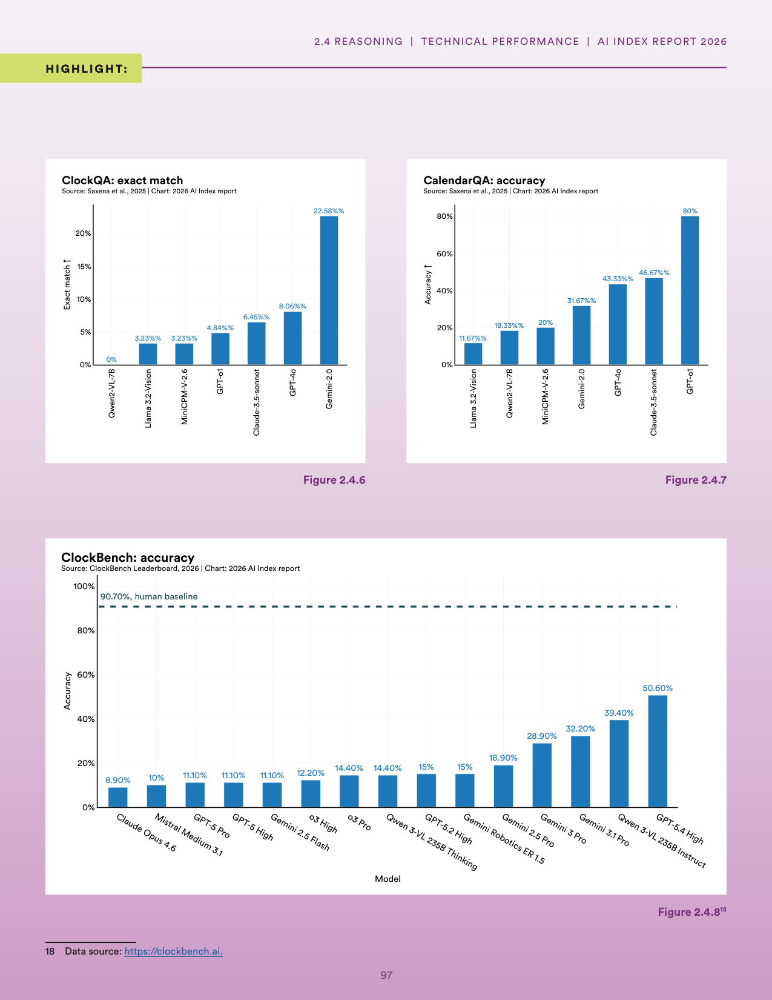
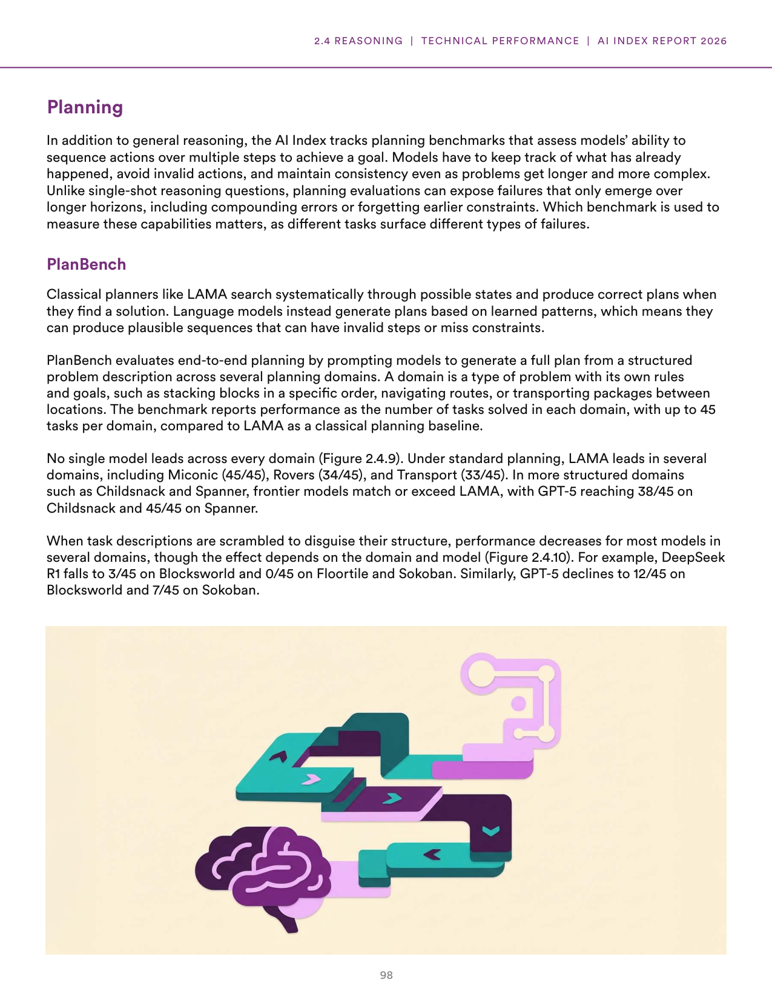
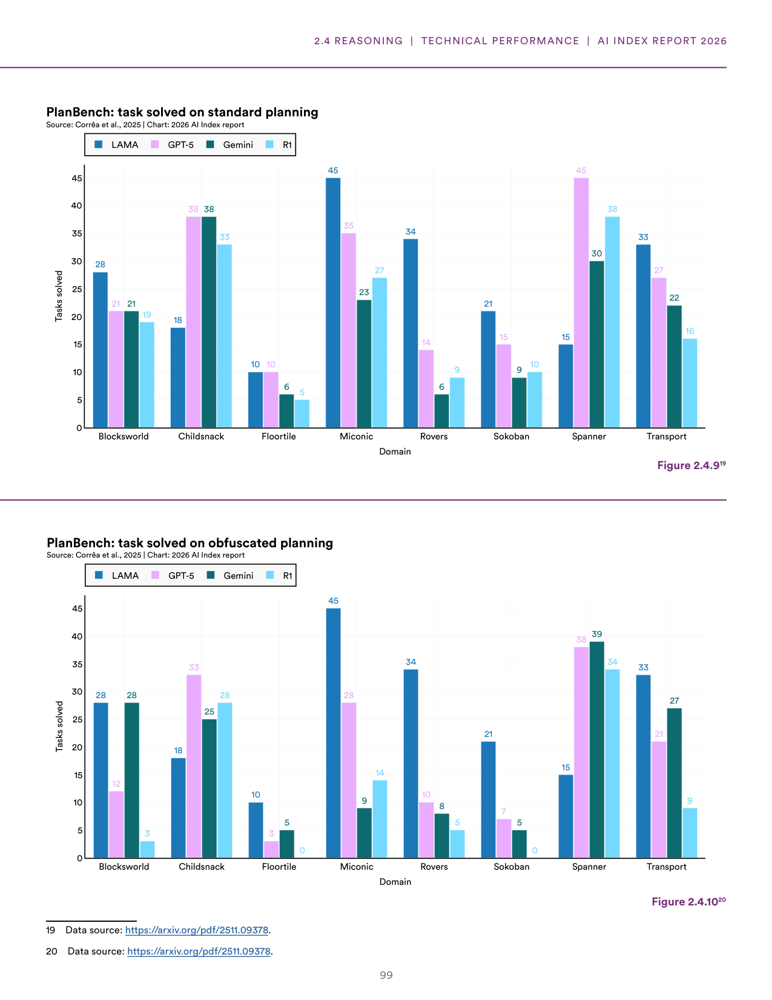

# ai_reasoning_planning_benchmarks

**Parent:** [[content/L1/ai-index-2026-performance-benchmarking|ai-index-2026-performance-benchmarking]] — As of March 2026, AI model performance has converged, with Anthropic leading the Arena Leaderboard at 1,503 Elo and Google's Gemini-3.1-Pro leading MMLU-Pro at 91.16%. Technical gaps between US and Chinese models have narrowed, with the top US model leading the top Chinese model (Dola-Seed-2.0 Preview, 1,464) by 39 points.

The provided text discusses the performance and capabilities of various AI models in reasoning and problem-solving tasks, specifically focusing on benchmarks for reasoning, planning, and specialized benchmarks. In terms of reasoning and planning, the text highlights that while models show progress, there is a gap in their ability to handle complex, multi-step planning compared to human performance. It specifically examines 'planning' through the lens of planning benchmarks, noting that models often struggle with long-horizon tasks. For reasoning, the text analyzes several benchmarks: the 'ARC' (Abstraction and Reasoning Corpus) benchmark, which tests a model's ability to solve novel visual puzzles; 'GSM8K' for mathematical reasoning; and 'HumanEval' for coding tasks. The data shows that while scaling laws generally improve performance on GSM8K and HumanEval, progress on ARC has been slower, suggesting terms of 'System 1' (fast, intuitive) versus 'System 2' (slow, deliberative) reasoning. The text concludes that true 'reasoning' requires a move toward deliberative processes and the ability to generalize to unseen problems, rather than relying on pattern matching from training data.

## Source pages

