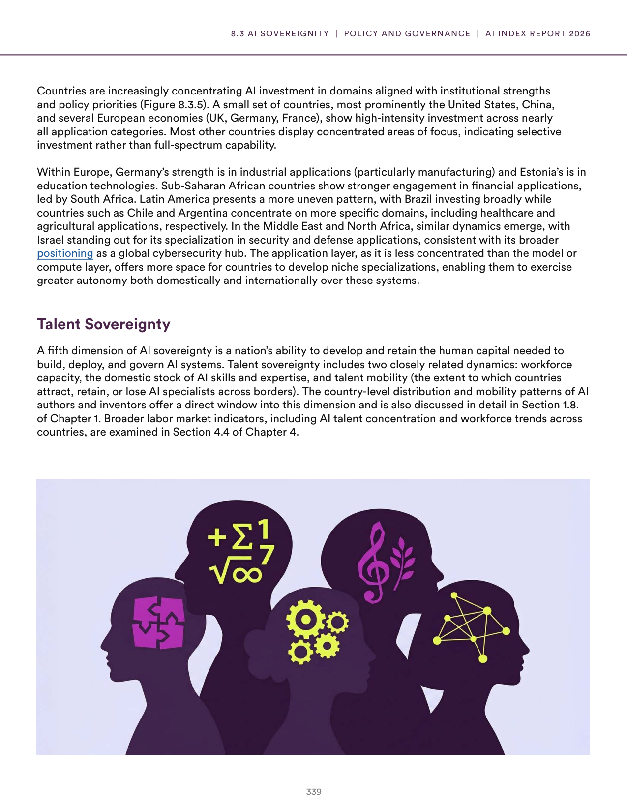
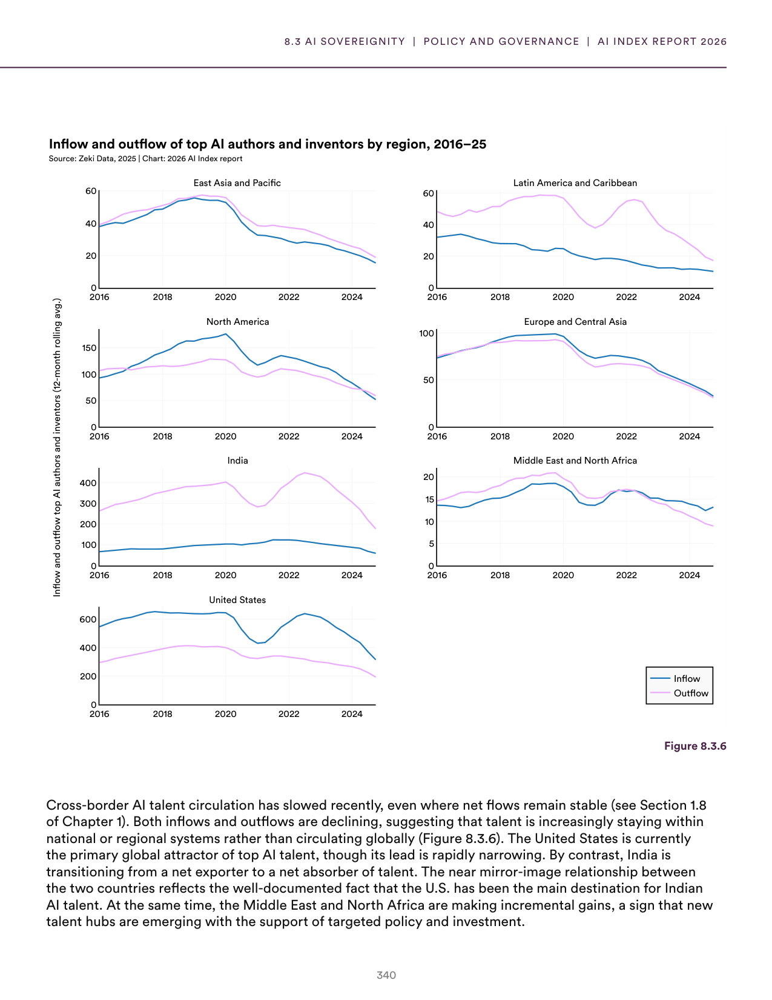
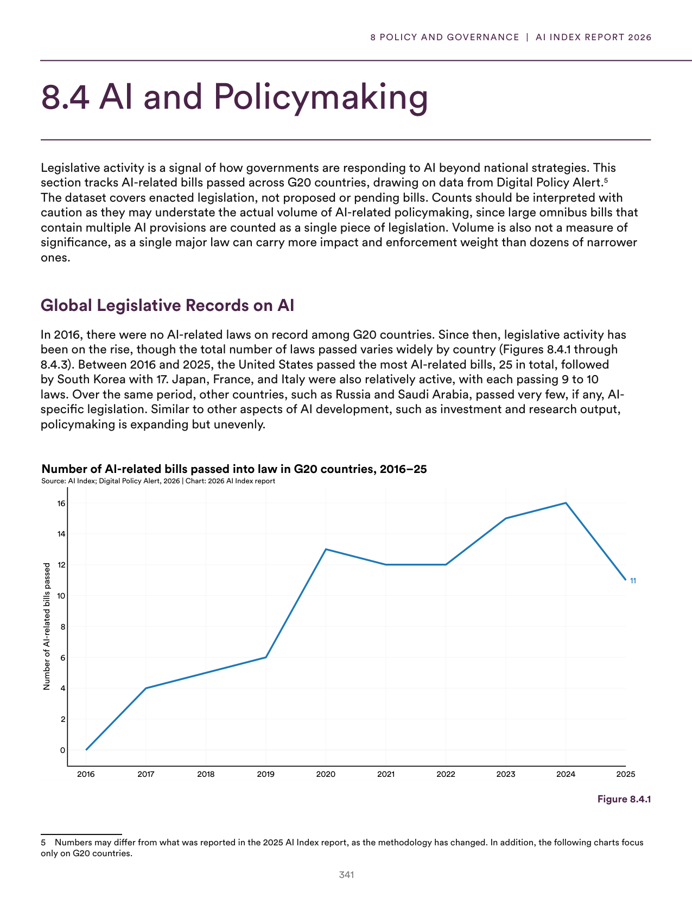
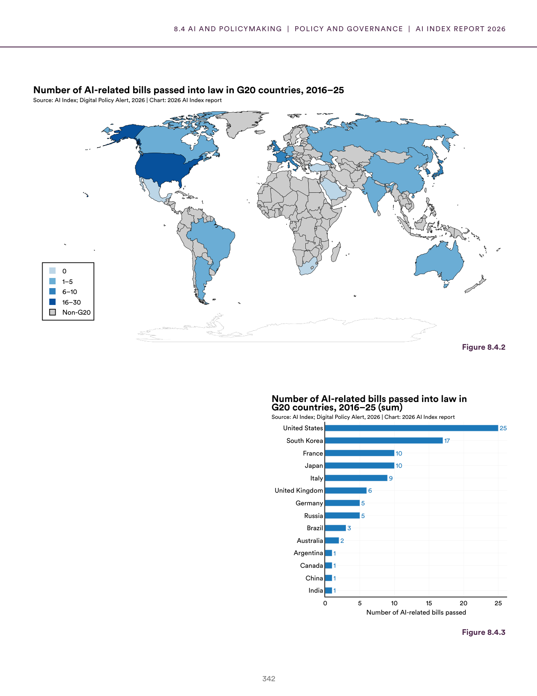
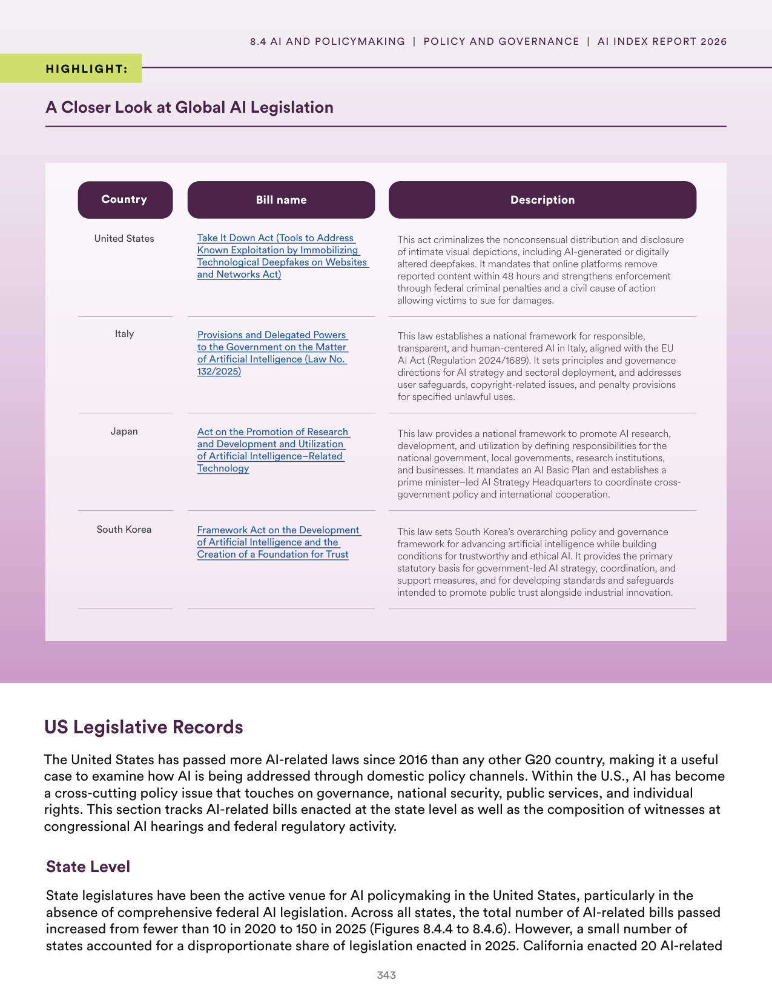
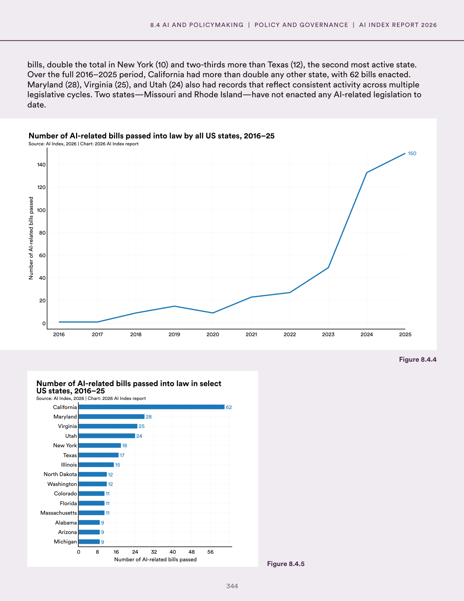
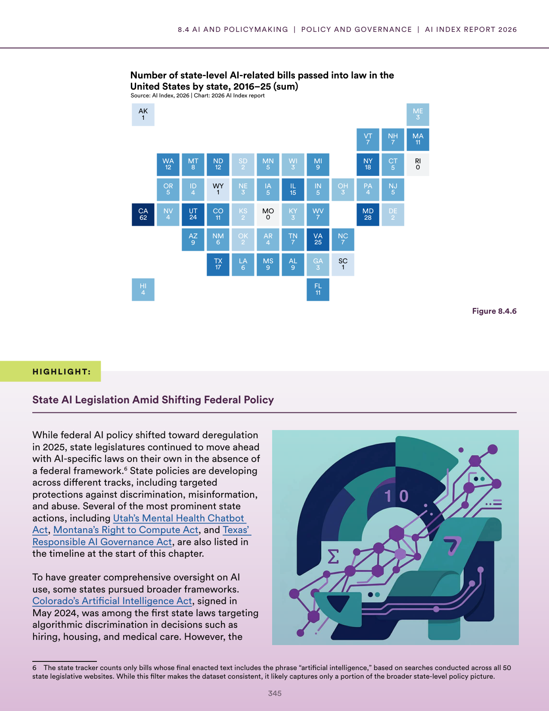
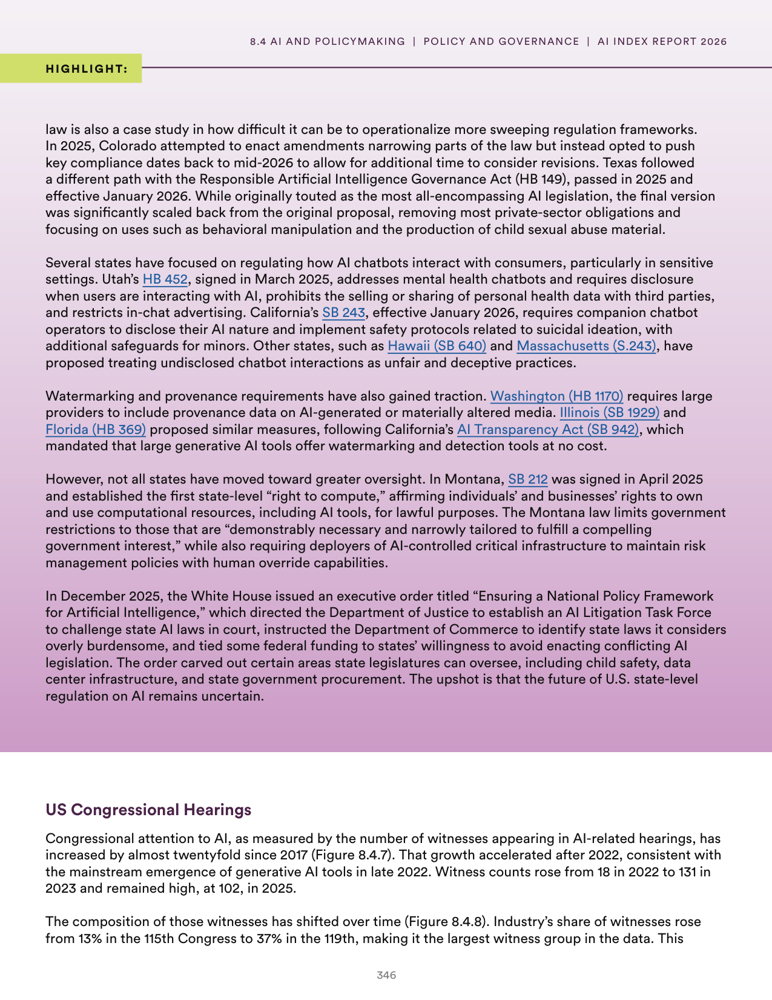

# ai_regulatory_landscape_us

**Parent:** [[content/L1/ai-sovereignty-and-us-policy|ai-sovereignty-and-us-policy]] — Countries are pursuing 'Sovereign AI' through GPU clusters and local-language datasets to reduce foreign dependency, while the U.S. government's policy shifted from risk mitigation to a 'pro-innovation' stance between 2020 and 2025 to maintain global leadership.

The provided text discusses the intersection of AI and law/policy, specifically focusing on the regulatory landscape and legislative activities surrounding AI in the United States. It highlights the tension between state-level and federal approaches to AI governance. In terms of state-level legislation, the document notes that various states have pursued different regulatory paths. For instance, some states have focused on transparency and consumer protection, while others have explored more comprehensive frameworks. A key point of discussion is the role of state-level laws in shaping the overall AI ecosystem, including potential conflicts or synergies with federal or international standards. The text also touches upon the a-priori challenges of regulating a rapidly evolving technology, where traditional legislative cycles may not keep pace with technical advancements. Furthermore, it mentions the importance of inter-agency and inter-state cooperation to create a cohesive regulatory environment that balances innovation with safety and ethical considerations.

## Source pages

