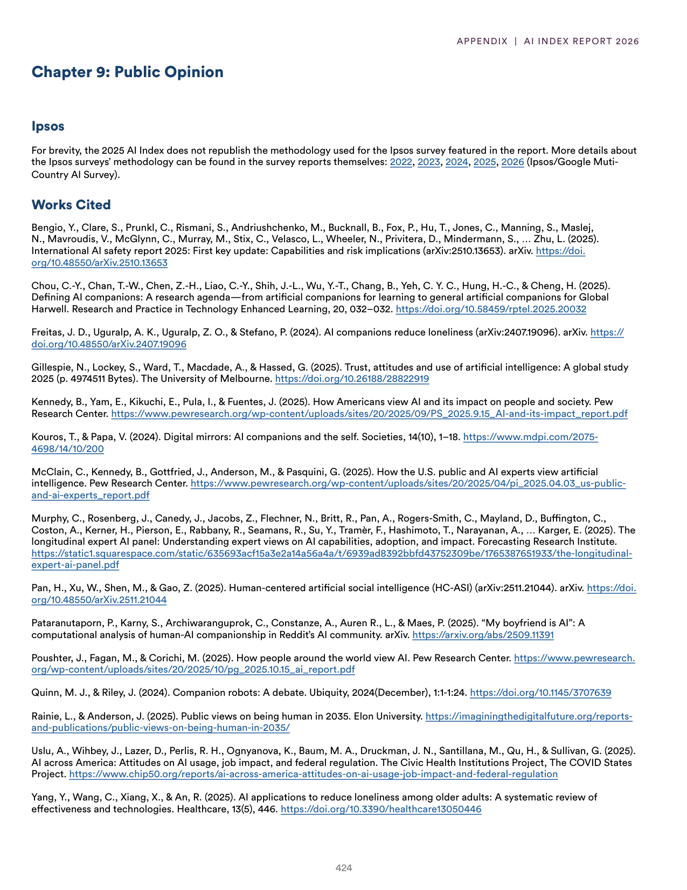
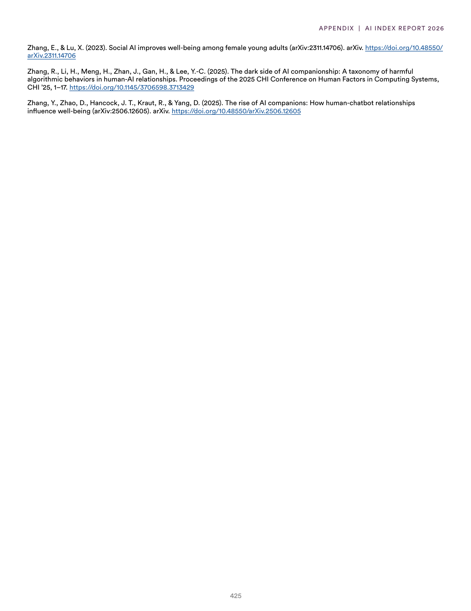

# ai_report_bibliography_2025

**Parent:** [[index]]

The provided text consists of a bibliography and references section for the 2025 AI report. It lists academic sources and citations focusing on AI-related topics such as AI companions, human-AI interaction, and the societal impacts of AI. Key citations include research on the effect of AI companions on loneliness, the use of AI in different demographics, and the general perception and regulation of AI. It also references data from Pew Research Center and various academic studies regarding the intersection of technology and human psychology.

## Source pages

