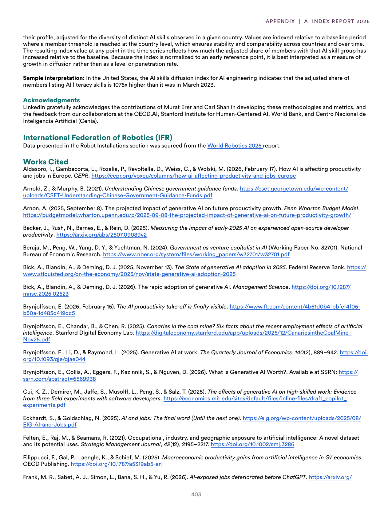
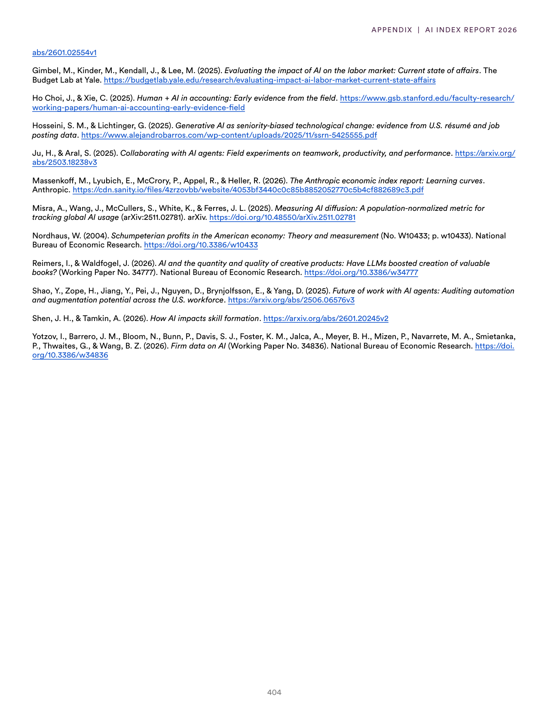
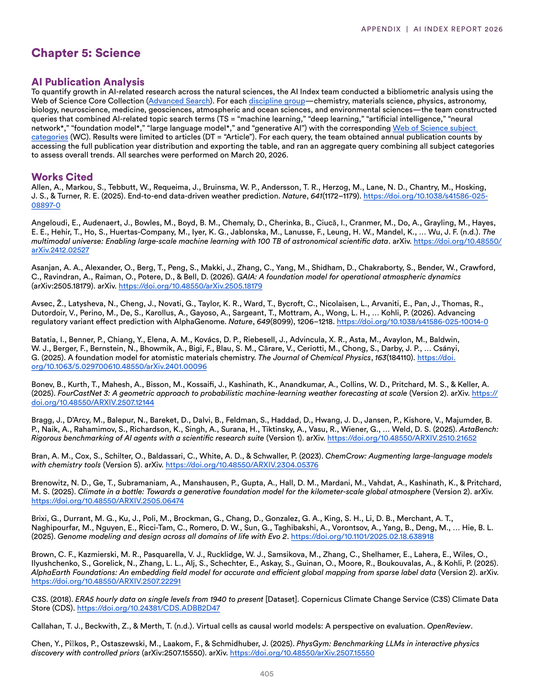
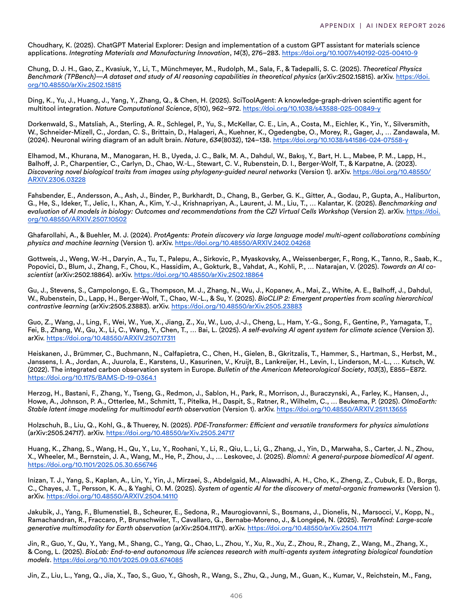
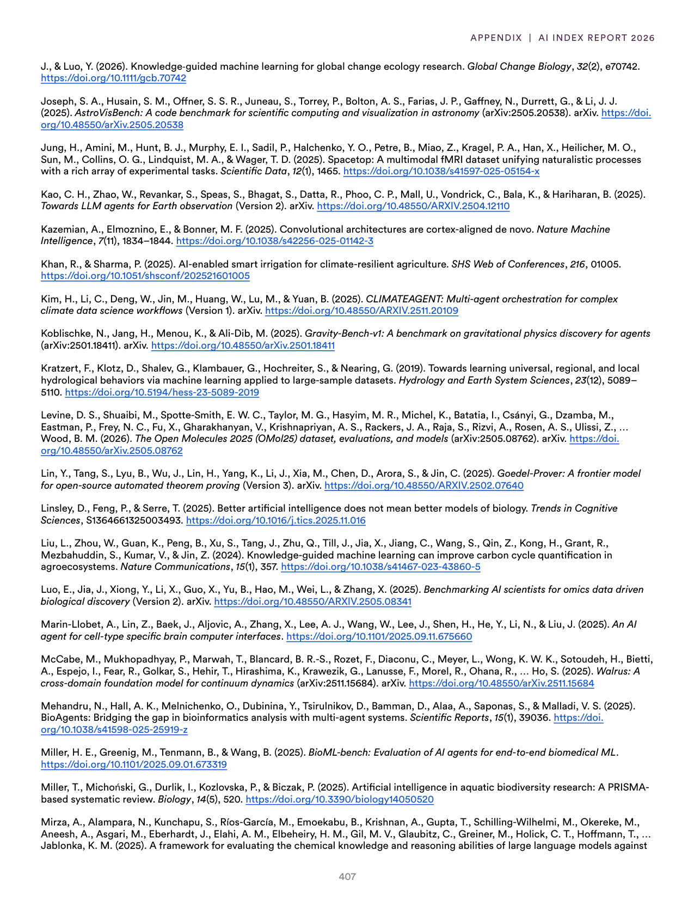
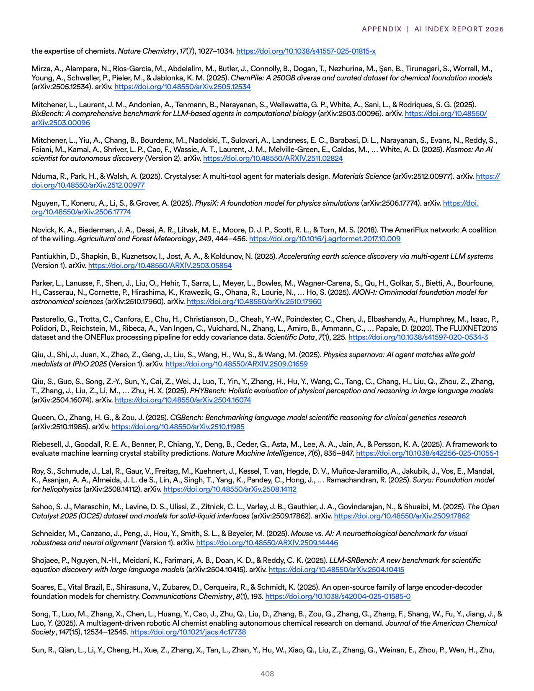

# ai_science_bibliography_appendix

**Parent:** [[index]]

The provided text consists of a series of bibliographic references and an appendix from terms related to a report on AI and scientific research. It includes citations for numerous papers and projects focusing on AI applications in chemistry, physics, biology, and environmental science, as well as a description of the methodology used for the 'AI and Science' section of terms. Specifically, it lists works on AI for protein folding, material discovery, and climate modeling, and mentions the use of an 'AI and Science' term list to categorize the impact of AI across various scientific disciplines.

## Source pages

