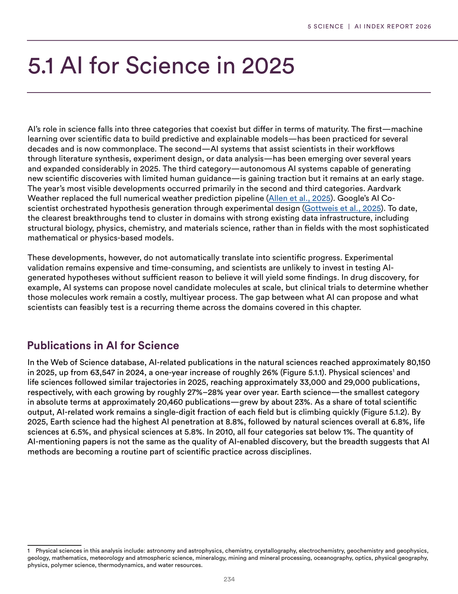
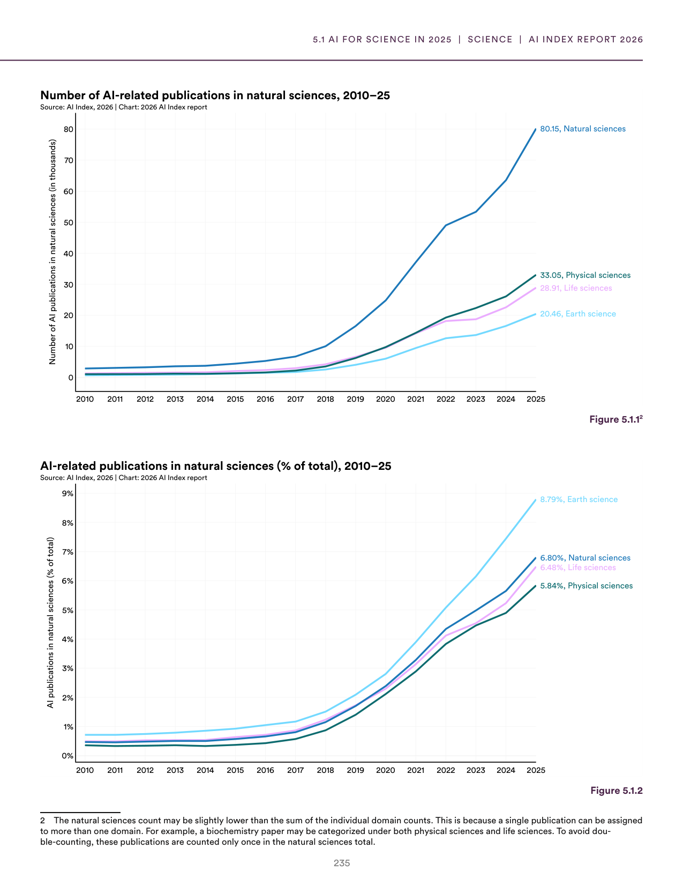
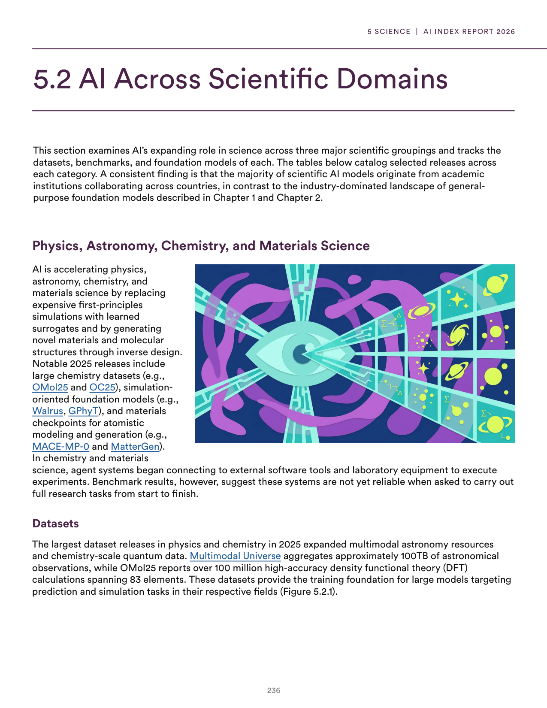
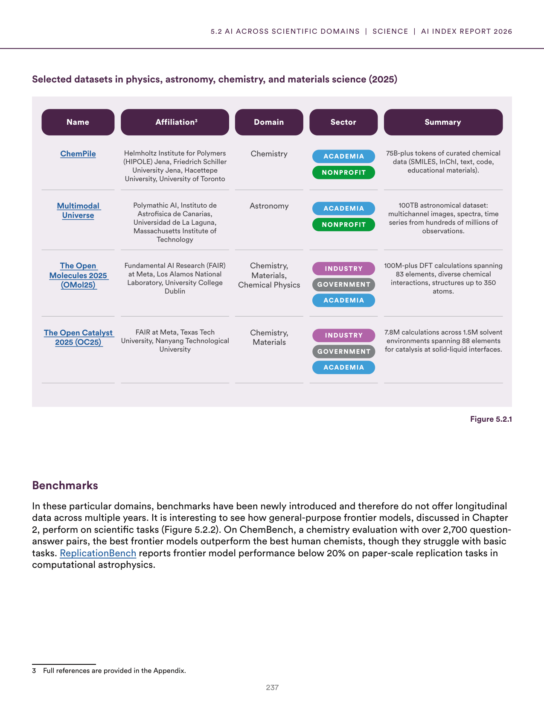
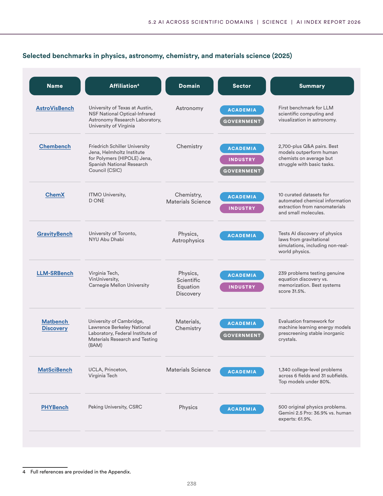
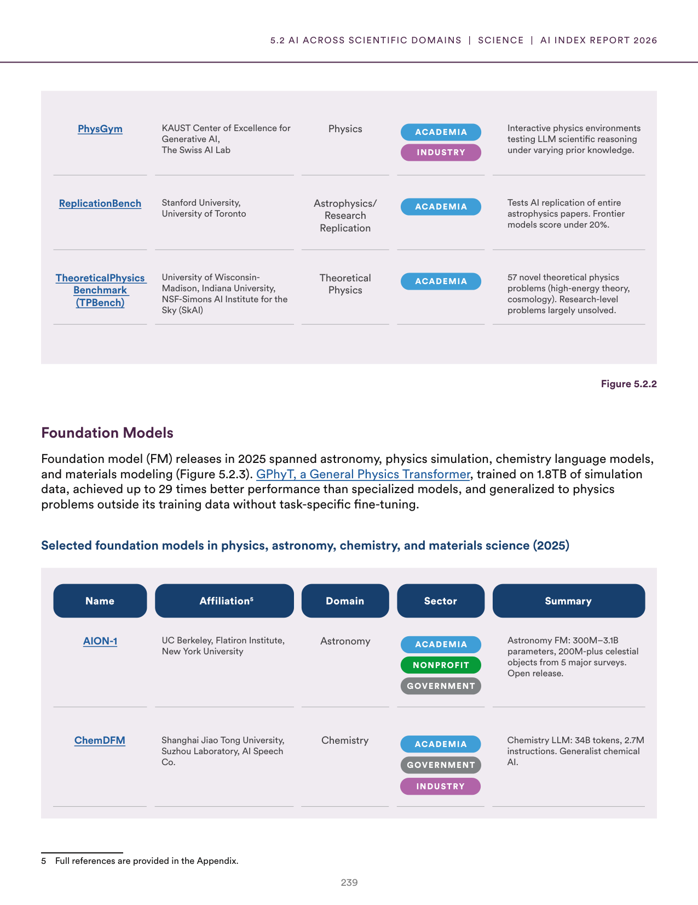
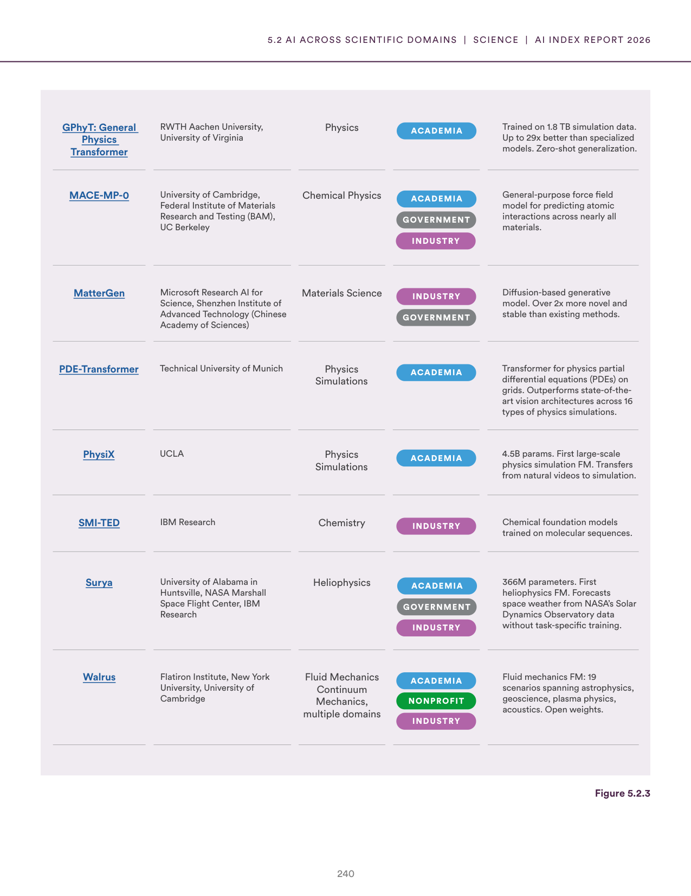
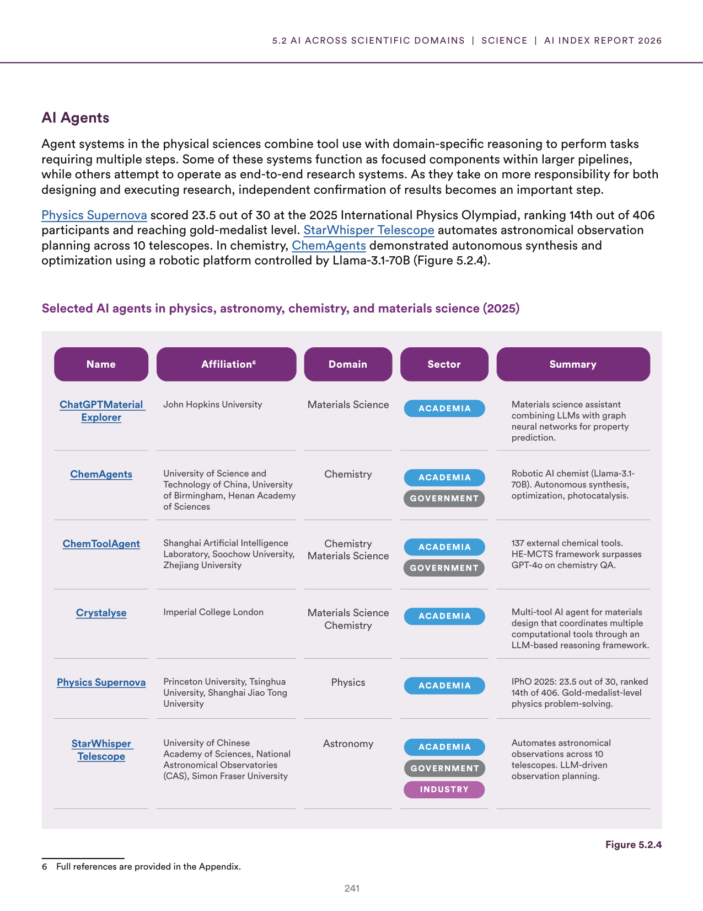

# ai_scientific_discovery_overview

**Parent:** [[content/L1/ai-2025-state-technical-economic-governance|ai-2025-state-technical-economic-governance]] — In 2025, AI is characterized by a tension between capability and safety, with the US dominating private investment and the rise of 'AI4Science' for scientific discovery. Meanwhile, RAI framework maturity scores rose from 2.5 to 2.8, but only 15% of organizations are 'high maturity' (score 4+), and a specific Pydantic 'AttributeError: NoneType object has no attribute model_dump' persists in API structured outputs.

In 2025, AI is increasingly integrated into scientific research, though its application varies by domain. AI tools are being used for a range of tasks, from predicting molecular properties to automating laboratory workflows. A significant trend is the shift toward 'AI for Science' (AI4Science), where models are trained specifically on scientific data rather than general text. However, challenges remain, including the need for high-quality, curated scientific datasets and the ability of models to reason through complex, multi-step scientific problems without 'hallucinating' results. Despite these hurdles, AI is accelerating discovery in materials science, drug development, and physics by narrowing the search space for new hypotheses.

Regarding the role of AI in scientific discovery, recent data shows that AI-driven discovery is particularly potent when combined with human expertise. For example, in materials science, AI can suggest thousands of candidate materials, which are then validated by human researchers in a lab. In physics, AI is helping to analyze massive datasets from particle accelerators and telescopes that would be impossible for humans to process manually. The current state of AI in science is characterized by a transition from using AI as a simple tool for data analysis to using it as a partner in the hypothesis-generation process.

## Source pages

