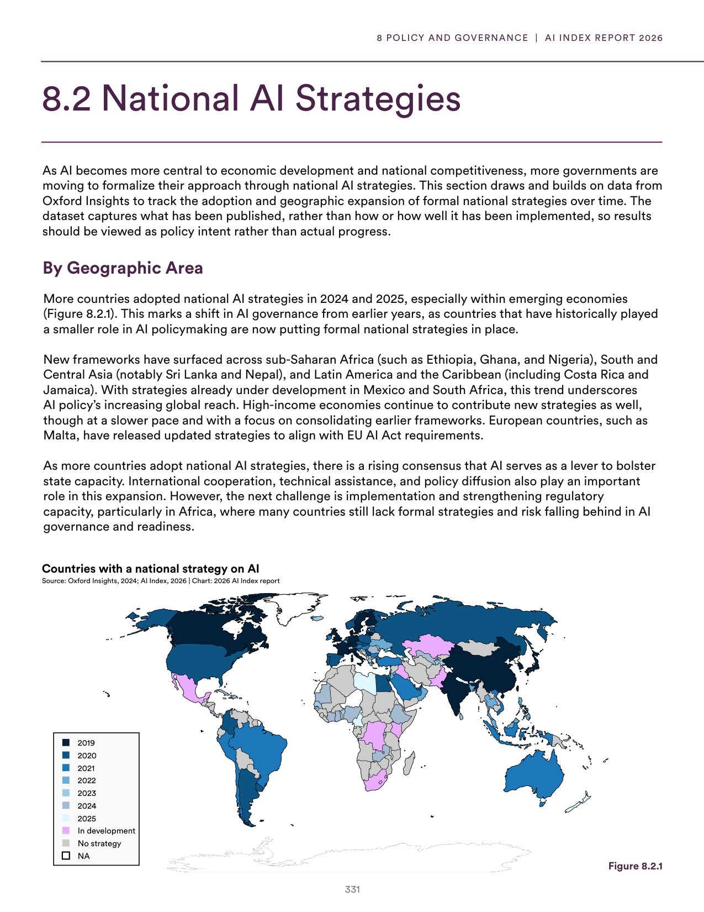
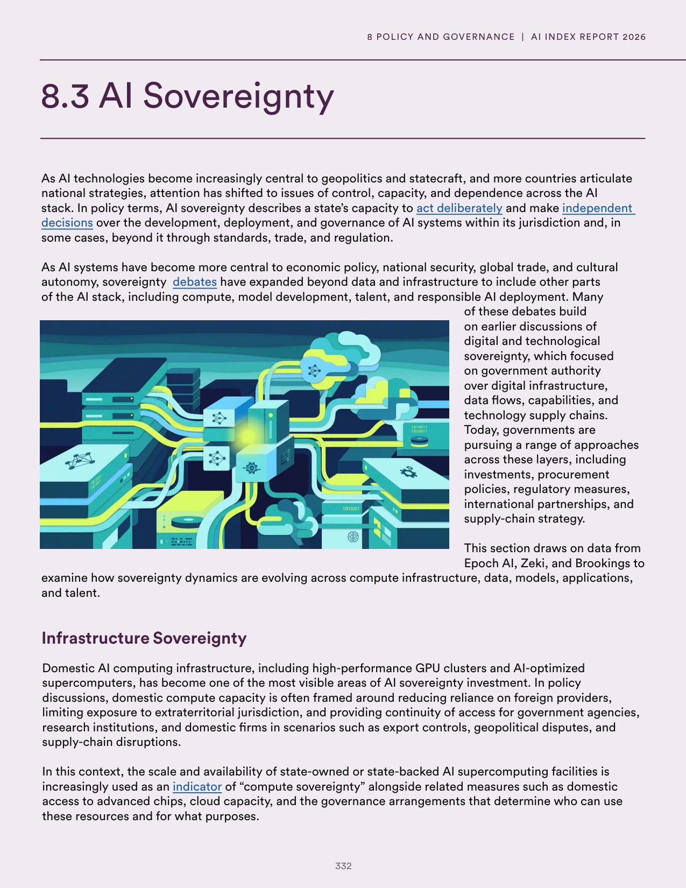
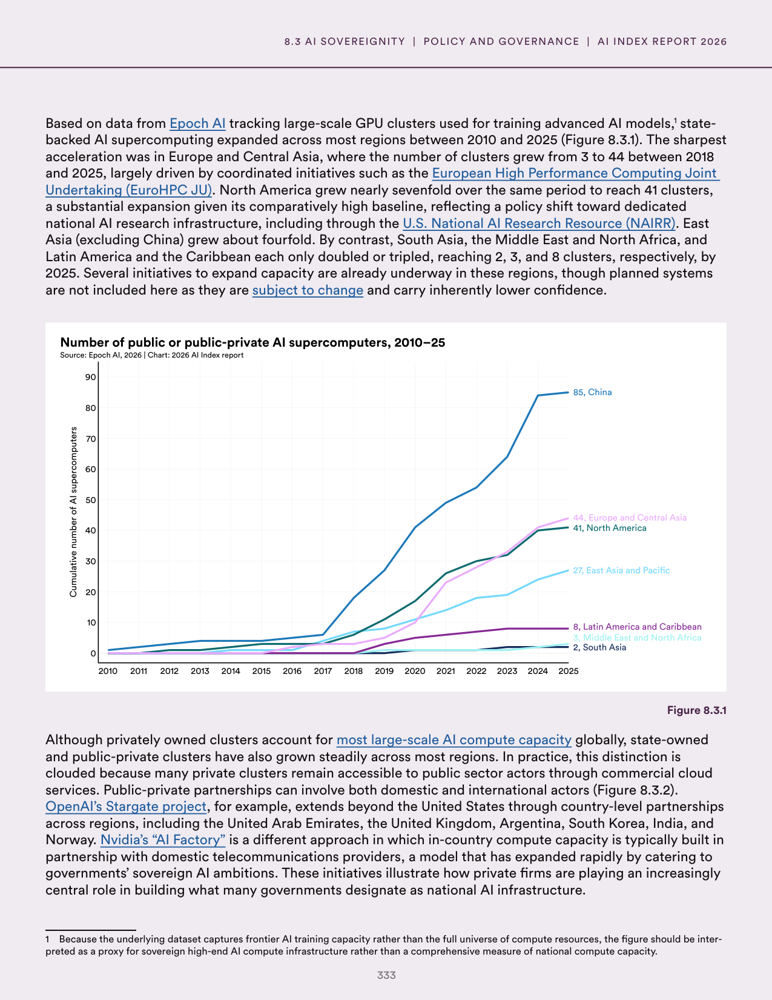
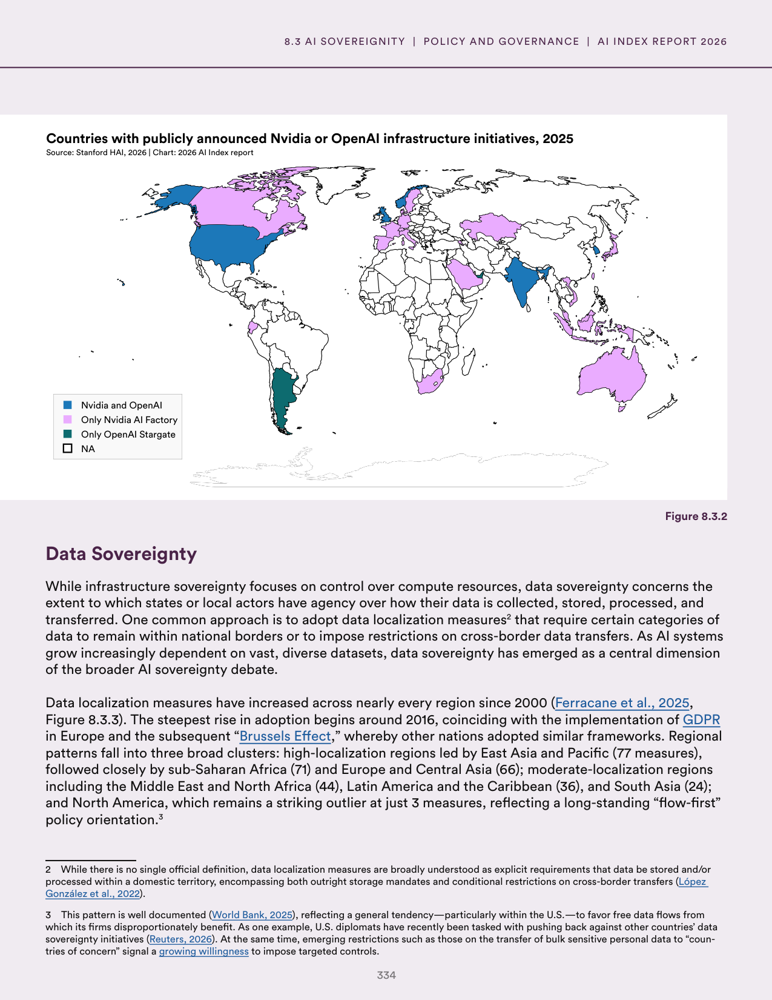
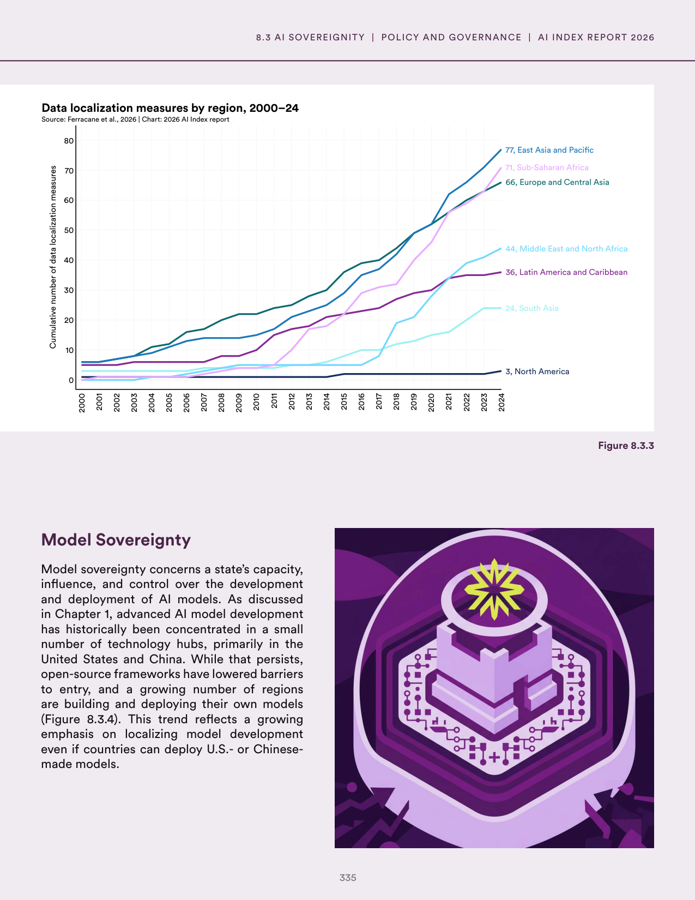
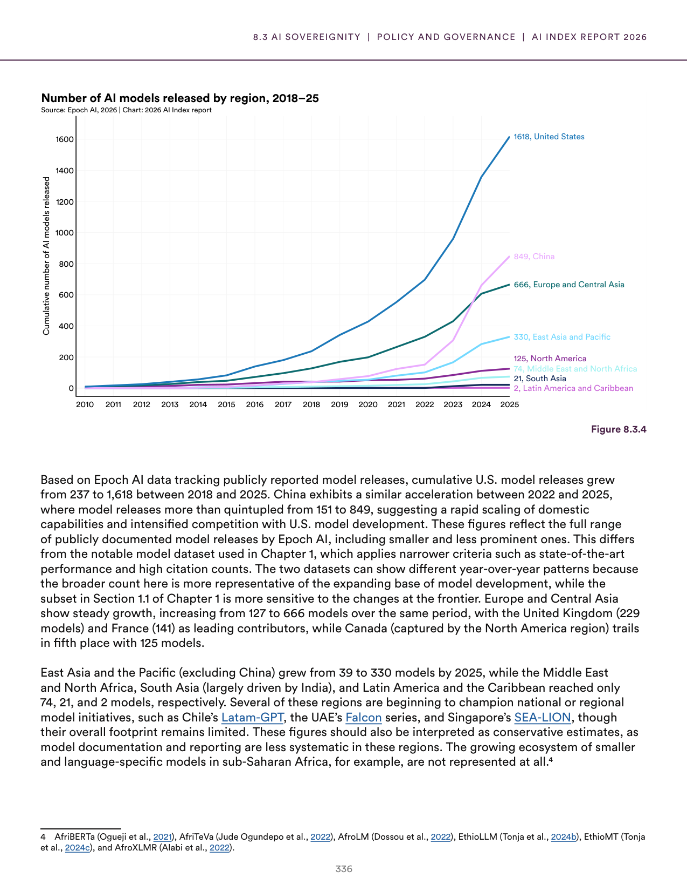
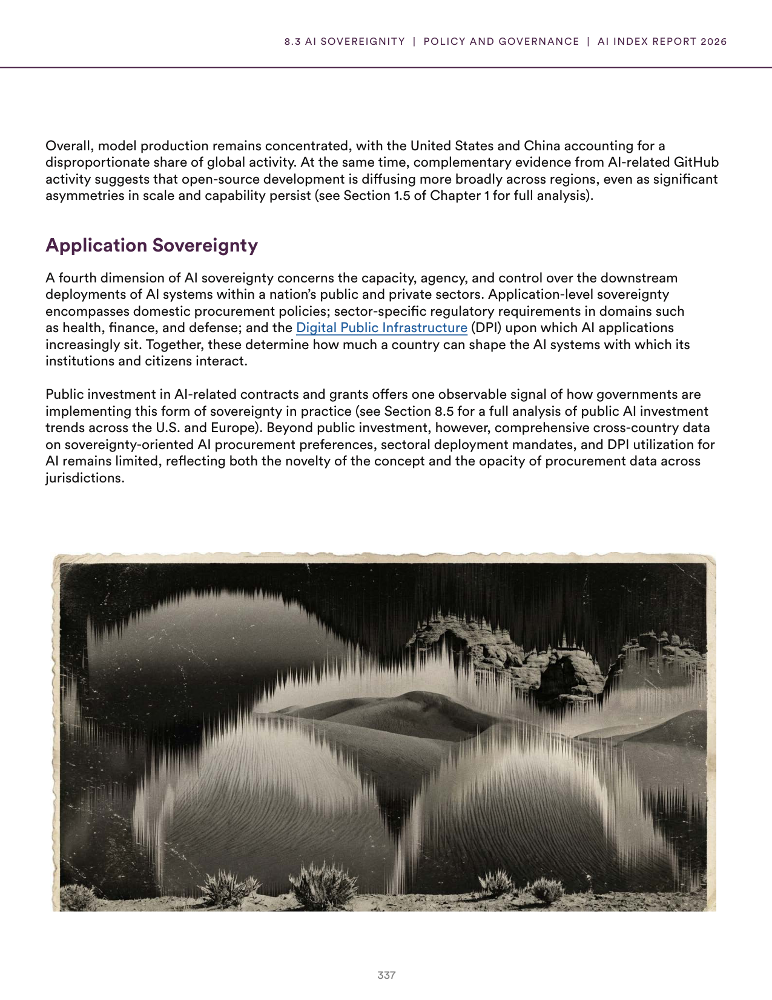
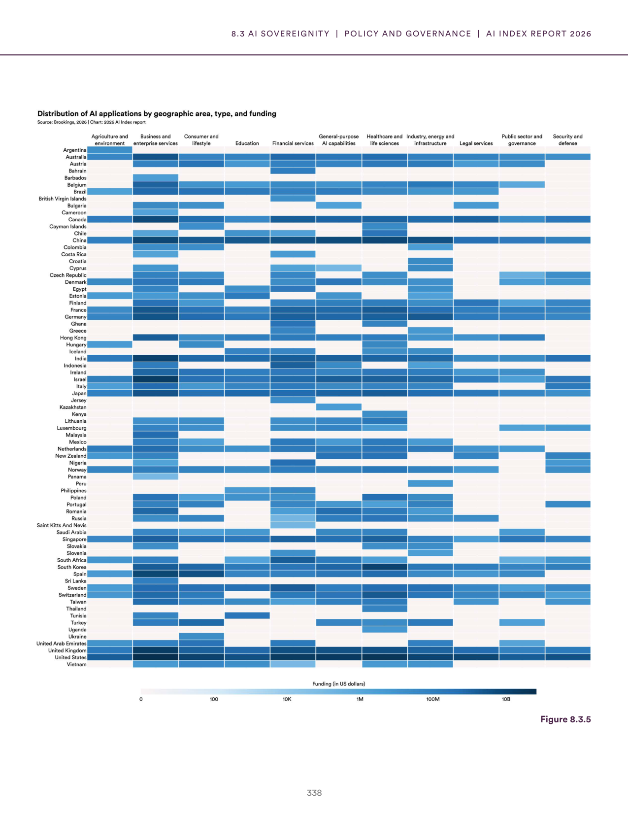

# ai_sovereignty_and_national_strategy

**Parent:** [[content/L1/ai-sovereignty-and-us-policy|ai-sovereignty-and-us-policy]] — Countries are pursuing 'Sovereign AI' through GPU clusters and local-language datasets to reduce foreign dependency, while the U.S. government's policy shifted from risk mitigation to a 'pro-innovation' stance between 2020 and 2025 to maintain global leadership.

The provided text details the concept of AI sovereignty and the strategies countries use to ensure control over their AI ecosystems. National AI sovereignty is being pursued through various means, including the development of sovereign AI infrastructure, the creation of specialized datasets, and the implementation of tailored regulatory frameworks. A significant part of this effort involves the adoption of 'Sovereign AI'—the idea that nations should build and run their own AI models using their own data, computing resources, and workforce to reduce dependency on foreign technology. The text also highlights the role of government partnerships and investments in domestic computing power (GPU clusters) and the use of local-language datasets to ensure cultural and linguistic alignment. Furthermore, it discusses the balance between openness and protectionism, noting that while some countries embrace open-source models to accelerate innovation, others implement strict controls over data and model weights to protect national security and economic interests.

## Source pages

