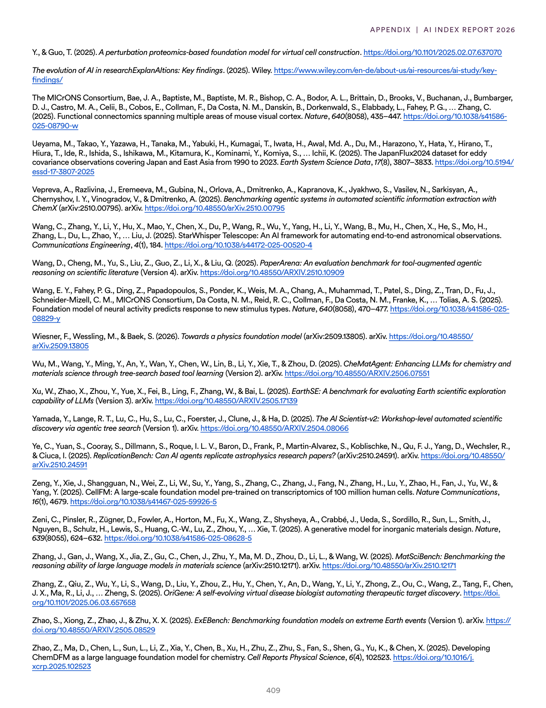
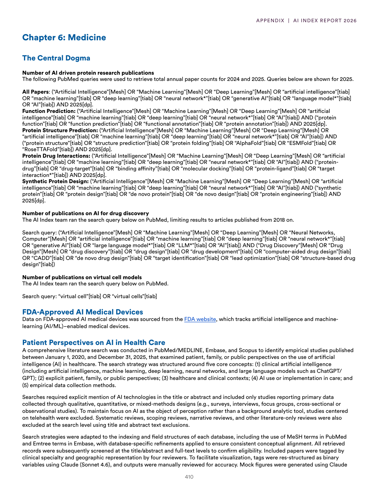
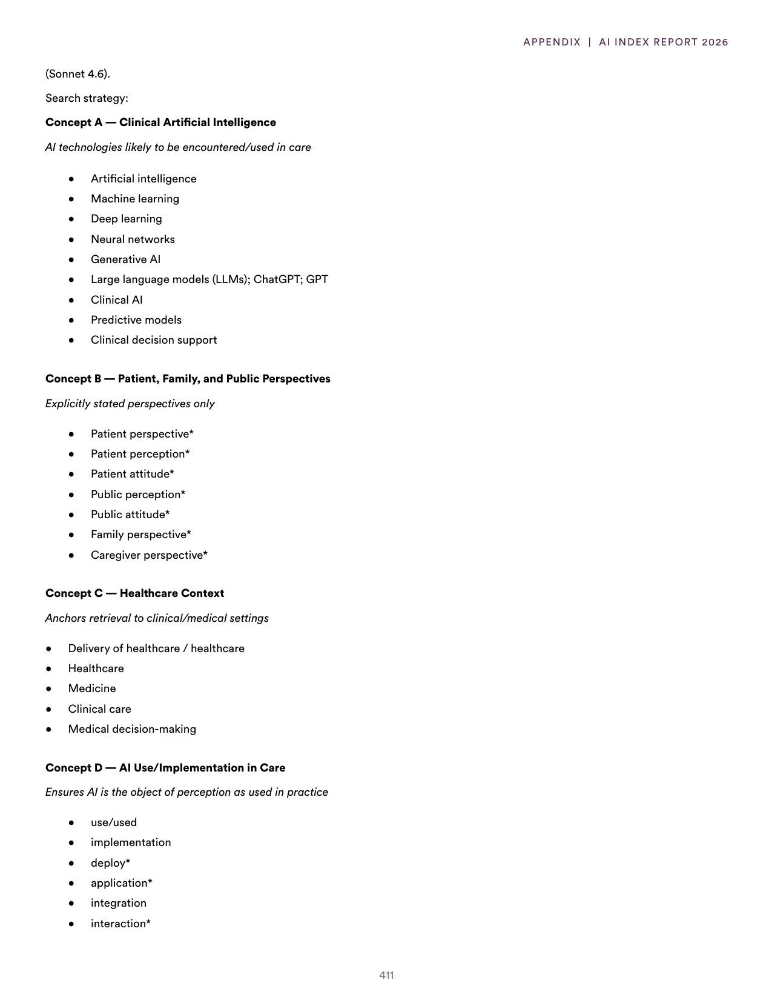
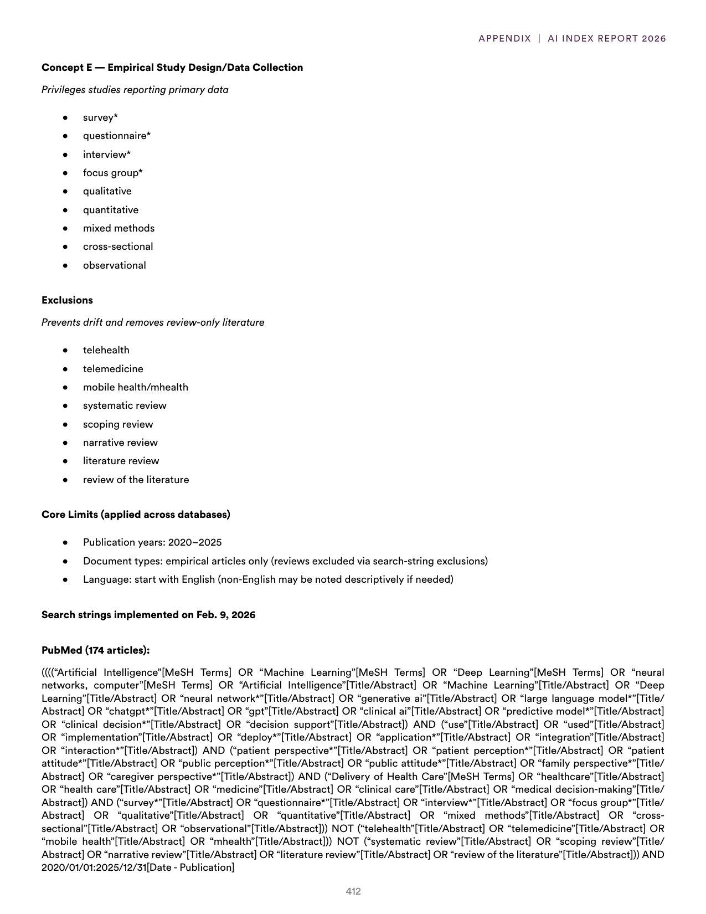
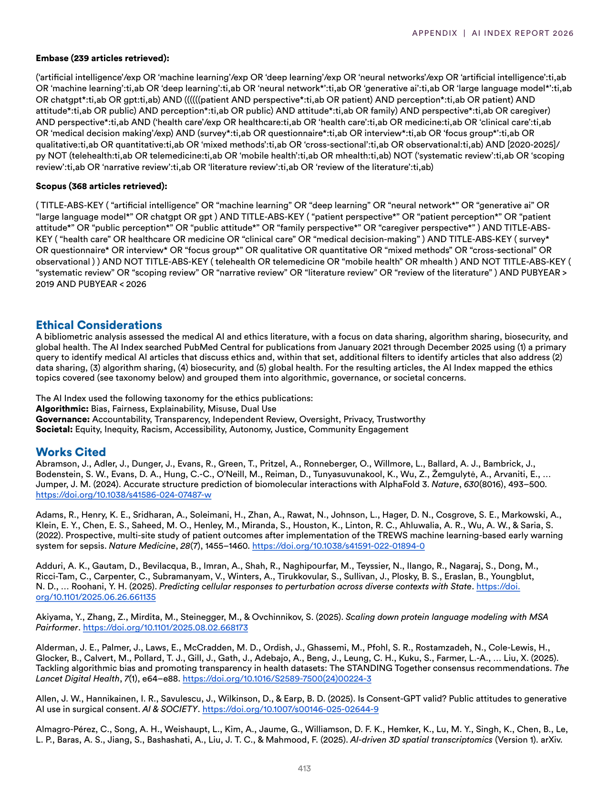
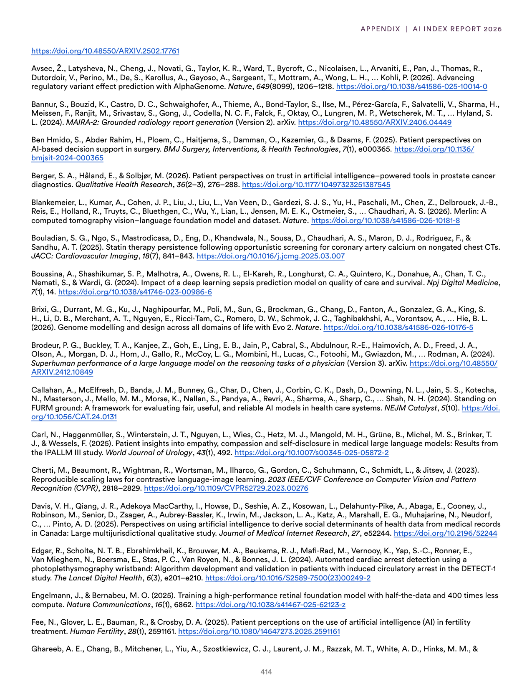
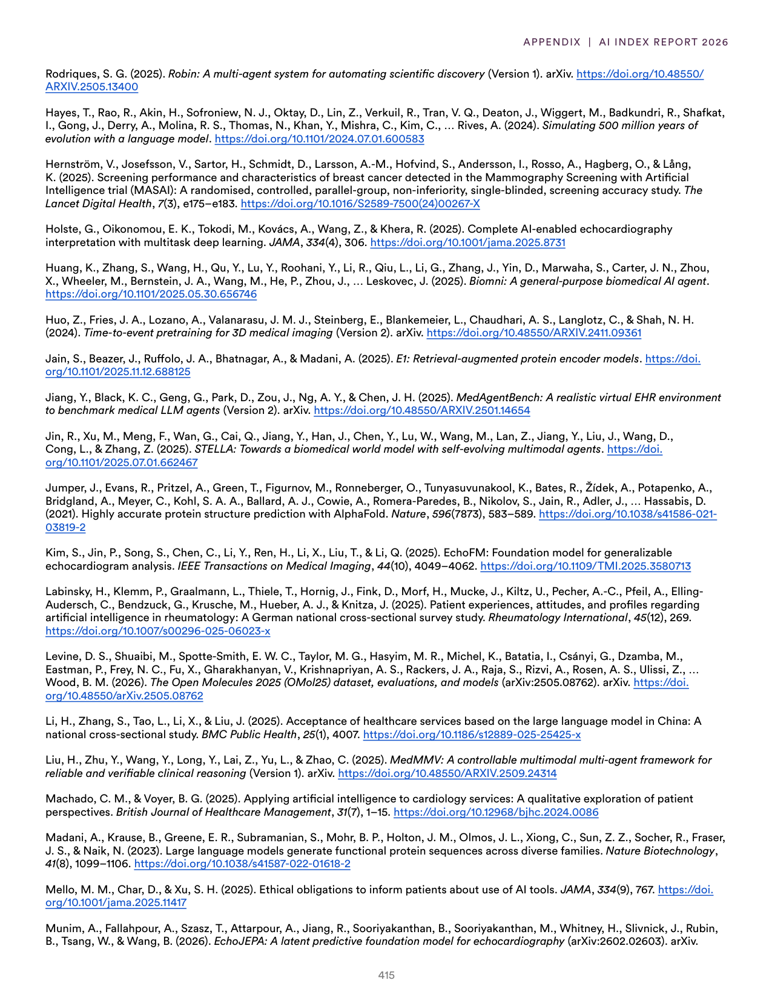

# ai_technical_evolution_and_impact

**Parent:** [[index]]

The provided text consists of a series of detailed reports and data regarding the state of AI development, specifically focusing on the technical and operational aspects of large-scale models and their deployment. 

Key highlights include:
- **Model Capabilities and Performance**: An analysis of how modern AI models handle complex reasoning and the transition from specific-task optimization to general-purpose utility. It details the use of 'Chain-of-Thought' prompting and reinforcement learning from human feedback (RLHF) to improve output quality.
- **Infrastructure and Scaling**: Discussion on the hardware requirements for training state-of-the-art models, emphasizing the role of GPU clusters (e.g., NVIDIA H100s) and the energy consumption associated with massive data centers.
- **Ethical and Safety Frameworks**: An overview of 'red-teaming' processes used to identify vulnerabilities and the implementation of safety guardrails to prevent the generation of harmful content.
- **Economic Impact**: An evaluation of how AI is integrating into professional workflows, which sectors are seeing the highest productivity gains, and the shift toward 'agentic' AI that can execute multi-step tasks independently.
- **Future Directions**: Predictions regarding the convergence of multimodal inputs (text, image, audio) and the potential for AI to accelerate scientific discovery in materials science and drug development.

## Source pages

