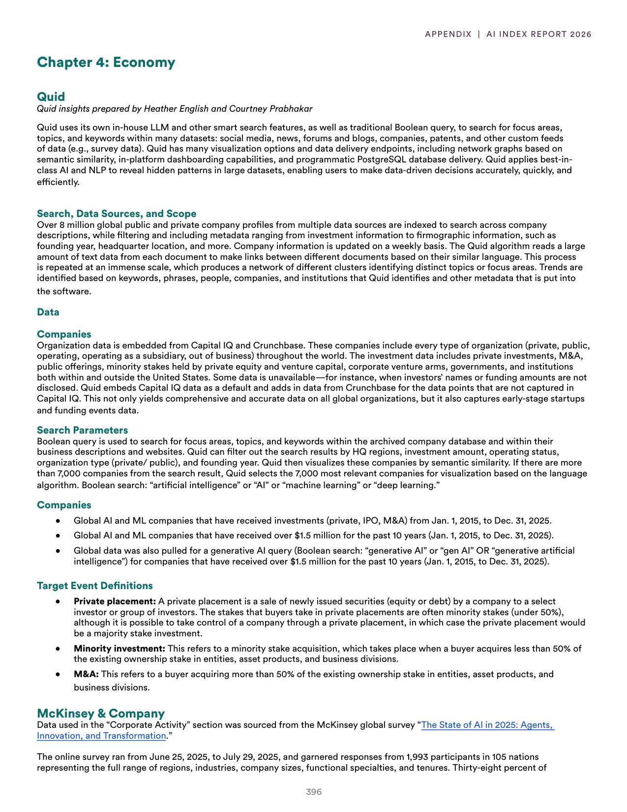
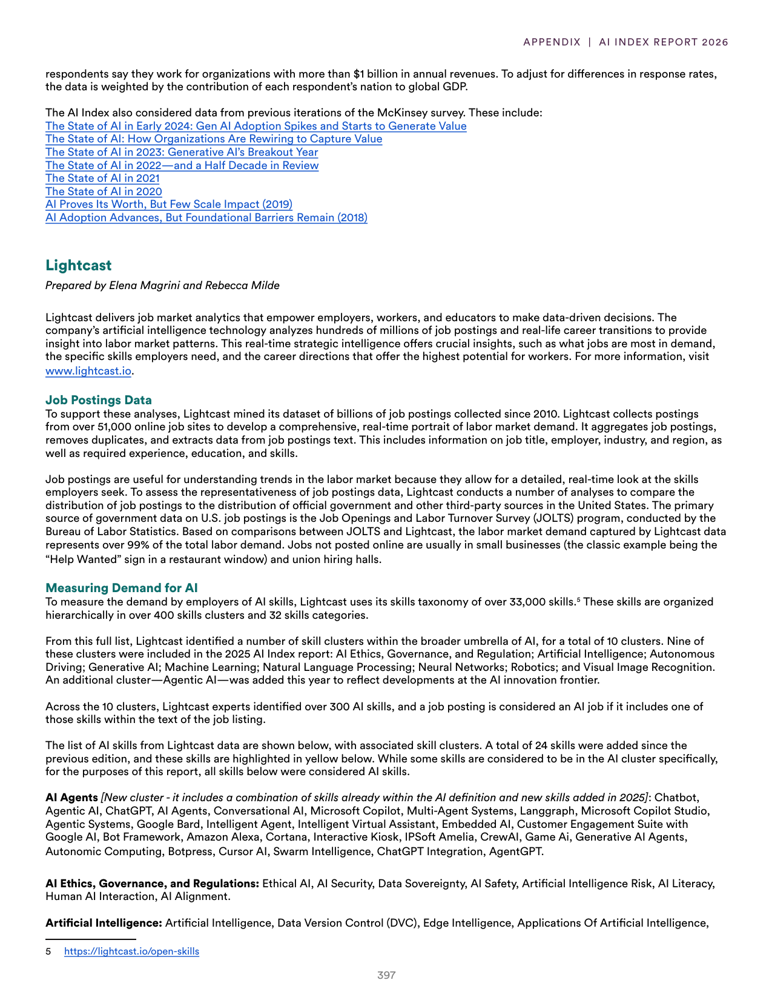
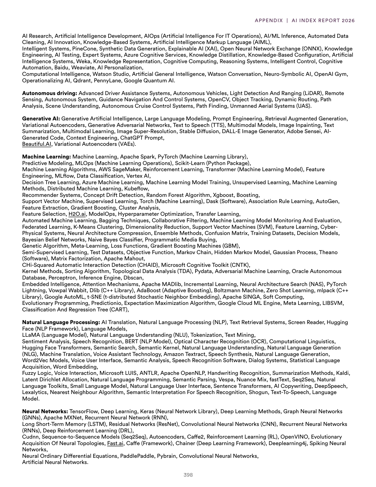
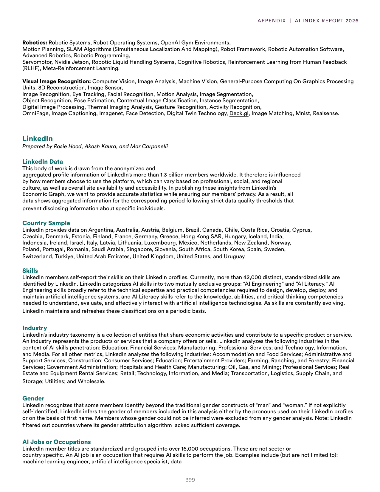
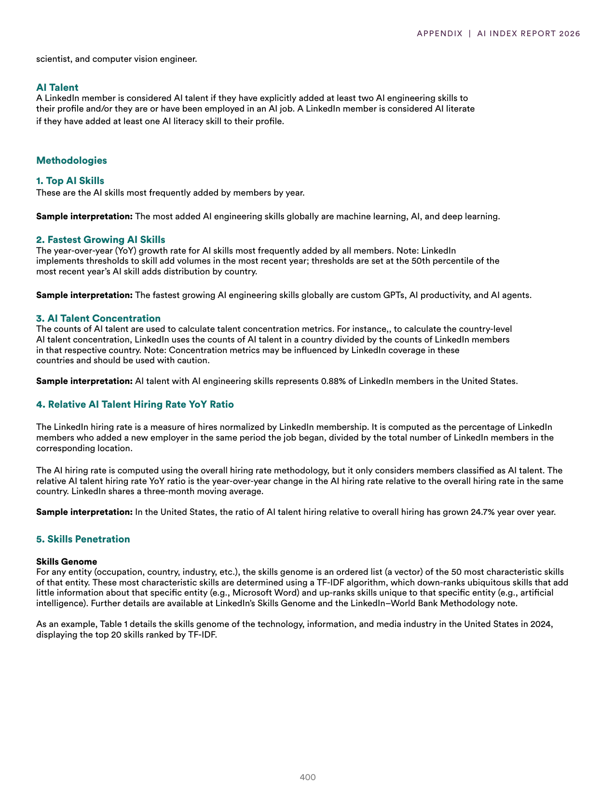
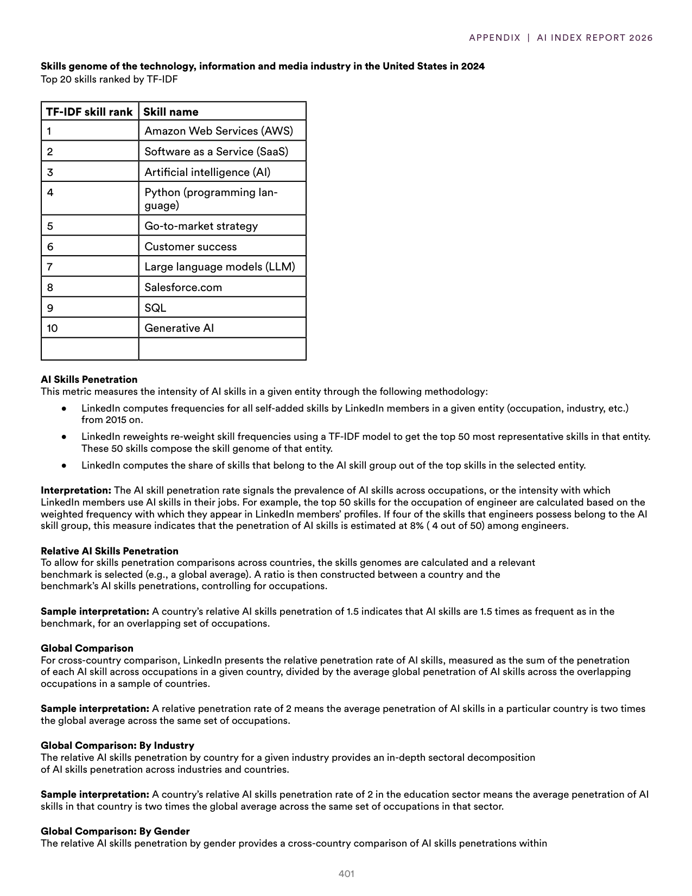
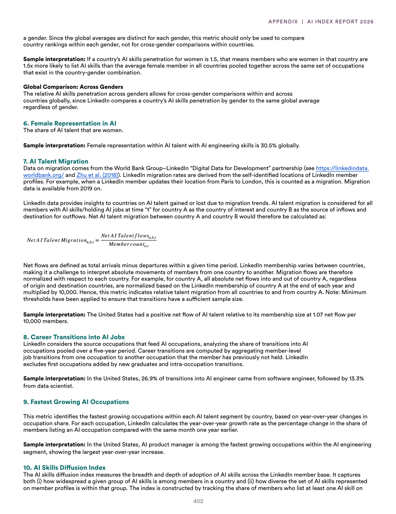

# ai_workforce_methodology

**Parent:** [[index]]

This section provides the methodology and definitions for assessing AI talent and workforce trends, primarily through the lens of LinkedIn data. The analysis focuses on 'AI talent' and 'AI workforce' using a combination of indicators, including job titles, skills listed in profiles, and educational backgrounds. Specifically, the 'AI workforce' is defined as individuals who possess a combination of AI-related skills and hold roles that utilize these skills. The 'AI talent' metric specifically identifies a subset of the workforce—those with high-demand AI skills who are likely to be targets for recruitment. The methodology utilizes a 'skill-based' approach to avoid the noise associated with generic job titles, ensuring that identified professionals actually possess the technical competencies required for AI tasks. Data is aggregated globally, with specific deep-dives into regional distributions and industry-specific concentrations. The analysis also tracks the evolution of these roles over time to identify emerging trends in AI specialization and the shift from general data science to specialized machine learning and generative AI roles.

## Source pages

