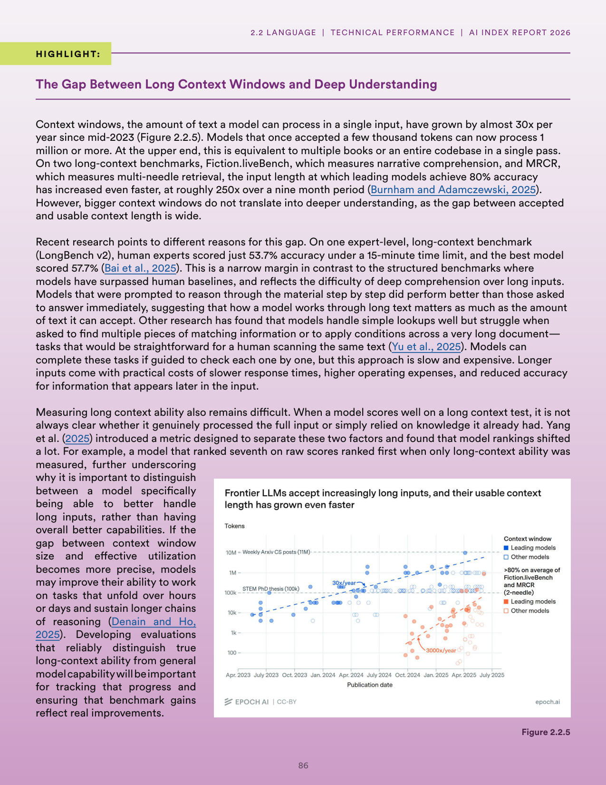
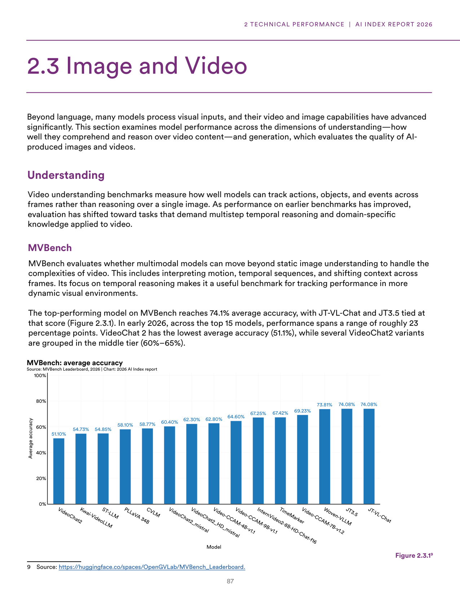
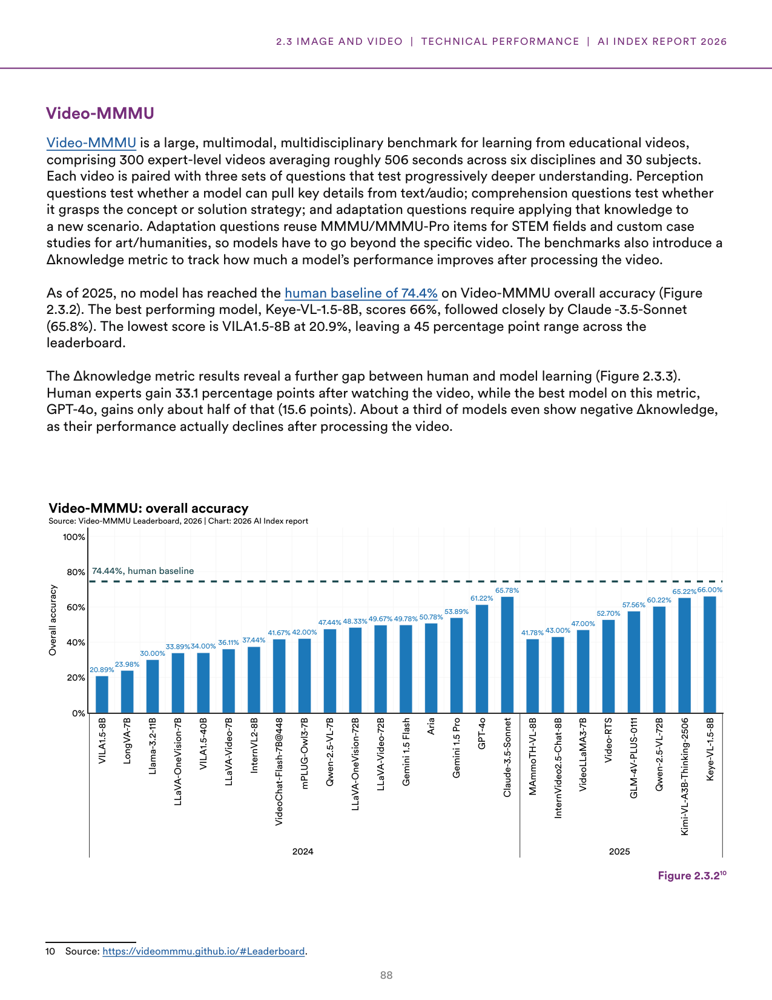
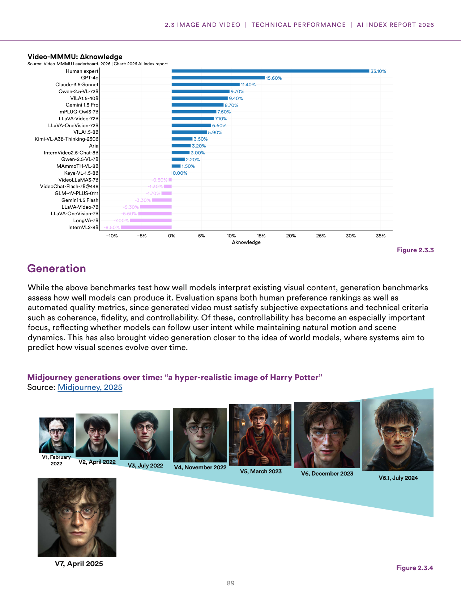
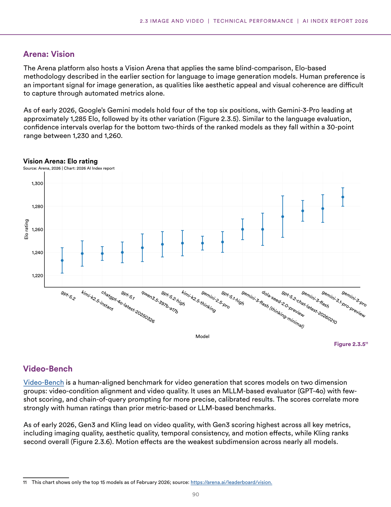
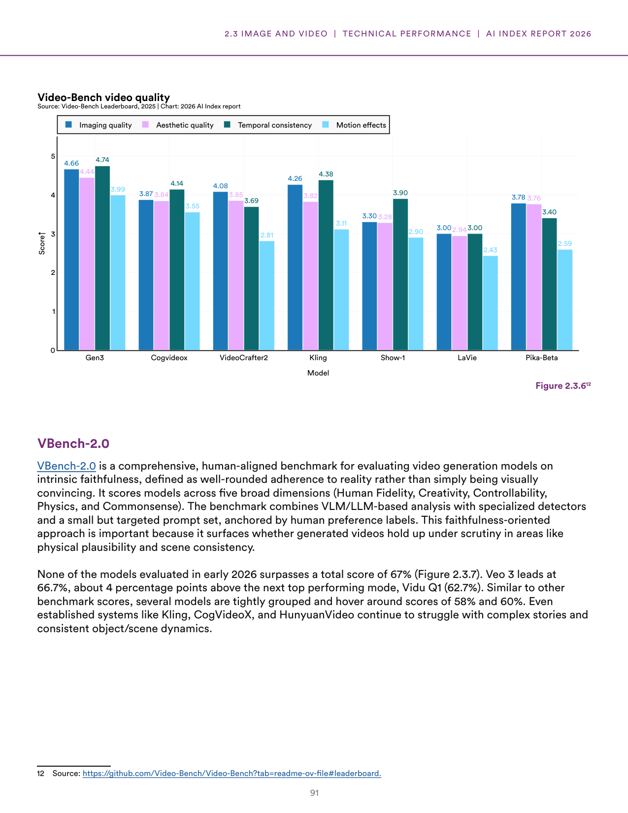
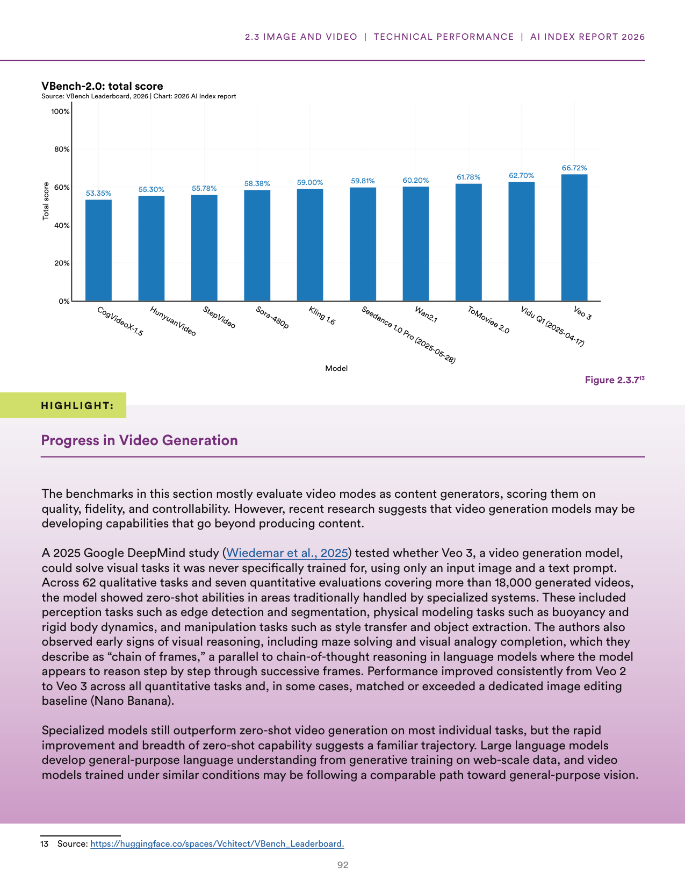

# ai_world_models_and_reasoning.txt

**Parent:** [[content/L1/ai-index-2026-performance-benchmarking|ai-index-2026-performance-benchmarking]] — As of March 2026, AI model performance has converged, with Anthropic leading the Arena Leaderboard at 1,503 Elo and Google's Gemini-3.1-Pro leading MMLU-Pro at 91.16%. Technical gaps between US and Chinese models have narrowed, with the top US model leading the top Chinese model (Dola-Seed-2.0 Preview, 1,464) by 39 points.

The 2025 AI landscape shows a divergence between the capabilities of language models and multimodal systems. In terms of language models, there is a noted gap between the capacity of models and their actual performance in specialized tasks. Regarding multimodal AI, the industry is shifting toward 'World Models'—systems trained on massive video datasets to understand physical laws and spatial relationships. This transition is exemplified by models that can predict future frames in a video or simulate physical interactions, moving beyond mere pattern recognition to a more functional understanding of the physical world. However, these systems still struggle with 'causal reasoning' (understanding why things happen) compared to 'predictive reasoning' (predicting what happens next), which remains a primary hurdle for achieving a truly autonomous AI agent capable of complex planning in real-world environments.

## Source pages

