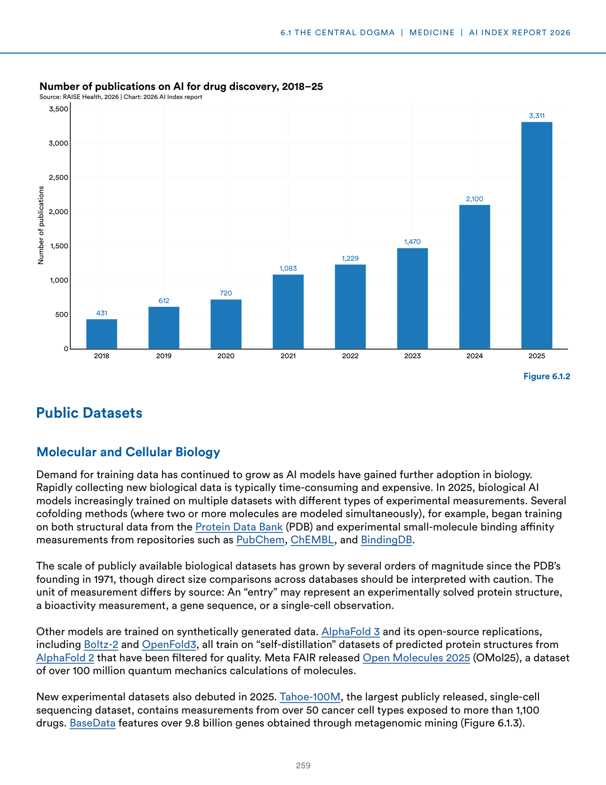
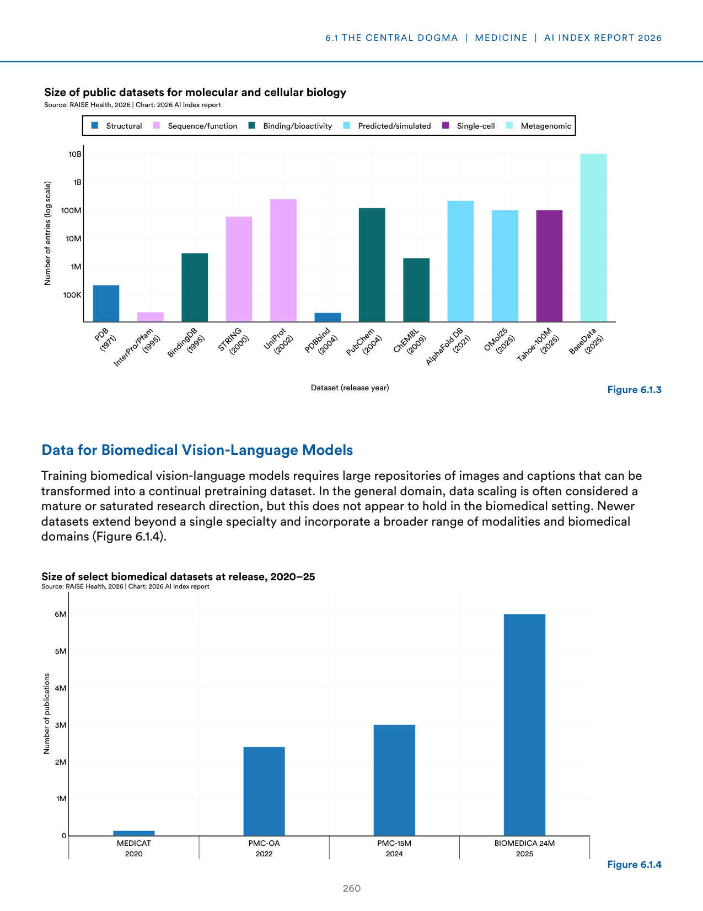
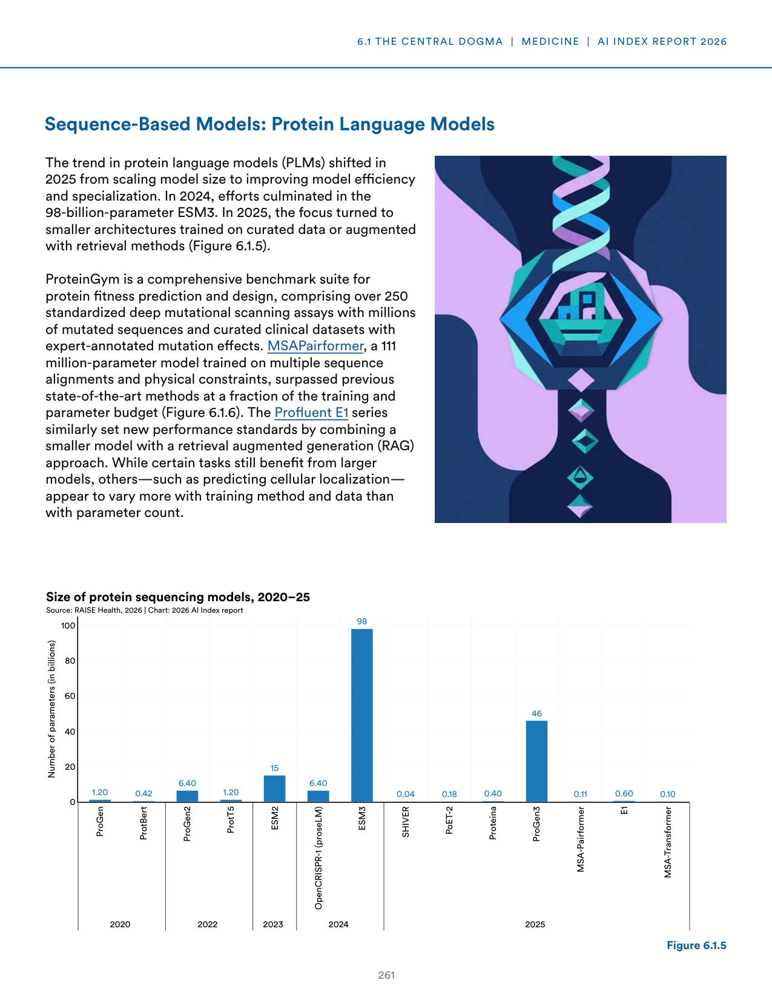
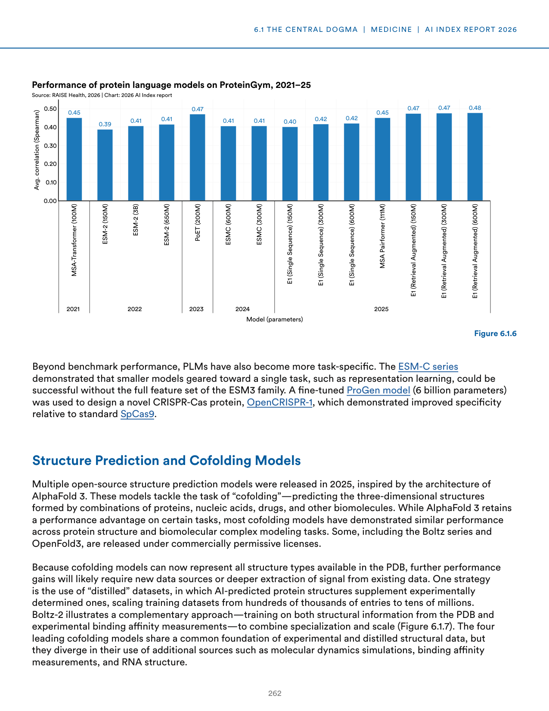
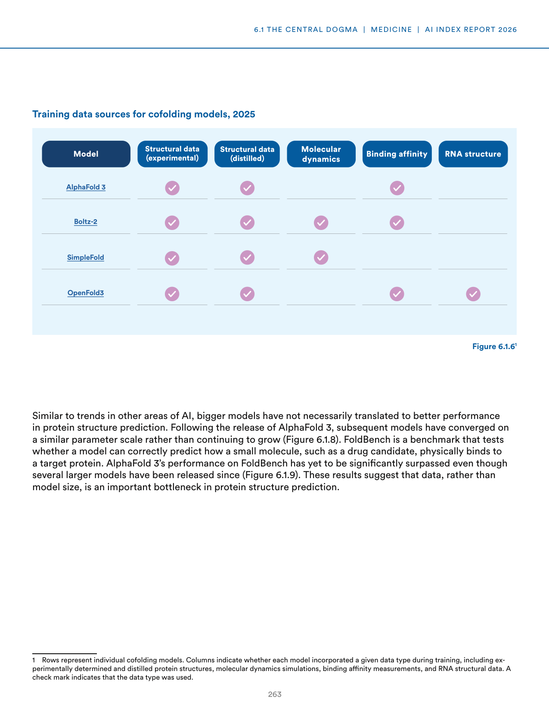
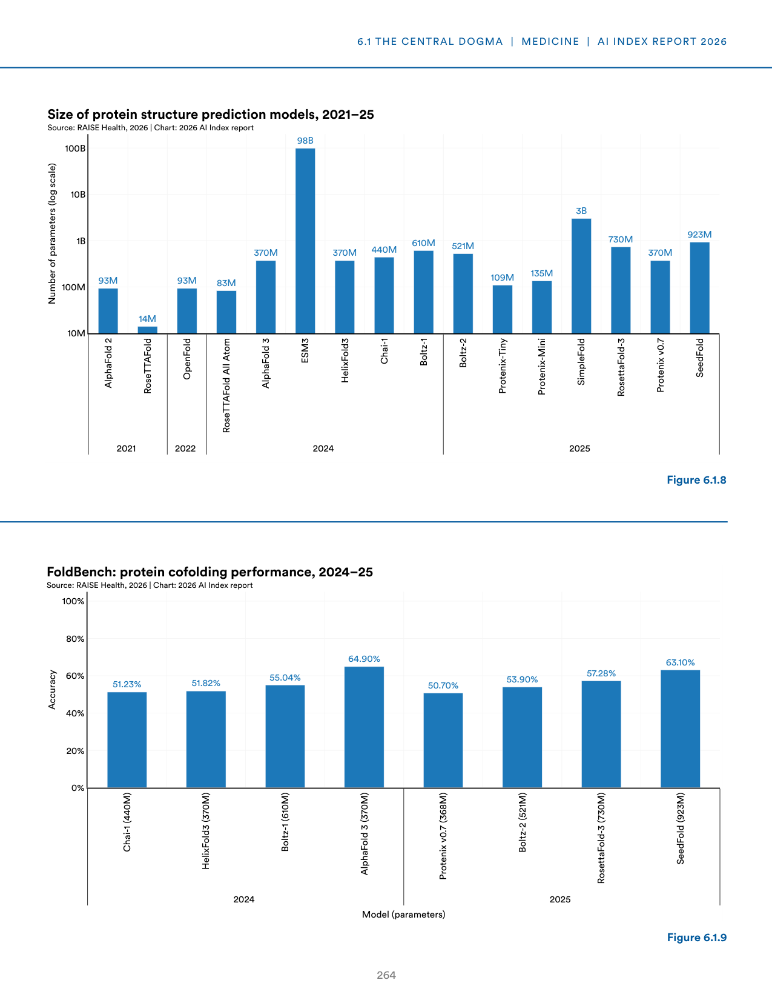
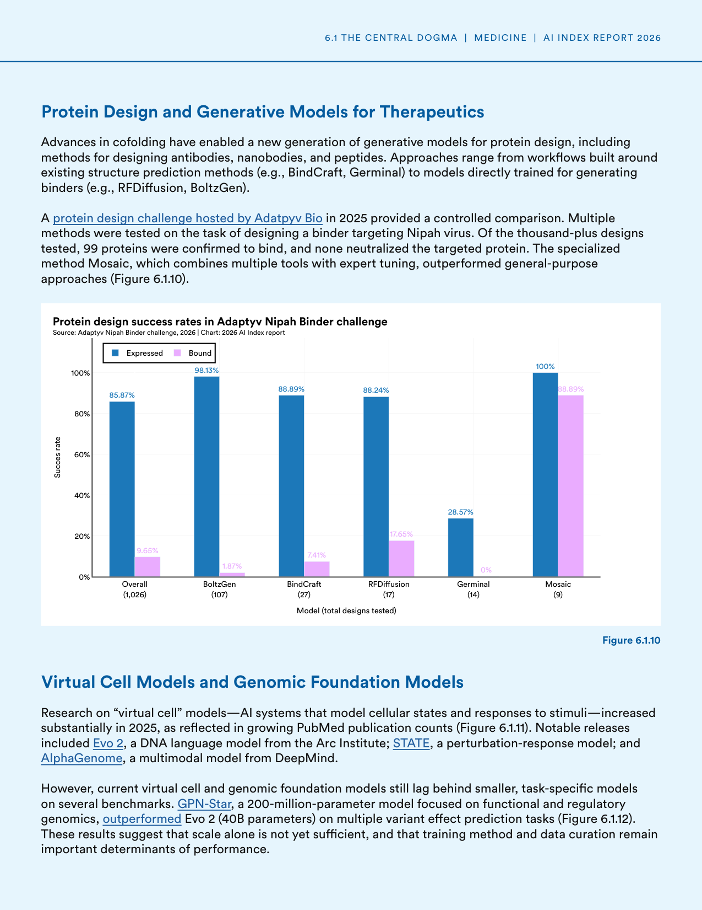
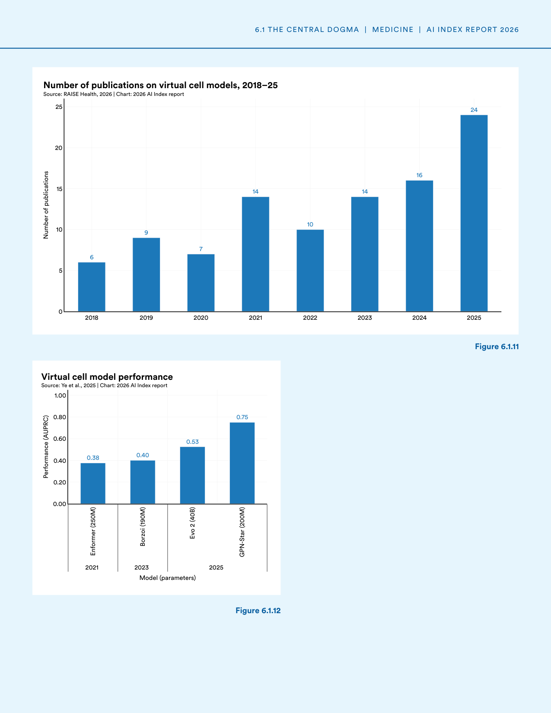
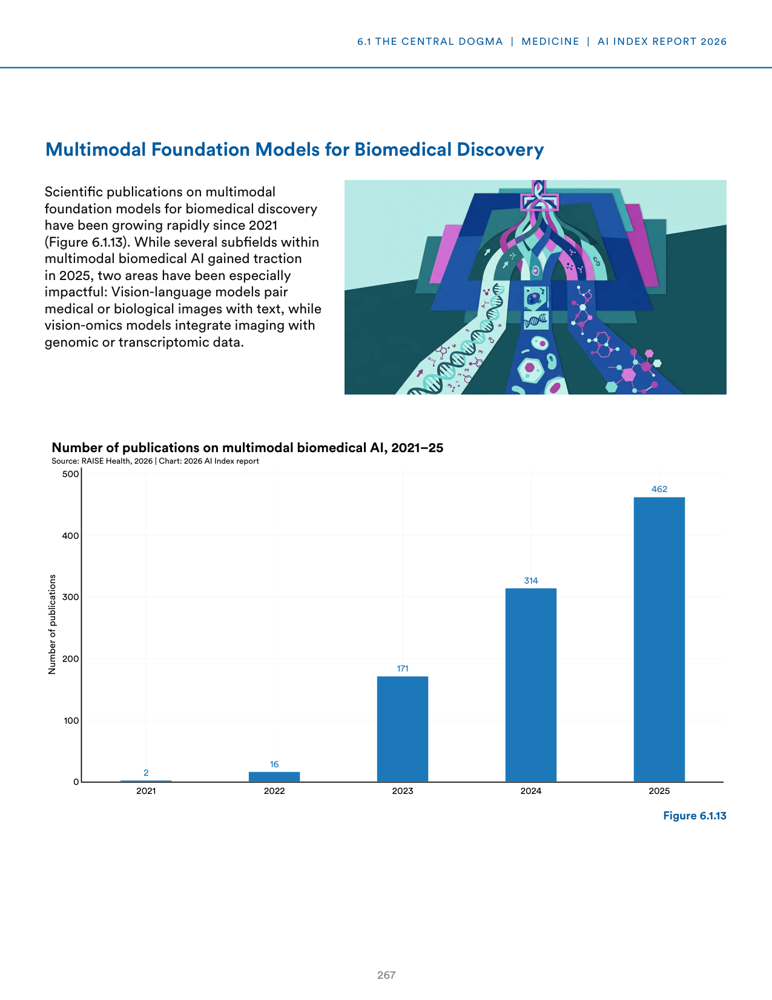
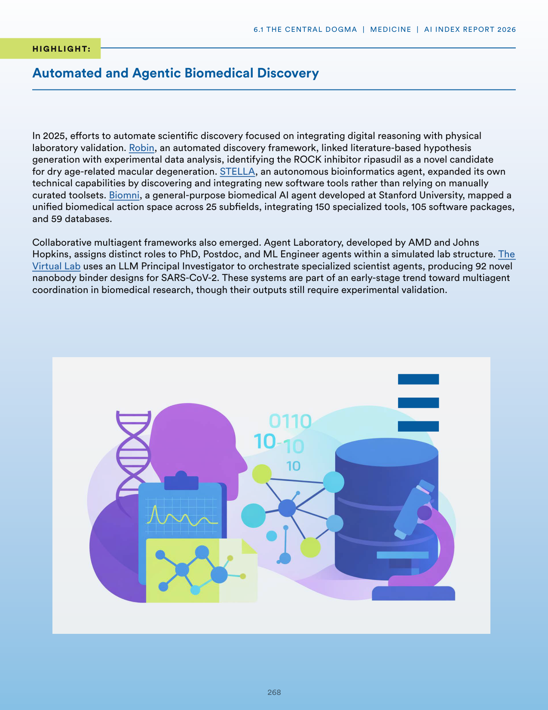

# biomedical_ai_discovery_trends

**Parent:** [[content/L1/ai-for-science-applications-2025|ai-for-science-applications-2025]] — AI in 2025 is shifting toward 'AI4Science,' utilizing closed-loop 'predict-synthesize-test-analyze' systems with lab-on-a-chip robotics to accelerate drug discovery, while applying geometric deep learning for 3D molecular modeling and machine learning emulators for high-resolution climate projections.

In the field of biomedical AI, there is a growing trend toward integrating multimodal data and automating discovery. Recent developments highlight a shift toward specialized model architectures for biological data. For instance, the use of multimodal models (combining text, image, and genomic data) has improved the ability to predict protein functions and drug-target interactions. In terms of automation, the emergence of 'AI scientists'—agents capable of hypothesis generation and experimental design—has accelerated the discovery of new materials and molecules. Specifically, the integration of LLMs with robotics (lab-on-a-chip systems) allows for a closed-loop cycle of 'predict-synthesize-test-analyze,' significantly reducing the time required for lead optimization in drug discovery compared to traditional manual methods. Furthermore, the application of geometric deep learning (GDL) has enabled better modeling of 3D molecular structures, which is critical for understanding how small molecules bind to proteins, thereby improving the accuracy of virtual screening processes.

## Source pages

