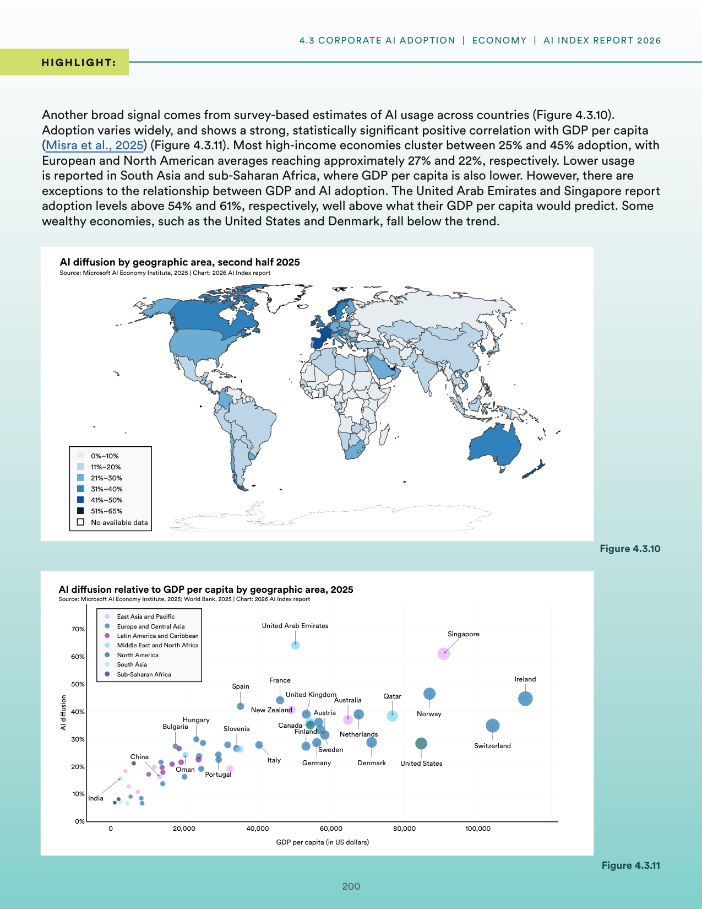
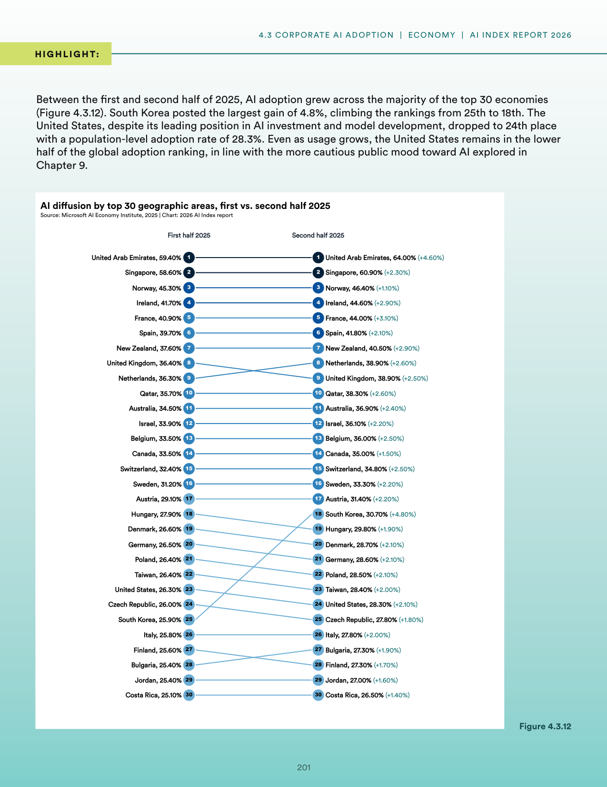
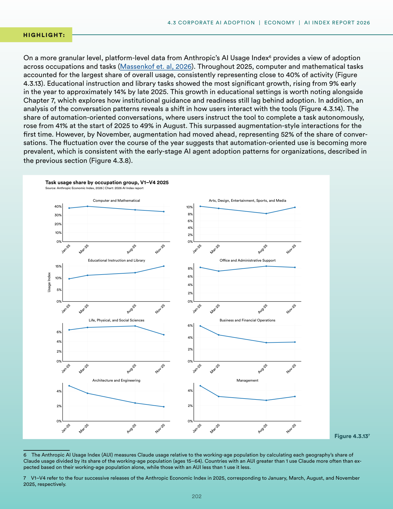
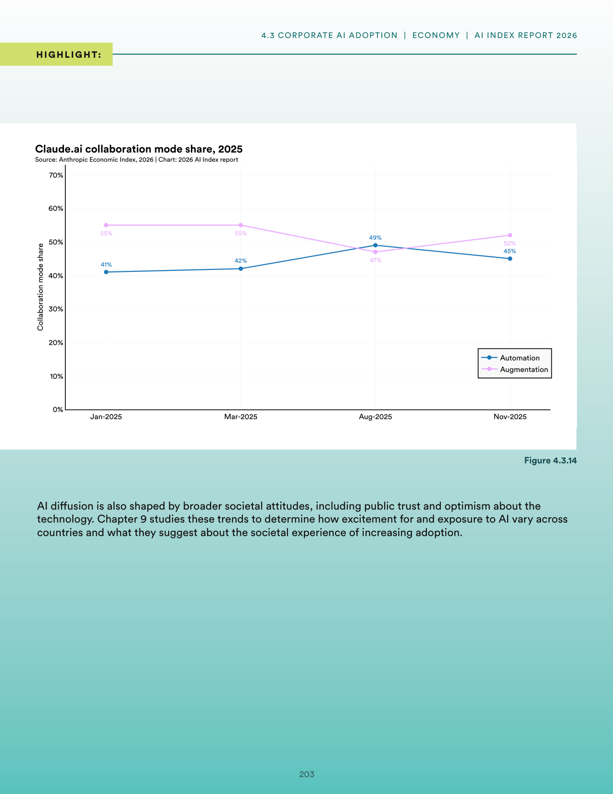
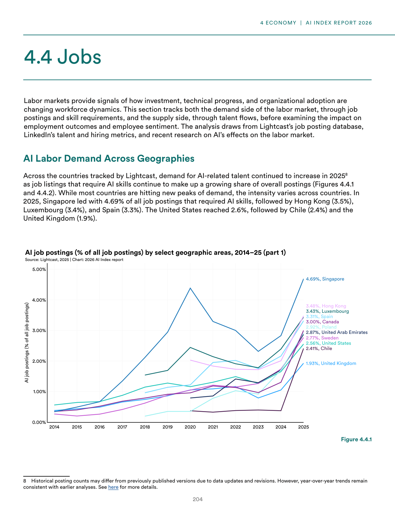
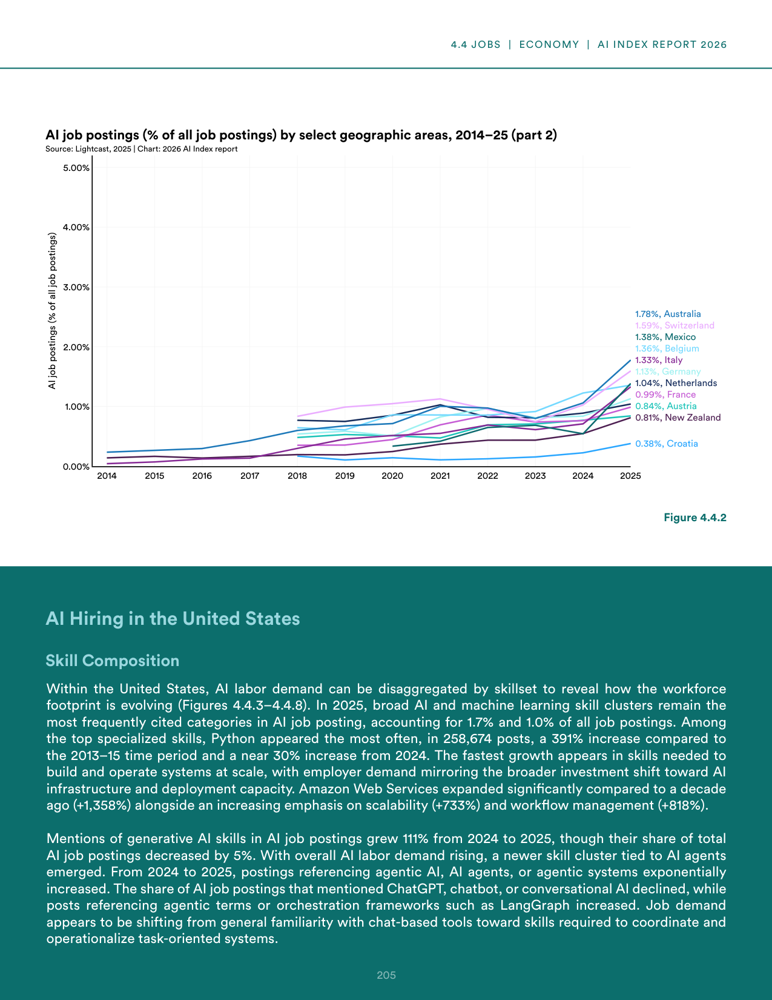
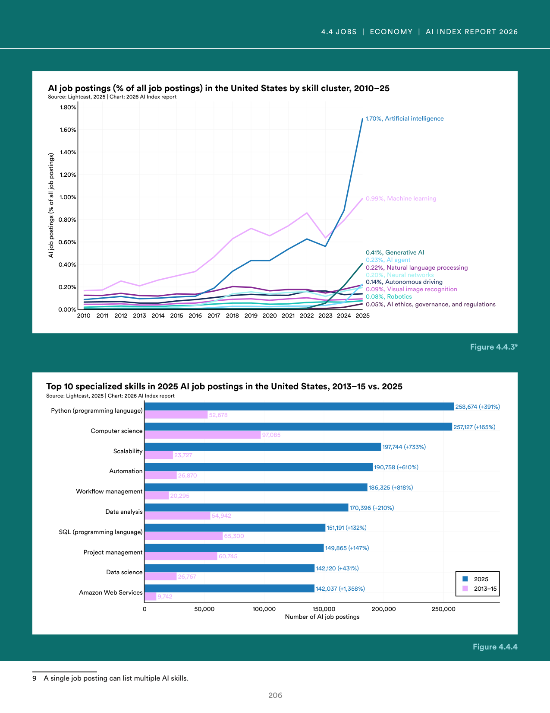
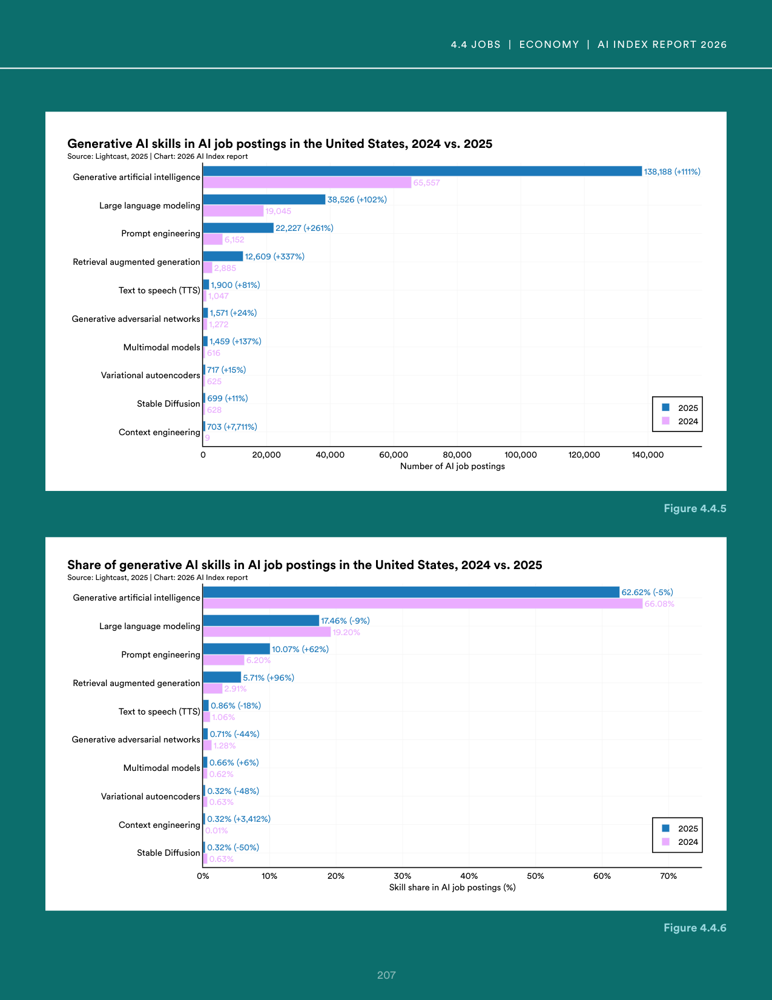

# error_handling_response.json

**Parent:** [[content/L1/ai-ecosystem-2025-economics-safety-labor|ai-ecosystem-2025-economics-safety-labor]] — The 2025 AI landscape is characterized by technical tensions between capability and safety, a US-led concentration of capital in vertical AI, and a 'productivity paradox' where corporate AI investment has not yet yielded macroeconomic productivity gains, while the US labor market sees a sharp rise in demand for specialized AI/ML production skills over general data analysis.

The user is reporting a system error ('NoneType' object has no attribute 'model_dump') and is requesting a valid JSON response that matches a specific (though currently unspecified) schema. This indicates a previous interaction failed due to a Python-related crash in the last response generation process, likely during a model's internal data structure conversion to JSON.

## Source pages

