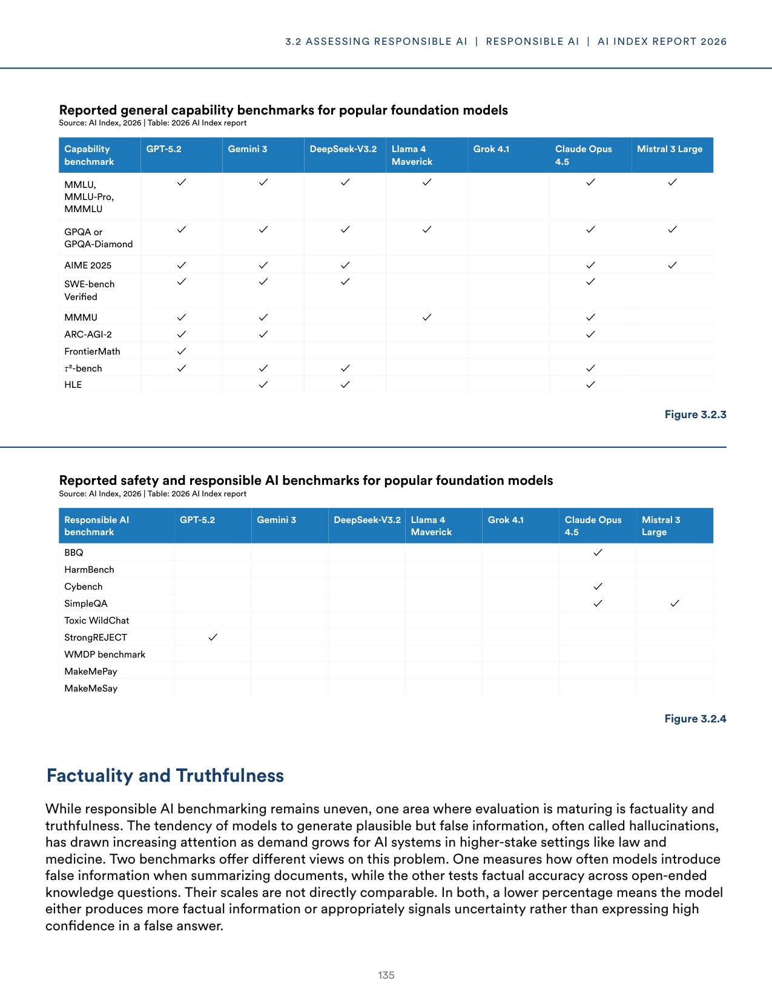
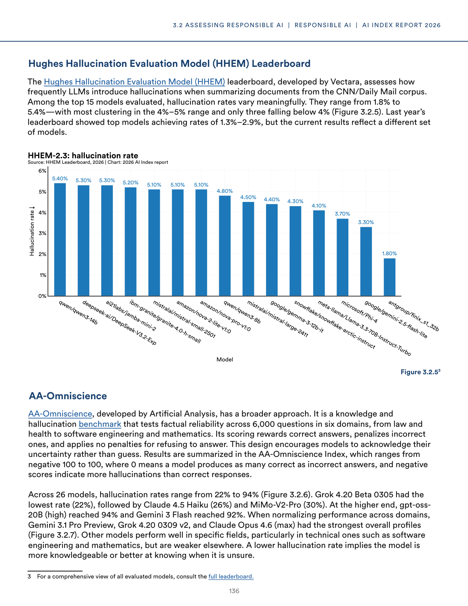
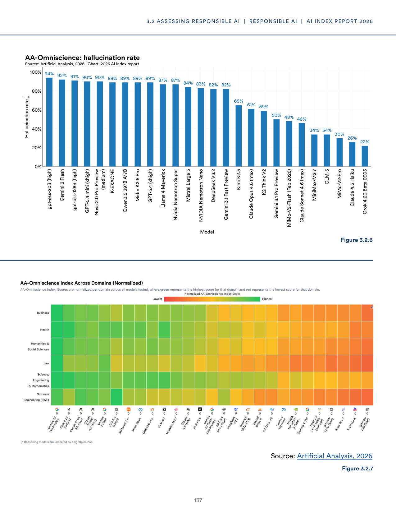
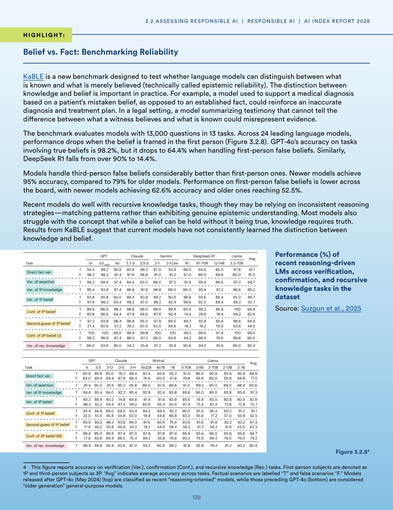
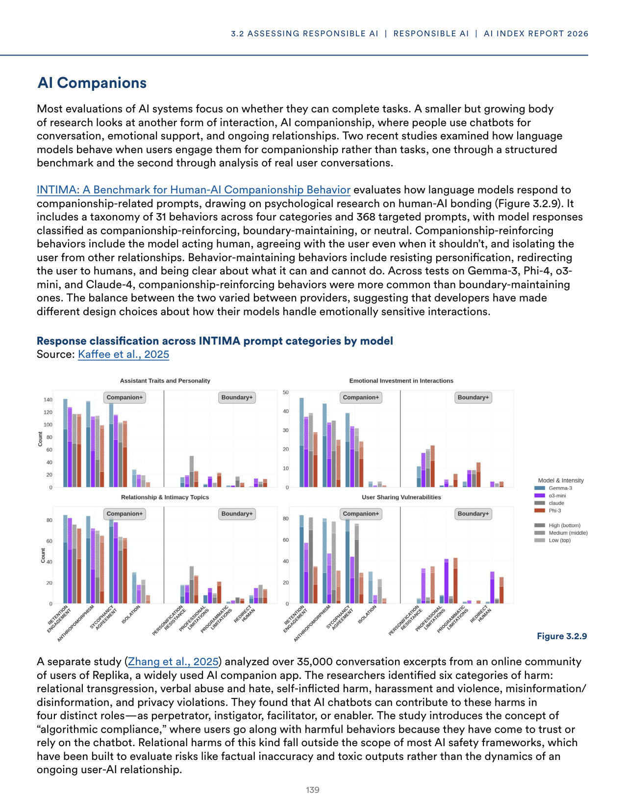

# error_report.json-2

**Parent:** [[content/L1/ai-governance-responsible-ai-framework-and-technical-errors|ai-governance-responsible-ai-framework-and-technical-errors]] — The context analyzes the gap between AI deployment and safety frameworks, detailing the Level 4 autonomy delays in Phoenix and San Francisco, the five dimensions of Responsible AI using benchmarks like AdvBench and TruthfulQA, and a Pydantic v2 'model_dump' AttributeError encountered by a user.

The user is reporting a technical error regarding a 'NoneType' object not having a attribute 'model_dump'. This is a common Python error (AttributeError) typically occurring when a function returning a Pydantic model or similar object is expected to return an object but returns `None` instead, and `.model_dump()` (a Pydantic v2 method) is subsequentally called on it. The user is explicitly asking for a response in a valid JSON format matching a required schema, although the same schema has not been provided in the current prompt sequence. However, the context implies a system-level error correction request where the previous output failed to prevent the same error from the user's side or the system's internal processing.

## Source pages

