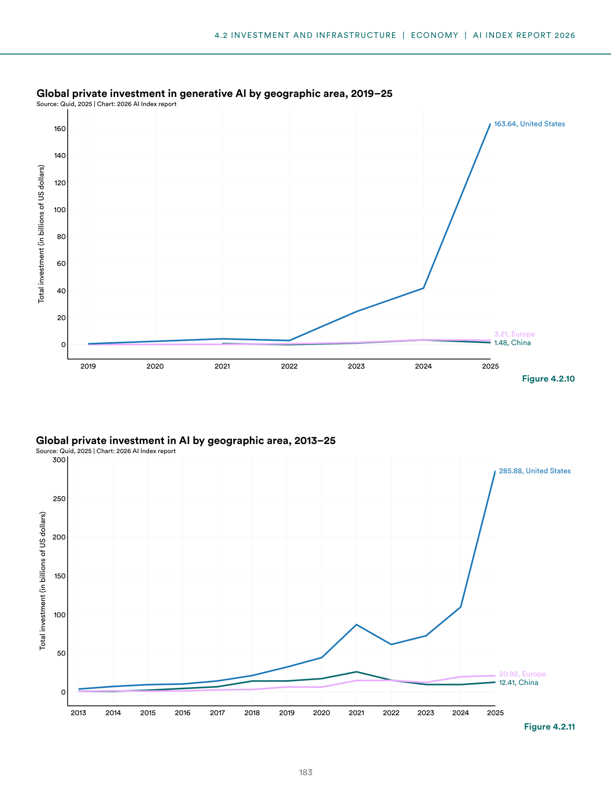
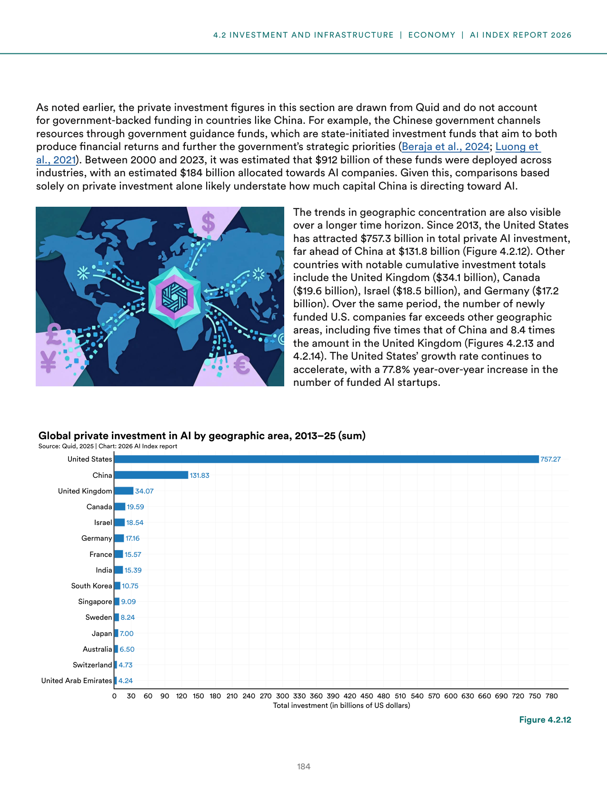
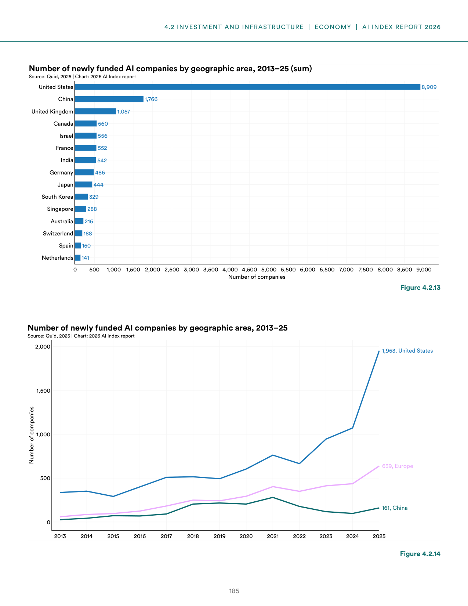
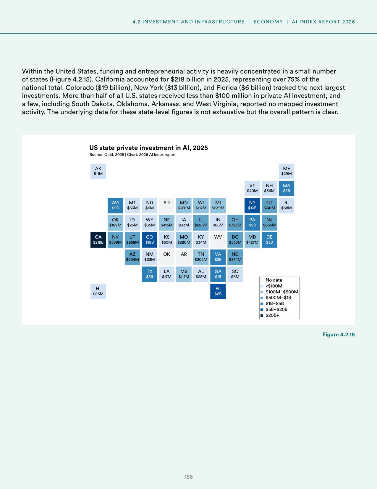
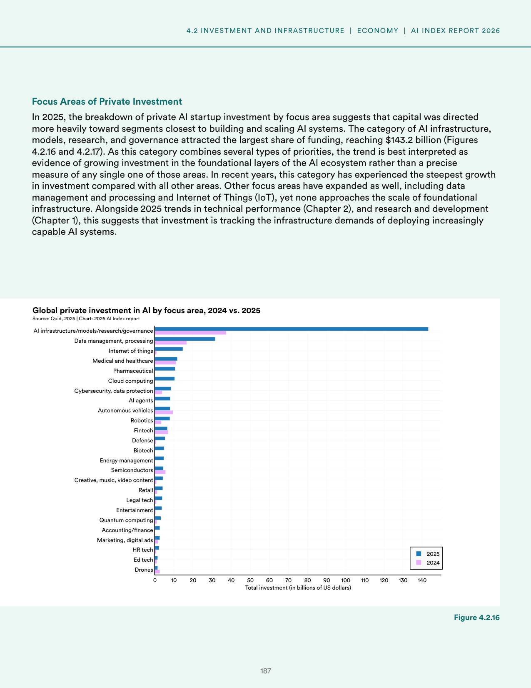
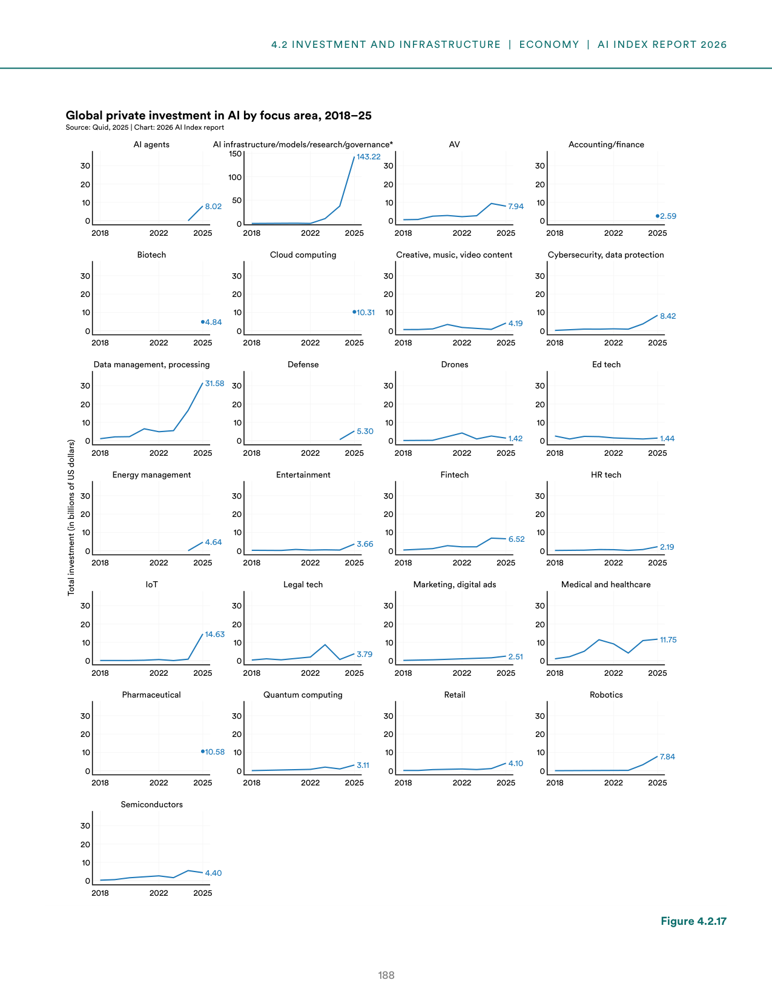
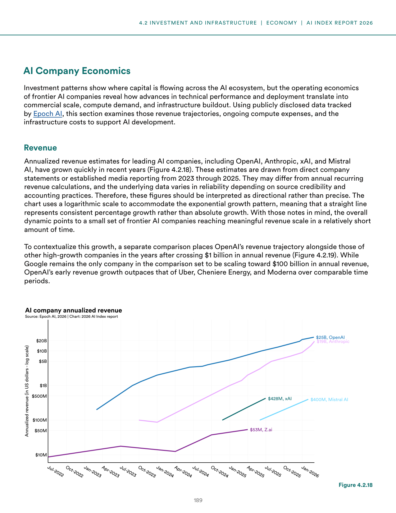
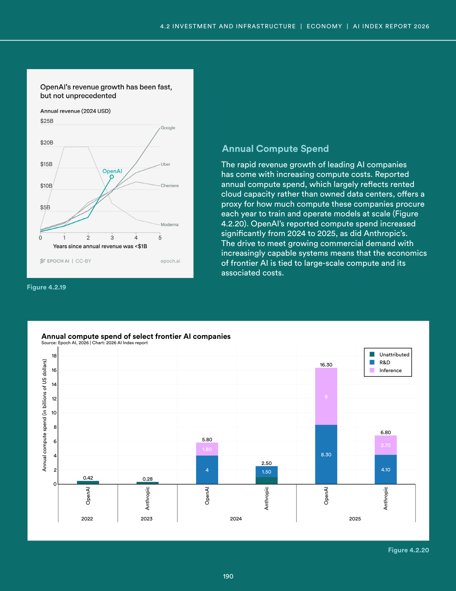
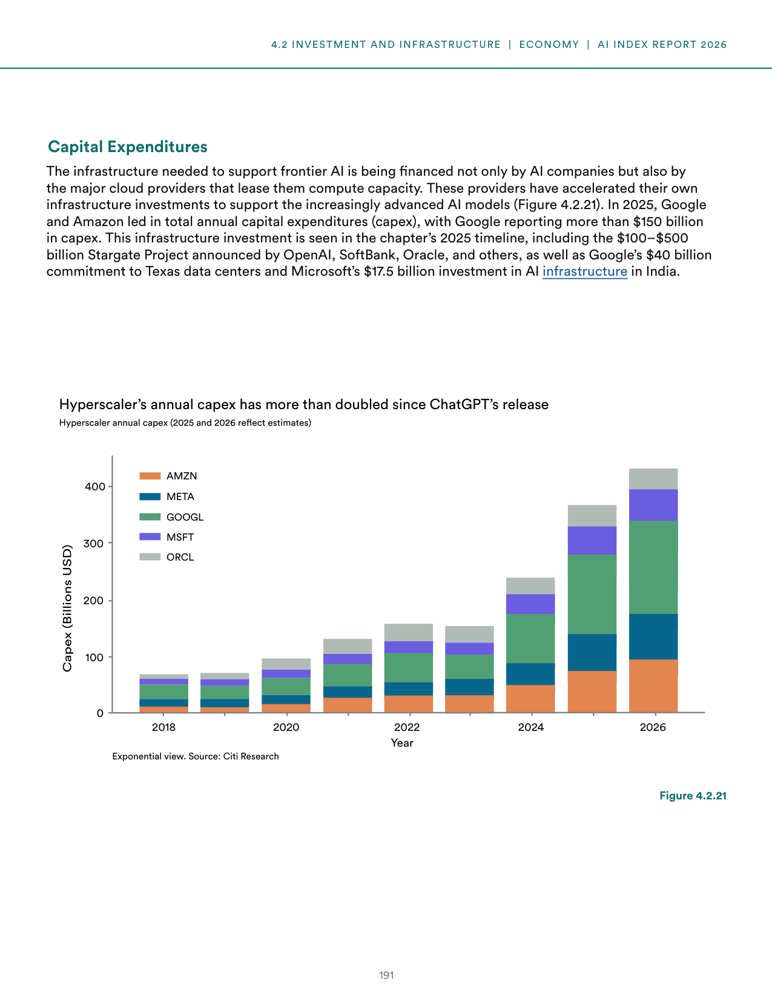

# error_report.json-3

**Parent:** [[content/L1/ai-safety-economics-and-system-errors|ai-safety-economics-and-system-errors]] — The AI landscape in 2025 is defined by technical challenges like sycophancy and the trade-off between safety and capabilities, US-led dominance in AI unicorns and funding for vertical AI in healthcare, law, and finance, and a system error ('NoneType' object has no attribute 'model_dump') occurring in Pydantic-based JSON validation.

The user is reporting a technical error ('NoneType' object has no attribute 'model_dump') and is requesting a valid JSON response matching a required schema. This suggests the user is interacting with an LLM via an API or a structured output system that expects a specific JSON format, and the previous output failed validation because the same internal logic encountered a None object when attempting to call `model_dump` (likely a Pydantic model).

## Source pages

