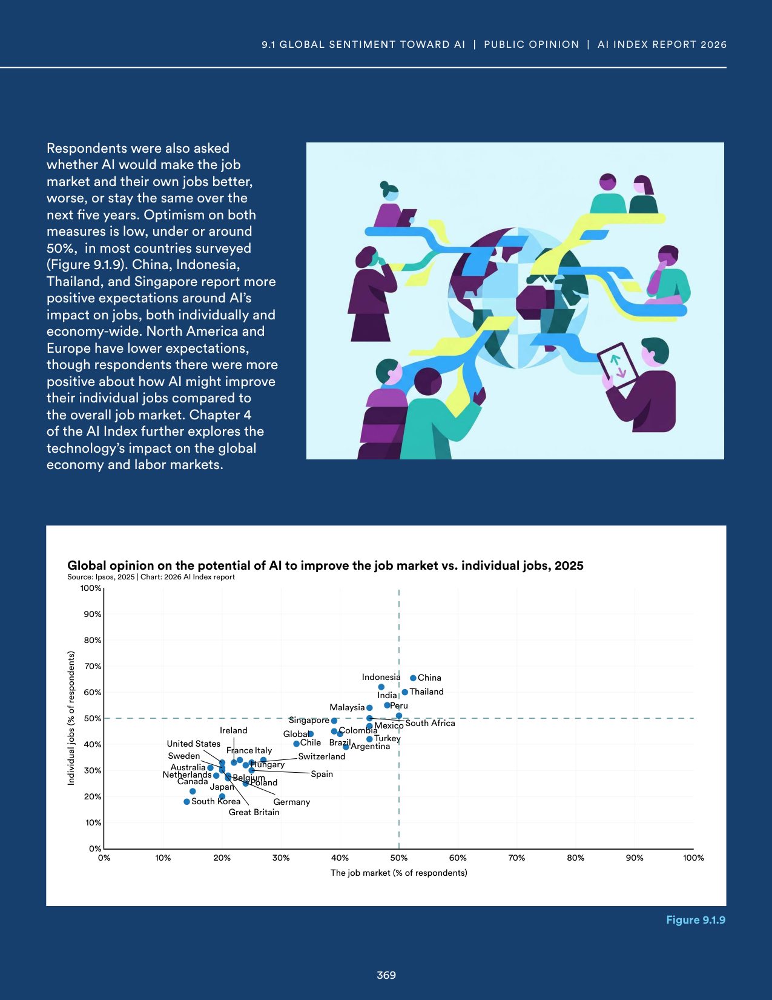
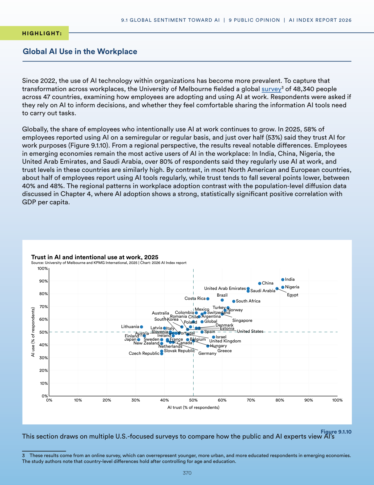
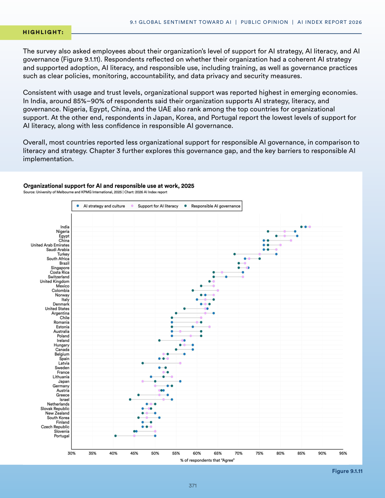
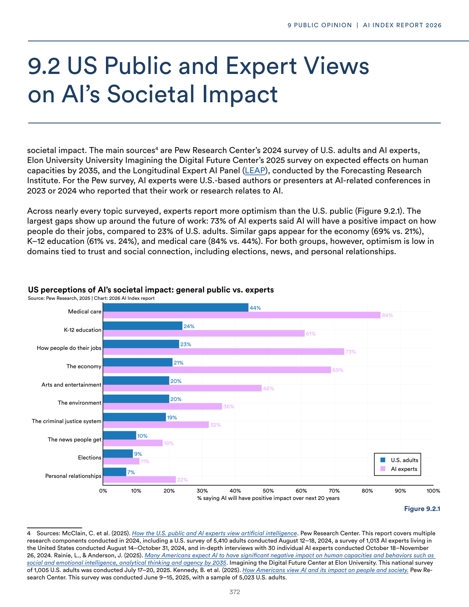
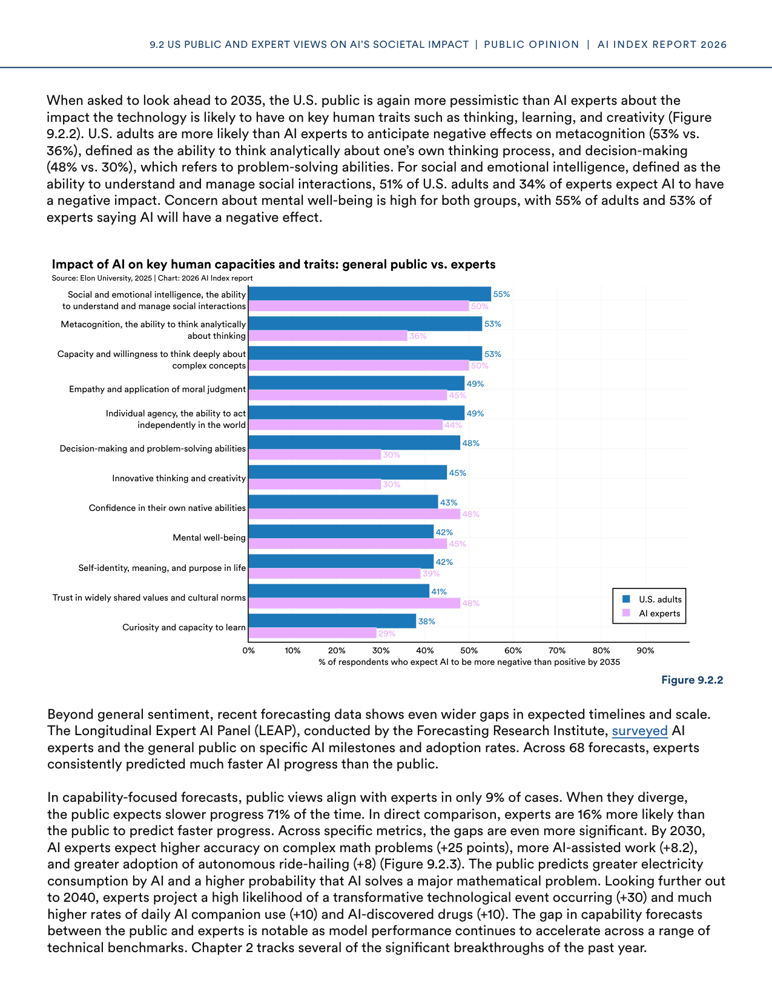
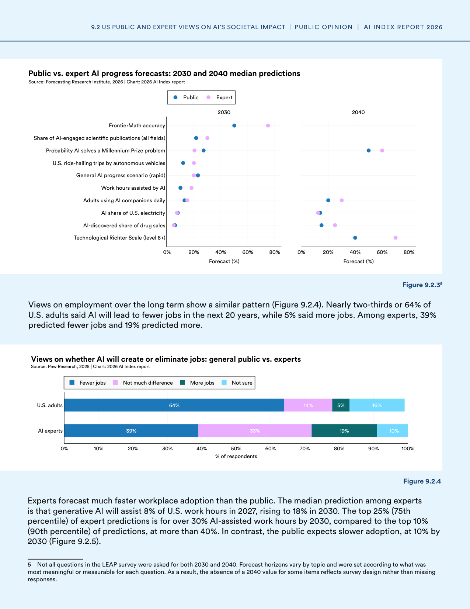
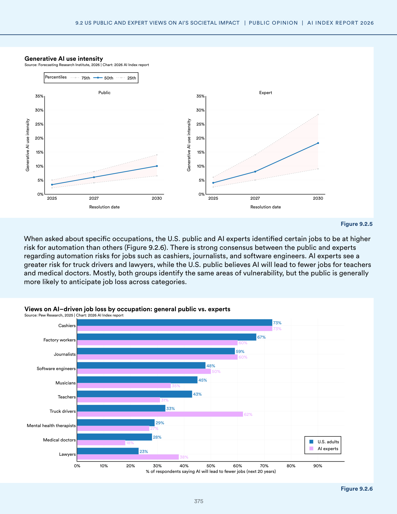

# error_report.json-4

**Parent:** [[content/L1/ai-landscape-governance-and-funding|ai-landscape-governance-and-funding]] — This comprehensive context synthesizes the AI landscape in 2025, detailing the balance between capabilities and safety, the U.S. dominance in private and public sector funding (using grants, contracts, and loans between 2014-2024), and the regional differences in public sentiment and RAI framework maturity scores (rising from 2.5 to 2.8).

The user is reporting a technical error ('NoneType' object has no attribute 'model_dump') and requesting a valid JSON response matching a required schema. This error typically occurs in Python/Pydantic when a function returns `None` instead of a model instance, and the subsequently called `.model_dump()` method is called on that `None` object.

## Source pages

