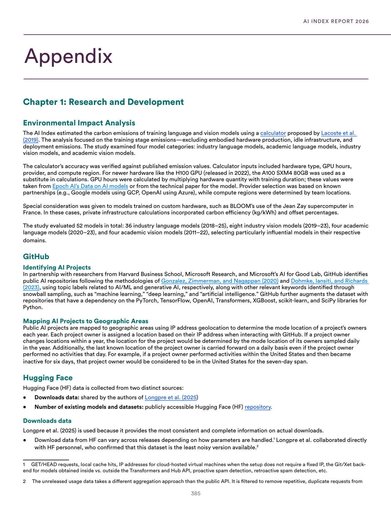
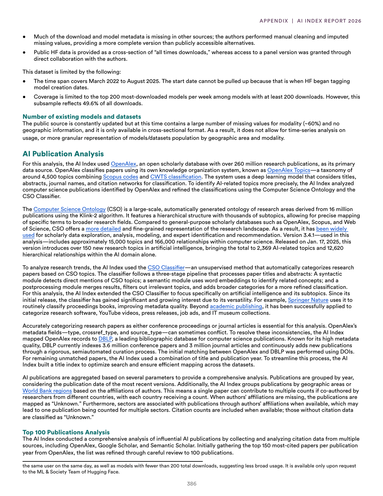
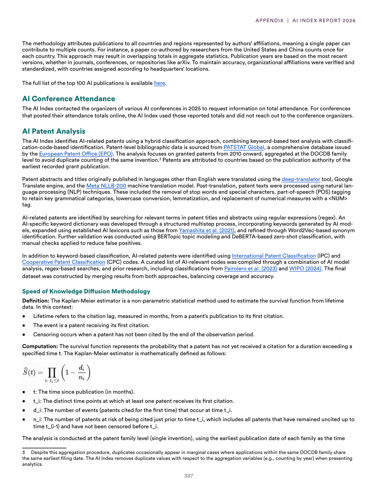
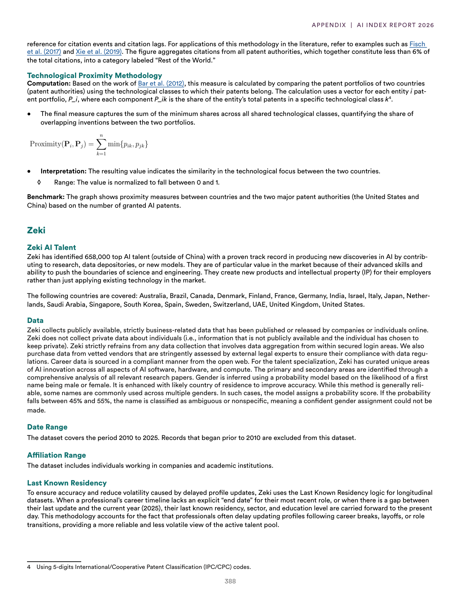

# error_report.json-5

**Parent:** [[content/L1/ai-landscape-2025-technical-governance|ai-landscape-2025-technical-governance]] — The 2025 AI landscape is defined by the interplay of high US capital concentration in vertical AI, an increase in RAI framework maturity (from 2.5 to 2.8), and a widespread perception among US demographics (especially older and college-educated individuals) that government regulation is insufficient.

The user is reporting a technical error ('NoneType' object has no attribute 'model_dump') and requesting a valid JSON response matching a required schema. This indicates a previous system failure where a function call or a model output was not properly handled, causing a Python error in the mid-layer.

## Source pages

