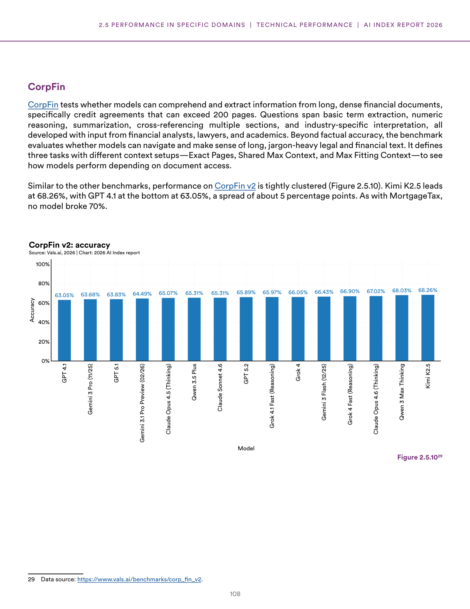
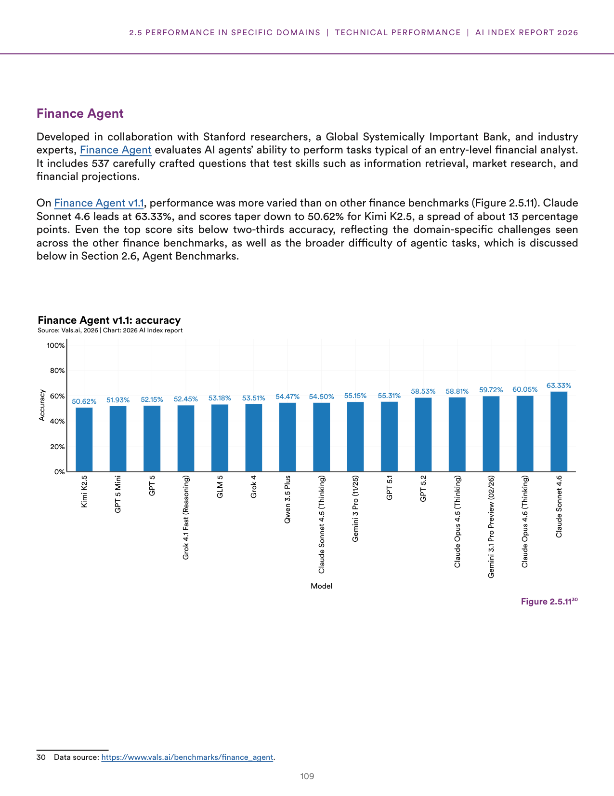
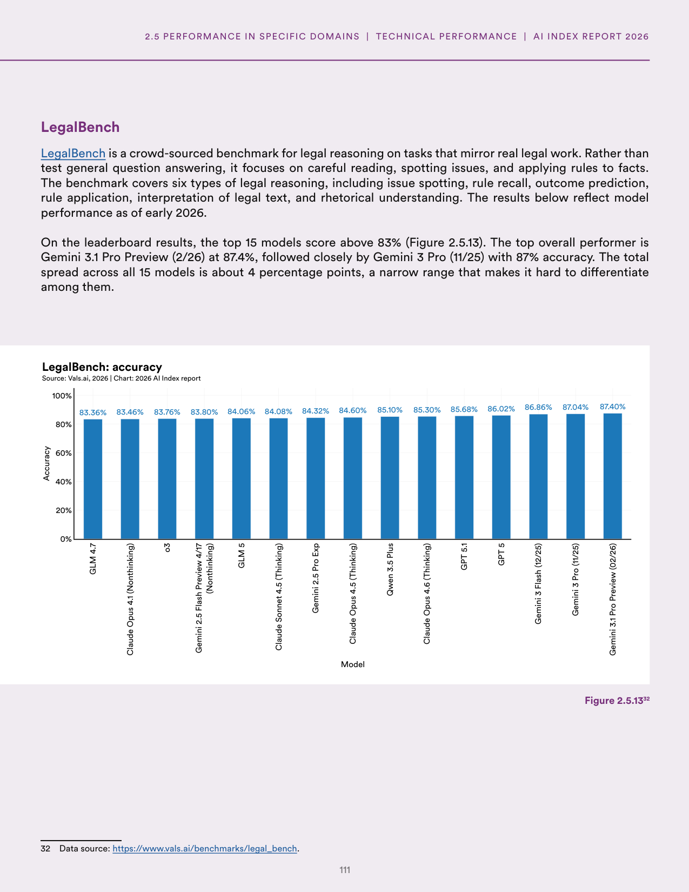
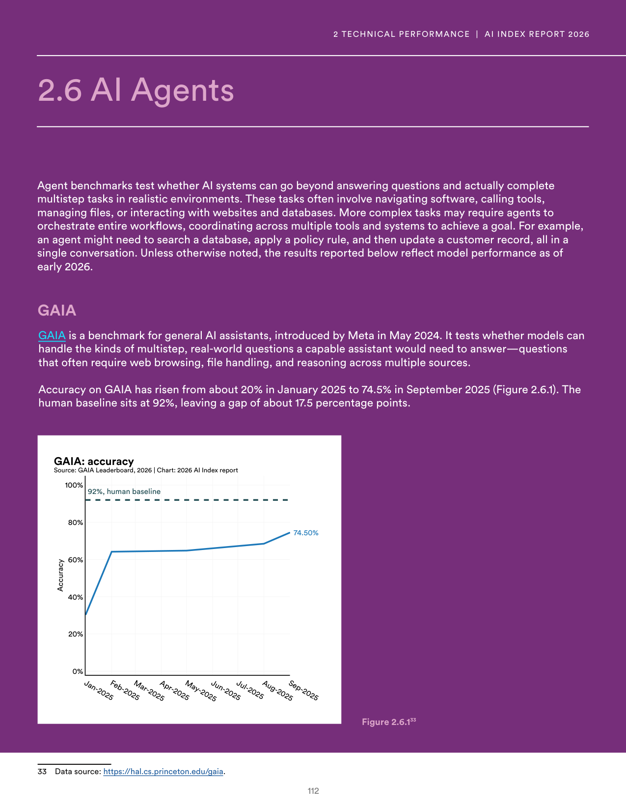
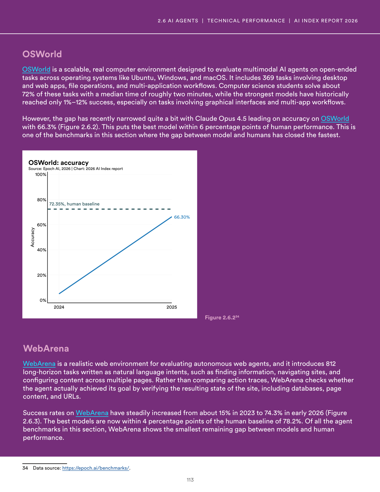
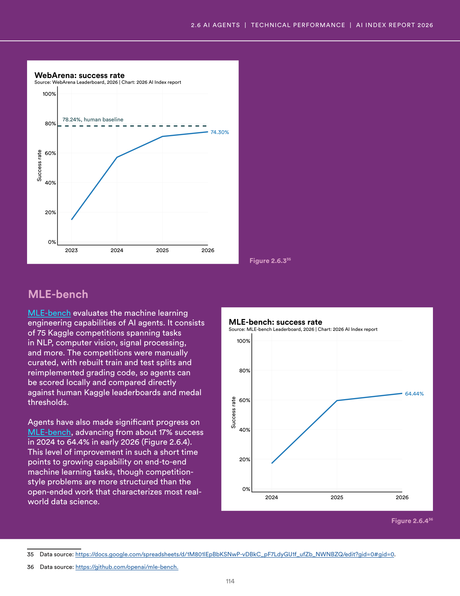
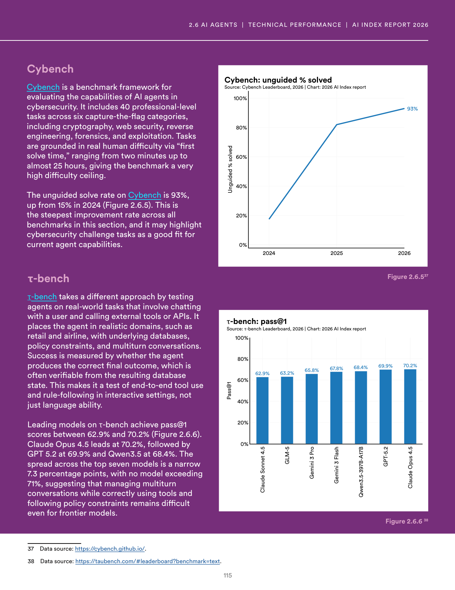

# error_report.json

**Parent:** [[content/L1/ai-specialized-benchmarks-and-robotics|ai-specialized-benchmarks-and-robotics]] — AI models show improvements in benchmarks like GSM8K, HumanEval, and RLBench, but struggle with complex multi-step reasoning and the 'sim-to-real' gap in robotics, while professional exam success in law and medicine does not equate to real-world practice.

The user is reporting a system error ('NoneType' object has no attribute 'model_dump') and is requesting a valid JSON response that matches a required schema. This suggests a previous interaction failed due to a consciousness/code execution error in the software layer interacting with the LLM.

## Source pages

