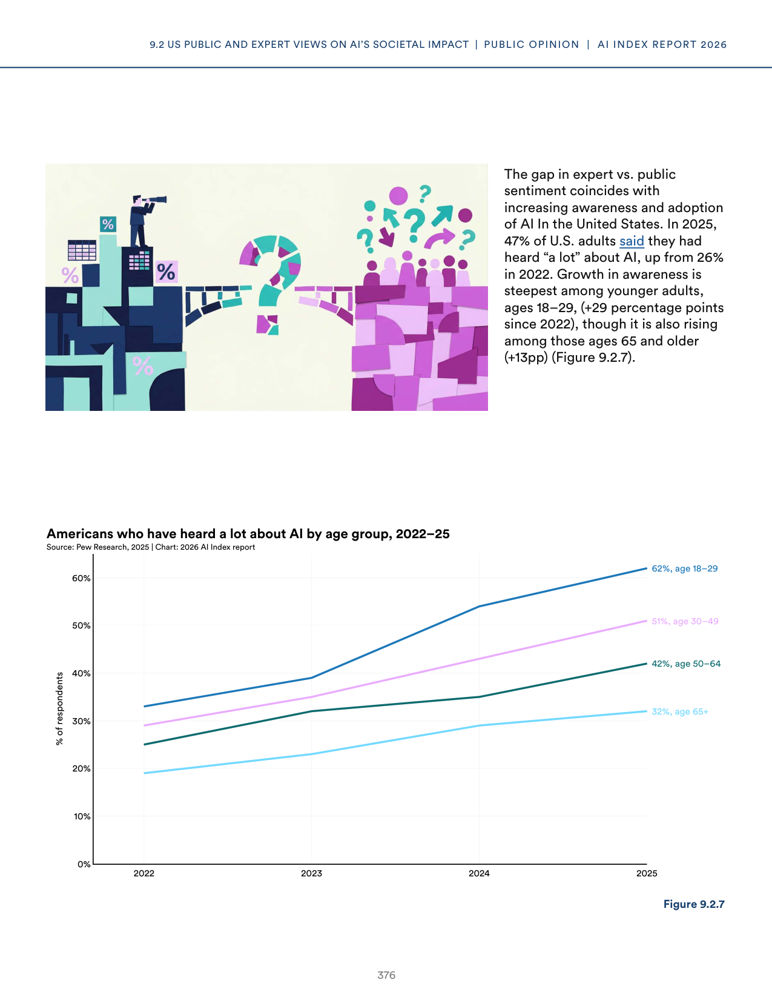
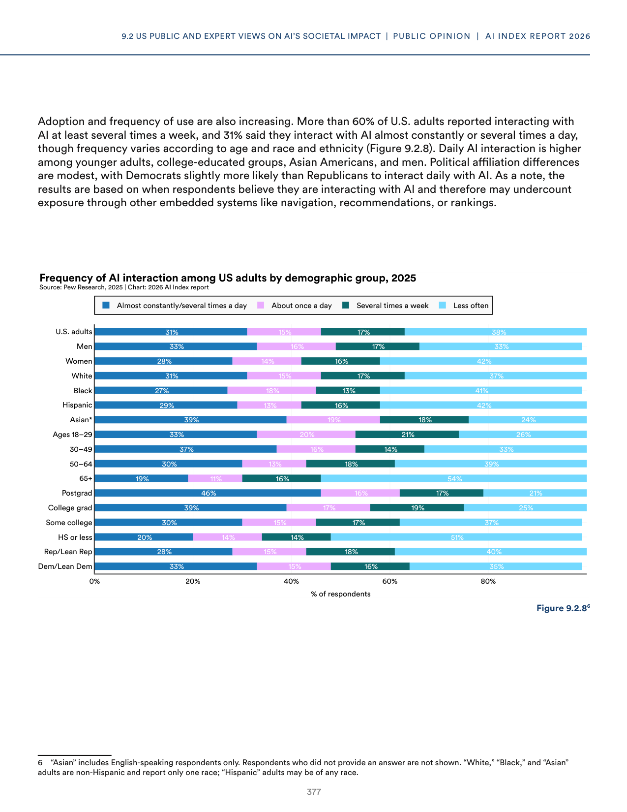
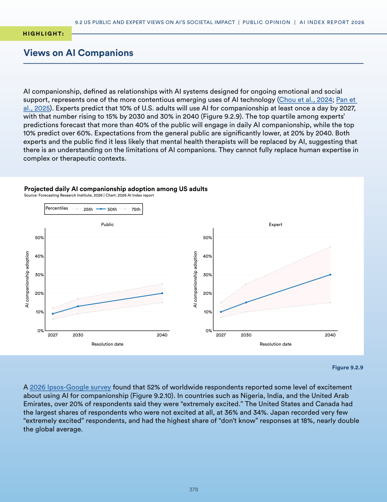
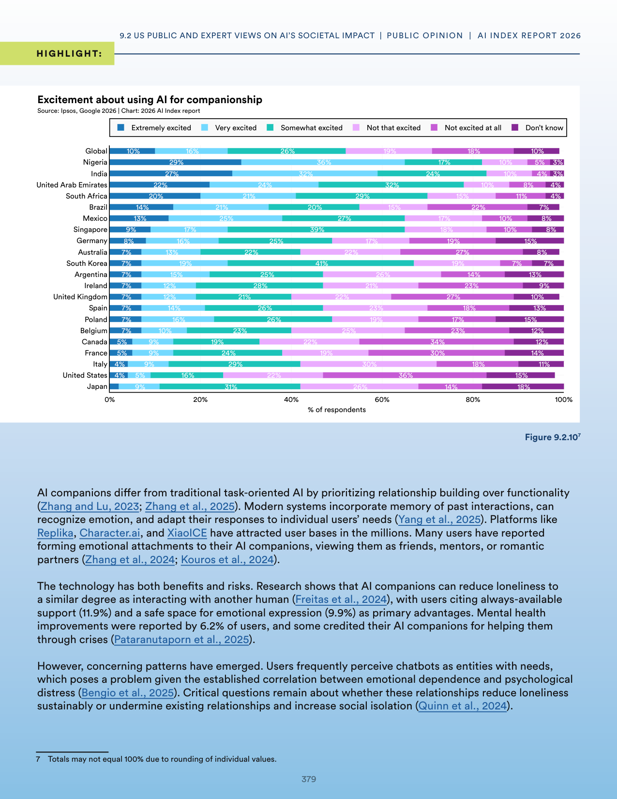
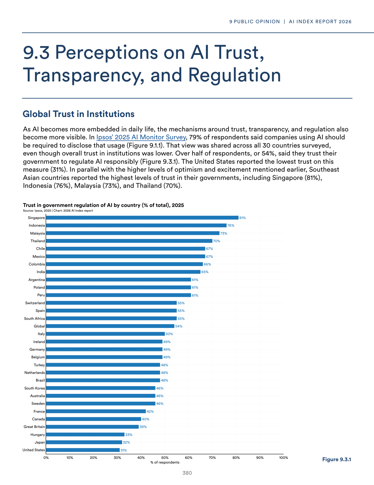
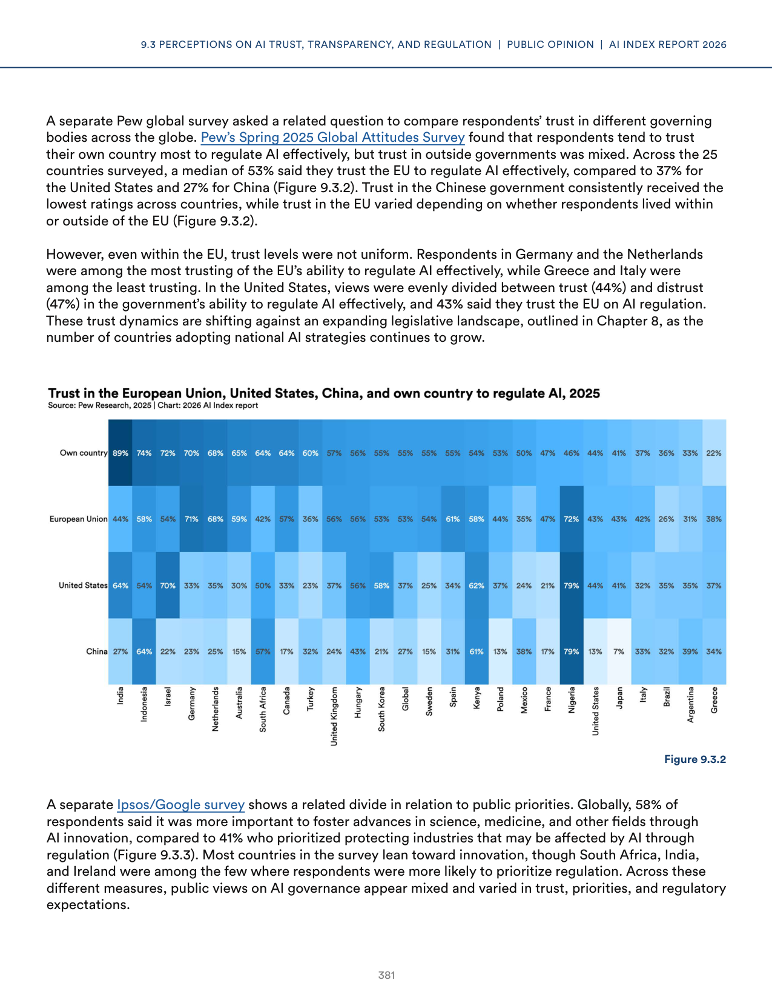
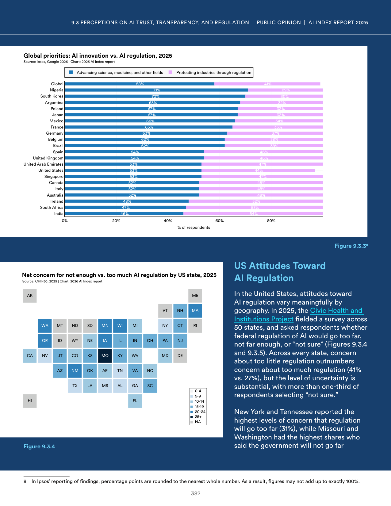

# error_report_response.json

**Parent:** [[content/L1/ai-landscape-2025-technical-governance|ai-landscape-2025-technical-governance]] — The 2025 AI landscape is defined by the interplay of high US capital concentration in vertical AI, an increase in RAI framework maturity (from 2.5 to 2.8), and a widespread perception among US demographics (especially older and college-educated individuals) that government regulation is insufficient.

The user is reporting a technical error ('NoneType' object has no attribute 'model_dump') and requesting a valid JSON response that matches a specific, but unstated, schema. This indicates a previous failure in the internal processing of the same task, and the user is likely interacting with an agent or system that requires structured output.

## Source pages

