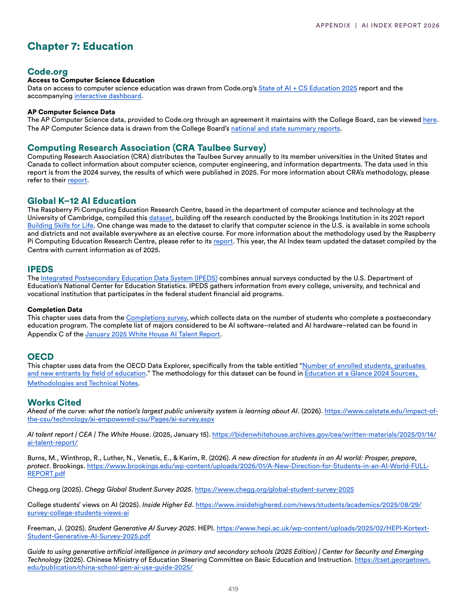
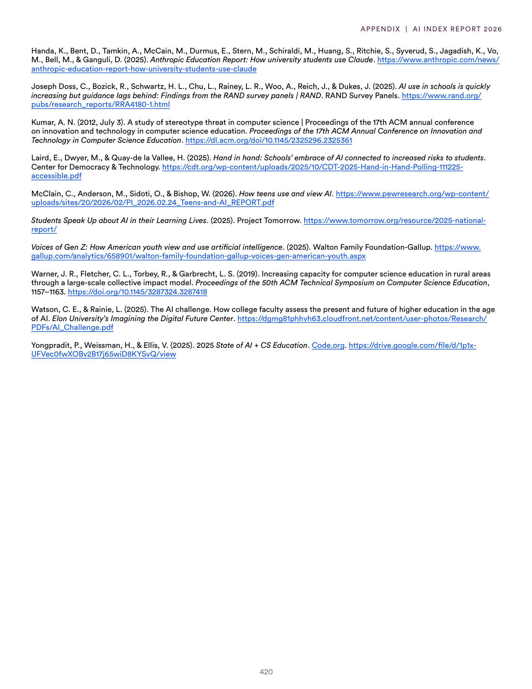
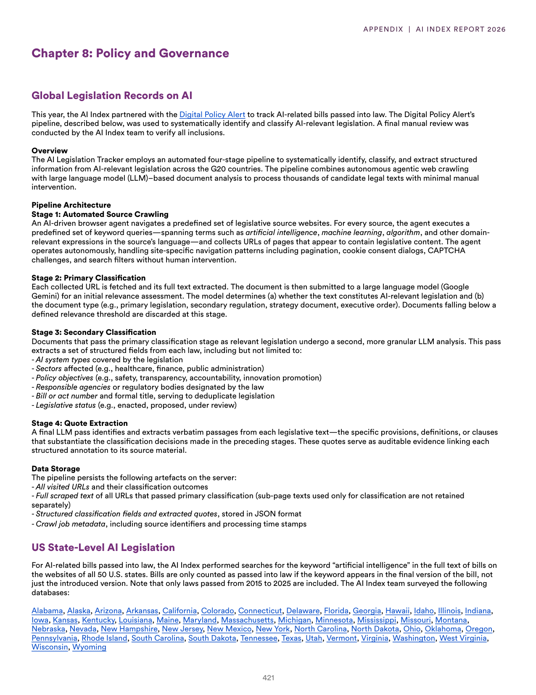
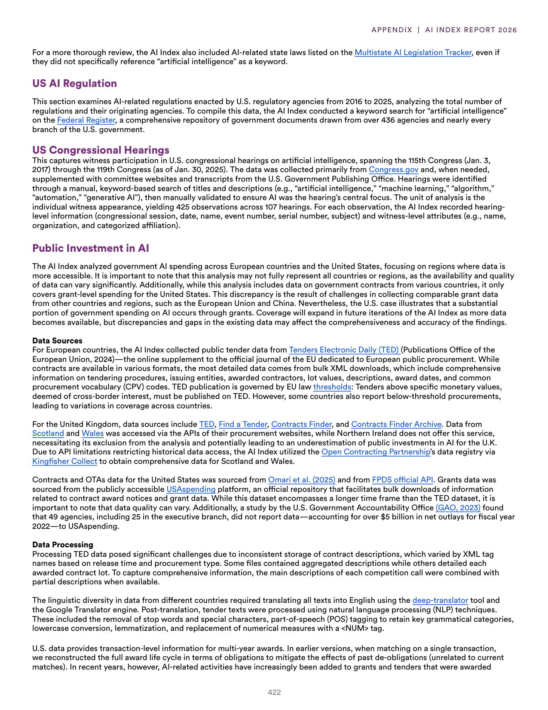
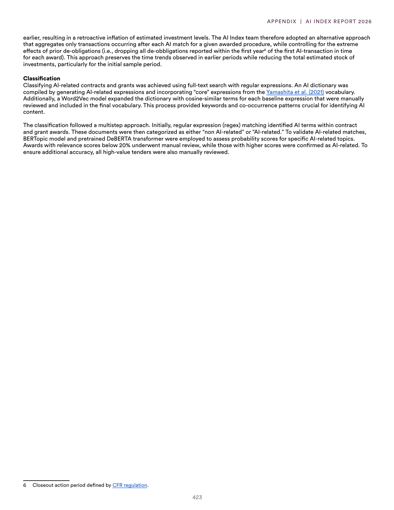

# error_resolution_json_response.json

**Parent:** [[index]]

The user is reporting an error regarding a 'NoneType' object not having the attribute 'model_dump', which is typically a Pydantic v2 model method. This indicates a previous response failed to return a valid object, returning None instead, and subsequent code tried to call .model_dump() on it. The user is requesting a valid JSON response matching a specific schema (though the same schema is not provided in the current prompt, I must assume the same schema as the previous turn in the same conversation context or a general standard for the requested output format).

## Source pages

