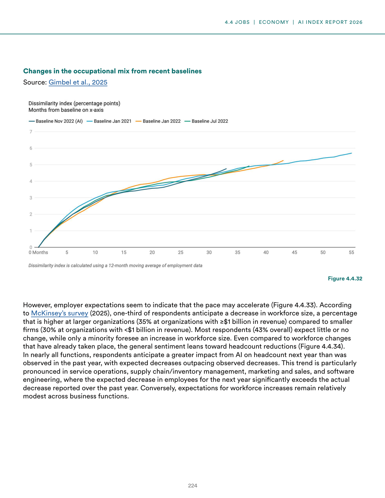
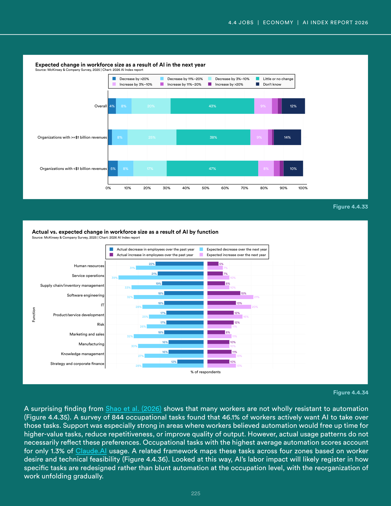
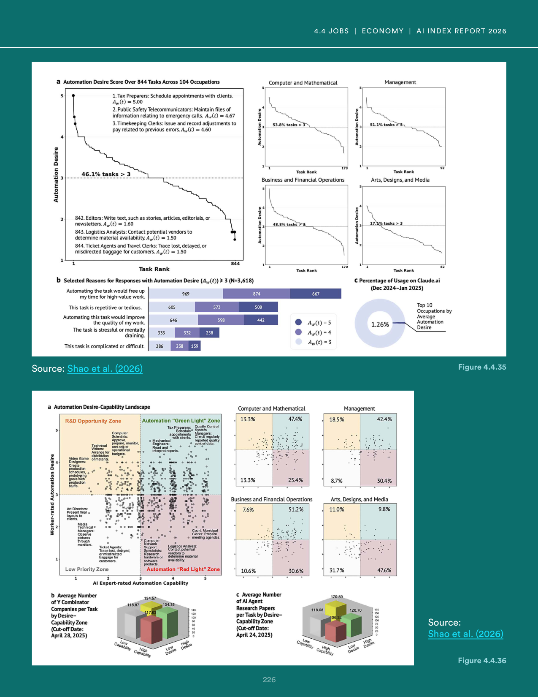
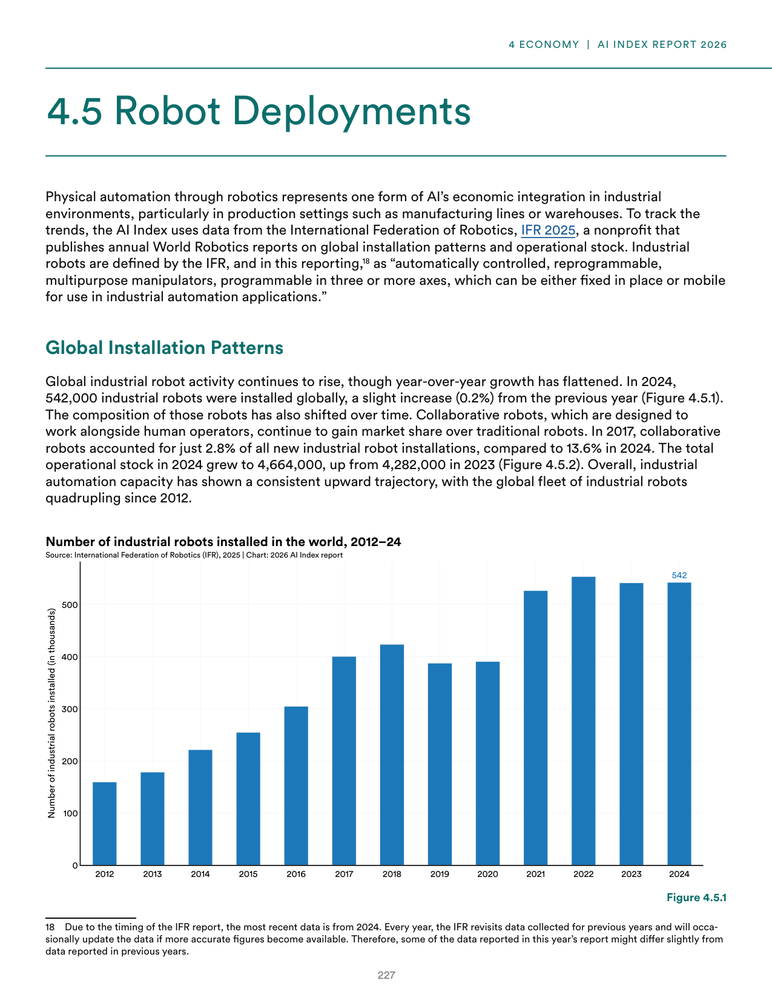
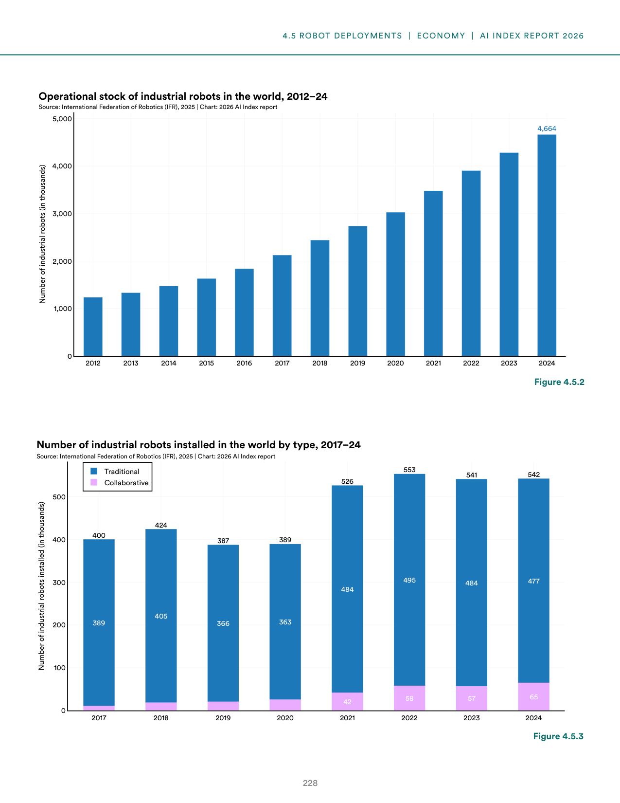
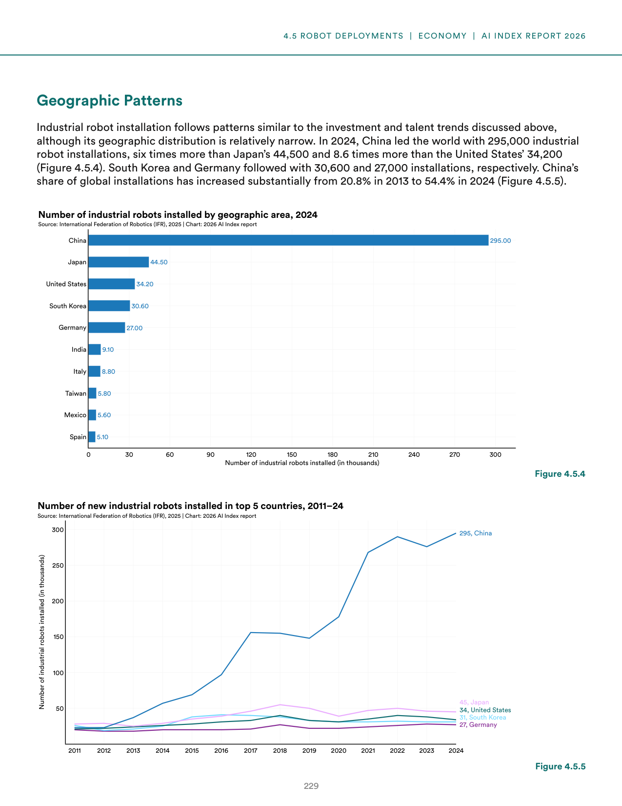
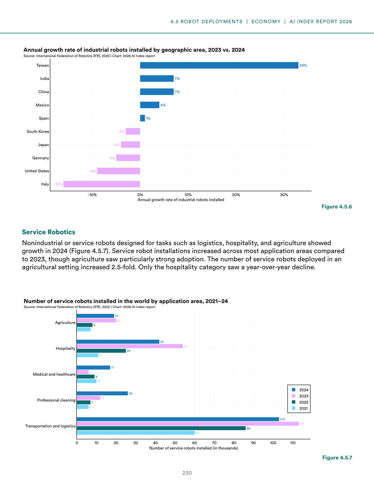
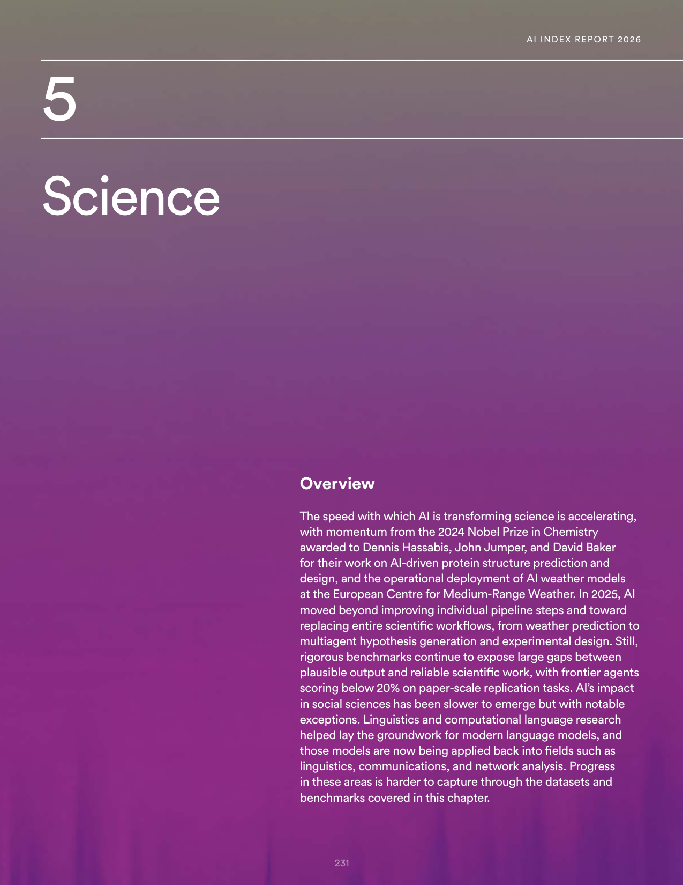
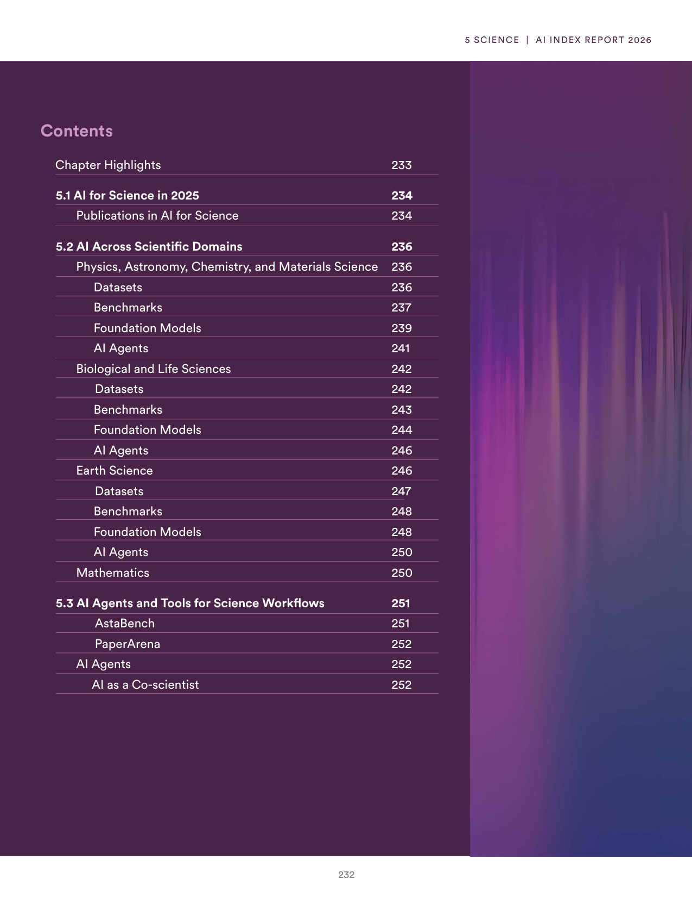
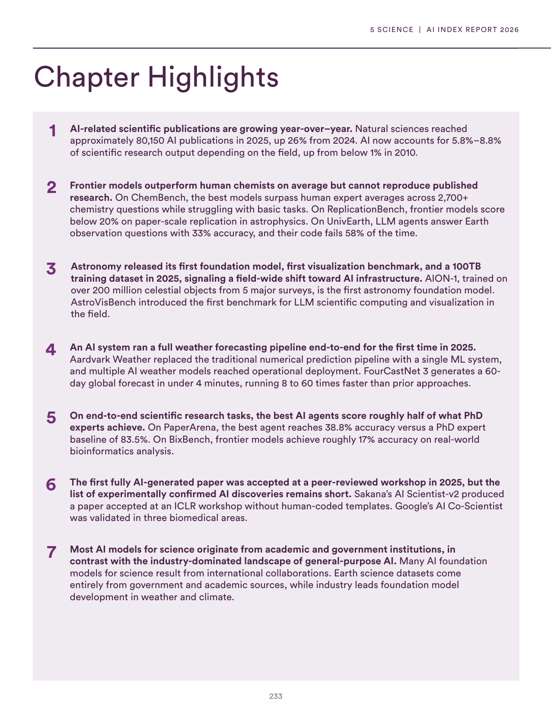

# error_response.json

**Parent:** [[content/L1/ai-2025-state-technical-economic-governance|ai-2025-state-technical-economic-governance]] — In 2025, AI is characterized by a tension between capability and safety, with the US dominating private investment and the rise of 'AI4Science' for scientific discovery. Meanwhile, RAI framework maturity scores rose from 2.5 to 2.8, but only 15% of organizations are 'high maturity' (score 4+), and a specific Pydantic 'AttributeError: NoneType object has no attribute model_dump' persists in API structured outputs.

The user is reporting a technical error ('NoneType' object has no attribute 'model_dump') which typically occurs in Python/Pydantic when a function returns None instead of an object. The user is prompt-engineering or interacting with an LLM via an API that expects a specific JSON schema, and the previous response failed validation.

## Source pages

