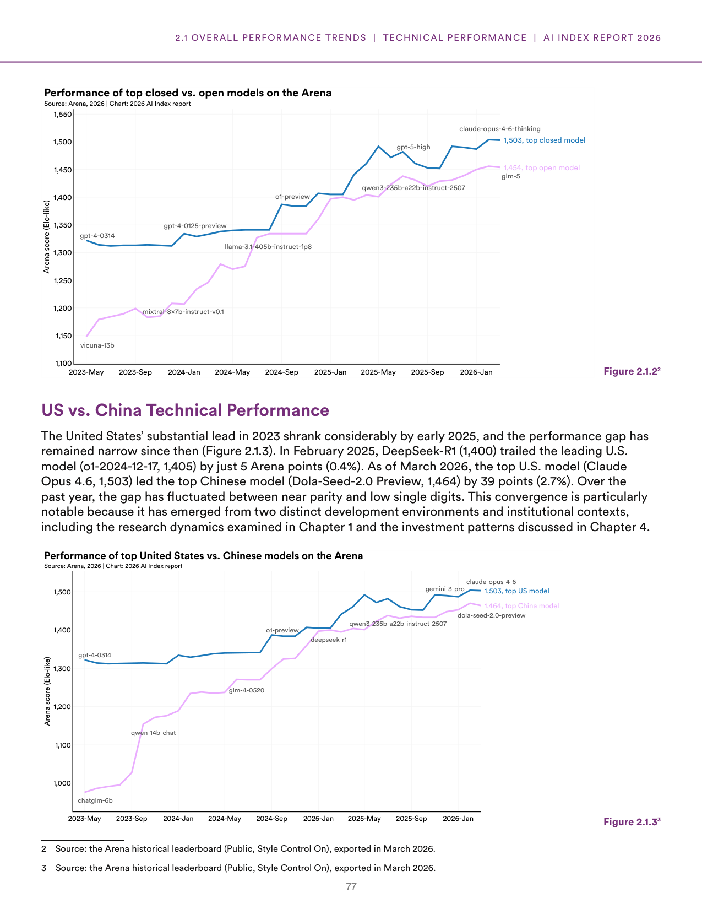
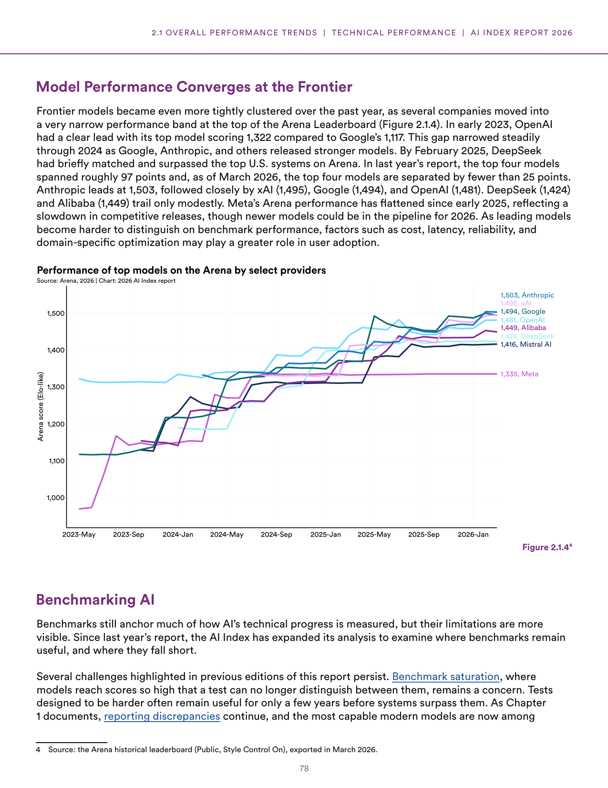
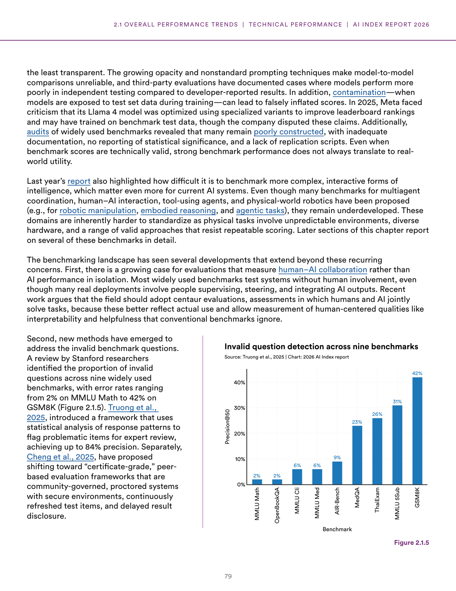
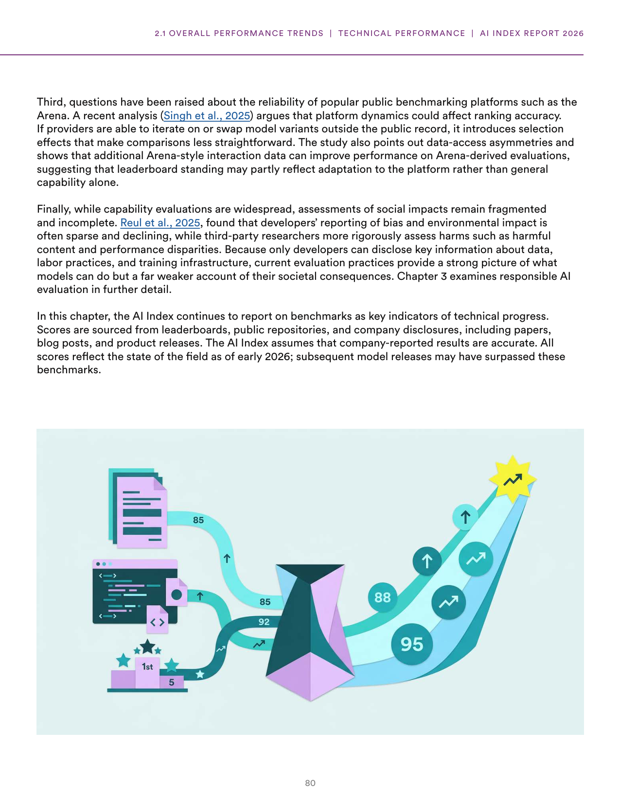

# frontier-model-convergence-and-benchmarking-limitations

**Parent:** [[content/L1/ai-talent-technical-performance-2026|ai-talent-technical-performance-2026]] — The 2026 AI Index Report details a world where the US leads in total AI talent (220,520 individuals) but Switzerland leads per capita (110.45), while frontier models have converged in performance, with the top four providers (Anthropic, xAI, Google, OpenAI) separated by fewer than 25 Elo points.

The 2026 Artificial Intelligence Index Report analyzes the technical performance of frontier AI models, emphasizing the convergence of capabilities between leading providers and the inherent limitations of current benchmarking practices. All scores cited reflect the state of the field as of early 2026.

### Model Performance and Convergence

Frontier AI models have become increasingly tightly clustered in their performance. According to the Arena Leaderboard (exported in March 2026), the top four models are now separated by fewer than 25 Elo points. Anthropic leads with a score of 1,503, followed closely by xAI (1,495), Google (1,494), and OpenAI (1,481). Other high-performing models include Alibaba (1,449) and DeepSeek (1,424), while Meta's performance has flattened since early 2025, with its top model scoring 1,335. 

**Figure 2.1.4: Performance of top models on the Arena by select providers**
- X-axis: Time (May 2023 to January 2026)
- Y-axis: Arena score (Elo-like) from 1,000 to 1,500
- Final scores as of March 2026: Anthropic (1,503), xAI (1,495), Google (1,494), OpenAI (1,481), Alibaba (1,449), DeepSeek (1,424), Mistral AI (1,416), and Meta (1,335).

#### Closed-Weight vs. Open-Weight Models
Performance trends between closed-weight and open-weight models show a fluctuating gap. As of March 2026, the top closed-weight model, Claude Opus 4.6, leads with a score of 1,503, while the top open-weight model, GLM-5, scores 1,454.

**Figure 2.1.2: Performance of top closed vs. open models on the Arena**
- X-axis: Time (May 2023 to January 2026)
- Y-axis: Arena score (Elo-like) from 1,100 to 1,550
- Notable models tracked: GPT-4-0314, GPT-4-0125-preview, o1-preview, GPT-5-high, Claude Opus 4.6-thinking (1,503), GLM-5 (1,454), Vicuna-13B, Mixtral-8x7B-instruct-v0.1, Llama-3.1-405B-instruct-fp8, and Qwen3-235B-A22B-instruct-2507.

#### United States vs. China Technical Performance
The substantial lead held by the United States in 2023 shrank considerably by early 2025. In February 2025, the Chinese model DeepSeek-R1 (1,400) trailed the leading U.S. model, o1-2024-12-17 (1,405), by only 5 points (0.4%). As of March 2026, the top U.S. model, Claude Opus 4.6 (1,503), leads the top Chinese model, Dola-Seed-2.0 Preview (1,464), by 39 points (2.7%). Over the past year, the gap has fluctuated between near parity and low single digits.

**Figure 2.1.3: Performance of top United States vs. Chinese models on the Arena**
- X-axis: Time (May 2023 to January 2026)
- Y-axis: Arena score (Elo-like) from 1,000 to 1,500
- Final data points: Top US model (1,503) and Top China model (1,464).

### Benchmarking AI: Challenges and Limitations

While benchmarks anchor the measurement of technical progress, several critical limitations have emerged. 

#### Technical and Structural Issues
- **Benchmark Saturation:** Models have reached scores so high that tests can no longer distinguish between them. 
- **Opacity and Reporting:** Leading models have become less transparent. Nonstandard prompting techniques and growing opacity make model-to-model comparisons unreliable. Third-party evaluations have found that models sometimes perform worse in independent testing than in developer-reported results.
- **Contamination:** Models may be exposed to test set data during training, leading to falsely inflated scores. For example, in 2025, Meta faced criticism (though it disputed the claims) that its Llama 4 model was optimized using specialized variants to improve leaderboard rankings and may have been trained on benchmark data.
- **Construction Errors:** Audits revealed that many benchmarks are poorly constructed, lacking replication scripts, statistical significance reporting, and adequate documentation.

#### Evaluation of Complex Intelligence
Benchmarking complex, interactive forms of intelligence—such as multi-agent coordination, human-AI interaction, tool-using agents, and physical-world robotics (including embodied reasoning and robotic manipulation)—remains underdeveloped because these tasks involve unpredictable environments and diverse hardware that resist repeatable scoring.

#### New Evaluation Paradigms
- **Human-AI Collaboration:** There is a growing call for "centaur evaluations," where humans and AI jointly solve tasks to better measure human-centered qualities like interpretability and helpfulness.
- **Invalid Question Detection:** Research has identified high error rates in widely used benchmarks. 

**Figure 2.1.5: Invalid question detection across nine benchmarks**
- X-axis: Benchmark
- Y-axis: Precision@50 (0% to 40%)
- Error rates: MMLU Math (2%), OpenBookQA (2%), MMLU Cli (6%), MMLU Med (6%), AIR-Bench (9%), MedQA (23%), ThaiExam (26%), MMLU 5Sub (31%), and GSM8K (42%).

To address these, Truong et al. (2025) introduced a framework using statistical analysis of response patterns to flag problematic items for expert review with up to 84% precision. Additionally, Cheng et al. (2025) proposed "certificate-grade," peer-based, community-governed evaluation frameworks featuring secure environments, continuously refreshed items, and delayed result disclosure.

#### Reliability of Public Platforms
Analysis by Singh et al. (2025) suggests that rankings on platforms like the Arena may be affected by platform dynamics. Selection effects occur if providers swap model variants outside the public record. Furthermore, additional interaction data from the Arena can improve performance on Arena-derived evaluations, suggesting that leaderboard standings may reflect adaptation to the platform rather than general capability.

#### Social Impact Assessments
Assessments of social impacts remain fragmented. While third-party researchers rigorously assess harms like performance disparities and harmful content, developers' reporting on environmental impact and bias is often sparse and declining. Because only developers have access to key data on labor practices and training infrastructure, current evaluations provide a strong picture of model capability but a weak account of societal consequences.

## Source pages

