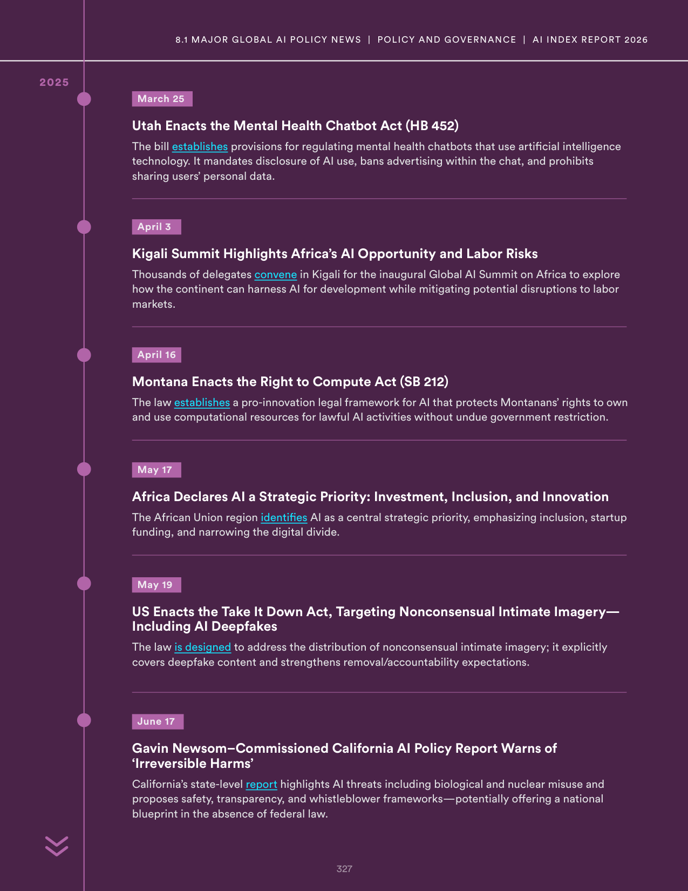
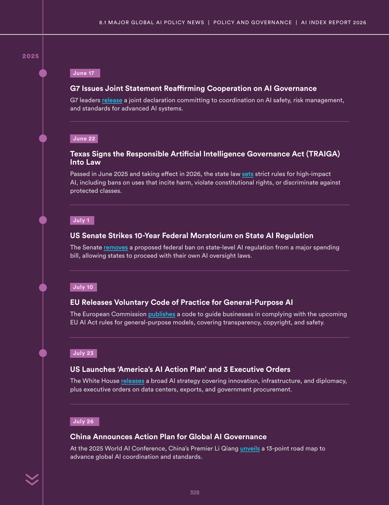
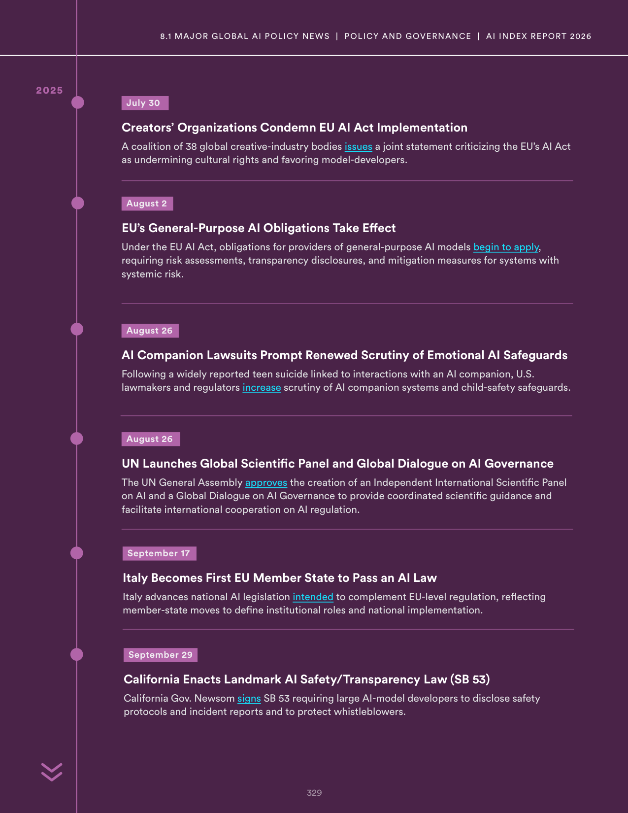
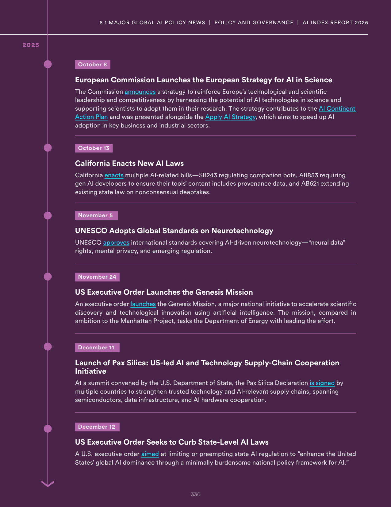

# global_ai_regulation_timeline

**Parent:** [[content/L1/ai-governance-and-technical-safety-2025|ai-governance-and-technical-safety-2025]] — The AI landscape in 2025 is characterized by a tension between capabilities and safety, with U.S. dominance in investment and 'vertical AI', alongside a global shift toward risk-based regulation like the EU AI Act and state-level laws in Utah and California.

The provided text outlines a timeline of key global policy and legislative developments regarding Artificial Intelligence throughout 2024 and 2025. In the United States, several state-level and federal initiatives emerged, including the passage of laws regulating AI and a federal-level focus on AI governance. Specific state laws were enacted to address AI usage, while a broader federal approach aimed to coordinate national AI strategy. In Utah, legislation was passed to regulate the use of AI in specific sectors, and in California, a landmark AI safety bill was introduced and debated. Internationally, the European Union continued its implementation of the AI Act, establishing a framework for risk-based AI regulation and creating the EU AI Office to oversee compliance. Additionally, other nations, including China and the UK, introduced their own guidelines and regulatory frameworks for AI development and deployment, focusing on safety and ethical alignment. These efforts reflect a global trend toward increasing oversight of AI systems to mitigate risks while fostering innovation.

## Source pages

