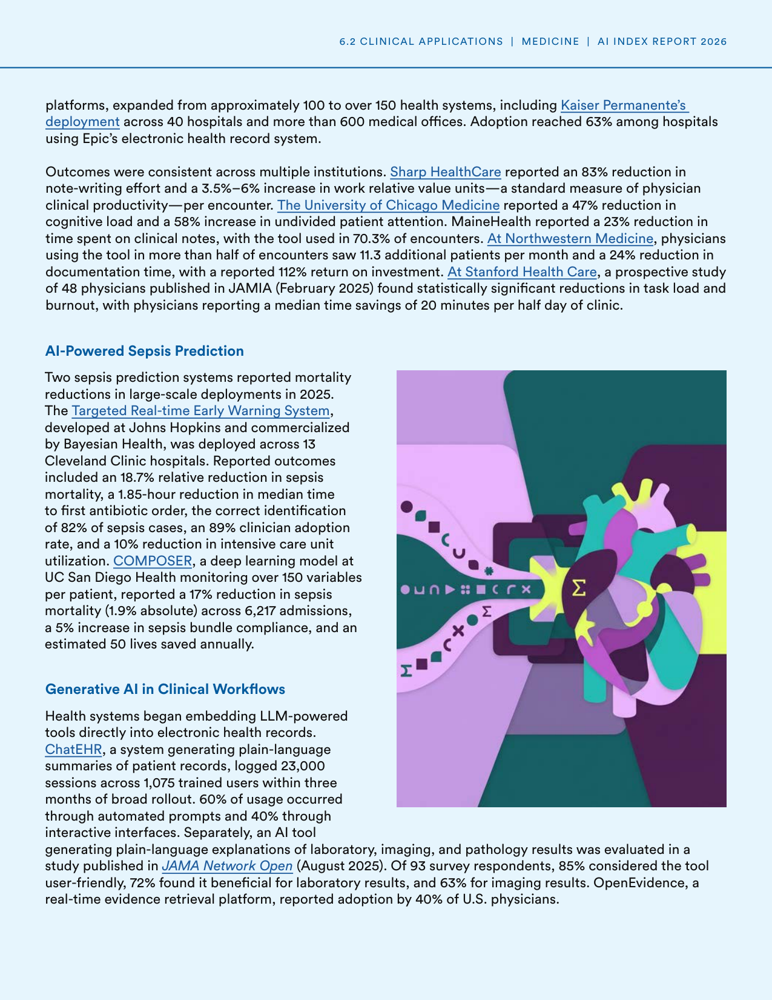
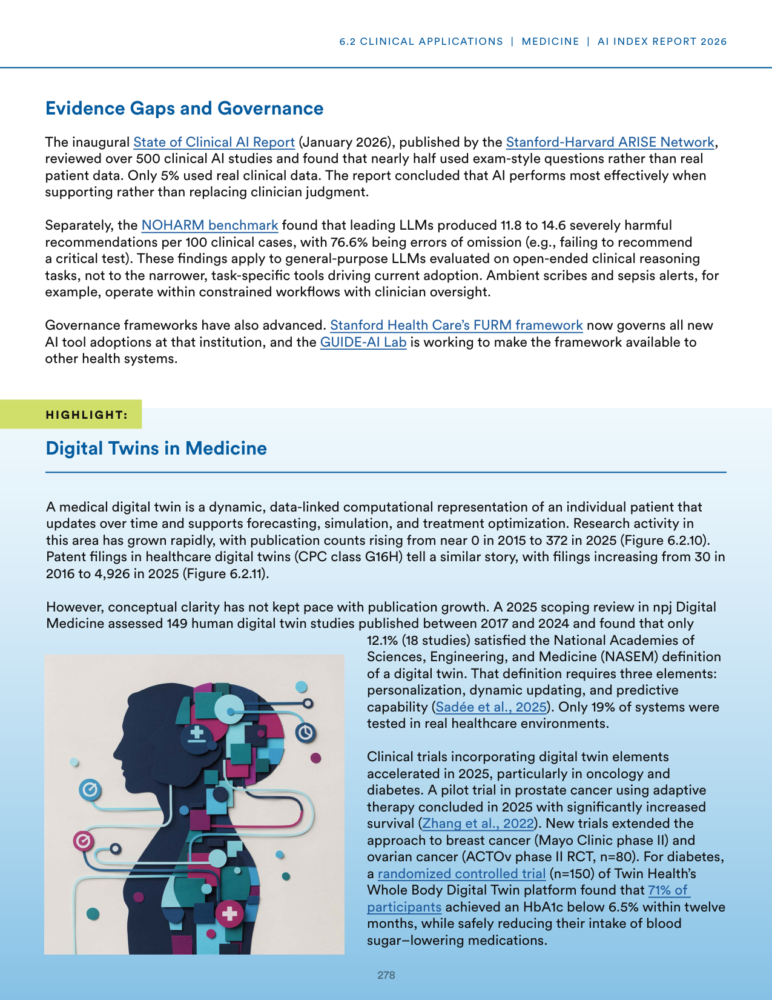
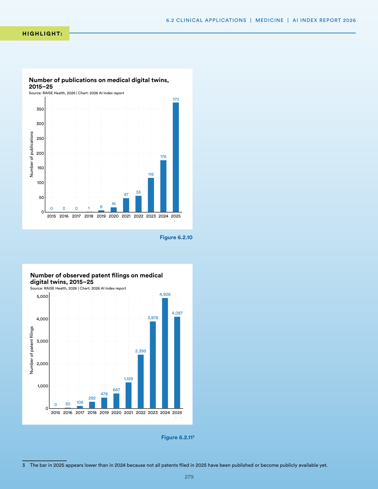
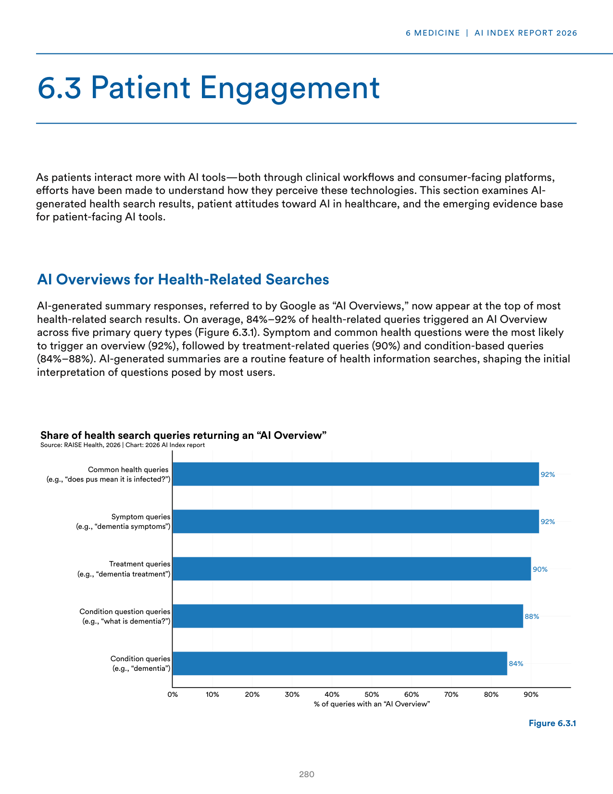
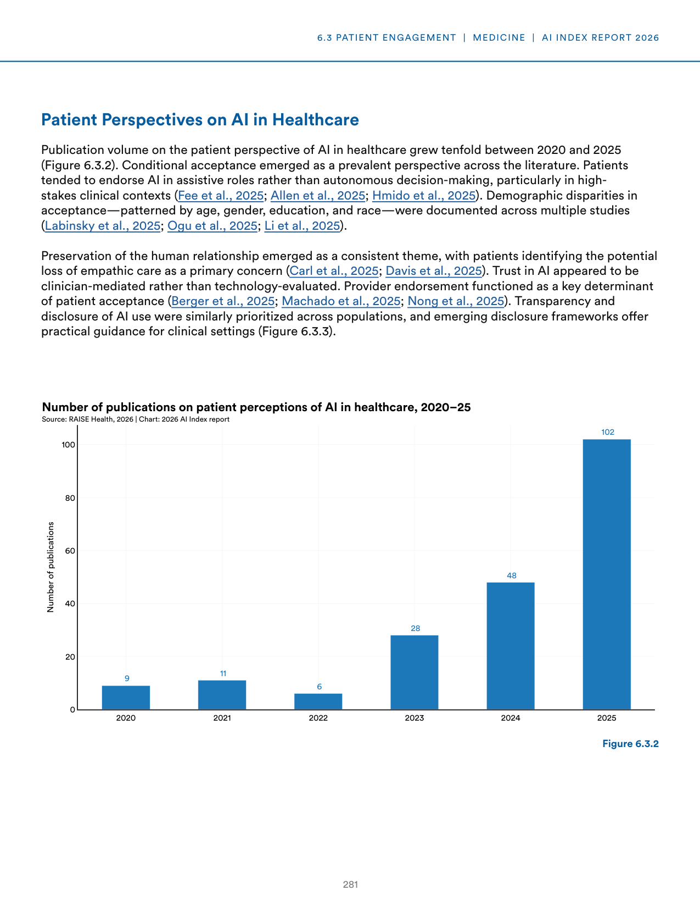
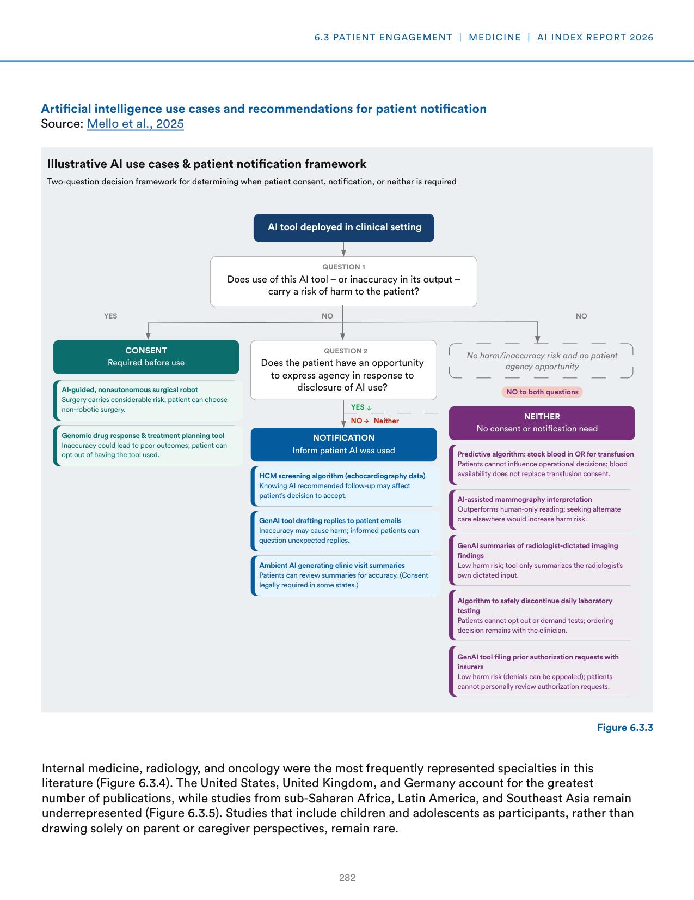
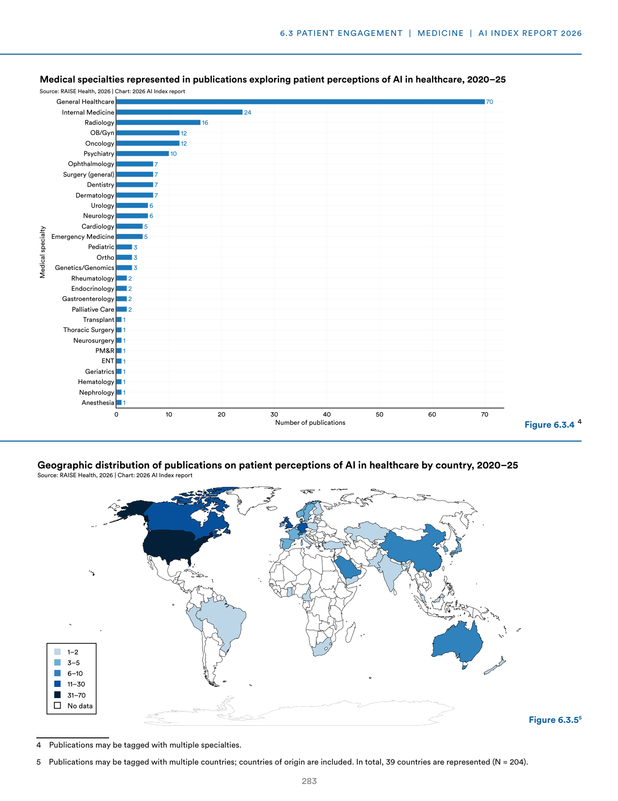

# healthcare_ai_integration.txt

**Parent:** [[content/L1/ai-healthcare-integration-clinical-regulatory|ai-healthcare-integration-clinical-regulatory]] — AI in healthcare is being deployed in radiology (lung CT nodules/X-ray fractures), pathology (cell counting/tumor grading), and cardiology (ECG arrhythmia detection), with radiology models trained on up to 100,000 images. Regulatory trends shift toward FDA Predetermined Change Control Plans (PCCPs) for post-market updates and the use of 'human-in-the-loop' verification to reduce false positives/negatives.

In the healthcare sector, AI integration is manifesting through various applications across clinical and administrative domains. A significant trend is the use of AI for clinical tasks, such as the deployment of AI in clinical settings for diagnostic and patient management purposes. In the realm of patient care, AI is being used to improve outcomes and efficiency, while administrative AI focuses on optimizing workflows and resource allocation. A critical aspect of this integration is the balance between the efficiency gains provided by AI and the necessity of human oversight to ensure safety and accuracy. Specifically, the use of AI in medical imaging and pathology has shown promise in reducing error rates and increasing the speed of diagnosis. Furthermore, AI-driven predictive analytics are being employed to identify high-risk patients and intervene proactively, potentially reducing hospital readmission rates. However, the widespread adoption of these tools depends on addressing challenges related to data privacy, algorithmic bias, and the integration of AI into existing clinical workflows without increasing clinician burnout.

## Source pages

