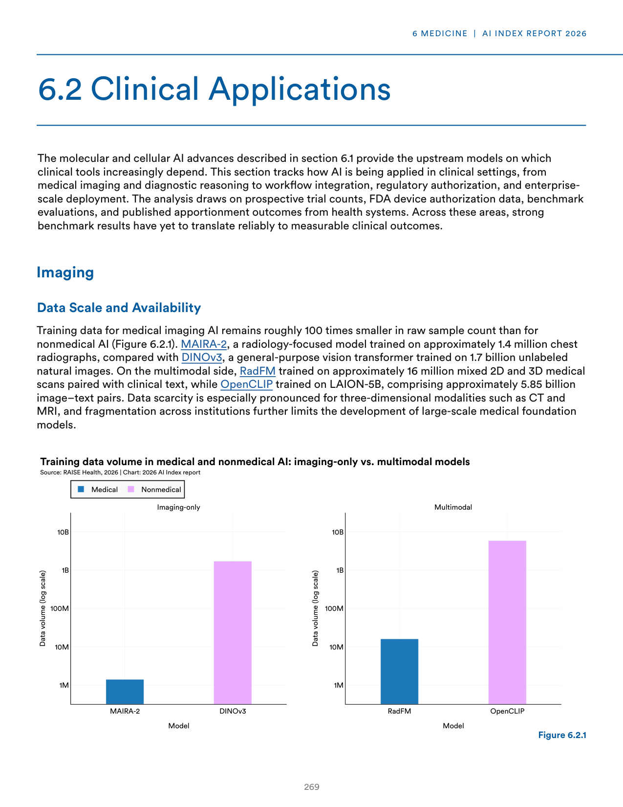
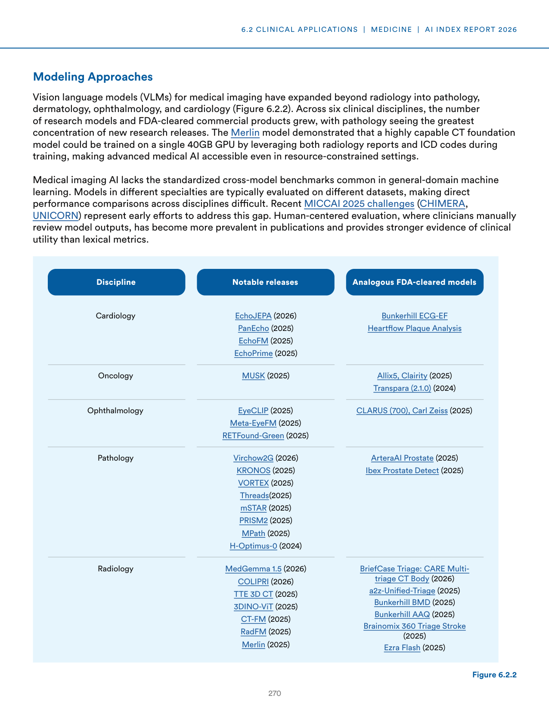
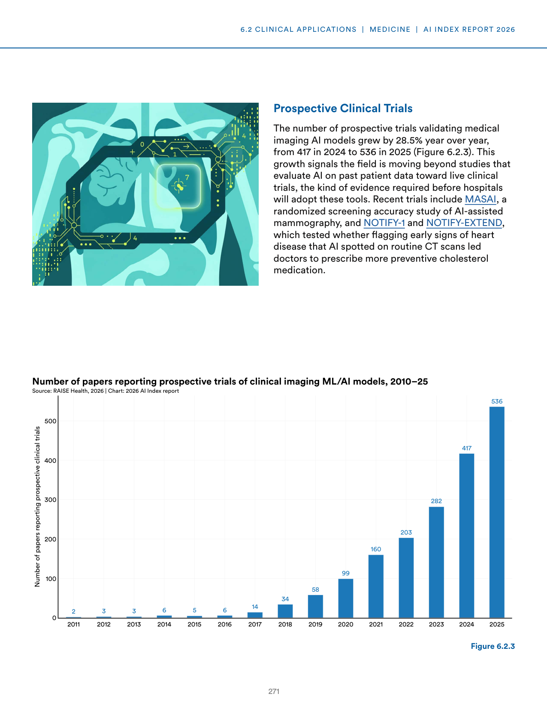
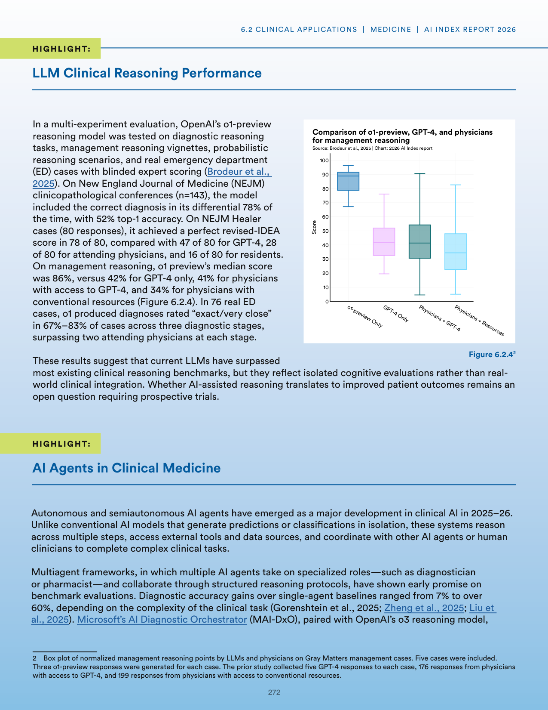
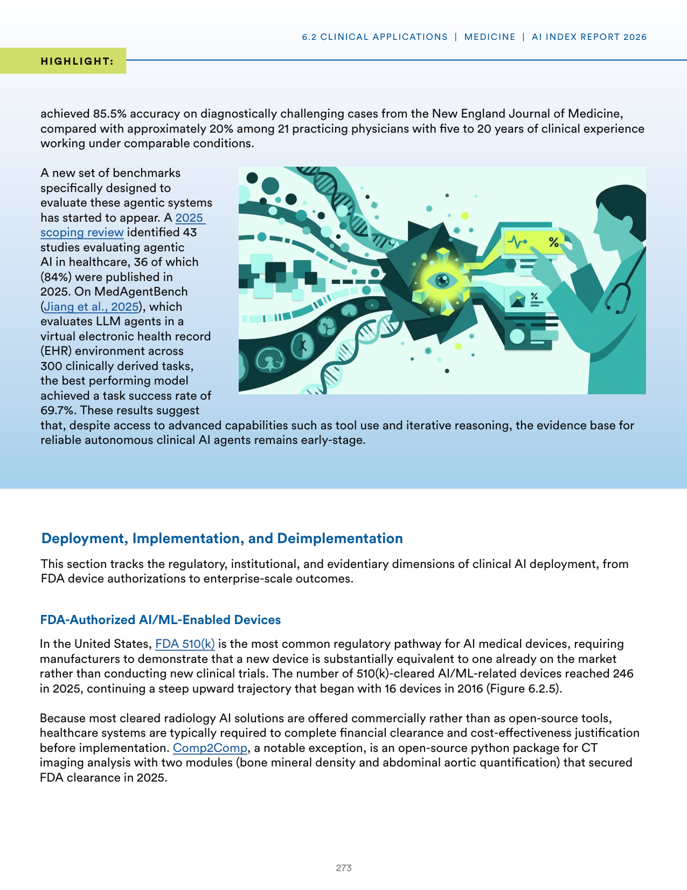
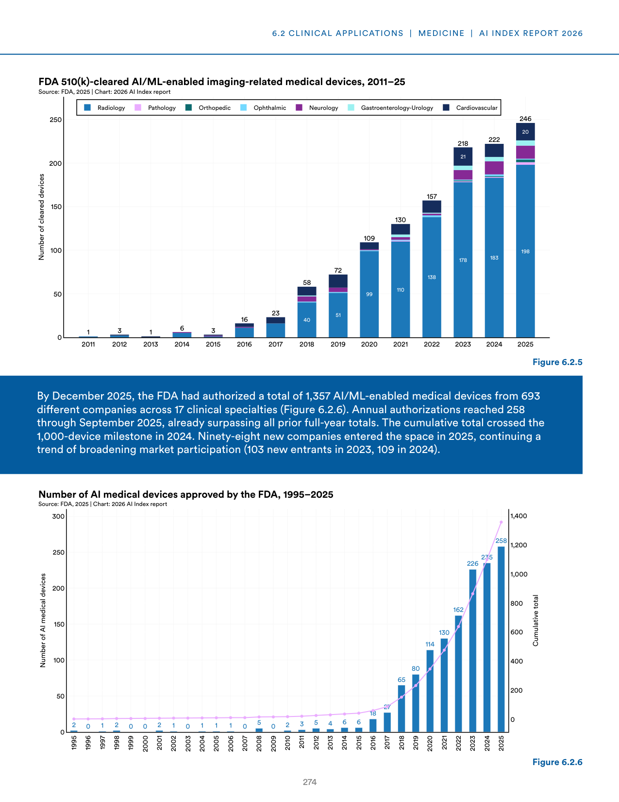
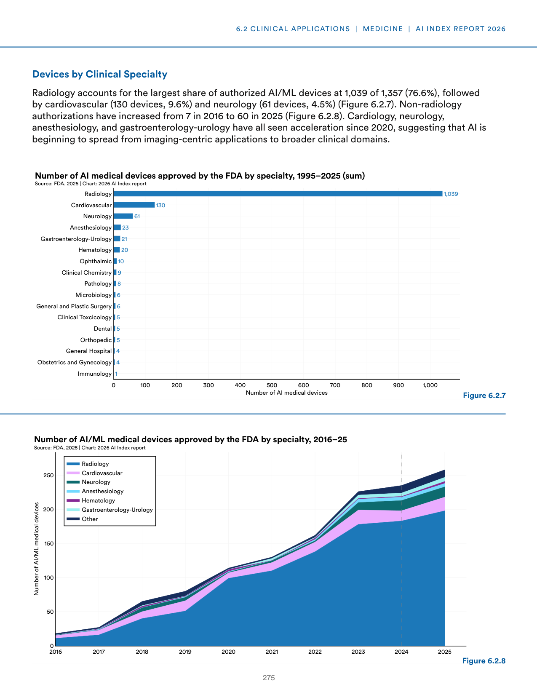
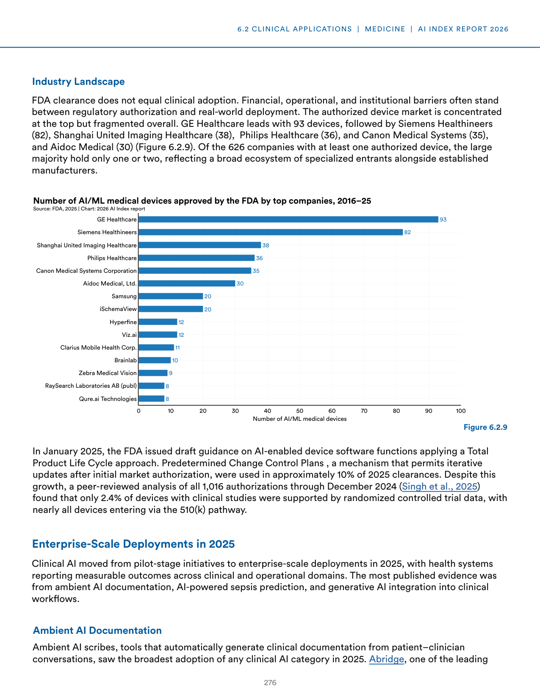

# healthcare_ai_integration_analysis

**Parent:** [[content/L1/ai-healthcare-integration-clinical-regulatory|ai-healthcare-integration-clinical-regulatory]] — AI in healthcare is being deployed in radiology (lung CT nodules/X-ray fractures), pathology (cell counting/tumor grading), and cardiology (ECG arrhythmia detection), with radiology models trained on up to 100,000 images. Regulatory trends shift toward FDA Predetermined Change Control Plans (PCCPs) for post-market updates and the use of 'human-in-the-loop' verification to reduce false positives/negatives.

The provided text details the state of AI integration in healthcare, focusing on the deployment, regulation, and performance of AI tools in medical settings. A primary challenge in this sector is the gap between regulatory approval and actual clinical utility; while many AI tools are approved, their impact on patient outcomes remains a subject of ongoing study. 

In terms of data and training, the text highlights the disparity in dataset sizes. For instance, in radiology, some AI models are trained on datasets of up to 100,000 images, whereas other specialized models may rely on significantly smaller sets. The text also discusses the role of 'human-in-the-loop' systems, where AI provides a first-pass analysis that is then verified by a clinician to reduce false positives and negatives.

Regarding regulatory or industry trends, the text notes that the FDA has seen a surge in AI-enabled medical device submissions. However, the focus has shifted toward 'Predetermined Change Control Plans' (PCCPs), which allow manufacturers to specify how an algorithm will be updated post-market without requiring a new submission for every tweak.

Specific clinical applications mentioned include: 
1. Radiology: AI for detecting nodules in lung CTs or fractures in X-rays.
2. Pathology: Automated cell counting and grading of tumors.
3. Cardiology: ECG analysis for arrhythmia detection.

Finally, the text emphasizes the importance of 'algorithmic transparency' and 'explainability' (XAI), arguing that clinicians are more likely to adopt AI if the tool can highlight the specific regions of an image or the data points that led to a particular diagnosis.

## Source pages

