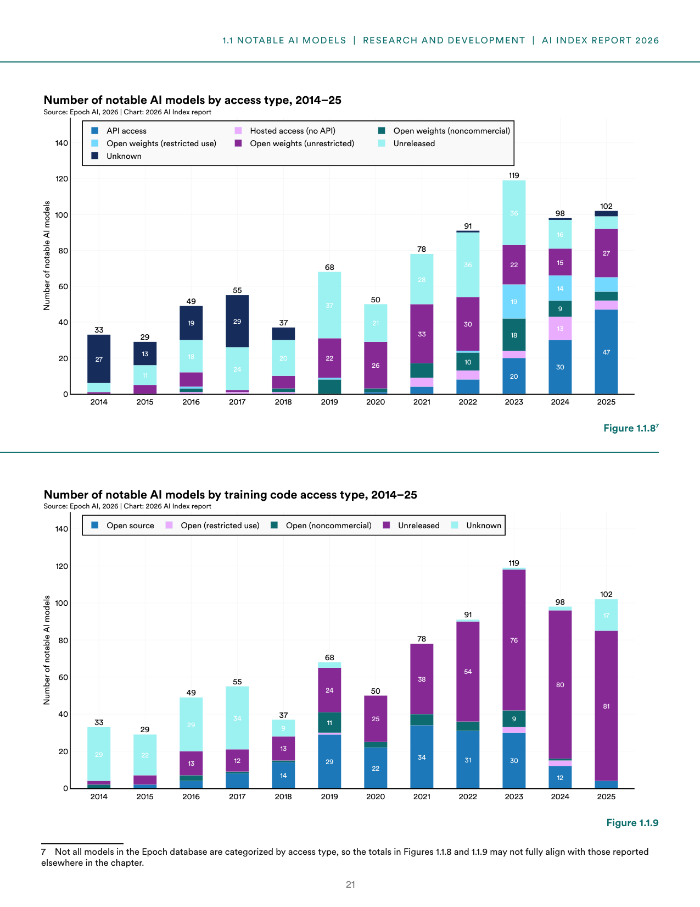
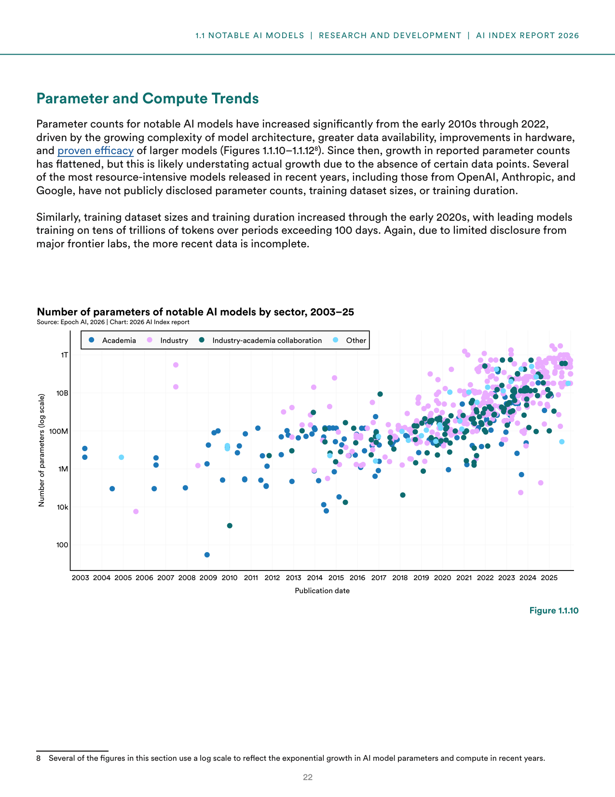
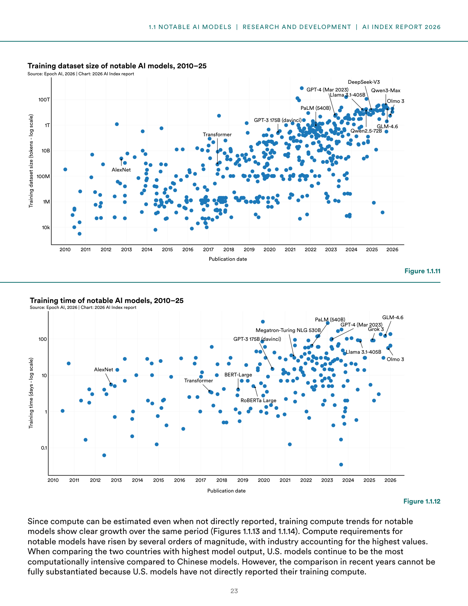
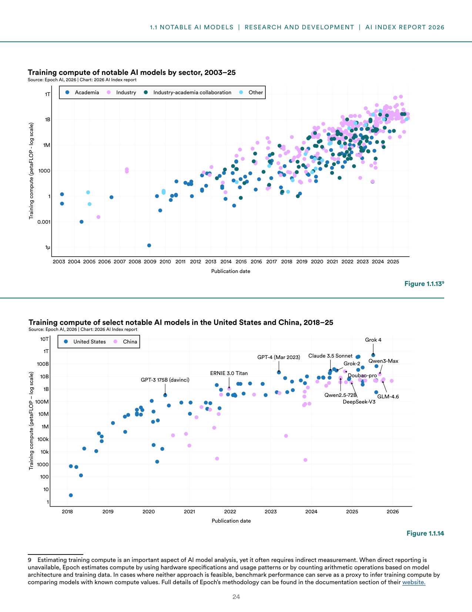
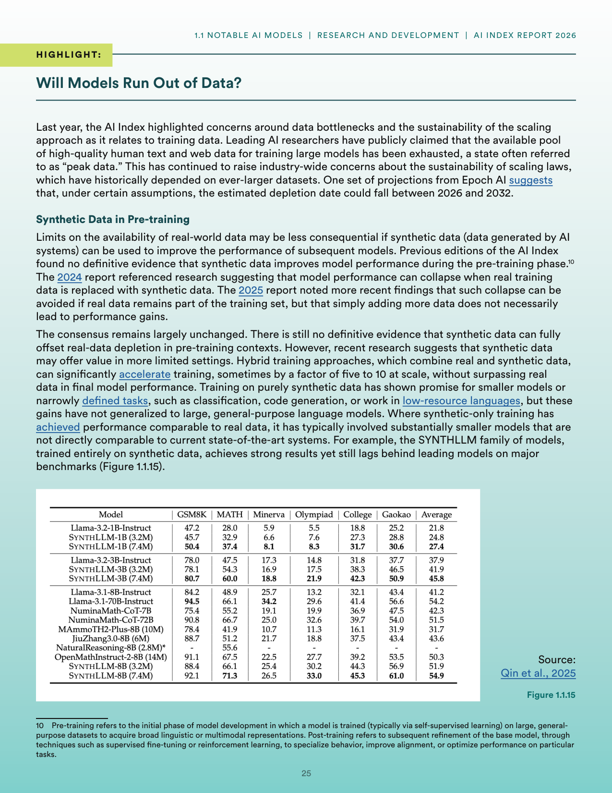
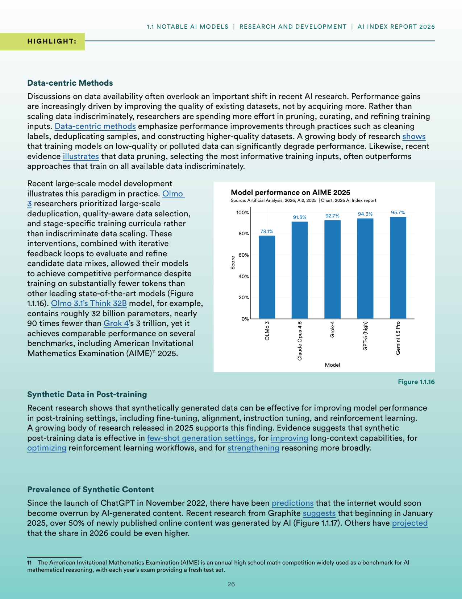
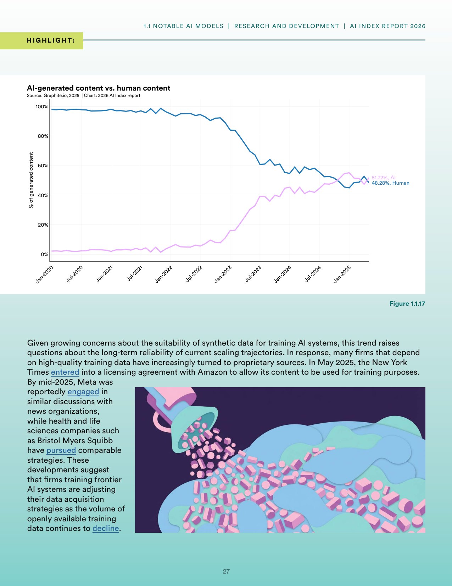

# notable-ai-model-trends-compute-data

**Parent:** [[content/L1/ai-models-infrastructure-environmental-impact|ai-models-infrastructure-environmental-impact]] — The 2026 AI Index Report highlights that while global AI compute capacity grew to 17.1 million H100-equivalents by 2025, training emissions for models like Grok 4 reached 72,816 tons of CO2e, and the US dominates data center counts with 5,427 facilities.

The 2026 Artificial Intelligence Index Report details the technical trends in the development of notable AI models, focusing on parameter counts, training compute, and the evolving nature of training data. 

### Notable AI Model Access and Transparency

Notable AI models are categorized by their access types and the availability of their training code. 

**Figure 1.1.8** illustrates the number of notable AI models by access type from 2014 to 2025. In 2025, there were 102 models, with the distribution as follows:
- API access: 47 models
- Open weights (unrestricted): 13 models
- Open weights (restricted use): 13 models
- Open weights (noncommercial): 19 models
- Hosted access (no API): 14 models
- Unreleased: 27 models
- Unknown: 10 models

**Figure 1.1.9** shows the number of notable AI models by training code access type from 2014 to 2025. In 2025, the breakdown is:
- Unreleased: 81 models
- Unknown: 17 models
- Open (noncommercial): 9 models
- Open (restricted use): 12 models
- Open source: 4 models

### Parameter and Compute Trends

Parameter counts for notable AI models increased significantly from the early 2010s through 2022. This growth was driven by increasing model architecture complexity, greater data availability, hardware improvements, and the proven efficacy of larger models. Since 2022, reported parameter growth has flattened; however, this likely understates actual growth because organizations like OpenAI, Anthropic, and Google have not publicly disclosed parameter counts, training dataset sizes, or training duration for several resource-intensive models. 

Similarly, training dataset sizes and training durations increased through the early 2020s, with leading models training on tens of trillions of tokens over periods exceeding 100 days. Recent data is incomplete due to limited disclosure from major frontier labs.

**Figure 1.1.10** shows the number of parameters of notable AI models by sector from 2003 to 2025 (log scale). The chart indicates a steady increase in parameter counts across academia, industry, and industry-academia collaborations, with industry models eventually dominating in scale.

**Figure 1.1.11** displays the training dataset size of notable AI models from 2010 to 2025 (tokens, log scale). High-profile models mentioned include AlexNet, Transformer, GPT-3 175B (davinci), PaLM (540B), Llama 3.1-405B, GPT-4 (Mar 2023), DeepSeek-V3, Qwen3-Max, Olmo 3, GLM-4.6, and Qwen2.5-72B.

**Figure 1.1.12** shows the training time of notable AI models from 2010 to 2025 (days, log scale). Models listed include AlexNet, Transformer, BERT-Large, RoBERTa Large, GPT-3 175B (davinci), Megatron-Turing NLG 530B, PaLM (540B), GPT-4 (Mar 2023), Llama 3.1-405B, GLM-4.6, Grok 3, and Olmo 3.

Because compute can be estimated indirectly, training compute trends show clear growth. Compute requirements for notable models have risen by several orders of magnitude, with industry models having the highest values. While U.S. models continue to be the most computationally intensive compared to Chinese models, this comparison for recent years cannot be fully substantiated due to a lack of direct reporting by U.S. models.

**Figure 1.1.13** tracks training compute of notable AI models by sector from 2003 to 2025 (petaFLOP, log scale), showing a significant upward trend for industry models.

**Figure 1.1.14** displays the training compute of select notable AI models in the United States and China from 2018 to 2025 (petaFLOP, log scale). Key models plotted include GPT-3 175B (davinci), ERNIE 3.0 Titan, GPT-4 (Mar 2023), Claude 3.5 Sonnet, Grok-2, Grok 4, DeepSeek-V3, Doubao-pro, Qwen2.5-72B, Qwen3-Max, and GLM-4.6.

### Data Bottlenecks and Scaling

Concerns regarding data bottlenecks and the sustainability of scaling laws have emerged, as leading researchers claim the available pool of high-quality human text and web data for training large models has been exhausted (a state called "peak data"). Epoch AI projections suggest the estimated depletion date for this data could fall between 2026 and 2032.

#### Synthetic Data in Pre-training

Synthetic data—data generated by AI systems—may mitigate the limits on real-world data. However, there is no definitive evidence that synthetic data can fully offset real-data depletion in pre-training. While purely synthetic training has shown promise for smaller models or narrowly defined tasks (such as code generation or low-resource languages), these gains have not generalized to large, general-purpose language models. Hybrid training approaches, combining real and synthetic data, can accelerate training by a factor of 5 to 10 at scale without surpassing real data in final performance.

For example, the SYNTHLLM family of models, trained entirely on synthetic data, shows strong results but still lags behind leading models on major benchmarks.

#### Data-centric Methods

Recent AI research has shifted toward improving the quality of existing datasets rather than indiscriminately scaling data. Data-centric methods—including cleaning labels, deduplicating samples, and constructing higher-quality datasets—often outperform approaches that train on all available data. Data pruning (selecting the most informative training inputs) is highlighted as an effective technique.

Recent large-scale model development illustrates this. Olmo 3 researchers used large-scale deduplication, quality-aware data selection, and stage-specific training curricula. This allowed the Olmo 3.1 Think 32B model, which has roughly 32 billion parameters—nearly 90 times fewer than Grok 4’s 3 trillion parameters—to achieve competitive performance on benchmarks such as the American Invitational Mathematics Examination (AIME) 2025.

**Figure 1.1.16** shows the model performance on AIME 2025:
- OLMo 3: 78.1%
- Claude Opus 4.5: 91.3%
- Grok-4: 92.7%
- GPT-5 (high): 94.3%
- Gemini 1.5 Pro: 95.7%

#### Synthetic Data in Post-training

Synthetically generated data is effective for improving model performance in post-training settings (fine-tuning, alignment, instruction tuning, and reinforcement learning). Evidence from 2025 research indicates it is particularly effective for few-shot generation, long-context capabilities, and reasoning.

#### Prevalence of Synthetic Content

Since the launch of ChatGPT in November 2022, the internet has seen a rise in AI-generated content. Research from Graphite suggests that starting in January 2025, over 50% of newly published online content was generated by AI.

**Figure 1.1.17** provides a line chart of AI-generated content vs. human content from January 2020 to January 2025. The chart shows AI-generated content rising from near 0% in 2020 to 51.72% by January 2025, while human-generated content fell from nearly 100% to 48.28%.

### Proprietary Data Acquisition

Due to concerns about the suitability of synthetic data for training, firms training frontier AI systems are adjusting data acquisition strategies. This has led to an increase in the use of proprietary sources. In May 2025, the New York Times entered a licensing agreement with Amazon to allow its content to be used for training purposes. By mid-2025, Meta was reportedly engaged in similar discussions with news organizations, and health and life sciences companies like Bristol Myers Squibb have pursued comparable strategies as the volume of openly available training data declines.

## Source pages

