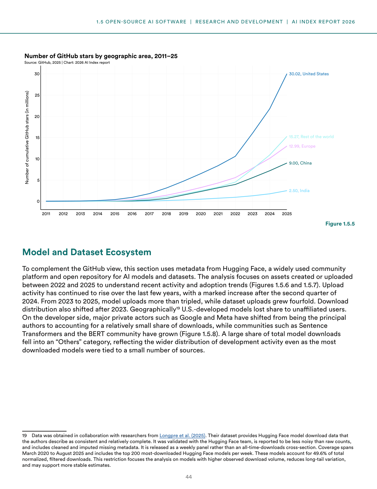
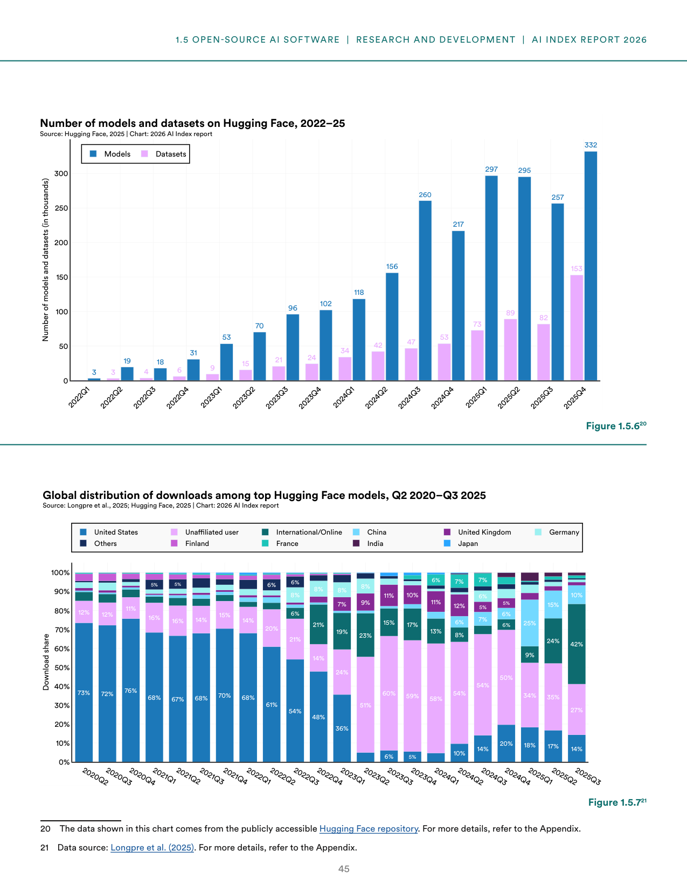
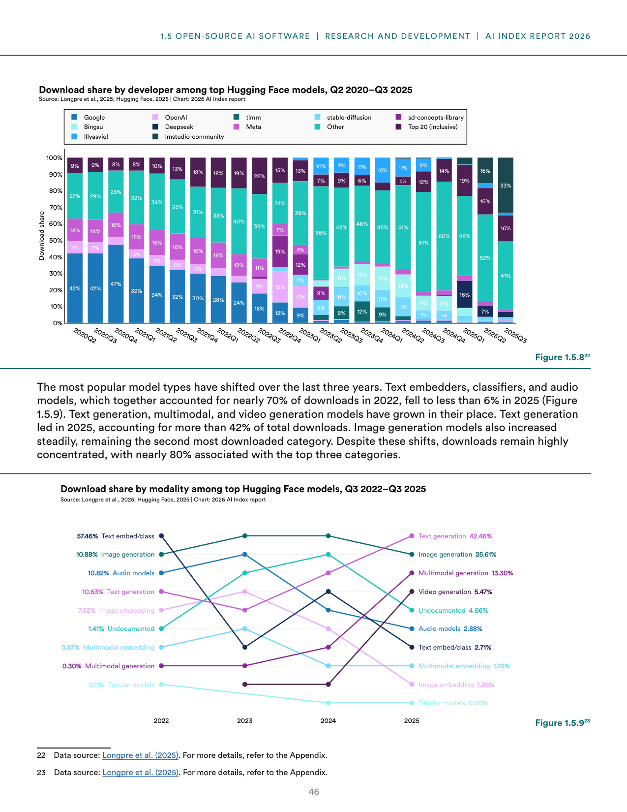

# open-source-ai-software-engagement

**Parent:** [[content/L1/ai-environmental-research-patents-2026|ai-environmental-research-patents-2026]] — The 2026 AI Index Report shows a shift toward China's dominance in patent volume (74.24%) and publication counts, while the U.S. maintains leadership in high-influence patents (51.91% forward citations) and cumulative GitHub stars (30.02 million).

The 2026 Artificial Intelligence Index Report provides an analysis of open-source AI software development, focusing on engagement metrics from GitHub and Hugging Face.

### GitHub Engagement and Geographic Distribution

Developer interest and engagement in AI projects on GitHub are measured by cumulative stars. Between 2011 and 2025, the distribution of these stars has varied by geographic area. As of 2025, the United States leads with 30.02 million cumulative stars, followed by the Rest of the World (15.27 million), Europe (12.99 million), China (9.00 million), and India (2.50 million).

**Figure 1.5.5: Number of GitHub stars by geographic area, 2011–25**
- X-axis: Year (2011 to 2025)
- Y-axis: Number of cumulative GitHub stars (in millions), from 0 to 30
- 2025 values: United States (30.02), Rest of the world (15.27), Europe (12.99), China (9.00), India (2.50)

### The Hugging Face Model and Dataset Ecosystem

To complement the GitHub data, the report analyzes metadata from Hugging Face, a community platform and open repository for AI models and datasets. This analysis focuses on assets created or uploaded between 2022 and 2025. The data used for download analysis was obtained from a dataset by Longpre et al. (2025), which provides cleaned and imputed metadata for the top 200 most-downloaded Hugging Face models per week from March 2020 to August 2025; these models represent 49.6% of total normalized, filtered downloads.

#### Upload and Download Activity

Upload activity on Hugging Face increased significantly after the second quarter of 2024. Between 2023 and 2025, model uploads more than tripled, while dataset uploads grew fourfold.

**Figure 1.5.6: Number of models and datasets on Hugging Face, 2022–25**
- X-axis: Quarter (2022Q1 to 2025Q4)
- Y-axis: Number of models and datasets (in thousands), from 0 to 300
- Models (blue bars): Rose from 3 thousand in 2022Q1 to 332 thousand in 2025Q4.
- Datasets (purple bars): Rose from 3 thousand in 2022Q1 to 153 thousand in 2025Q4.

Download distribution shifted after 2023, with U.S.-developed models losing share to unaffiliated users. Additionally, major private developers like Google and Meta shifted from being the principal authors of the most-downloaded models to accounting for a relatively small share of downloads, while communities such as Sentence Transformers and the BERT community grew.

**Figure 1.5.7: Global distribution of downloads among top Hugging Face models, Q2 2020–Q3 2025**
- X-axis: Quarter (2020Q2 to 2025Q3)
- Y-axis: Download share (%), from 0% to 100%
- Data series (as of 2025Q3): United States (17%), Unaffiliated user (14%), International/Online (12%), China (12%), United Kingdom (11%), Germany (8%), Others (8%), Finland (8%), France (6%), India (6%), Japan (5%).

**Figure 1.5.8: Download share by developer among top Hugging Face models, Q2 2020–Q3 2025**
- X-axis: Quarter (2020Q2 to 2025Q3)
- Y-axis: Download share (%), from 0% to 100%
- Data series (as of 2025Q3): Top 20 (inclusive) (41%), Other (52%), Meta (16%), Google (16%), OpenAI (13%), timm (11%), stable-diffusion (9%), sd-concepts-library (7%), Bingsu (6%), Deepseek (6%), llyasviel (5%), lmstudio-community (5%).

#### Modality Trends

Model popularity by modality has shifted significantly between 2022 and 2025. Text embedders, classifiers, and audio models, which together accounted for nearly 70% of downloads in 2022, fell to less than 6% by 2025. Conversely, text generation, multimodal, and video generation models have grown. As of 2025, text generation leads with more than 42% of total downloads, followed by image generation, which grew steadily to become the second most downloaded category.

Despite these shifts, downloads remain highly concentrated, with nearly 80% associated with the top three modalities.

**Figure 1.5.9: Download share by modality among top Hugging Face models, Q3 2022–Q3 2025**
- X-axis: Year (2022 to 2025)
- Y-axis: Download share (%)
- 2022 shares: Text embed/class (57.46%), Image generation (10.88%), Audio models (10.82%), Text generation (10.63%), Image embedding (7.52%), Undocumented (1.41%), Multimodal embedding (0.87%), Multimodal generation (0.30%), Tabular models (0.11%)
- 2025 shares: Text generation (42.46%), Image generation (25.61%), Multimodal generation (13.30%), Video generation (5.47%), Undocumented (4.56%), Audio models (2.88%), Text embed/class (2.71%), Multimodal embedding (1.72%), Image embedding (1.28%), Tabular models (0.00%)

## Source pages

