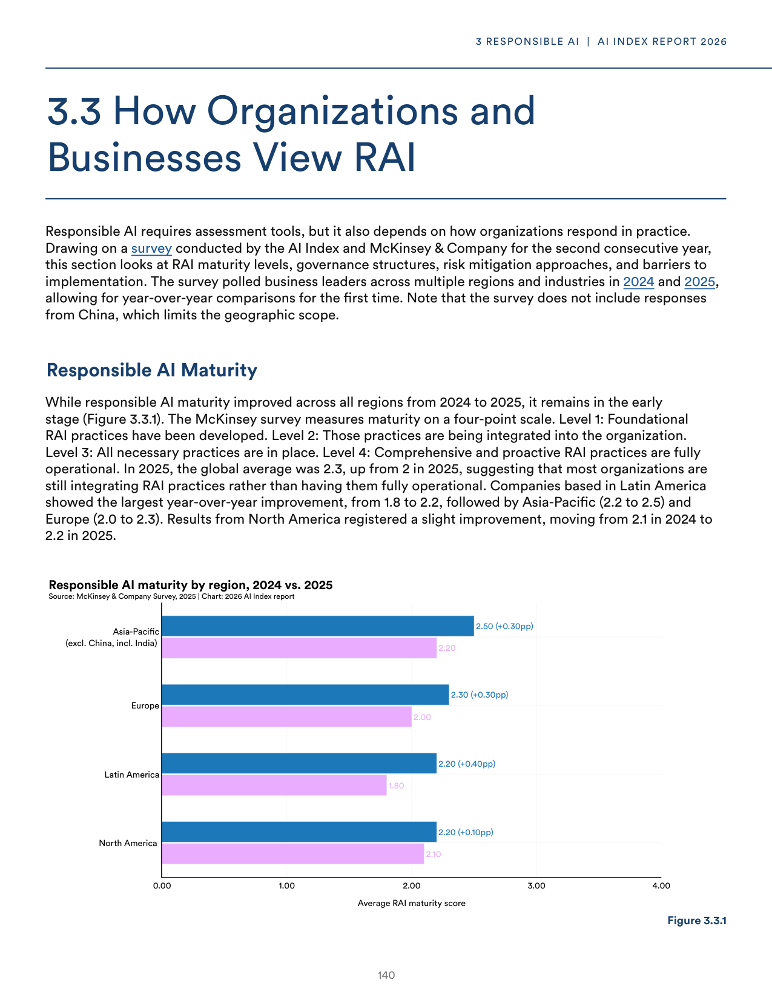
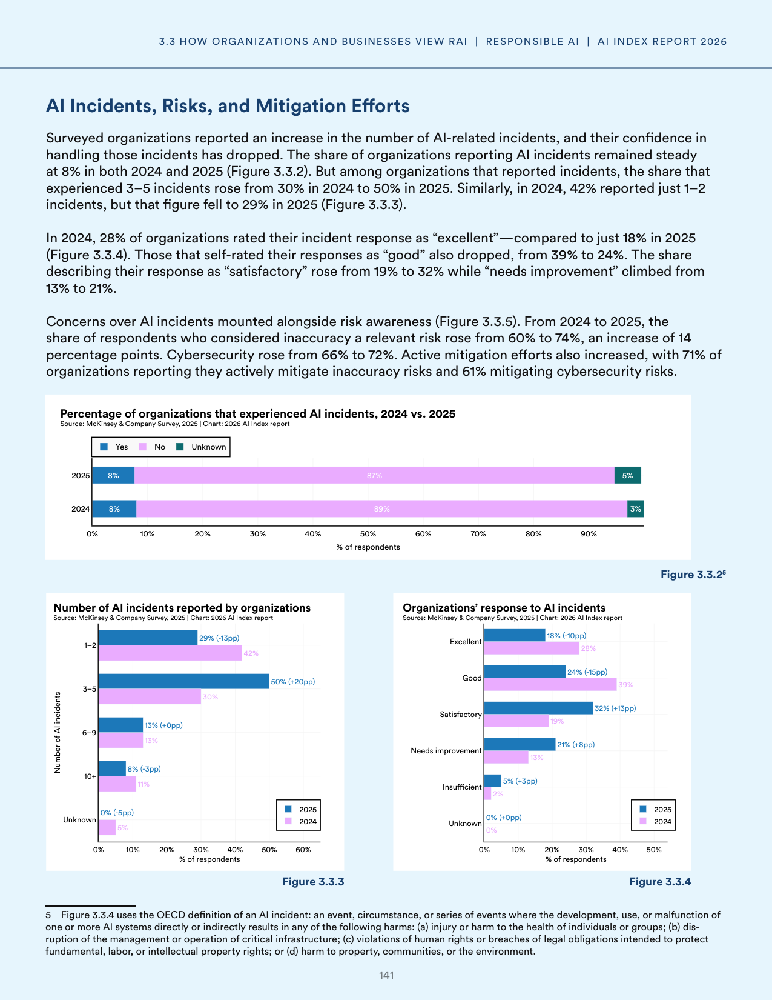
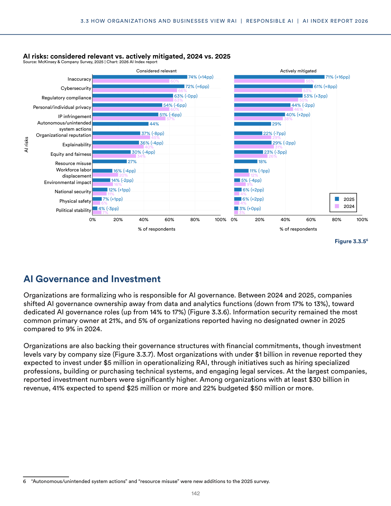
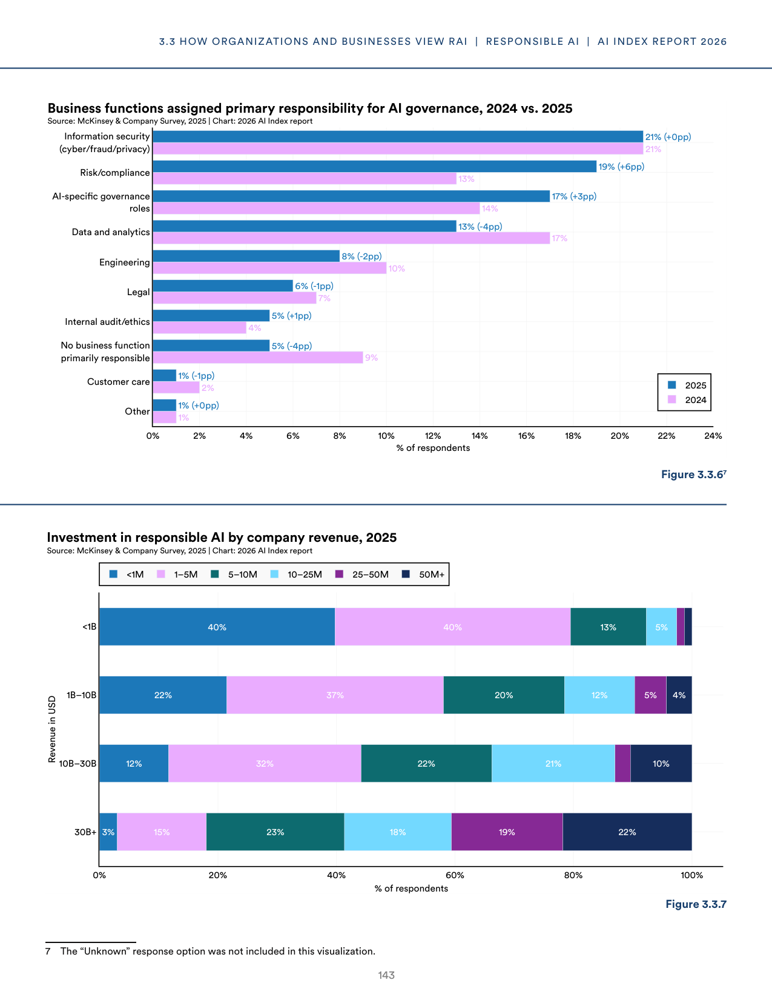
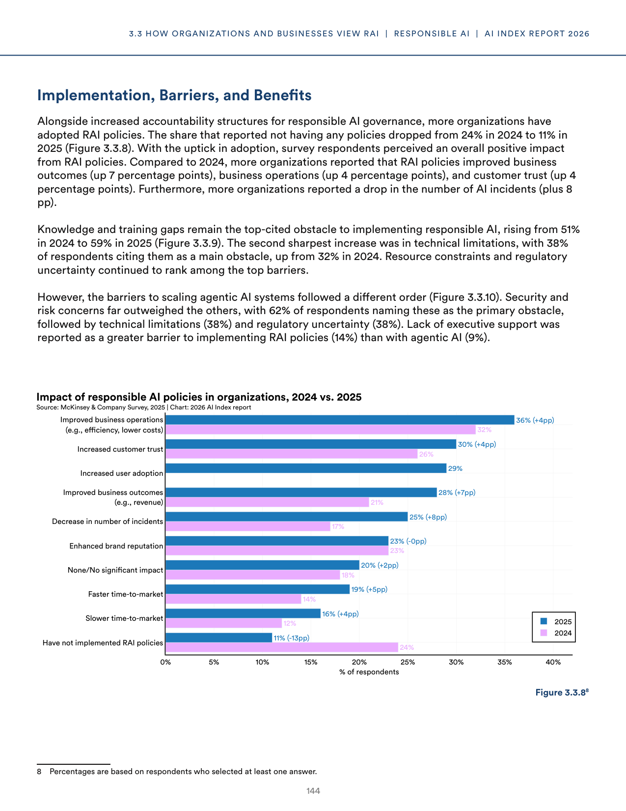
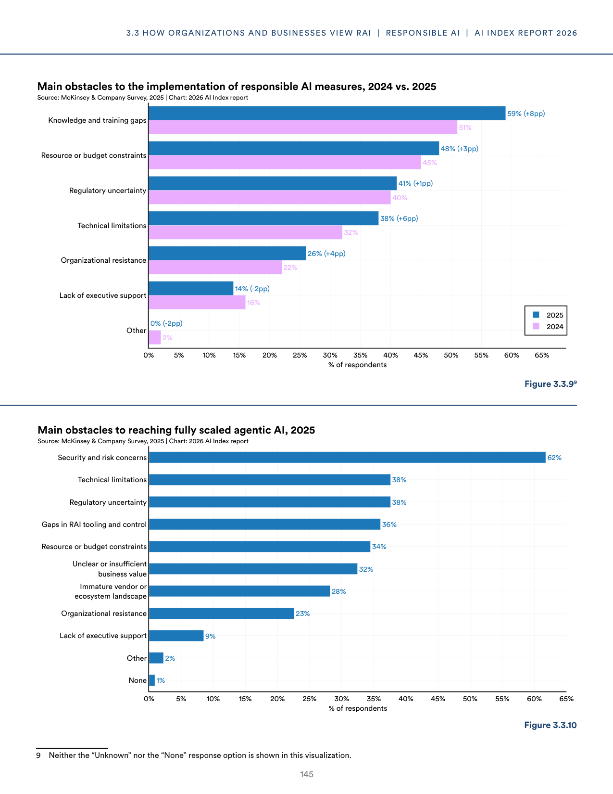
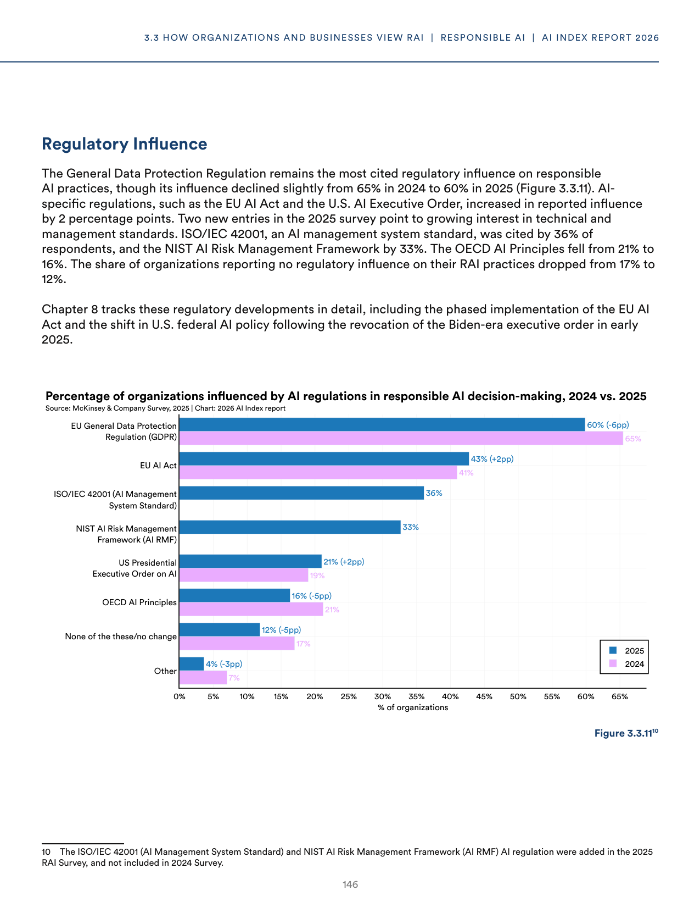

# rai_implementation_trends_2025

**Parent:** [[content/L1/responsible-ai-governance-implementation-status|responsible-ai-governance-implementation-status]] — RAI maturity scores rose from 2.5 to 2.8, with 62% of organizations having frameworks, while 42% cite talent shortages and 38% struggle with fairness/safety metrics, amidst EU risk-based mandates and academic focus on algorithmic bias and training costs.

The provided text details the current state of Responsible AI (RAI) and the implementation of RAI frameworks within organizations, based on a survey comparing 2024 and 2025 data. While adoption is increasing, organizations face varied levels of maturity. The average maturity score for RAI frameworks rose from 2.5 to 2.8, with 'high maturity' organizations (scoring 4+) comprising 15% of the sample. In terms of implementation, 62% of organizations have an established RAI framework, a slight increase from 59% the previous year. The most common RAI activities include conducting impact assessments (54%) and establishing governance committees (48%). However, significant gaps remain; only 28% of organizations report having a formal process for monitoring AI systems in production. The data shows a correlation between RAI maturity and the use of advanced techniques like RLHF and red-teaming, which are more prevalent in high-maturity organizations. Challenges to implementation include a lack of specialized talent (cited by 42%) and difficulty in defining clear metrics for 'fairness' and 'safety' (cited by 38%).

## Source pages

