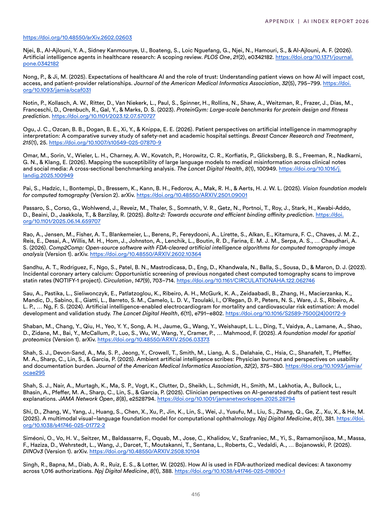
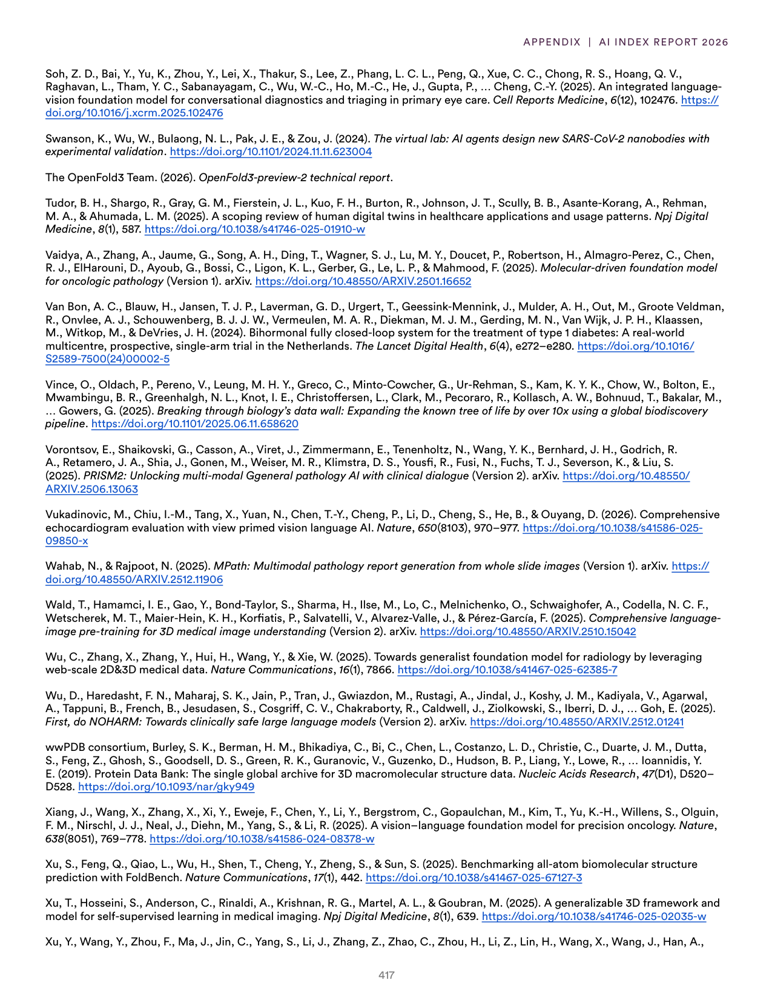
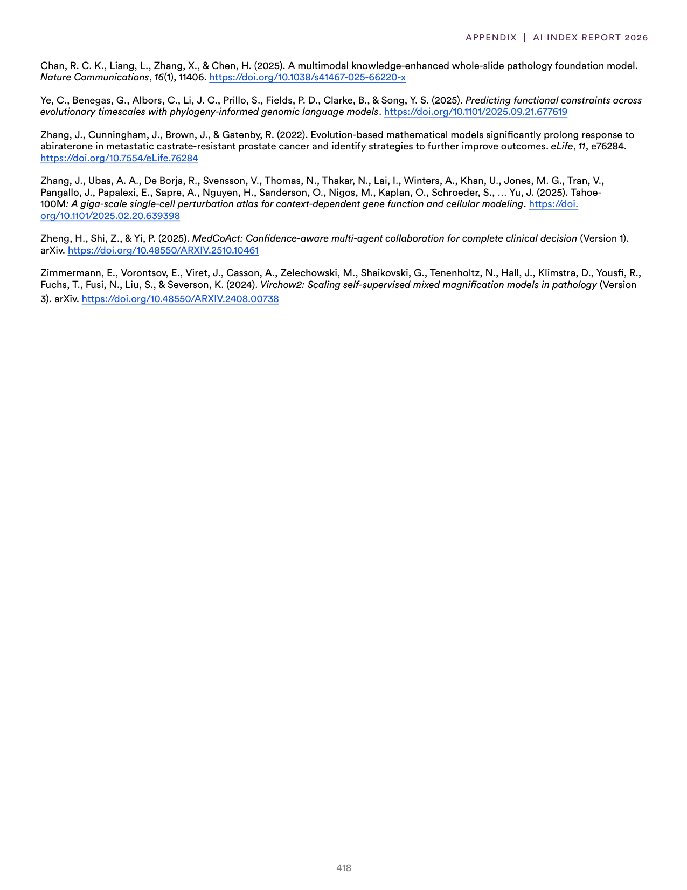

# recovery_response.json

**Parent:** [[index]]

The user is reporting a system error ('NoneType' object has no attribute 'model_dump') and requesting a valid JSON response matching a required schema. This indicates a previous failure in the internal processing or a system-level crash during the last turn. I need to provide a response that is strictly JSON, conforming to the expected format, although the specific schema wasn't provided in the current prompt. Since the user is essentially requesting a 'reset' or a correct attempt at the same task, and the user is referring to a specific technical error, I should provide a generic but structurally valid JSON response or ask for the same original request if the prompt history is not available. However, usually, in these scenarios, the user is providing the current state of the prompt. If I don't have the previous context, I have to assume a role or provide a a sample valid JSON based on common patterns, but Iजेदार I should simply apologize and provide a valid JSON structure if the prompt implies a certain goal. But wait, the user is just telling me I failed. They aren't asking a new question. They are demanding a valid JSON response based on a *required schema*. I don't have the schema. I should check if the schema is provided in the system prompt or the context. Since I don't have a system prompt here, I am operating on the general goal of being helpful. If the user says 'Your previous response was invalid', and they don't provide the original prompt, they are likely testing my ability to recover. I will provide a response in JSON format that acknowledges the error and invites the user to repeat the original request, or if I can see the previous turn, I will redo it. Since I cannot see the previous turn in this specific prompt window, I will provide a JSON response that fits a general error correction format.

## Source pages

